Production loan systems need to answer "what did this loan look like on March 31st?" — for month-end accounting close-outs, regulatory snapshots, dispute investigation and external audits. Apache Fineract handles this with the **Loan Point-in-Time API**, a read-only endpoint that reconstructs a loan's principal, interest, fee, penalty and arrears figures **as they would have been computed on a chosen historical date** — without ever mutating the database. The implementation lives under `org.apache.fineract.portfolio.loanaccount.api.pointintime` (resource + delegate) and `org.apache.fineract.portfolio.loanaccount.service.LoanPointInTimeServiceImpl` (the algorithm).

## API surface

The endpoint set is mounted at `/v1/loans/at-date`, declared by `LoansPointInTimeApiResource` and described by the `LoansPointInTimeApi` interface.

| Method | Path | Purpose |
| --- | --- | --- |
| `GET` | `/v1/loans/at-date/{loanId}?date=YYYY-MM-DD` | Loan state at `date` for a single loan by id |
| `GET` | `/v1/loans/at-date/external-id/{loanExternalId}?date=...` | Same, by external id |
| `POST` | `/v1/loans/at-date/search` | Body `{ loanIds: [...], date: ... }` — bulk reconstruct |
| `POST` | `/v1/loans/at-date/search/external-id` | Same, by list of external ids |

Each call returns one or many `LoanPointInTimeData` rows.

```java
@Path("/v1/loans/at-date")
@Component
@Tag(name = "LoansPointInTime", description = "API to enable clients to retrieve Loan states in a specific point in time")
public class LoansPointInTimeApiResource implements LoansPointInTimeApi {
    private final LoansPointInTimeApiDelegate delegate;

    @GET
    @Path("{loanId}")
    @Produces({ MediaType.APPLICATION_JSON })
    public LoanPointInTimeData retrieveLoanPointInTime(
        @PathParam("loanId") Long loanId,
        @QueryParam("date") DateParam dateParam,
        @QueryParam("dateFormat") String dateFormat,
        @QueryParam("locale") String locale) {
      return delegate.retrieveLoanPointInTime(loanId, dateParam, dateFormat, locale);
    }
    // ...
}
```

The resource is a thin shell; the heavy lifting is done by `LoanPointInTimeServiceImpl`.

## What gets returned

`LoanPointInTimeData` is the result DTO. It is purposefully much smaller than the full `LoanAccountData` returned by the regular loan API — it carries only the figures that have a clear interpretation at a historical date.

| Field group | Fields |
| --- | --- |
| Identity | `id`, `accountNo`, `externalId` |
| Status & currency | `status`, `currency` |
| Money breakdown | `principal`, `interest`, `fee`, `penalty`, `total` (each a `Loan*Data` sub-DTO with `charged`, `paid`, `waived`, `writtenOff`, `outstanding`) |
| Client | `clientId`, `clientAccountNo`, `clientExternalId`, `clientDisplayName`, `clientOfficeId` |
| Product | `loanProductId`, `loanProductName` |
| Arrears | `arrears: LoanArrearsData` — overdue principal, interest, fees, penalties as of the chosen date |

The `Mapper` inside `LoanPointInTimeData` uses MapStruct to flatten the reconstructed `Loan` aggregate into this DTO.

## The reconstruction algorithm

The key insight: rather than maintain a separate historical store, Fineract **rewinds the live `Loan` aggregate in memory** inside a read-only transaction, returns the snapshot, then **rolls the transaction back** so nothing is persisted.

```mermaid
sequenceDiagram
  participant U as Client
  participant API as LoansPointInTimeApiResource
  participant D as LoansPointInTimeApiDelegate
  participant S as LoanPointInTimeServiceImpl
  participant TX as ThreadLocalContext
  participant LA as LoanAssembler
  participant SS as LoanScheduleService
  participant AS as LoanArrearsAgingService

  U->>API: GET /v1/loans/at-date/{id}?date=D
  API->>D: retrieveLoanPointInTime
  D->>S: retrieveAt&#40;loanId, D&#41;
  S->>TX: set BUSINESS_DATE = D
  S->>LA: assembleFrom&#40;loanId&#41;
  S->>S: remove transactions after D
  S->>S: remove charges effective-due after D
  alt anything removed
    S->>SS: regenerateScheduleWithReprocessingTransactions
  end
  S->>S: recalculate summary up to D
  S->>AS: calculateArrearsForLoan
  S->>S: map to LoanPointInTimeData
  S->>TX: restore BUSINESS_DATE
  S->>S: rollbackOnly + EntityManager.clear&#40;&#41;
  S-->>U: snapshot
```



### Step 1 — Override business date

Most Fineract interest math reads the current business date from `ThreadLocalContextUtil`. The service overrides it to the requested date so all downstream calculations behave as if today were `date`.

### Step 2 — Hydrate the loan

`LoanAssembler.assembleFrom(loanId)` materialises the full `Loan` aggregate — installments, transactions, charges, summary, status.

### Step 3 — Trim transactions and charges

```java
private void removeAfterDateTransactions(Loan loan, LocalDate date) {
    loan.removeLoanTransactions(tx -> DateUtils.isAfter(tx.getTransactionDate(), date));
}

private void removeAfterDateCharges(Loan loan, LocalDate date) {
    loan.removeCharges(c -> !c.isInstalmentFee() &&
        DateUtils.isAfter(c.getEffectiveDueDate(), date));
}
```

Anything that happened after the chosen date is removed from the in-memory aggregate. **Installment fees are explicitly preserved** because their effective due date is the first unpaid installment — dropping them based on that date would discard fees on installments that were already paid before the requested date. They are handled later by the summary recompute.

### Step 4 — Re-run the schedule and processor

If transactions or charges were trimmed, the loan no longer matches its persisted schedule. The service rebuilds it:

```java
ScheduleGeneratorDTO sg = loanUtilService.buildScheduleGeneratorDTO(loan, null, null);
loanScheduleService.regenerateScheduleWithReprocessingTransactions(loan, sg);
```

This calls the same `LoanScheduleGenerator` and `LoanRepaymentScheduleTransactionProcessor` used at disbursement, but only the transactions that survived the trim are re-applied. The result is an installment list and per-installment paid/outstanding figures that reflect the loan as of `date`.

### Step 5 — Recompute the summary

```java
private void recalculateSummaryForInstallmentsUpToDate(Loan loan, LocalDate date) {
    // Only include charges due by `date`, with installment-fee portions
    // split per-installment.
    ...
    summary.recalculateDerivedTotalsForAdjustedFeeCharged(adjustedFeeCharged.getAmount());
}
```

`LoanSummary` is updated so its `totalFeeChargesCharged`, `totalOutstanding`, and the per-component totals all reflect the snapshot.

### Step 6 — Arrears

`LoanArrearsAgingService.calculateArrearsForLoan(loan)` runs the same arrears computation the nightly `UPDATE_LOAN_ARREARS_AGEING` job uses, but against the rewound aggregate so the response carries arrears figures consistent with the chosen date.

### Step 7 — Map and discard

The aggregate is mapped to `LoanPointInTimeData`, the entity manager is cleared and the transaction is forcibly marked `rollbackOnly`:

```java
} finally {
    entityManager.clear();
    TransactionInterceptor.currentTransactionStatus().setRollbackOnly();
    ThreadLocalContextUtil.setBusinessDates(originalBDs);
}
```

This is the safety net: even if a code path on the trimmed `Loan` would have written back to the DB, the rollback guarantees the historical query has no persistent side-effects.

## Why rewind instead of querying history?

<CardGroup cols={2}>
  <Card title="No parallel history schema" icon="database">
    Apart from `LoanRepaymentScheduleHistory` (reschedule audit), there is no per-day historical mirror of the loan tables. Rebuilding the schedule on the fly from real transactions avoids the storage and consistency cost of that mirror.
  </Card>
  <Card title="Same math everywhere" icon="equals">
    Because the reconstruction uses the very same `LoanScheduleGenerator` and processor as live operations, the historical figures are guaranteed to match the rules in effect today — there is no chance of historic and current values disagreeing because of a separate code path.
  </Card>
</CardGroup>

## Date semantics

<Tabs>
  <Tab title="Inclusive of date">
    A transaction with `transactionDate = D` survives the trim (only `> D` is removed). A charge with `effectiveDueDate = D` is also kept. The response describes the loan **after** all activity that landed on `date`.
  </Tab>
  <Tab title="Future installments">
    Installments whose due date is after `date` are kept in the schedule but never re-paid by the processor (since their corresponding transactions are gone). They show with their full charged amounts and zero paid amounts.
  </Tab>
  <Tab title="Closed loans">
    For a loan closed before `date`, the rewind is a no-op except for arrears (always zero on a closed loan) — the regenerate step is skipped.
  </Tab>
</Tabs>

## Bulk retrieval

The `POST /v1/loans/at-date/search` and `.../search/external-id` endpoints accept a list of ids plus a single date and stream out one `LoanPointInTimeData` per loan. They reuse the same `retrieveAt(loanId, date)` per loan; the request body is `RetrieveLoansPointInTimeRequest` (or `RetrieveLoansPointInTimeExternalIdsRequest`).

<Info>
Bulk calls still rollback per loan — they do not share a transaction across loans — so a failure in one loan does not poison the others.
</Info>

## Performance notes

<CardGroup cols={2}>
  <Card title="Read-only" icon="lock">
    `EntityManager.setFlushMode(FlushModeType.COMMIT)` plus the `rollbackOnly` flag mean no dirty checking or flushes during the rewind.
  </Card>
  <Card title="O(transactions)" icon="gauge">
    Reconstruction time is proportional to the number of `LoanTransaction` rows on the loan. For long-lived high-activity loans expect tens of milliseconds per call.
  </Card>
  <Card title="No cache" icon="ban">
    There is no caching — every call rebuilds. If you need a point-in-time over many loans for a fixed date, batch with `/search` to amortise per-call overhead.
  </Card>
  <Card title="Idempotent" icon="rotate-right">
    Same loan + same date returns the same snapshot regardless of when called, assuming no back-dated transactions are added later.
  </Card>
</CardGroup>

## Limitations

<Warning>
Back-dated transactions added **after** the point-in-time query was made will change a future call's answer for the same date. The API reconstructs from the current transaction set, not from an immutable historical log.
</Warning>

<Warning>
The endpoint deliberately does not expose every field of `LoanAccountData`. Fields whose interpretation at a historical date is ambiguous (collateral valuations, current officer assignment, GLIM rollups) are omitted.
</Warning>

## Example request and response

A typical month-end audit request:

```http
GET /v1/loans/at-date/123?date=2024-03-31&dateFormat=yyyy-MM-dd&locale=en HTTP/1.1
```

A trimmed response body:

```json
{
  "id": 123,
  "accountNo": "000000123",
  "status": { "id": 300, "value": "Active" },
  "externalId": "abc-xyz",
  "currency": { "code": "USD", "decimalPlaces": 2 },
  "principal": { "charged": 10000.00, "paid": 3200.00, "outstanding": 6800.00 },
  "interest":  { "charged":  1200.00, "paid":  400.00, "outstanding":  800.00 },
  "fee":       { "charged":    50.00, "paid":   50.00, "outstanding":    0.00 },
  "penalty":   { "charged":    25.00, "paid":    0.00, "outstanding":   25.00 },
  "total":     { "charged": 11275.00, "paid": 3650.00, "outstanding": 7625.00 },
  "clientId": 99,
  "clientDisplayName": "Acme Co.",
  "loanProductId": 7,
  "loanProductName": "Working capital — monthly",
  "arrears": {
    "principalOverdue": 200.00,
    "interestOverdue":   50.00,
    "feeOverdue":         0.00,
    "penaltyOverdue":    25.00,
    "totalOverdue":     275.00,
    "overdueSinceDate": "2024-03-15"
  }
}
```

The same loan queried at `2024-04-30` would return different paid / outstanding / arrears figures reflecting the additional month of activity, all computed by re-running the schedule and arrears math against the trimmed transaction set.

## Use cases

<CardGroup cols={2}>
  <Card title="Month-end accounting" icon="calendar">
    Pull every active loan's outstanding at month-end for the trial balance.
  </Card>
  <Card title="Regulatory snapshot" icon="building-columns">
    Reconstruct portfolio composition at the supervisor's chosen reporting date.
  </Card>
  <Card title="Dispute investigation" icon="magnifying-glass">
    Confirm what the customer's outstanding was on the day of a disputed transaction.
  </Card>
  <Card title="Provisioning re-check" icon="chart-pie">
    Recompute expected-loss bands at a past date using the same arrears logic the job used at that time.
  </Card>
</CardGroup>

## Related pages

<CardGroup cols={2}>
  <Card title="Transactions" icon="receipt" href="/loan/loan-transactions">
    The transaction history that drives the rewind.
  </Card>
  <Card title="Repayment schedule" icon="list-ol" href="/loan/loan-repayment-schedule">
    The schedule shape that gets regenerated in step 4.
  </Card>
  <Card title="Arrears ageing" icon="hourglass-half" href="/loan/loan-arrears-aging">
    The arrears calculation reused in step 6.
  </Card>
  <Card title="Summary providers" icon="layer-group" href="/loan/loan-summary-providers">
    The summary the snapshot derives from.
  </Card>
</CardGroup>
