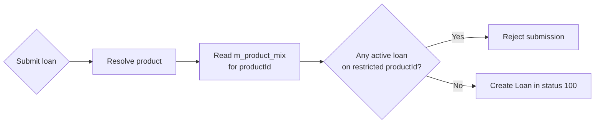

In Apache Fineract a `LoanProduct` is the template used to spin up individual loans. It captures every defaultable setting — interest method, amortization, repayment frequency, currency, charges, rates, accounting type — and is referenced (lazily) by every `Loan` aggregate. Editing a product never retroactively changes existing loans; the relevant subset of fields is copied into the embedded `LoanProductRelatedDetail` at submission time.

## Source layout

Package: `fineract-loan/src/main/java/org/apache/fineract/portfolio/loanproduct/domain/`.

| File | Purpose |
| --- | --- |
| `LoanProduct.java` | The `@Entity` itself, mapped to `m_product_loan` |
| `LoanProductRelatedDetail.java` | `@Embeddable` snapshot embedded into `Loan` and `LoanProduct` |
| `LoanProductMinMaxConstraints.java` | Min/max amount, term, interest rate |
| `LoanProductTrancheDetails.java` | Multi-disburse flags |
| `LoanProductInterestRecalculationDetails.java` | Interest recalculation config |
| `LoanProductPaymentAllocationRule.java` | Per-product payment allocation table |
| `LoanProductCreditAllocationRule.java` | Per-product credit allocation table |
| `AmortizationMethod.java` | `EQUAL_PRINCIPAL` / `EQUAL_INSTALLMENTS` |
| `InterestMethod.java` | `DECLINING_BALANCE` / `FLAT` |
| `InterestCalculationPeriodMethod.java` | `DAILY` / `SAME_AS_REPAYMENT_PERIOD` |
| `RepaymentStartDateType.java` | First repayment anchor |
| `LoanScheduleProcessingType.java` (in `loanschedule.domain`) | Horizontal vs vertical processing |

## Entity shell

```java
@Entity
@Getter
@Setter
@Table(name = "m_product_loan", uniqueConstraints = {
    @UniqueConstraint(columnNames = "name",        name = "unq_name"),
    @UniqueConstraint(columnNames = "external_id", name = "external_id_UNIQUE"),
    @UniqueConstraint(columnNames = "short_name",  name = "unq_short_name") })
public class LoanProduct extends AbstractPersistableCustom<Long> {
    ...
}
```

A product carries an external ID, a short name (used in journal-entry descriptions), an optional fund, and a `transactionProcessingStrategyCode` that gets resolved against the `LoanRepaymentScheduleTransactionProcessorFactory`.

## Core configuration fields

<ResponseField name="name / shortName / description" type="String">
  Unique product identifiers.
</ResponseField>
<ResponseField name="charges" type="List<Charge>">
  ManyToMany via `m_product_loan_charge` — default charges attached to
  every new loan.
</ResponseField>
<ResponseField name="rates" type="List<Rate>">
  ManyToMany via `m_product_loan_rate` — tax/fee rates referenced by
  charges.
</ResponseField>
<ResponseField name="loanProductRelatedDetail" type="LoanProductRelatedDetail">
  Embedded block holding currency, principal range, term, interest rate
  / type, amortization, calculation period, charges-included flags.
</ResponseField>
<ResponseField name="loanProductMinMaxConstraints" type="LoanProductMinMaxConstraints">
  Embedded min/max guard rails enforced at submit time.
</ResponseField>
<ResponseField name="loanProductTrancheDetails" type="LoanProductTrancheDetails">
  Multi-disburse flag, max tranche count, max outstanding.
</ResponseField>
<ResponseField name="accountingRule" type="AccountingRuleType">
  `NONE`, `CASH_BASED`, `ACCRUAL_PERIODIC`, `ACCRUAL_UPFRONT`.
</ResponseField>

## Amortization method

```java
public enum AmortizationMethod {
    EQUAL_PRINCIPAL(0,    "amortizationType.equal.principal"),
    EQUAL_INSTALLMENTS(1, "amortizationType.equal.installments"),
    INVALID(2,            "amortizationType.invalid");
}
```

| Method | Behaviour |
| --- | --- |
| `EQUAL_INSTALLMENTS` | Each installment has the same total (EMI). Principal share rises over time, interest share falls. |
| `EQUAL_PRINCIPAL` | Each installment has the same principal chunk; total falls over time because interest on the dwindling balance falls. |

## Interest method

```java
public enum InterestMethod {
    DECLINING_BALANCE(0, "interestType.declining.balance"),
    FLAT(1,              "interestType.flat"),
    INVALID(2,           "interestType.invalid");
}
```

<Tabs>
  <Tab title="Declining balance">
    Interest accrues on the outstanding principal only. Combined with
    `EQUAL_INSTALLMENTS` you get classic mortgage-style EMI; combined
    with `EQUAL_PRINCIPAL` you get a straight-line amortization.
  </Tab>
  <Tab title="Flat">
    Interest is computed once on the original principal and split evenly
    across installments. Used for simple-interest products.
  </Tab>
  <Tab title="Progressive (declining balance EMI)">
    Implemented in `fineract-progressive-loan` rather than as a third
    enum value; the schedule type `PROGRESSIVE` plus
    `LoanScheduleProcessingType.HORIZONTAL` selects the
    `AdvancedPaymentScheduleTransactionProcessor`.
  </Tab>
</Tabs>

<Info>
  Cumulative declining-balance maths is implemented by
  `CumulativeDecliningBalanceInterestLoanScheduleGenerator`; flat by
  `CumulativeFlatInterestLoanScheduleGenerator`. See
  [Cumulative generator](/loan/cumulative-schedule-generator).
</Info>

## Interest calculation period

```java
public enum InterestCalculationPeriodMethod {
    DAILY,
    SAME_AS_REPAYMENT_PERIOD;
}
```

`DAILY` charges interest day-by-day (impacted by holidays/non-working-day rules); `SAME_AS_REPAYMENT_PERIOD` treats each repayment period as a single accrual block. The product also stores `allowPartialPeriodInterestCalcualtion` to spread partial-month interest pro-rata when a non-aligned disbursement happens.

## Days-in-year / days-in-month

`LoanProductRelatedDetail` embeds:

| Field | Values |
| --- | --- |
| `DaysInYearType` | `ACTUAL`, `360`, `364`, `365` |
| `DaysInMonthType` | `ACTUAL`, `30` |
| `DaysInYearCustomStrategyType` | Optional override for leap-year handling |

These feed the EMI denominator and daily-interest calc, mirroring market conventions.

## Repayment strategy

`transactionProcessingStrategyCode` is a string key — see [Transaction processors](/loan/loan-transaction-processors). Typical values:

| Code | Strategy |
| --- | --- |
| `mifos-standard-strategy` | Penalty → Fee → Interest → Principal in arrears |
| `heavensfamily-strategy` | Fee/Penalty waterfall variant |
| `creocore-strategy` | Pre-disbursement repayment-at-disbursement handling |
| `early-repayment-strategy` | Early-payment principal first |
| `principal-interest-penalties-fees-order-strategy` | P → I → Pen → Fee |
| `interest-principal-penalties-fees-order-strategy` | I → P → Pen → Fee |
| `rbi-india-strategy` | RBI ordering |
| `advanced-payment-allocation-strategy` | Progressive engine |

## Multi-disburse and overapplication

```java
@Embedded
private LoanProductTrancheDetails loanProductTrancheDetails;
```

Holds `multiDisburseLoan`, `maxTrancheCount`, `outstandingLoanBalance`, plus over-application:

| Field | Meaning |
| --- | --- |
| `allowApprovedDisbursedAmountsOverApplied` | Allow approval > applied amount |
| `overAppliedCalculationType` | `FLAT` / `PERCENTAGE` |
| `overAppliedNumber` | The headroom value |

## Interest recalculation

```java
@OneToOne(cascade = ALL)
@JoinColumn(name = "product_loan_recalculation_details_id")
private LoanProductInterestRecalculationDetails productInterestRecalculationDetails;
```

When enabled, the schedule is rebuilt after every transaction using:

- `InterestRecalculationCompoundingMethod` — what gets capitalised
  (`NONE`, `INTEREST`, `FEE`, `INTEREST_AND_FEE`)
- `RecalculationFrequencyType` — `DAILY`, `WEEKLY`, `MONTHLY`, `SAME_AS_REPAYMENT_PERIOD`
- `LoanRescheduleStrategyMethod` — what to do with the unpaid amount
- `LoanPreCloseInterestCalculationStrategy` — interest behaviour on pre-closure

## Borrower cycle pricing

If `useBorrowerCycle` is true the product can offer different default principal / number-of-repayments / interest based on the client/group's current cycle count, configured via `LoanProductBorrowerCycleVariations` rows. This is what powers "second-cycle loan is bigger" rules common in microfinance.

## Product mix

`LoanProduct` does not own the product-mix relation directly; a separate `m_product_mix` table lists `(product_id, restricted_product_id)` pairs. The pre-submit validator rejects an application if the client has an active loan in any restricted product:



## Floating rates and rates

For products with `isLinkedToFloatingInterestRates = true`, the product references a `FloatingRate` and stores deltas (`interestRateDifferential`, min/max/default), and a `floatingRateBaseLendingRate` flag. The schedule generator pulls the relevant period rate at each calculation.

## Charge-off behaviour

`LoanProduct` references a `LoanChargeOffBehaviour` enum that drives whether interest/fee accrual continues after a charge-off event and how subsequent recoveries are journalled.

## Configurable attributes overlay

`LoanProductConfigurableAttributes` records which fields are user-editable at loan submission vs locked at product creation, supporting branch-level overrides.

## Related pages

<CardGroup cols={2}>
  <Card title="Loan model" icon="cube" href="/loan/loan-domain-model">
    Where the embedded `LoanProductRelatedDetail` lands.
  </Card>
  <Card title="Schedule" icon="calendar" href="/loan/loan-repayment-schedule">
    How product fields feed the generator.
  </Card>
  <Card title="Cumulative generator" icon="ruler" href="/loan/cumulative-schedule-generator">
    Maths for declining vs flat interest.
  </Card>
  <Card title="Tx processors" icon="diagram-project" href="/loan/loan-transaction-processors">
    The strategy resolved from `transactionProcessingStrategyCode`.
  </Card>
</CardGroup>

<Tip>
  When two loans seem to behave differently against the same product,
  inspect the embedded `LoanProductRelatedDetail` on each `Loan` row —
  that snapshot is the **actual** behaviour the engine uses, regardless
  of what the live product currently says.
</Tip>
