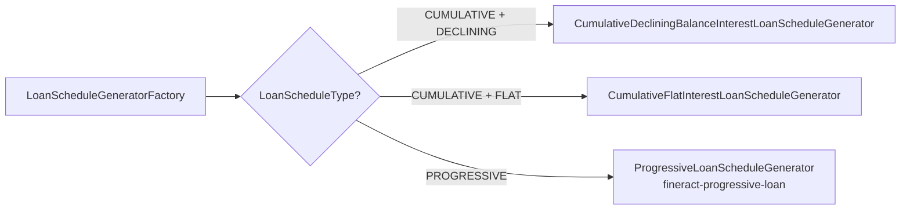

The loan repayment schedule is the per-installment breakdown of principal, interest, fees and penalties Apache Fineract expects the borrower to pay. It is rebuilt by a `LoanScheduleGenerator` whenever a disbursement, charge change, term variation or reschedule alters the inputs. The classic engine lives in `fineract-loan` (`AbstractCumulativeLoanScheduleGenerator`); the modern engine in `fineract-progressive-loan` (`ProgressiveLoanScheduleGenerator`). Both produce the same persistent shape: rows in `m_loan_repayment_schedule`.

## The installment entity

`LoanRepaymentScheduleInstallment` is mapped to `m_loan_repayment_schedule` and owns the per-installment columns. Every column has both the "scheduled" amount and the running `paid` / `waived` / `written-off` / `outstanding` counters.

| Column group | Columns |
| --- | --- |
| Identity | `loan_id`, `installment`, `from_date`, `due_date` |
| Principal | `principal_amount`, `principal_completed_derived`, `principal_writtenoff_derived` |
| Interest | `interest_amount`, `interest_completed_derived`, `interest_waived_derived`, `interest_writtenoff_derived` |
| Fees | `fee_charges_amount`, `fee_charges_completed_derived`, `fee_charges_waived_derived`, `fee_charges_writtenoff_derived` |
| Penalties | `penalty_charges_amount`, `penalty_charges_completed_derived`, `penalty_charges_waived_derived`, `penalty_charges_writtenoff_derived` |
| Status | `completed_derived`, `obligations_met_on_date`, `recalculated_interest_component` |
| Downpayment | `is_down_payment` flag (progressive products) |

<Note>
  The `*_completed_derived` columns are kept up to date by the active
  `LoanRepaymentScheduleTransactionProcessor`. They are not
  recomputed on read — they are written every time a transaction
  hits the installment.
</Note>

## Generator SPI

```java
public interface LoanScheduleGenerator {

    LoanScheduleModel generate(MathContext mc,
                               LoanApplicationTerms loanApplicationTerms,
                               Set<LoanCharge> loanCharges,
                               HolidayDetailDTO holidayDetailDTO);

    LoanScheduleModel generate(MathContext mc,
                               LoanApplicationTerms loanApplicationTerms,
                               Set<LoanCharge> loanCharges,
                               HolidayDetailDTO holidayDetailDTO,
                               LoanScheduleParams loanScheduleParams);
    ...
}
```

The factory `LoanScheduleGeneratorFactory` picks the right generator:



Both cumulative implementations subclass `AbstractCumulativeLoanScheduleGenerator`.

## Inputs

`LoanApplicationTerms` is the heavyweight DTO consumed by every generator. It bundles every product field the schedule needs:

| Group | Fields |
| --- | --- |
| Principal | `principal`, `disbursementDataList`, `inArrears` |
| Term | `loanTermFrequency`, `loanTermPeriodFrequencyType`, `numberOfRepayments`, `repaymentEvery` |
| Interest | `interestRatePerPeriod`, `annualNominalInterestRate`, `interestMethod`, `interestCalculationPeriodMethod` |
| Amortization | `amortizationMethod`, `partialPeriodInterestCalculationStrategy` |
| Calendar | `holidayDetailDTO`, `restCalendarInstance`, `compoundingCalendarInstance` |
| Variations | `loanTermVariations` |
| Recalculation | `recalculationFrequencyType`, `compoundingMethod`, `restFrequencyType` |
| Downpayment | `enableDownPayment`, `disbursedAmountPercentageForDownPayment` |

## Outputs

`LoanScheduleModel` is the in-memory model the generator returns; the persistence layer turns each period into a `LoanRepaymentScheduleInstallment` row. Important model classes:

| Class | Role |
| --- | --- |
| `LoanScheduleModel` | Aggregate model returned to the caller |
| `LoanScheduleModelRepaymentPeriod` | Normal repayment installment |
| `LoanScheduleModelDownPaymentPeriod` | Downpayment installment (progressive) |
| `LoanScheduleModelDisbursementPeriod` | Disbursement-only row used for charges/EMI calc |
| `LoanScheduleParams` | Inputs passed back into generator for incremental reuse |

## When the schedule regenerates

<Steps>
  <Step title="Disburse / undo disburse">
    The schedule is recomputed from the actual disbursement date. New
    tranches restart subsequent installment calculations.
  </Step>
  <Step title="Add or waive a charge">
    Inserting a `LoanCharge` (or waiving it) reshuffles the per-installment
    fee/penalty columns; the generator re-runs to redistribute.
  </Step>
  <Step title="Reschedule approval">
    `LoanRescheduleRequest` approval applies term variations and rebuilds
    the post-from-date portion of the schedule.
  </Step>
  <Step title="Interest recalculation">
    If product enables recalculation, each repayment also triggers a
    re-run so future interest reflects the new outstanding balance.
  </Step>
  <Step title="Reage / reamortize">
    Special transactions (29, 30) intentionally redraw the schedule
    without altering past transactions.
  </Step>
</Steps>

## Holiday and non-working-day handling

`HolidayDetailDTO` carries the working-days config plus holiday list. When a generated installment falls on a holiday or non-working day, the engine consults `RepaymentRescheduleType`:

| Strategy | Result |
| --- | --- |
| `SAME_DAY` | Keep due date on the holiday |
| `MOVE_TO_NEXT_WORKING_DAY` | Push forward to next working day |
| `MOVE_TO_NEXT_REPAYMENT_MEETING_DAY` | Move to next configured meeting |
| `MOVE_TO_PREVIOUS_WORKING_DAY` | Pull back |

The adjustment is captured in `AdjustedDateDetailsDTO`, which keeps both the original due date (for interest accrual) and the adjusted due date (for payment).

## Downpayment

When `enableDownPayment` is true on the product, the generator emits a `LoanScheduleModelDownPaymentPeriod` immediately after the disbursement period. The downpayment principal share comes from `disbursedAmountPercentageForDownPayment` and is paid by a `DOWN_PAYMENT` (tx 28) transaction — typically auto-created at disbursal.

<Info>
  Downpayment is implemented in the cumulative generator but is most
  natural in the progressive engine where it interacts with payment
  allocation rules.
</Info>

## Term variations

```java
@OneToMany(mappedBy = "loan", cascade = ALL, orphanRemoval = true)
private List<LoanTermVariations> loanTermVariations;
```

Each `LoanTermVariations` row encodes a date-anchored change to the schedule: grace period, EMI amount change, interest-rate change, principal-due-on-installment change, payment holiday. The generator consults this list while iterating and applies variations whose `termApplicableFrom` is reached.

| `LoanTermVariationType` value | Effect |
| --- | --- |
| `EMI_AMOUNT` | New EMI for subsequent installments |
| `PRINCIPAL_AMOUNT` | Override principal due |
| `INTEREST_RATE` | Reset interest rate from this date |
| `INTEREST_RATE_FROM_INSTALLMENT` | Stepped change |
| `EXTEND_REPAYMENT_PERIOD` | Add installments |
| `GRACE_ON_INTEREST` / `GRACE_ON_PRINCIPAL` | Skip portion |
| `INSERT_INSTALLMENT` / `DELETE_INSTALLMENT` | Manual edit |
| `DUE_DATE` | Move a single installment |
| `INTEREST_PAUSE` | From `interestpauses` module |

## Processing wrapper

`LoanRepaymentScheduleProcessingWrapper` provides static helpers used widely by generators and processors:

```java
public static boolean isAfterPeriod(LocalDate date, LoanRepaymentScheduleInstallment period);
public static boolean isBeforePeriod(LocalDate date, LoanRepaymentScheduleInstallment period);
```

These keep the date-comparison logic consistent between schedule build and transaction allocation.

## Related pages

<CardGroup cols={2}>
  <Card title="Cumulative generator" icon="ruler" href="/loan/cumulative-schedule-generator">
    Maths for declining vs flat interest.
  </Card>
  <Card title="Progressive overview" icon="arrow-trend-up" href="/progressive-loan/overview">
    Modern engine layered on top.
  </Card>
  <Card title="Tx processors" icon="diagram-project" href="/loan/loan-transaction-processors">
    Apply the cash to schedule rows.
  </Card>
  <Card title="Reschedule" icon="rotate" href="/loan/loan-reschedule">
    Term variations applied to the schedule.
  </Card>
</CardGroup>

<Tip>
  The schedule is **derived** state: when in doubt, regenerate from
  `LoanApplicationTerms` + the current `loanCharges` and compare. Any
  divergence vs the stored rows indicates a missed transaction-processor
  invocation in code paths that bypass the central mutators.
</Tip>
