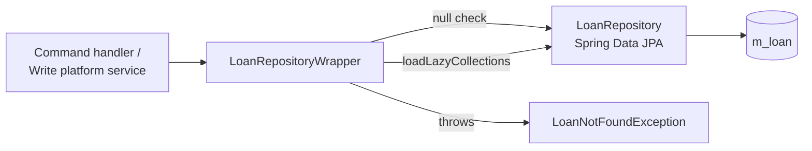

Apache Fineract puts a thin Spring Data interface in front of the `Loan` aggregate (`LoanRepository`) and wraps it in a service bean (`LoanRepositoryWrapper`) that adds null-safety and lazy-collection initialisation. Almost every command handler and read service in the loan subsystem talks to the wrapper rather than the repository directly, so it is the single chokepoint for "load a loan".

## Two layers



Source files:

| File | Role |
| --- | --- |
| `domain/LoanRepository.java` | Spring Data `JpaRepository<Loan, Long>` |
| `domain/LoanRepositoryWrapper.java` | `@Service` facade with `findOneWithNotFoundDetection` |
| `domain/LoanRepaymentScheduleInstallmentRepository.java` | Schedule-row repo (separate aggregate root) |
| `domain/LoanTransactionRepository.java` | Transaction-row repo |
| `domain/LoanChargeRepository.java` | Charge repo |
| `domain/LoanDisbursementDetailsRepository.java` | Disbursement-tranche repo |

## The repository interface

```java
public interface LoanRepository
        extends JpaRepository<Loan, Long>, JpaSpecificationExecutor<Loan> {
    ...
}
```

Beyond inherited CRUD it declares ~30 `String` constants holding JPQL fragments and exposes them via `@Query` methods. The naming convention is `FIND_<scope>_BY_<criteria>` or `DOES_<predicate>`.

## Representative named queries

| Constant | Returns | Used by |
| --- | --- | --- |
| `FIND_GROUP_LOANS_DISBURSED_AFTER` | `List<Loan>` per group, sorted by disbursement date | Group cycle counter maintenance |
| `FIND_CLIENT_OR_JLG_LOANS_DISBURSED_AFTER` | `List<Loan>` per client | Client cycle counter |
| `FIND_MAX_GROUP_LOAN_COUNTER_QUERY` | `Integer` max counter | Auto-numbering of group loans |
| `FIND_MAX_CLIENT_OR_JLG_LOAN_PRODUCT_COUNTER_QUERY` | `Integer` per product | Product-scoped counter |
| `DOES_CLIENT_HAVE_LOANS_WITH_STATUSES` | `boolean` projection | Pre-close validation |
| `DOES_PRODUCT_HAVE_LOANS_WITH_STATUSES` | `boolean` | Product retire guard |
| `FIND_LOANS_BY_ACCOUNT_NUMBER_AND_STATUSES` | `List<Loan>` | External-ID resolution |
| `FIND_ALL_BY_STATUSES` | `List<Long>` IDs | Bulk jobs, accrual posting |
| `FIND_BY_ACCOUNT_NUMBER` | `Optional<Loan>` | Account-number lookup |
| `FIND_LOAN_BY_EXTERNAL_ID` | `Optional<Loan>` | External-ID lookup |
| `FIND_ID_BY_EXTERNAL_ID` | `Long` only | Lightweight existence check |
| `FIND_LOAN_DATA_FOR_EXTERNAL_TRANSFER` | DTO projection | Investor asset transfer |
| `FIND_ACTIVE_LOANS_PRODUCT_IDS_BY_CLIENT` | `List<Long>` product IDs | Loan officer dashboards |

<Note>
  Many constants share the prefix `FIND_ALL_LOANS_` and target the COB
  pipeline — they accept an `:cobBusinessDate` plus `:loanStatuses` and
  return either `Long` IDs or the `COBIdAndLastClosedBusinessDate`
  projection so the chunked job can stream millions of accounts.
</Note>

## COB-oriented projections

The repository returns DTOs (not entities) for bulk COB selection. The projection classes live in `fineract-core`:

<CodeGroup>
```java COBIdAndLastClosedBusinessDate
public record COBIdAndLastClosedBusinessDate(
        Long loanId,
        LocalDate lastClosedBusinessDate) {}
```

```java COBIdAndExternalIdAndAccountNo
public record COBIdAndExternalIdAndAccountNo(
        Long id,
        ExternalId externalId,
        String accountNo) {}
```

```java LoanDataForExternalTransfer
public record LoanDataForExternalTransfer(
        Long id,
        ExternalId externalId,
        LoanStatus loanStatus,
        Long productId,
        String productShortName) {}
```
</CodeGroup>

Projection queries avoid loading the full graph and let the COB scheduler decide which loans need the heavyweight `findOneWithNotFoundDetection` second pass.

## The wrapper

```java
@Service
@RequiredArgsConstructor
public class LoanRepositoryWrapper {

    private static final Collection<LoanStatus> NON_CLOSED_LOAN_STATUSES =
        List.of(SUBMITTED_AND_PENDING_APPROVAL, APPROVED, ACTIVE,
                TRANSFER_IN_PROGRESS, TRANSFER_ON_HOLD);

    private static final Collection<LoanStatus> NON_CLOSED_AND_OVERPAID_LOAN_STATUSES =
        List.of(SUBMITTED_AND_PENDING_APPROVAL, APPROVED, ACTIVE,
                TRANSFER_IN_PROGRESS, TRANSFER_ON_HOLD, OVERPAID);

    private final LoanRepository repository;
    private final FineractProperties fineractProperties;
    ...
}
```

### Findone overloads

<Tabs>
  <Tab title="By id">
    ```java
    @Transactional(readOnly = true)
    public Loan findOneWithNotFoundDetection(final Long id) {
        return findOneWithNotFoundDetection(id, false);
    }
    ```
  </Tab>
  <Tab title="By id + lazy">
    ```java
    @Transactional(readOnly = true)
    public Loan findOneWithNotFoundDetection(final Long id,
                                             boolean loadLazyCollections) {
        final Loan loan = repository.findById(id)
            .orElseThrow(() -> new LoanNotFoundException(id));
        if (loadLazyCollections) {
            loan.initializeLazyCollections();
        }
        return loan;
    }
    ```
  </Tab>
  <Tab title="By external id">
    ```java
    @Transactional(readOnly = true)
    public Loan findOneWithNotFoundDetection(final ExternalId externalId,
                                             boolean loadLazyCollections) {
        final Loan loan = repository.findByExternalId(externalId)
            .orElseThrow(() -> new LoanNotFoundException(externalId));
        if (loadLazyCollections) {
            loan.initializeLazyCollections();
        }
        return loan;
    }
    ```
  </Tab>
</Tabs>

<Warning>
  Calling `findById` directly on `LoanRepository` skips the
  `LoanNotFoundException` translation and the `initializeLazyCollections`
  call. Command handlers should always go through the wrapper to get
  consistent error semantics and a fully-hydrated aggregate inside the
  transaction.
</Warning>

## Lazy-collection initialisation

`Loan.initializeLazyCollections()` walks the lazily-fetched collections (`loanTransactions`, `repaymentScheduleInstallments`, `charges`, `disbursementDetails`, etc.) and calls `size()` on each to force Hibernate to populate them while the session is open. This avoids `LazyInitializationException` once the loan crosses the service-method boundary.

<Info>
  The wrapper additionally caches `FineractProperties` so methods can
  switch behaviour based on tenant flags (for example whether the
  current tenant enabled cumulative or progressive schedules by
  default).
</Info>

## Specialised wrapper methods

The wrapper exposes purpose-built methods on top of the named queries:

| Method | Returns | Behaviour |
| --- | --- | --- |
| `existsByExternalId(ExternalId)` | `boolean` | Uses `FIND_ID_BY_EXTERNAL_ID` projection |
| `getLoanIdByExternalId(ExternalId)` | `Long` | Throws `LoanNotFoundException` if absent |
| `getGroupLoansDisbursedAfter(...)` | `List<Loan>` | Group cycle book-keeping |
| `findLoanForExternalAssetTransfer(Long)` | `LoanDataForExternalTransfer` | Investor module hook |
| `doesClientHaveNonClosedLoans(Long)` | `boolean` | Convenience over the static `NON_CLOSED_LOAN_STATUSES` list |
| `findAllNonClosedLoansBehindByLoanIds(...)` | `List<COBIdAndLastClosedBusinessDate>` | Drives chunked COB |

## Companion repositories

While `LoanRepository` covers the aggregate root, several supporting tables get their own repos:

<Accordion title="Companion repositories">
  - `LoanTransactionRepository` — `m_loan_transaction`
  - `LoanRepaymentScheduleInstallmentRepository` — `m_loan_repayment_schedule`
  - `LoanChargeRepository` — `m_loan_charge`
  - `LoanChargePaidByRepository` — `m_loan_charge_paid_by`
  - `LoanCollateralManagementRepository` — `m_loan_collateral_management`
  - `LoanDisbursementDetailsRepository` — `m_loan_disbursement_detail`
  - `LoanTransactionRelationRepository` — chargeback / refund linkage
  - `LoanAccrualActivityRepository` — periodic accrual transactions
  - `LoanStatusChangeHistoryRepository` — `m_loan_status_change_history`
  - `LoanSummaryBalancesRepository` — balance breakdowns per loan
</Accordion>

## Locking and concurrency

The `Loan` entity has `@Version int version`, so any update outside an attached session triggers `OptimisticLockException`. COB additionally writes a row to `m_loan_account_locks` so two concurrent COB instances cannot pick up the same loan; the wrapper exposes `findAllStayedLockedByCobBusinessDate(...)` for stuck-lock cleanup.

<Tip>
  When you write a new feature that needs to load a loan, **always**
  inject `LoanRepositoryWrapper`. The repository itself should only be
  referenced from inside the wrapper or from read services that return
  projections (where you specifically want to avoid hydrating the
  aggregate).
</Tip>

## Related pages

<CardGroup cols={2}>
  <Card title="Loan model" icon="cube" href="/loan/loan-domain-model">
    What gets loaded by `findOneWithNotFoundDetection`.
  </Card>
  <Card title="Lifecycle" icon="route" href="/loan/loan-application-lifecycle">
    The transitions that mutate the loaded aggregate.
  </Card>
</CardGroup>
