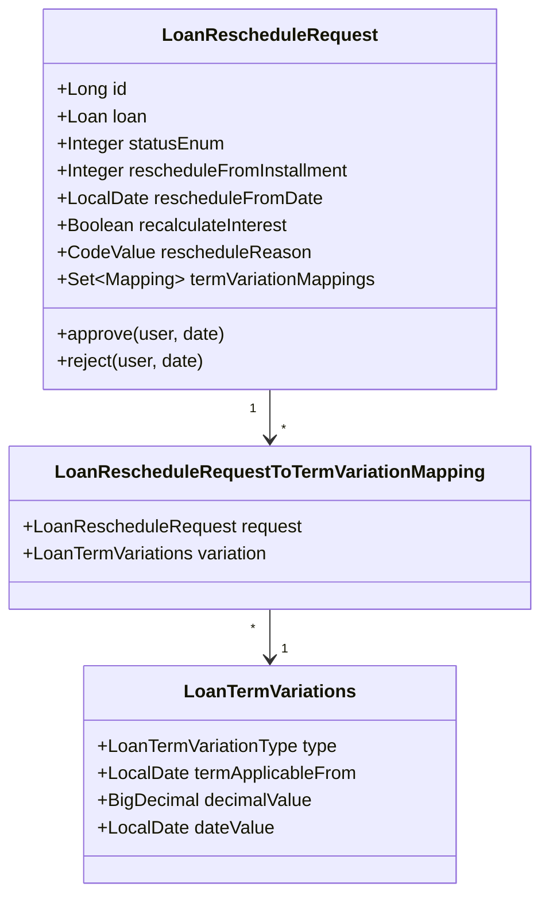
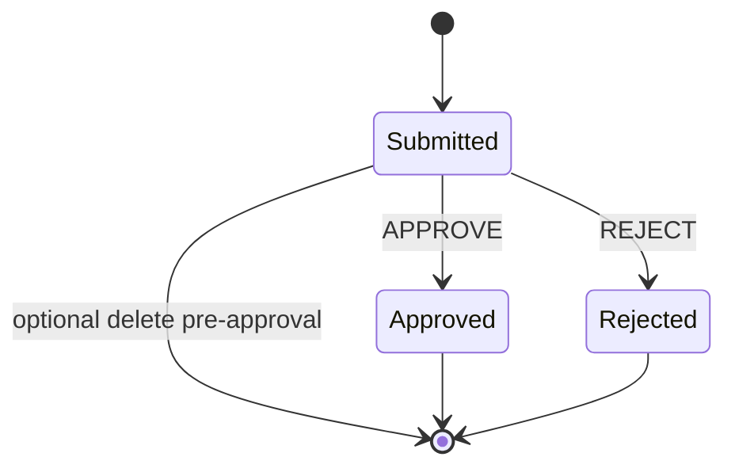
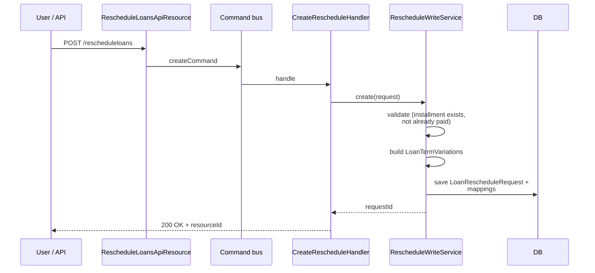

Loan reschedule in Apache Fineract is a first-class workflow with its own entity, API resource, command handlers and term-variation machinery — distinct from a simple "edit the loan". A reschedule request is a draft proposal to change the future repayment schedule (new rate, more grace, longer term, shifted due dates) that goes through submit → approve → reject states, captures who did what when, and on approval regenerates the schedule from the reschedule-from-installment forward while preserving everything paid before it.

The implementation lives under `fineract-loan/src/main/java/org/apache/fineract/portfolio/loanaccount/rescheduleloan/`.

## Package layout

```
loanaccount/rescheduleloan/
├── api/
│   └── RescheduleLoansApiResource.java
├── data/                      ← DTOs and template data
├── domain/
│   ├── LoanRescheduleRequest.java
│   ├── LoanRescheduleRequestRepository.java
│   ├── LoanRescheduleRequestRepositoryWrapper.java
│   ├── LoanRescheduleModalPeriod.java
│   ├── LoanRescheduleModelRepaymentPeriod.java
│   └── LoanTermVariationsRepository.java
├── exception/
├── handler/
│   ├── CreateLoanRescheduleRequestCommandHandler.java
│   ├── ApproveLoanRescheduleRequestCommandHandler.java
│   └── RejectLoanRescheduleRequestCommandHandler.java
├── service/
└── RescheduleLoansApiConstants.java
```

## LoanRescheduleRequest entity

Mapped to `m_loan_reschedule_request`, the entity stores the proposal plus its lifecycle audit columns.

| Column | Purpose |
| --- | --- |
| `loan_id` | The loan being rescheduled |
| `status_enum` | Submitted (100), Approved (200), Rejected (300) |
| `reschedule_from_installment` | First installment affected — everything before is frozen |
| `reschedule_from_date` | First due date affected — used when working with calendar variations |
| `recalculate_interest` | If true, schedule is regenerated using the current outstanding balance; else only the affected installments are re-amortised |
| `reschedule_reason_cv_id` | FK to `m_code_value` for the reason code |
| `reschedule_reason_comment` | Free-text justification |
| `submitted_on_date`, `submitted_by_user_id` | Who submitted |
| `approved_on_date`, `approved_by_user_id` | Who approved |
| `rejected_on_date`, `rejected_by_user_id` | Who rejected |

The actual schedule changes are not stored on the request directly — they live as `LoanTermVariations` linked through `LoanRescheduleRequestToTermVariationMapping`.



## Supported variations

A single reschedule request can bundle several term variations together. The supported `LoanTermVariationType` values are:

| Variation type | Effect on schedule |
| --- | --- |
| `EMI_AMOUNT` | Pin a new EMI from `rescheduleFromInstallment` forward |
| `INTEREST_RATE` | Apply a new nominal interest rate from the reschedule date |
| `INTEREST_RATE_FROM_INSTALLMENT` | Apply a new rate from a given installment number |
| `PRINCIPAL_AMOUNT` | Adjust outstanding principal (rare, used in restructure scenarios) |
| `DUE_DATE` | Shift a specific installment's due date |
| `GRACE_ON_INTEREST` | Insert N grace periods on interest from the reschedule date |
| `GRACE_ON_PRINCIPAL` | Insert N grace periods on principal |
| `EXTEND_REPAYMENT_PERIOD` | Extend term by N new installments at the end |

These variations are read by `AbstractCumulativeLoanScheduleGenerator` and the progressive engine during regeneration.

## State machine



Once approved or rejected, the request is terminal. A new request must be created for further changes. The terminal status is enforced by `LoanRescheduleRequestStatusEnumData` in the data package and by guards in the entity methods.

## Command handlers

Three `@CommandType` handlers drive the workflow. They sit on the regular Fineract command bus and write events through the audit infrastructure.

<CardGroup cols={2}>
  <Card title="CreateLoanRescheduleRequestCommandHandler" icon="plus">
    Entity `LOANRESCHEDULEREQUEST`, action `CREATE`. Validates the proposal, builds the `LoanRescheduleRequest` and its term-variation mappings, persists in `Submitted` state.
  </Card>
  <Card title="ApproveLoanRescheduleRequestCommandHandler" icon="circle-check">
    Action `APPROVE`. Flips the status to Approved, regenerates the schedule, archives the prior schedule to `LoanRepaymentScheduleHistory`, recomputes loan summary.
  </Card>
  <Card title="RejectLoanRescheduleRequestCommandHandler" icon="circle-xmark">
    Action `REJECT`. Records who rejected when and the comment. No schedule change.
  </Card>
</CardGroup>

The handlers wrap `LoanRescheduleRequestWritePlatformService` which carries the real business logic.

## Submit phase



Validation is centralised in `LoanRescheduleRequestDataValidator` and rejects requests that target paid or non-existent installments, missing reasons, or contradictory variations (for example both an EMI and a new rate without `recalculateInterest`).

## Approval phase

Approval is where the schedule actually changes. The service:

<Steps>
  <Step title="Re-load the loan">
    Fetch the loan through `LoanRepositoryWrapper` and verify it is in a state that allows reschedule (Active, not Closed, not WrittenOff).
  </Step>
  <Step title="Snapshot the existing schedule">
    Copy current `LoanRepaymentScheduleInstallment` rows into `LoanRepaymentScheduleHistory` for audit.
  </Step>
  <Step title="Promote term variations">
    Mark each linked `LoanTermVariations` row as `isActive = true` with `termApplicableFrom = rescheduleFromDate`.
  </Step>
  <Step title="Regenerate the schedule">
    Build a fresh `LoanApplicationTerms` (now including the new variations), call the configured `LoanScheduleGenerator`, then call the configured `LoanRepaymentScheduleTransactionProcessor` to re-apply existing transactions against the new periods.
  </Step>
  <Step title="Persist and notify">
    Replace future installments, recompute `LoanSummary`, raise a `LoanRescheduledDueAdjustScheduleBusinessEvent` so listeners (accounting, notification, hooks) can react.
  </Step>
</Steps>

<Info>
Installments earlier than `rescheduleFromInstallment` are never touched. Their `principal_completed_derived`, `interest_completed_derived` and other paid-amount columns carry over unchanged so historical accounting stays intact.
</Info>

## Recalculate vs. preserve interest

The `recalculateInterest` flag is the most consequential choice in the request:

<Tabs>
  <Tab title="recalculateInterest = false">
    Only the affected installments are re-amortised using the existing `interestRate` and the new variations. Future interest charges that were already computed for un-reached installments are preserved. Useful for "extend the loan by 3 months" scenarios where the customer wants to keep the original rate.
  </Tab>
  <Tab title="recalculateInterest = true">
    The schedule is regenerated from scratch using the current outstanding balance and the new rate / EMI / variations. This effectively re-amortises the loan as if it were freshly disbursed at the outstanding amount. Required when the rate changes mid-loan and the customer expects new interest figures.
  </Tab>
</Tabs>

## API surface

`RescheduleLoansApiResource` exposes the workflow at `/rescheduleloans`:

| Method | Path | Purpose |
| --- | --- | --- |
| `GET` | `/rescheduleloans/template` | Reschedule template (reasons, term-variation types) |
| `POST` | `/rescheduleloans` | Create a new request — `command=create` (default) |
| `GET` | `/rescheduleloans/{scheduleId}` | Read one request |
| `GET` | `/rescheduleloans?loanId={loanId}` | List requests for a loan |
| `POST` | `/rescheduleloans/{scheduleId}?command=approve` | Approve |
| `POST` | `/rescheduleloans/{scheduleId}?command=reject` | Reject |

Request payloads carry `rescheduleFromDate`, `submittedOnDate`, `graceOnPrincipal`, `graceOnInterest`, `extraTerms`, `newInterestRate`, `adjustedDueDate`, `rescheduleReasonId`, `rescheduleReasonComment` and the locale/date-format fields.

## Term-variation persistence

The term variations created during reschedule live in `m_loan_term_variations`:

| Column | Notes |
| --- | --- |
| `loan_id` | The loan |
| `term_type` | Enum value of `LoanTermVariationType` |
| `applicable_from_date` | `rescheduleFromDate` |
| `decimal_value` | New rate / new EMI / number of grace periods |
| `date_value` | New due date (for `DUE_DATE`) |
| `is_specific_to_installment` | True for installment-specific variations |
| `is_active` | Set to true on approval; false while the request is pending |

Because the variations are loan-scoped (not request-scoped), they survive after the request itself; the link table `m_loan_reschedule_request_term_variations_mapping` provides traceability back to the originating request.

## Reasons code

Reschedule reasons are not free-form. They are managed under the standard `m_code` / `m_code_value` infrastructure with `code_name = 'LoanRescheduleReason'`, so MFIs can govern the vocabulary (Natural disaster, Income loss, Restructure, etc.) without code changes.

## Audit and traceability

Every state transition leaves a trail:

| Source | What it records |
| --- | --- |
| `m_command_source` | The original API command, user, IP, timestamp, JSON payload |
| `LoanRescheduleRequest` lifecycle columns | Submit/approve/reject user and date |
| `m_loan_reschedule_request_term_variations_mapping` | Which variations belong to which request |
| `m_loan_repayment_schedule_history` | Snapshot of the schedule replaced on approval |
| `LoanRescheduledDueAdjustScheduleBusinessEvent` | Hook-able event for downstream systems |

This means even years after the fact, an auditor can reconstruct what the schedule was before approval, what the proposed changes were, and who approved them.

## Related pages

<CardGroup cols={2}>
  <Card title="Cumulative generator" icon="calculator" href="/loan/cumulative-schedule-generator">
    The classic engine that consumes the term variations on approval.
  </Card>
  <Card title="Repayment schedule" icon="list-ol" href="/loan/loan-repayment-schedule">
    The installment shape that is replaced on approval.
  </Card>
  <Card title="Handlers catalogue" icon="bolt" href="/loan/loan-handlers">
    Where the three reschedule command handlers sit in the loan command surface.
  </Card>
  <Card title="Loan application lifecycle" icon="route" href="/loan/loan-application-lifecycle">
    How reschedule fits into the broader loan state machine.
  </Card>
</CardGroup>
