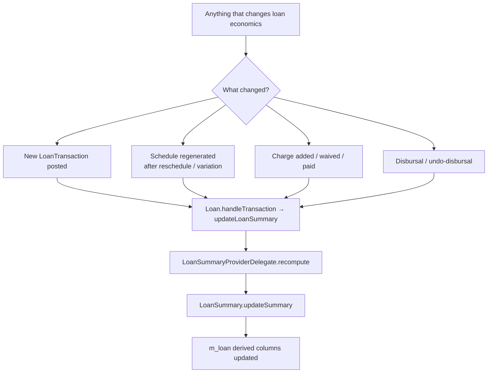

Every row in `m_loan` carries a fat block of **derived columns** — `principal_outstanding_derived`, `interest_repaid_derived`, `total_outstanding_derived` and so on — that summarise the loan's economic state in a single read. These columns are not authoritative; they are *recomputable projections* of the repayment schedule and transaction list. Apache Fineract models them through a `@Embeddable` class called `LoanSummary` and refreshes them every time a transaction posts or the schedule is regenerated.

This page documents:

- the `LoanSummary` embeddable and its 27 derived columns,
- the `LoanSummaryProviderDelegate` that selects an implementation per loan/product,
- the triggers that recompute the summary,
- the relationship to the live aggregate (the schedule, transactions, charges).

## Why an embeddable summary?

Two reasons:

1. **Read performance**: dashboards, search, the loan list, and reports all need a quick "what is the outstanding balance on this loan?" answer. Recomputing from the schedule and transactions on every read would be expensive.
2. **Single-row contract**: the same numbers are returned to API clients as `LoanAccountData.summary`. The embeddable shape is the source for that DTO.

## The 27 columns

The columns are partitioned into **four buckets** — principal, interest, fees, penalties — plus four totals.

```java fineract-loan/.../loanaccount/domain/LoanSummary.java
@Embeddable
public class LoanSummary {

    @Column(name = "total_principal_derived", scale = 6, precision = 19)
    private BigDecimal totalPrincipal;

    @Column(name = "principal_disbursed_derived",  scale = 6, precision = 19)
    private BigDecimal totalPrincipalDisbursed;
    @Column(name = "principal_adjustments_derived",scale = 6, precision = 19)
    private BigDecimal totalPrincipalAdjustments;
    @Column(name = "principal_repaid_derived",     scale = 6, precision = 19)
    private BigDecimal totalPrincipalRepaid;
    @Column(name = "principal_writtenoff_derived", scale = 6, precision = 19)
    private BigDecimal totalPrincipalWrittenOff;
    @Column(name = "principal_outstanding_derived",scale = 6, precision = 19)
    private BigDecimal totalPrincipalOutstanding;

    // ...interest, fee, penalty buckets each with the same shape...

    @Column(name = "total_expected_repayment_derived",  scale = 6, precision = 19)
    private BigDecimal totalExpectedRepayment;
    @Column(name = "total_repayment_derived",           scale = 6, precision = 19)
    private BigDecimal totalRepayment;
    @Column(name = "total_expected_costofloan_derived", scale = 6, precision = 19)
    private BigDecimal totalExpectedCostOfLoan;
    @Column(name = "total_costofloan_derived",          scale = 6, precision = 19)
    private BigDecimal totalCostOfLoan;
    @Column(name = "total_waived_derived",              scale = 6, precision = 19)
    private BigDecimal totalWaived;
    @Column(name = "total_writtenoff_derived",          scale = 6, precision = 19)
    private BigDecimal totalWrittenOff;
    @Column(name = "total_outstanding_derived",         scale = 6, precision = 19)
    private BigDecimal totalOutstanding;
}
```

### Per-bucket columns

For each of *principal*, *interest*, *fee*, *penalty* the summary carries:

| Column suffix | Meaning |
|---------------|---------|
| `_charged_derived` (or `_disbursed_derived` for principal) | Total amount of this kind ever billed |
| `_adjustments_derived` | Net adjustments (chargebacks, charge adjustments) |
| `_repaid_derived` | Total paid by the borrower |
| `_waived_derived` | Total waived by the lender |
| `_writtenoff_derived` | Total written off in write-off events |
| `_outstanding_derived` | `charged - adjustments - repaid - waived - writtenoff` |

### Top-level totals

| Column | Meaning |
|--------|---------|
| `total_principal_derived` | Net disbursed principal (`disbursed - principal-related adjustments`) |
| `total_expected_repayment_derived` | All expected cash inflows from the schedule (principal + interest + fees + penalties) |
| `total_repayment_derived` | All actual cash inflows posted as repayments |
| `total_expected_costofloan_derived` | Expected interest + fees + penalties |
| `total_costofloan_derived` | Actual interest + fees + penalties paid |
| `total_waived_derived` | Sum across waived buckets |
| `total_writtenoff_derived` | Sum across writtenoff buckets |
| `total_outstanding_derived` | Sum across outstanding buckets — the *current balance* a UI shows |

### Capitalized income

The summary also carries two columns reserved for the optional capitalized-income feature (deferred fee income):

- `capitalized_income_derived`
- `capitalized_income_adjustment_derived`

These are zero on products that do not enable capitalization.

## Recomputation API

The embeddable exposes a single fat method `updateSummary(MonetaryCurrency, Money principal, ...)` that takes every component as a `Money` and rewrites all derived fields atomically. Plus targeted setters for fields that change in isolation:

```java fineract-loan/.../LoanSummary.java
public void updateSummary(final MonetaryCurrency currency, final Money principal, ...);

public void updateTotalFeeChargesDueAtDisbursement(BigDecimal v);
public Money  getTotalFeeChargesDueAtDisbursement(MonetaryCurrency currency);

public Money getTotalOutstanding(MonetaryCurrency currency);
public void  updateFeeChargeOutstanding(BigDecimal v);
public void  updateFeeChargesCharged(BigDecimal v);
public void  updatePenaltyChargeOutstanding(BigDecimal v);
public void  updateFeeChargesWaived(BigDecimal v);
public void  updatePenaltyChargesWaived(BigDecimal v);
public boolean isRepaidInFull(MonetaryCurrency currency);
public void  updateTotalOutstanding(BigDecimal v);
public void  updateTotalWaived(BigDecimal v);
public void  updateTotalExpectedRepayment(BigDecimal v);
public void  updateTotalExpectedCostOfLoan(BigDecimal v);
public void  recalculateDerivedTotalsForAdjustedFeeCharged(BigDecimal adjustedFeeCharged);
public void  zeroFields();
```

The factory `LoanSummary.create(BigDecimal totalFeeChargesDueAtDisbursement)` seeds a fresh summary on loan creation.

## LoanSummaryProviderDelegate

Different product configurations need slightly different summary recomputation logic — for example, a *progressive* (Advanced Payment Allocation) loan rolls up its summary from `LoanTransaction` rows directly, whereas a *cumulative* (legacy) loan walks the repayment schedule.

```java fineract-loan/.../service/LoanSummaryProviderDelegate.java
public class LoanSummaryProviderDelegate {
    // delegates to the right LoanSummaryProvider implementation
    // based on the loan's transaction processor / product flavour
}
```

The delegate routes to one of:

| Provider | When |
|----------|------|
| **Schedule-driven** | Cumulative loans — recompute by walking `LoanRepaymentScheduleInstallment` |
| **Transaction-driven** | Progressive (Advanced Payment Allocation) loans — recompute by walking `LoanTransaction` |

Both end up calling `LoanSummary.updateSummary(...)` with the same shape, so consumers see no difference.

## Where the trigger lives



Every command handler that mutates a loan ends by invoking the Loan aggregate's recompute. Concretely, the call chains are:

1. A handler calls `LoanAccountDomainService.saveLoanWithDataIntegrityViolationChecks(loan)` after the domain mutation.
2. Inside the Loan aggregate, methods like `handleRepaymentOrRecoveryOrWaiverTransaction`, `handleDisbursementTransaction`, `regenerateRepaymentSchedule` and `updateLoanSummaryDerivedFields` end with a call into the summary provider.
3. The provider produces fresh `Money` values from the schedule and transaction list.
4. `LoanSummary.updateSummary` writes them onto the embeddable.

Because the summary is part of `m_loan`, the JPA flush at end-of-transaction persists everything in one UPDATE statement.

## Relationship to `m_loan_summary_balances`

A companion table `m_loan_summary_balances` (entity `LoanSummaryBalancesRepository` lives in the same package) stores **point-in-time snapshots** of summary balances for historical reporting. The recompute path optionally writes a row here when the loan crosses certain milestones (charge-off, write-off, foreclosure). The live `LoanSummary` is always *now*; the balances table is the audit trail.

## Reading the summary

API consumers see the embeddable through `LoanAccountData.summary`:

```json
{
  "summary": {
    "principalDisbursed":      5000.00,
    "principalPaid":           1200.00,
    "principalOutstanding":    3800.00,
    "interestCharged":          400.00,
    "interestPaid":             150.00,
    "interestOutstanding":      250.00,
    "feeChargesCharged":         50.00,
    "feeChargesOutstanding":     20.00,
    "penaltyChargesOutstanding":  0.00,
    "totalExpectedRepayment":  5450.00,
    "totalOutstanding":        4070.00,
    "totalWaived":               30.00,
    "totalWrittenOff":            0.00
  }
}
```

Each field maps 1-to-1 to a `*_derived` column.

## Invariants checked by recompute

After every recompute Fineract asserts (via `isRepaidInFull` and balance comparisons):

- `principal_disbursed = principal_repaid + principal_writtenoff + principal_outstanding` (modulo waivers and adjustments),
- `total_outstanding = sum of bucket outstanding columns`,
- `total_outstanding >= 0`,
- if the loan status is `CLOSED_OBLIGATIONS_MET` then `total_outstanding == 0`.

A violation is treated as a domain bug and surfaces as a `PlatformDataIntegrityException`.

## When recompute does **not** happen

- Setting metadata (loan officer, sub-status, fraud flag) — these do not change cash flows.
- Reading the loan.
- Background jobs that don't post a transaction (e.g. `UPDATE_LOAN_ARREARS_AGEING` reads the summary but does not mutate it).

## Operational considerations

- **Cost**: recompute touches the repayment schedule and the in-memory `LoanTransaction` collection. For loans with thousands of transactions (long-running revolving credit) this becomes expensive — products needing very high transaction frequency typically use the *transaction-driven* provider which avoids re-walking the schedule.
- **Concurrency**: the `LoanSummary` is part of `m_loan`, which is row-locked by the surrounding command transaction. There is no separate locking concern.
- **Migration**: when adding a column, both the SQL schema and the embeddable need updating in tandem; the `zeroFields()` initializer must include the new column or fresh loans will have a `NULL`.

<Note>
Because `LoanSummary` is an `@Embeddable`, it does not have its own primary key. The "summary row" *is* the `m_loan` row. There is no separate insert/update path.
</Note>

## Summary

`LoanSummary` is Fineract's denormalised single-row view of a loan's economic position, kept in sync by `LoanSummaryProviderDelegate` after every transaction, charge change, and schedule regeneration. It exists to make the most-frequently-asked question — *"what's the balance?"* — a single column read instead of a join, while the schedule and transaction tables remain the authoritative source of truth.
