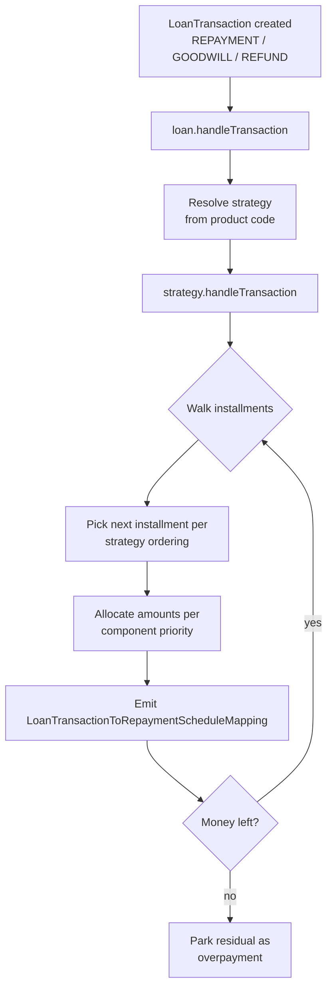
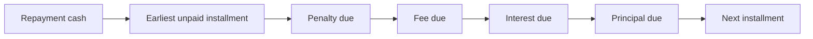
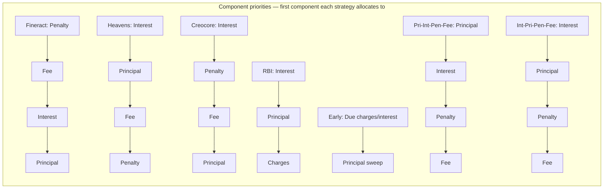

When a repayment arrives, Apache Fineract has to decide which installments the money pays down, and in what order it consumes principal vs. interest vs. fees vs. penalties inside each installment. That decision is delegated to a strategy class implementing `LoanRepaymentScheduleTransactionProcessor`. The processor is selected per loan product via the **Transaction processing strategy** field and travels with the loan for its lifetime, so the same rules govern every repayment, waiver, refund, charge-off and chargeback on that account.

This page catalogues the concrete strategies shipped in `fineract-loan`, the order they walk installments, and the component priority they apply inside each one.

## Strategy contract

The contract is `org.apache.fineract.portfolio.loanaccount.domain.transactionprocessor.LoanRepaymentScheduleTransactionProcessor`. Implementations live under `domain/transactionprocessor/impl/` and share a base class:

<CardGroup cols={2}>
  <Card title="AbstractLoanRepaymentScheduleTransactionProcessor" icon="diagram-project">
    Shared machinery: walking installments, applying overpayments, transferring waivers, calling charges, emitting `LoanTransactionToRepaymentScheduleMapping` rows.
  </Card>
  <Card title="Strategy hook" icon="code">
    Subclasses override `handleTransaction(...)` and the helpers `handleRepayment`, `handleRefund`, `handleChargeOff`, `handleChargeback` to encode the in-installment priority.
  </Card>
</CardGroup>

A strategy answers four questions:

| Question | Driven by |
| --- | --- |
| Which installment receives the cash first? | Strategy — usually earliest unpaid, but EarlyPayment differs |
| Inside that installment, what gets paid first? | Strategy — penalty, fee, interest, principal in some order |
| What happens when a transaction predates an installment? | Strategy — in-advance allocation rules |
| What happens to overpayment? | Strategy — push to next installment or park as overpayment |

## Shipped strategies

```
fineract-loan/.../loanaccount/domain/transactionprocessor/impl/
├── FineractStyleLoanRepaymentScheduleTransactionProcessor.java
├── HeavensFamilyLoanRepaymentScheduleTransactionProcessor.java
├── CreocoreLoanRepaymentScheduleTransactionProcessor.java
├── EarlyPaymentLoanRepaymentScheduleTransactionProcessor.java
├── RBILoanRepaymentScheduleTransactionProcessor.java
├── PrincipalInterestPenaltyFeesOrderLoanRepaymentScheduleTransactionProcessor.java
├── InterestPrincipalPenaltyFeesOrderLoanRepaymentScheduleTransactionProcessor.java
├── DuePenFeeIntPriInAdvancePriPenFeeIntLoanRepaymentScheduleTransactionProcessor.java
└── DuePenIntPriFeeInAdvancePenIntPriFeeLoanRepaymentScheduleTransactionProcessor.java
```

| Strategy code | Class | One-line description |
| --- | --- | --- |
| `mifos-standard-strategy` | `FineractStyleLoanRepaymentScheduleTransactionProcessor` | Default. Penalty → Fee → Interest → Principal on the earliest due installment |
| `heavensfamily-strategy` | `HeavensFamilyLoanRepaymentScheduleTransactionProcessor` | Interest → Principal → Fee → Penalty (used by some legacy MFIs) |
| `creocore-strategy` | `CreocoreLoanRepaymentScheduleTransactionProcessor` | Interest → Penalty → Fee → Principal; in-advance goes straight to principal |
| `early-repayment-strategy` | `EarlyPaymentLoanRepaymentScheduleTransactionProcessor` | Treat every repayment as principal-first to shorten the loan |
| `rbi-india-strategy` | `RBILoanRepaymentScheduleTransactionProcessor` | RBI India ordering — Interest → Principal → Charges |
| `principal-interest-penalties-fees-order-strategy` | `PrincipalInterestPenaltyFeesOrderLoanRepaymentScheduleTransactionProcessor` | Principal first, then Interest, then Penalties, then Fees |
| `interest-principal-penalties-fees-order-strategy` | `InterestPrincipalPenaltyFeesOrderLoanRepaymentScheduleTransactionProcessor` | Interest, Principal, Penalties, Fees — used by progressive-loan defaults |
| `due-penalty-fee-interest-principal-in-advance-principal-penalty-fee-interest-strategy` | `DuePenFeeIntPriInAdvancePriPenFeeIntLoanRepaymentScheduleTransactionProcessor` | Asymmetric due/in-advance ordering |
| `due-penalty-interest-principal-fee-in-advance-penalty-interest-principal-fee-strategy` | `DuePenIntPriFeeInAdvancePenIntPriFeeLoanRepaymentScheduleTransactionProcessor` | Asymmetric due/in-advance with fees last |

The string codes are the `code` values from `LoanRepaymentScheduleTransactionProcessor.getCode()` and are stored on `m_product_loan.transaction_processing_strategy_code`.

## Processing pipeline



Each pass produces `LoanTransactionToRepaymentScheduleMapping` rows so the audit trail can show which repayment paid down which installment.

## The Fineract default



`FineractStyleLoanRepaymentScheduleTransactionProcessor` is the closest analogue to the Mifos legacy ordering. Within each installment cash is consumed in the order `penaltyChargesPortion` → `feeChargesPortion` → `interestPortion` → `principalPortion`. Money that arrives early (before the next due date) still posts to the earliest unpaid installment.

## Early-payment

`EarlyPaymentLoanRepaymentScheduleTransactionProcessor` is a special case used by MFIs that want any extra cash to retire principal — shortening the loan rather than pre-funding interest.

<Steps>
  <Step title="Pay due interest and charges first">
    The portion of cash equal to interest + fees + penalties already due is allocated normally.
  </Step>
  <Step title="Excess sweeps to principal">
    Whatever is left is applied directly to outstanding principal, starting with the earliest installment that still has principal due.
  </Step>
  <Step title="Schedule shortening">
    Because principal drops, the schedule recalculation step removes or shrinks future installments rather than reducing per-installment amounts.
  </Step>
</Steps>

This is the strategy paired with `recalculateInterest = true` interest recalculation products to give the "save interest by paying ahead" feel.

## RBI India

`RBILoanRepaymentScheduleTransactionProcessor` follows the Reserve Bank of India guidance for retail loans: every rupee allocates Interest → Principal → Charges. This means charges accrue but are settled last, and a partial repayment can never leave interest unpaid while principal goes down.

<Info>
Choose RBI when the product needs to satisfy RBI Master Directions on EMI allocation or when interest must always be cleared before principal for regulatory reporting.
</Info>

## HeavensFamily and Creocore

These are legacy MFI strategies preserved for backward compatibility with deployments migrated from older Mifos installations.

<AccordionGroup>
  <Accordion title="HeavensFamily">
    Within an installment: Interest → Principal → Fee → Penalty. Excess cash is applied principal-first to the next installment. Useful when penalty income should be the last priority.
  </Accordion>
  <Accordion title="Creocore">
    Within an installment: Interest → Penalty → Fee → Principal. In-advance cash bypasses the per-installment ordering and goes directly against principal — useful for loans where prepayment should immediately reduce balance.
  </Accordion>
</AccordionGroup>

## Symmetric vs. asymmetric strategies

Some strategies apply a different ordering depending on whether the cash settles a **due** obligation (the installment's due date has passed) or arrives **in advance** (paid before its due date).

| Strategy | Due ordering | In-advance ordering |
| --- | --- | --- |
| `DuePenFeeIntPri-InAdvancePriPenFeeInt...` | Penalty, Fee, Interest, Principal | Principal, Penalty, Fee, Interest |
| `DuePenIntPriFee-InAdvancePenIntPriFee...` | Penalty, Interest, Principal, Fee | Penalty, Interest, Principal, Fee |

These asymmetric strategies let an MFI insist that anything past its due date settles penalties and interest first (the regulatory default) while early payments reduce principal aggressively.

## Component priority cheat sheet



## Reversals and chargebacks

`AbstractLoanRepaymentScheduleTransactionProcessor` also handles non-repayment transactions:

| Transaction type | What the processor does |
| --- | --- |
| `WAIVE_INTEREST` | Apply the waiver against the earliest unpaid interest portion; mark waived amounts in `interest_waived_derived` |
| `WAIVE_CHARGES` | Reduce fee/penalty waived columns on the affected installment |
| `WRITEOFF` | Move outstanding to `*_writtenoff_derived` columns on each installment |
| `CHARGEBACK` | Reverse a prior repayment's allocations and re-open the installment portions |
| `REFUND` | Apply the same ordering as a repayment, but as a negative allocation |
| `CHARGE_OFF` | Mark all remaining installments as charged-off and stop further accrual |

The strategy interface exposes dedicated hooks for each so subclasses can override the asymmetric rules where needed.

## Choosing a strategy

<CardGroup cols={2}>
  <Card title="Standard microfinance" icon="users">
    Use `mifos-standard-strategy` (`FineractStyleLoanRepaymentScheduleTransactionProcessor`). Penalties and fees first protects fee income.
  </Card>
  <Card title="Retail consumer (India)" icon="building-columns">
    Use `rbi-india-strategy`. Required for some bank deployments.
  </Card>
  <Card title="Prepayment-friendly" icon="forward-fast">
    Use `early-repayment-strategy` with interest recalculation enabled.
  </Card>
  <Card title="Progressive loan default" icon="chart-line">
    Use `interest-principal-penalties-fees-order-strategy` to match the in-installment ordering used by `ProgressiveLoanScheduleGenerator`.
  </Card>
</CardGroup>

## Overpayment behaviour

Every strategy has to deal with the same edge case: a repayment exceeds what is owed. The base class normalises the outcome.

| Scenario | Default outcome |
| --- | --- |
| Cash leftover after last unpaid installment | Stored on the loan as `total_overpaid_derived`; surfaced as an overpayment row |
| Loan has been previously overpaid | New repayments first cure prior overpayment if the strategy declares it |
| Refund issued against an overpaid loan | Settled from the overpaid pool via `CREDITBALANCEREFUND` |
| Foreclosure with surplus | Surplus emitted as a `CREDIT_BALANCE_REFUND` candidate |

Strategy subclasses can override `handleOverPayment` to redirect surplus to a specific installment or to the next future installment rather than parking it.

## Transaction-to-installment mapping

A repayment in Fineract is never just a row in `m_loan_transaction`. Once a processor allocates it, it emits one `LoanTransactionToRepaymentScheduleMapping` row per touched installment so reports can show:

| Column | Meaning |
| --- | --- |
| `loan_transaction_id` | The repayment |
| `loan_repayment_schedule_id` | The installment touched |
| `principal_portion`, `interest_portion`, `fee_charges_portion`, `penalty_charges_portion` | What share of the repayment landed on each component |
| `amount` | Total amount applied to this installment |

These rows make it possible for the loan view to highlight which installment a given repayment paid down, and for reversals to know exactly what to undo.

## Reprocessing on schedule change

When a schedule is regenerated — disbursement edit, reschedule approval, interest recalculation — the processor must be re-run from scratch against the new periods:

<Steps>
  <Step title="Wipe mappings">
    Existing `LoanTransactionToRepaymentScheduleMapping` rows are dropped.
  </Step>
  <Step title="Reset installment paid counters">
    All `*_completed_derived`, `*_waived_derived`, `*_writtenoff_derived` columns on the new installment rows start at zero.
  </Step>
  <Step title="Replay in date order">
    Each `LoanTransaction` is reprocessed in chronological order through the configured strategy, rebuilding the mappings and counters as if the new schedule had always been in place.
  </Step>
  <Step title="Update summary">
    `LoanSummary` derived totals are recomputed from the new installment state.
  </Step>
</Steps>

This guarantees the post-change loan is internally consistent regardless of how complex the prior repayment history was.

## Related pages

<CardGroup cols={2}>
  <Card title="Loan transactions" icon="receipt" href="/loan/loan-transactions">
    The transaction types these processors consume.
  </Card>
  <Card title="Repayment schedule" icon="list-ol" href="/loan/loan-repayment-schedule">
    The installment shape they update.
  </Card>
  <Card title="Cumulative generator" icon="calculator" href="/loan/cumulative-schedule-generator">
    Builds the schedule that processors then walk.
  </Card>
  <Card title="Charges" icon="money-bill" href="/loan/loan-charges">
    Where penalty and fee portions originate.
  </Card>
</CardGroup>
