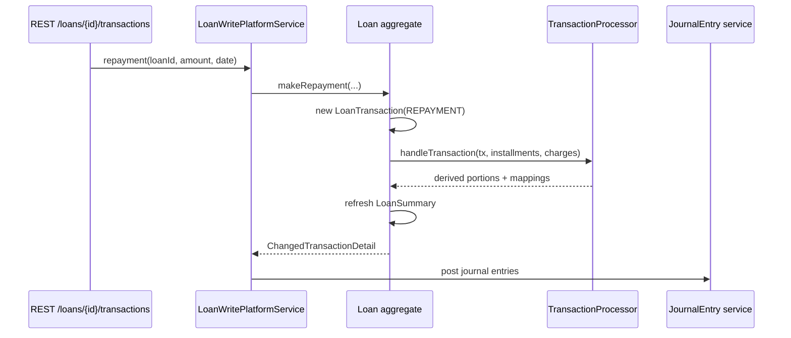

Every movement of money on an Apache Fineract loan is recorded as a `LoanTransaction` row. Disbursals, repayments, waivers, accruals, charge-offs, refunds, chargebacks and the modern capitalized-income transactions all share the same entity, distinguished only by the `LoanTransactionType` enum. The transaction log is the immutable source of truth — the embedded `LoanSummary` and the schedule rows are denormalised projections kept in sync by the active `LoanRepaymentScheduleTransactionProcessor`.

## Entity shell

`fineract-loan/src/main/java/org/apache/fineract/portfolio/loanaccount/domain/LoanTransaction.java`:

```java
@Getter
@Entity
@Table(name = "m_loan_transaction",
       uniqueConstraints = { @UniqueConstraint(columnNames = "external_id", name = "external_id_UNIQUE") })
public class LoanTransaction extends AbstractAuditableWithUTCDateTimeCustom<Long> {

    @Version private Long version;

    @ManyToOne(optional = false) @JoinColumn(name = "loan_id",   nullable = false) private Loan loan;
    @ManyToOne                   @JoinColumn(name = "office_id", nullable = false) private Office office;
    @ManyToOne                   @JoinColumn(name = "payment_detail_id")           private PaymentDetail paymentDetail;

    @Column(name = "transaction_type_enum", nullable = false) private LoanTransactionType typeOf;
    @Column(name = "transaction_date",      nullable = false) private LocalDate dateOf;
    @Column(name = "submitted_on_date",     nullable = false) private LocalDate submittedOnDate;

    @Column(name = "amount",                         scale = 6, precision = 19, nullable = false) private BigDecimal amount;
    @Column(name = "principal_portion_derived",      scale = 6, precision = 19) private BigDecimal principalPortion;
    @Column(name = "interest_portion_derived",       scale = 6, precision = 19) private BigDecimal interestPortion;
    @Column(name = "fee_charges_portion_derived",    scale = 6, precision = 19) private BigDecimal feeChargesPortion;
    ...
}
```

## Key columns

| Column | Meaning |
| --- | --- |
| `transaction_type_enum` | `LoanTransactionType.value` |
| `transaction_date` | Business date the money moves on |
| `submitted_on_date` | When the row was inserted |
| `amount` | Gross amount |
| `principal_portion_derived` | Of `amount`, how much is principal |
| `interest_portion_derived` | Of `amount`, how much is interest |
| `fee_charges_portion_derived` | Of `amount`, fees |
| `penalty_charges_portion_derived` | Of `amount`, penalties |
| `unrecognized_income_portion` | For overpayment / accrual adjustments |
| `outstanding_loan_balance_derived` | Post-tx outstanding principal snapshot |
| `is_reversed` | Soft-delete flag |
| `reversal_external_id` | External ID of the reversing tx |
| `external_id` | Optional client identifier (unique) |

`PaymentDetail` links to the payment-type, receipt and routing reference. `Office` is captured so branch-level reporting can attribute the tx even after a loan transfer.

## The transaction type enum

`LoanTransactionType` is the central switch:

```java
public enum LoanTransactionType {
    INVALID(0,                   "loanTransactionType.invalid"),
    DISBURSEMENT(1,              "loanTransactionType.disbursement"),
    REPAYMENT(2,                 "loanTransactionType.repayment"),
    CONTRA(3,                    "loanTransactionType.contra"),
    WAIVE_INTEREST(4,            "loanTransactionType.waiver"),
    REPAYMENT_AT_DISBURSEMENT(5, "loanTransactionType.repaymentAtDisbursement"),
    WRITEOFF(6,                  "loanTransactionType.writeOff"),
    MARKED_FOR_RESCHEDULING(7,   "loanTransactionType.marked.for.rescheduling"),
    RECOVERY_REPAYMENT(8,        "loanTransactionType.recoveryRepayment"),
    WAIVE_CHARGES(9,             "loanTransactionType.waiveCharges"),
    ACCRUAL(10,                  "loanTransactionType.accrual"),
    INITIATE_TRANSFER(12,        "loanTransactionType.initiateTransfer"),
    APPROVE_TRANSFER(13,         "loanTransactionType.approveTransfer"),
    WITHDRAW_TRANSFER(14,        "loanTransactionType.withdrawTransfer"),
    REJECT_TRANSFER(15,          "loanTransactionType.rejectTransfer"),
    REFUND(16,                   "loanTransactionType.refund"),
    CHARGE_PAYMENT(17,           "loanTransactionType.chargePayment"),
    REFUND_FOR_ACTIVE_LOAN(18,   "loanTransactionType.refund"),
    INCOME_POSTING(19,           "loanTransactionType.incomePosting"),
    CREDIT_BALANCE_REFUND(20,    "loanTransactionType.creditBalanceRefund"),
    MERCHANT_ISSUED_REFUND(21,   "loanTransactionType.merchantIssuedRefund"),
    PAYOUT_REFUND(22,            "loanTransactionType.payoutRefund"),
    GOODWILL_CREDIT(23,          "loanTransactionType.goodwillCredit"),
    CHARGE_REFUND(24,            "loanTransactionType.chargeRefund"),
    CHARGEBACK(25,               "loanTransactionType.chargeback"),
    CHARGE_ADJUSTMENT(26,        "loanTransactionType.chargeAdjustment"),
    CHARGE_OFF(27,               "loanTransactionType.chargeOff"),
    DOWN_PAYMENT(28,             "loanTransactionType.downPayment"),
    REAGE(29,                    "loanTransactionType.reAge"),
    REAMORTIZE(30,               "loanTransactionType.reAmortize"),
    INTEREST_PAYMENT_WAIVER(31,  "loanTransactionType.interestPaymentWaiver"),
    ACCRUAL_ACTIVITY(32,         "loanTransactionType.accrualActivity"),
    INTEREST_REFUND(33,          "loanTransactionType.interestRefund"),
    ACCRUAL_ADJUSTMENT(34,       "loanTransactionType.accrualAdjustment"),
    CAPITALIZED_INCOME(35,       "loanTransactionType.capitalizedIncome"),
    ...
    BUY_DOWN_FEE(40, ...),
    DISCOUNT_FEE(44, ...),
    CONTRACT_TERMINATION(38, ...);
}
```

### Grouped reference

<Tabs>
  <Tab title="Money in (debit balance)">
    | Code | Type | Notes |
    | --- | --- | --- |
    | 1 | `DISBURSEMENT` | Cash out to borrower |
    | 5 | `REPAYMENT_AT_DISBURSEMENT` | Charges paid from disbursement amount |
    | 28 | `DOWN_PAYMENT` | Borrower's initial principal payment |
    | 35 | `CAPITALIZED_INCOME` | Capitalize a fee into principal |
    | 40 | `BUY_DOWN_FEE` | Discount fee capitalization |
    | 44 | `DISCOUNT_FEE` | Discount fee capitalization variant |
  </Tab>
  <Tab title="Money in (credit balance)">
    | Code | Type | Notes |
    | --- | --- | --- |
    | 2 | `REPAYMENT` | Standard repayment |
    | 8 | `RECOVERY_REPAYMENT` | Post write-off recovery |
    | 17 | `CHARGE_PAYMENT` | Pay specific charge |
    | 23 | `GOODWILL_CREDIT` | Adjustment in favour of borrower |
    | 31 | `INTEREST_PAYMENT_WAIVER` | Waive paid interest |
  </Tab>
  <Tab title="Refunds & reversals">
    | Code | Type |
    | --- | --- |
    | 3 | `CONTRA` |
    | 16 | `REFUND` |
    | 18 | `REFUND_FOR_ACTIVE_LOAN` |
    | 20 | `CREDIT_BALANCE_REFUND` |
    | 21 | `MERCHANT_ISSUED_REFUND` |
    | 22 | `PAYOUT_REFUND` |
    | 24 | `CHARGE_REFUND` |
    | 25 | `CHARGEBACK` |
    | 26 | `CHARGE_ADJUSTMENT` |
    | 33 | `INTEREST_REFUND` |
  </Tab>
  <Tab title="Waivers & write-off">
    | Code | Type |
    | --- | --- |
    | 4 | `WAIVE_INTEREST` |
    | 6 | `WRITEOFF` |
    | 9 | `WAIVE_CHARGES` |
    | 27 | `CHARGE_OFF` |
    | 38 | `CONTRACT_TERMINATION` |
  </Tab>
  <Tab title="Accrual">
    | Code | Type |
    | --- | --- |
    | 10 | `ACCRUAL` |
    | 19 | `INCOME_POSTING` |
    | 32 | `ACCRUAL_ACTIVITY` |
    | 34 | `ACCRUAL_ADJUSTMENT` |
    | 36 | `CAPITALIZED_INCOME_AMORTIZATION` |
    | 42 | `BUY_DOWN_FEE_AMORTIZATION` |
    | 45 | `DISCOUNT_FEE_AMORTIZATION` |
  </Tab>
  <Tab title="Lifecycle / inter-office">
    | Code | Type |
    | --- | --- |
    | 7 | `MARKED_FOR_RESCHEDULING` |
    | 12 | `INITIATE_TRANSFER` |
    | 13 | `APPROVE_TRANSFER` |
    | 14 | `WITHDRAW_TRANSFER` |
    | 15 | `REJECT_TRANSFER` |
    | 29 | `REAGE` |
    | 30 | `REAMORTIZE` |
  </Tab>
</Tabs>

<Note>
  Codes 11 and 37 etc. are gaps in the numbering because older values
  were retired but their numeric slots are reserved for backwards
  database compatibility.
</Note>

## Lifecycle of a repayment



The processor returns a `ChangedTransactionDetail` that lists which prior transactions had to be reversed and rebuilt — that is how `replayFromDate` semantics carry through to a clean journal.

## Mapping to schedule installments

Each transaction can split across multiple installments, recorded in `m_loan_transaction_to_repayment_schedule_mapping`:

```java
@OneToMany(mappedBy = "loanTransaction", cascade = ALL, orphanRemoval = true)
private Set<LoanTransactionToRepaymentScheduleMapping> mappings;
```

Each mapping row says "of this transaction's amount, X went to principal, Y to interest, Z to fees, W to penalty of installment N". The processor builds these mappings; reads use them for installment-level repayment views.

## Charge-payment linkage

When a transaction settles charges, `LoanChargePaidBy` rows attribute the amount to specific `LoanCharge` records, supporting partial settlement of a single charge over several transactions.

## Transaction relations

```java
@OneToMany(mappedBy = "fromTransaction")
private Set<LoanTransactionRelation> relations;
```

`LoanTransactionRelation` + `LoanTransactionRelationTypeEnum` (`REPLAYED`, `RELATED`, `CHARGEBACK`, `ADJUSTMENT`) link transactions in pairs so that a chargeback can point at the originating repayment and downstream reports can chain them.

## Reversals vs deletions

Reversal is soft: `isReversed = true`, `reversal_external_id` filled, a counter-balancing reversal transaction created (`CONTRA` or a same-type negative). The original row is never deleted. Processors filter out reversed transactions when recomputing schedule splits.

<Warning>
  Direct DELETE on `m_loan_transaction` will desynchronise the
  `LoanSummary` totals and the journal entries. Always reverse via the
  mutator on `Loan`.
</Warning>

## Related pages

<CardGroup cols={2}>
  <Card title="Tx processors" icon="diagram-project" href="/loan/loan-transaction-processors">
    The strategies that split each transaction across installments.
  </Card>
  <Card title="Schedule" icon="calendar-days" href="/loan/loan-repayment-schedule">
    Where the mappings land.
  </Card>
  <Card title="Charges" icon="tag" href="/loan/loan-charges">
    Per-charge linkage via `LoanChargePaidBy`.
  </Card>
  <Card title="Disbursement" icon="arrow-up" href="/loan/loan-disbursement">
    The `DISBURSEMENT` transaction in context.
  </Card>
</CardGroup>
