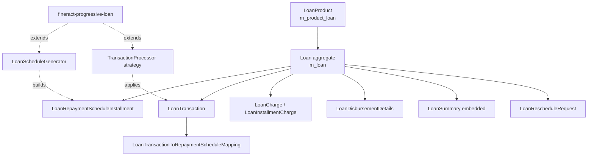

The `fineract-loan` Gradle module is the heart of Apache Fineract's lending domain. It owns the `Loan` JPA aggregate, the `LoanProduct` configuration, every transaction type that can hit a loan account, the cumulative schedule generator, and the rescheduling workflow. Sibling modules `fineract-progressive-loan` and `fineract-working-capital-loan` plug into the same domain hooks for newer features (progressive amortization, downpayment, advanced payment allocation) while leaving the classic engine untouched in this module.

## What ships in fineract-loan

The module sits under `fineract-loan/src/main/java/org/apache/fineract/portfolio/`. Its top-level packages are:

| Package | Responsibility |
| --- | --- |
| `loanaccount` | `Loan` entity, transactions, charges, repayment schedule, transaction processors, reschedule |
| `loanproduct` | `LoanProduct` configuration, payment & credit allocation rules, interest method enums |
| `collateral` / `collateralmanagement` | Per-loan and client-pledged collateral models |
| `delinquency` | Delinquency bucket → range mapping consumed by COB |
| `interestpauses` | Interest pause intervals applied during schedule processing |
| `accountdetails` | Shared account-type enums (individual / group / JLG / GLIM) |
| `repaymentwithpostdatedchecks` | Post-dated cheque tracking for repayments |

<Note>
  Some classes (e.g. `LoanStatus`, several enums) physically live in
  `fineract-core` so that DTOs and read-side services can depend on them
  without pulling in the full JPA aggregate. They are still part of the
  same conceptual subsystem.
</Note>

## Component diagram

## How the pieces fit

<Steps>
  <Step title="Create a product">
    A `LoanProduct` row captures amortization, interest method, repayment
    strategy, currency, accounting type, charges, rates, and optional
    multi-tranche / interest-recalculation flags.
  </Step>
  <Step title="Submit a loan application">
    The write platform service builds a `Loan` in
    `SUBMITTED_AND_PENDING_APPROVAL` (status 100), copying product defaults
    into an embedded `LoanProductRelatedDetail`.
  </Step>
  <Step title="Approve and disburse">
    Approval moves the loan to status 200, then disbursement creates a
    `DISBURSEMENT` transaction (type 1) and an `ACTIVE` (300) status.
  </Step>
  <Step title="Process repayments">
    Each `REPAYMENT` transaction (type 2) is split across installments by
    the configured `LoanRepaymentScheduleTransactionProcessor`.
  </Step>
  <Step title="Close or write off">
    When obligations are met the state machine transitions to 600; partial
    overpayment lands on 700 (`OVERPAID`); write-off ends at 601.
  </Step>
</Steps>

## Index of loan/* pages

<CardGroup cols={2}>
  <Card title="Loan model" icon="database" href="/loan/loan-domain-model">
    The JPA `Loan` entity, status machine, embedded `LoanSummary`, and the
    `m_loan` table.
  </Card>
  <Card title="Loan repo" icon="layer-group" href="/loan/loan-repository">
    `LoanRepository` Spring Data interface and `LoanRepositoryWrapper`
    null-safety facade.
  </Card>
  <Card title="Loan product" icon="sliders" href="/loan/loan-product">
    `LoanProduct` configuration — amortization, interest method, charges,
    accounting type, product mix.
  </Card>
  <Card title="Application lifecycle" icon="route" href="/loan/loan-application-lifecycle">
    Submit → approve → disburse → close, driven by
    `LoanLifecycleStateMachine`.
  </Card>
  <Card title="Transactions" icon="receipt" href="/loan/loan-transactions">
    `LoanTransaction` entity and the 40+ entry `LoanTransactionType` enum.
  </Card>
  <Card title="Charges" icon="tag" href="/loan/loan-charges">
    `LoanCharge`, `LoanInstallmentCharge`, `LoanTrancheCharge`, waivers and
    splits.
  </Card>
  <Card title="Disbursement" icon="arrow-up-from-bracket" href="/loan/loan-disbursement">
    `LoanDisbursementDetails` and the tranche workflow.
  </Card>
  <Card title="Schedule" icon="calendar-days" href="/loan/loan-repayment-schedule">
    `LoanRepaymentScheduleInstallment` and the regeneration triggers.
  </Card>
  <Card title="Cumulative generator" icon="ruler" href="/loan/cumulative-schedule-generator">
    `AbstractCumulativeLoanScheduleGenerator` — declining vs flat interest.
  </Card>
  <Card title="Tx processors" icon="diagram-project" href="/loan/loan-transaction-processors">
    All concrete transaction processor strategies and their ordering rules.
  </Card>
  <Card title="Reschedule" icon="rotate" href="/loan/loan-reschedule">
    `LoanRescheduleRequest` and the approval workflow.
  </Card>
  <Card title="Overview (you are here)" icon="map" href="/loan/overview">
    Map of the module and how the pages link together.
  </Card>
</CardGroup>

## Module boundary

<Tabs>
  <Tab title="fineract-loan">
    Ships the classic engine: cumulative schedule, principal-interest-fees
    transaction processors, single-disburse / multi-tranche workflows,
    reschedule requests, charges, write-off.
  </Tab>
  <Tab title="fineract-progressive-loan">
    Adds the progressive engine: `AdvancedPaymentScheduleTransactionProcessor`,
    payment & credit allocation rules per installment, downpayment splits,
    interest-recalculation by daily horizon, capitalized income, buy-down
    fees.
  </Tab>
  <Tab title="fineract-working-capital-loan">
    Wraps fineract-loan with revolving-credit semantics on top of the same
    `Loan` aggregate.
  </Tab>
</Tabs>

<Info>
  `Loan.java` contains TODOs explicitly tagged `FINERACT-1932-Fineract
  modularization` next to fields like `paymentAllocationRules` and
  `creditAllocationRules`. Those fields live on the shared aggregate
  today; the long-term intent is to push them out into the progressive
  module once the association is removed.
</Info>

## Cross-cutting collaborators

| Collaborator | Role |
| --- | --- |
| `fineract-core` | Holds `LoanStatus`, `Money`, `MonetaryCurrency`, base auditable classes |
| `fineract-investor` | External asset owner transfers reference loan IDs via `LoanDataForExternalTransfer` |
| COB (Close-of-Business) | Uses `COBIdAndLastClosedBusinessDate` projections for loan locking |
| Accounting | `AccountingRuleType` on `LoanProduct` chooses cash vs accrual postings |
| Delinquency | `DelinquencyBucket` linkage on product drives daily delinquency calc |

<Tip>
  When tracing a feature, follow the **command path**: REST resource →
  write platform service → `Loan` mutator → state-machine transition →
  transaction processor → schedule regeneration → summary refresh. Almost
  every loan operation walks that chain.
</Tip>

## Where to read next

<CardGroup cols={2}>
  <Card title="Start with the entity" icon="cube" href="/loan/loan-domain-model">
    The aggregate root binds everything else together.
  </Card>
  <Card title="Or jump to lifecycle" icon="play" href="/loan/loan-application-lifecycle">
    Follow a loan from submission to closure.
  </Card>
</CardGroup>
