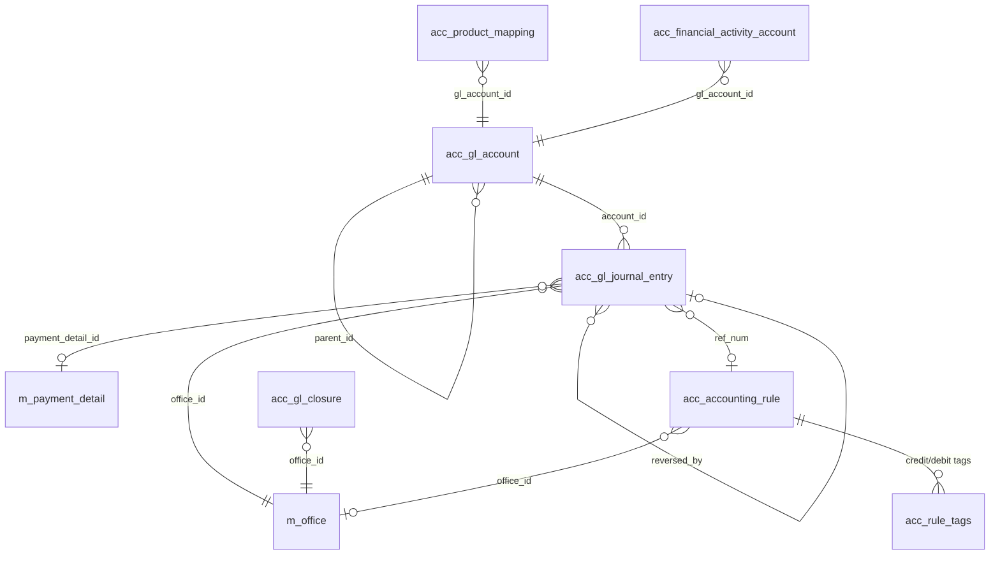

The accounting module turns Apache Fineract from a portfolio system into a double-entry bookkeeping system. Every loan disbursement, repayment, interest posting, charge, write-off, savings deposit, savings withdrawal, and inter-fund transfer produces one or more journal-entry rows in `acc_gl_journal_entry`, debiting or crediting accounts in the chart `acc_gl_account`. The mapping that decides which GL account a portfolio event hits comes from `acc_product_mapping` and `acc_financial_activity_account`. Closures are tracked in `acc_gl_closure`, and free-form manual entries are governed by `acc_accounting_rule`.

The DDL lives in `fineract-accounting/src/main/resources/jpa/accounting/db/changelog/`, with the initial schema also present in `fineract-provider/src/main/resources/db/changelog/tenant/parts/0001_initial_schema.xml`.

## Entity-relationship overview



## acc_gl_account — the chart of accounts

| Column | Type | Notes |
| --- | --- | --- |
| `id` | `BIGINT PK auto` | Surrogate. |
| `name` | `VARCHAR(45) NOT NULL UNIQUE` | Display. |
| `parent_id` | `BIGINT` → `acc_gl_account.id` | Self-reference for hierarchy. |
| `hierarchy` | `VARCHAR(100)` | Materialised path — e.g. `.1.4.7.`. |
| `gl_code` | `VARCHAR(45) NOT NULL UNIQUE` | Mnemonic identifier. |
| `disabled` | `BOOLEAN NOT NULL` | Cannot be posted to. |
| `manual_journal_entries_allowed` | `BOOLEAN NOT NULL` | Manual posting toggle. |
| `account_usage` | `SMALLINT NOT NULL` | 1 detail, 2 header. |
| `account_type_enum` | `SMALLINT NOT NULL` | 1 asset, 2 liability, 3 equity, 4 income, 5 expense. |
| `classification_enum` | `SMALLINT` | Sub-classification (income → fee income, interest income, etc.). |
| `tag_id` | `INT` → `m_code_value.id` | Tag for grouping. |
| `description` | `VARCHAR(500)` | Free-form. |

Foreign keys: `FK_acc_gl_account_parent` → `acc_gl_account(id)`, `FK_acc_gl_account_tag` → `m_code_value(id)`.

Indexes: `name` unique, `gl_code` unique, `hierarchy` for tree queries, `account_type_enum` for trial-balance scans.

## acc_gl_journal_entry — the journal

The append-only double-entry ledger. Every business operation that has accounting consequence creates a balanced set of rows in this table with the same `transaction_id`.

| Column | Type | Notes |
| --- | --- | --- |
| `id` | `BIGINT PK auto` | Surrogate. |
| `account_id` | `BIGINT NOT NULL` → `acc_gl_account.id` | GL account hit. |
| `office_id` | `BIGINT NOT NULL` → `m_office.id` | Booking branch. |
| `payment_details_id` | `BIGINT` → `m_payment_detail.id` | Payment metadata. |
| `reversal_id` | `BIGINT` → `acc_gl_journal_entry.id` | Self-reference: the reversing entry that cancelled this one. |
| `currency_code` | `VARCHAR(3) NOT NULL` | ISO currency. |
| `transaction_id` | `VARCHAR(100) NOT NULL` | Groups the debits and credits of a single business event. |
| `loan_transaction_id` | `BIGINT` → `m_loan_transaction.id` | Source loan transaction. |
| `savings_transaction_id` | `BIGINT` → `m_savings_account_transaction.id` | Source savings transaction. |
| `client_transaction_id` | `BIGINT` → `m_client_transaction.id` | Source client transaction. |
| `share_transaction_id` | `BIGINT` → `m_share_account_transactions.id` | Source share transaction. |
| `entity_type_enum` | `SMALLINT` | 1 loan, 2 savings, 3 client, 4 provisioning, 5 shares. |
| `entity_id` | `BIGINT` | Source entity id (loan / savings / client). |
| `type_enum` | `SMALLINT NOT NULL` | 1 credit, 2 debit. |
| `amount` | `DECIMAL(19,6) NOT NULL` | Absolute amount. |
| `description` | `VARCHAR(500)` | Free-form. |
| `entry_date` | `DATE NOT NULL` | Effective business date. |
| `submitted_on_date` | `DATE NOT NULL` | System date. |
| `is_running_balance_calculated` | `BOOLEAN NOT NULL DEFAULT false` | Set when the running-balance job has stamped this row. |
| `office_running_balance` | `DECIMAL(19,6)` | Running balance at branch level. |
| `organization_running_balance` | `DECIMAL(19,6)` | Running balance org-wide. |
| `ref_num` | `VARCHAR(100)` | Reference back to manual-rule entries. |
| `manual_entry` | `BOOLEAN NOT NULL DEFAULT false` | True when posted via accounting rule. |
| `is_reversed` | `BOOLEAN NOT NULL DEFAULT false` | True when reversed. |
| `createdby_id` / `created_date` / `lastmodifiedby_id` / `lastmodified_date` | audit | Auditable. |

### Foreign keys

- `FK_acc_gl_journal_entry_account` → `acc_gl_account(id)`
- `FK_acc_gl_journal_entry_office` → `m_office(id)`
- `FK_acc_gl_journal_entry_payment_detail` → `m_payment_detail(id)`
- `FK_acc_gl_journal_entry_reversal` → `acc_gl_journal_entry(id)`
- `FK_acc_gl_journal_entry_loan_tx` → `m_loan_transaction(id)`
- `FK_acc_gl_journal_entry_savings_tx` → `m_savings_account_transaction(id)`
- `FK_acc_gl_journal_entry_client_tx` → `m_client_transaction(id)`

### Indexes

- `transaction_id` — groups journal lines.
- `(office_id, entry_date)` — branch trial balance.
- `(account_id, entry_date)` — account ledger queries.
- `loan_transaction_id` / `savings_transaction_id` — drill-down to source.
- `(is_running_balance_calculated, entry_date)` — running-balance batch.

## acc_gl_closure — accounting period closure

When a branch closes a period, every journal date on or before `closing_date` is frozen — no new entries may post with `entry_date <= closing_date` for that office.

| Column | Type | Notes |
| --- | --- | --- |
| `id` | `BIGINT PK auto` | Surrogate. |
| `office_id` | `BIGINT NOT NULL` → `m_office.id` | Office. |
| `closing_date` | `DATE NOT NULL` | Last closed date. |
| `is_deleted` | `BOOLEAN NOT NULL` | Soft delete. |
| `comments` | `VARCHAR(500)` | Audit notes. |
| `createdby_id` / `created_date` / `lastmodifiedby_id` / `lastmodified_date` | audit | Auditable. |

Foreign key: `FK_acc_gl_closure_office` → `m_office(id)`. Unique constraint on `(office_id, closing_date, is_deleted)` prevents duplicate active closures.

## acc_accounting_rule — manual posting rules

A pre-defined recipe for manual journal entries: pick one or more debit accounts and one or more credit accounts, optionally restrict by office or tag set.

| Column | Type | Notes |
| --- | --- | --- |
| `id` | `BIGINT PK auto` | Surrogate. |
| `name` | `VARCHAR(100) NOT NULL UNIQUE` | Rule name. |
| `office_id` | `BIGINT` → `m_office.id` | Optional restriction. |
| `debit_account_id` | `BIGINT` → `acc_gl_account.id` | Default debit account. |
| `allow_multiple_debits` | `BOOLEAN NOT NULL` | Toggle. |
| `credit_account_id` | `BIGINT` → `acc_gl_account.id` | Default credit account. |
| `allow_multiple_credits` | `BOOLEAN NOT NULL` | Toggle. |
| `description` | `VARCHAR(500)` | Free-form. |
| `system_defined` | `BOOLEAN NOT NULL` | Built-in vs user-defined. |

Foreign keys: `FK_acc_accounting_rule_office` → `m_office(id)`, `FK_acc_accounting_rule_debit` → `acc_gl_account(id)`, `FK_acc_accounting_rule_credit` → `acc_gl_account(id)`. Companion tables `acc_rule_tags` map the rule to allowed tag code-values for either side.

### acc_rule_tags

| Column | Type | Notes |
| --- | --- | --- |
| `id` | `BIGINT PK auto` | Surrogate. |
| `acc_rule_id` | `BIGINT NOT NULL` → `acc_accounting_rule.id` | Owning rule. |
| `tag_id` | `INT NOT NULL` → `m_code_value.id` | Code-value tag. |
| `acc_type_enum` | `SMALLINT NOT NULL` | 1 debit, 2 credit. |

## acc_product_mapping — product → GL routing

For each (product, financial activity, payment type, charge) tuple, points at the GL account the journal-entry generator should post to.

| Column | Type | Notes |
| --- | --- | --- |
| `id` | `BIGINT PK auto` | Surrogate. |
| `gl_account_id` | `BIGINT` → `acc_gl_account.id` | Target GL. |
| `product_id` | `BIGINT` | Loan / savings / share product id. |
| `product_type` | `SMALLINT` | 1 loan, 2 savings, 3 shares. |
| `payment_type` | `INT` → `m_payment_type.id` | Optional payment-type override. |
| `charge_id` | `BIGINT` → `m_charge.id` | Optional charge override. |
| `financial_account_type` | `INT NOT NULL` | Enum identifying the slot in the product accounting matrix (e.g. fund-source, loan-portfolio, interest-receivable, fee-income, penalty-income, transfers-suspense, overpayment, NPA-interest, etc.). |

Foreign key: `FK_acc_product_mapping_gl` → `acc_gl_account(id)`.

Indexes: `(product_id, product_type, financial_account_type)` — primary lookup path used by the journal-entry creator; `(charge_id)` and `(payment_type)` for the override variants.

## acc_financial_activity_account — financial activity routing

Org-wide GL routing keyed by financial activity enum — independent of any product. Used for system-level transfers like inter-fund movement, suspense buckets, asset transfer suspense, opening balances.

| Column | Type | Notes |
| --- | --- | --- |
| `id` | `BIGINT PK auto` | Surrogate. |
| `financial_activity_type` | `INT NOT NULL UNIQUE` | Enum (`ASSET_TRANSFER`, `LIABILITY_TRANSFER`, `CASH_AT_MAINVAULT`, `CASH_AT_TELLER`, `OPENING_BALANCES_TRANSFER_CONTRA`, `PAYABLE_DIVIDENDS`, `ASSET_FUND_SOURCE`, `LIABILITY_FUND_SOURCE`, etc.). |
| `gl_account_id` | `BIGINT NOT NULL` → `acc_gl_account.id` | Target GL. |

Foreign key: `FK_acc_financial_activity_account_gl` → `acc_gl_account(id)`.

Unique constraint on `financial_activity_type` ensures exactly one routing per activity per tenant.

## acc_gl_account_history

Snapshot table populated when the running-balance batch finishes a day — captures end-of-day balance per account per office.

| Column | Type | Notes |
| --- | --- | --- |
| `id` | `BIGINT PK auto` | Surrogate. |
| `account_id` | `BIGINT NOT NULL` → `acc_gl_account.id` | GL account. |
| `office_id` | `BIGINT NOT NULL` → `m_office.id` | Branch. |
| `office_running_balance` | `DECIMAL(19,6)` | EOD office balance. |
| `organization_running_balance` | `DECIMAL(19,6)` | EOD org balance. |
| `effective_date` | `DATE NOT NULL` | EOD date. |

Indexes: `(account_id, office_id, effective_date)`.

## Indexes summary

| Table | Index | Use |
| --- | --- | --- |
| `acc_gl_account` | `name`, `gl_code` unique | Chart lookup. |
| `acc_gl_account` | `hierarchy` | Tree traversal. |
| `acc_gl_journal_entry` | `transaction_id` | Group lines. |
| `acc_gl_journal_entry` | `(account_id, entry_date)` | Account ledger. |
| `acc_gl_journal_entry` | `(office_id, entry_date)` | Trial balance. |
| `acc_gl_journal_entry` | `loan_transaction_id`, `savings_transaction_id` | Source drill-down. |
| `acc_gl_closure` | `(office_id, closing_date)` unique | Prevent dupes. |
| `acc_accounting_rule` | `name` unique | Rule lookup. |
| `acc_product_mapping` | `(product_id, product_type, financial_account_type)` | Journal-entry router. |
| `acc_financial_activity_account` | unique on `financial_activity_type` | One routing each. |

## Posting flow at a glance

1. Portfolio code calls `AccountingProcessorForLoan.createJournalEntriesForLoan(...)` (or the savings/shares variants).
2. The processor inspects the loan-transaction type, looks up the matching `acc_product_mapping` row(s) for the product, and creates balanced `acc_gl_journal_entry` rows.
3. The `transaction_id` field groups all lines under the same business event so the UI can show them as one transaction.
4. The `UpdateAccountingRunningBalancesTasklet` periodically stamps the `office_running_balance` and `organization_running_balance` columns on rows where `is_running_balance_calculated = false`.
5. Reversals copy the original lines with debits and credits swapped, set the original row's `reversal_id` to the new row's id, and flip `is_reversed`.

## Worked example: cash repayment on a loan

A `LoanRepaymentBusinessEvent` for $100 on a product with cash accounting wired to:

- Fund source GL = `Cash at branch teller` (asset, id=11)
- Loan portfolio GL = `Loans outstanding` (asset, id=12)
- Interest income GL = `Loan interest income` (income, id=13)

If the $100 is split into $80 principal and $20 interest, the journal entries inserted (sharing the same `transaction_id`) are:

| Line | account_id | type_enum | amount | description |
| --- | --- | --- | --- | --- |
| 1 | 11 (cash) | 1 debit | 100 | Cash received |
| 2 | 12 (portfolio) | 2 credit | 80 | Principal reduction |
| 3 | 13 (interest income) | 2 credit | 20 | Interest received |

The total of debits equals the total of credits — that invariant is enforced inside the journal-entry creator before any row is persisted.

## Worked example: write-off

A write-off of $50 against a product with the accrual periodic accounting type and:

- Write-off GL = `Loan loss expense` (expense)
- Loan portfolio GL = `Loans outstanding` (asset)
- Interest receivable GL = `Interest receivable` (asset)

produces a balanced set:

| Line | account_id | type_enum | amount | description |
| --- | --- | --- | --- | --- |
| 1 | write-off expense | 1 debit | 50 | Write-off |
| 2 | loan portfolio | 2 credit | 40 | Principal write-off |
| 3 | interest receivable | 2 credit | 10 | Interest write-off |

Reversing the write-off duplicates the lines with `type_enum` swapped, sets each original row's `reversal_id` to the new row's id, and marks both `is_reversed = true`.

## Querying the trial balance

Building a trial balance for an office on a date filters journal rows by `office_id` and `entry_date`, then sums by GL account grouped by `account_type_enum`. Because `acc_gl_journal_entry` denormalises both `office_running_balance` and `organization_running_balance`, the simpler reports skip the GROUP BY entirely and read the latest row per `(account_id, office_id)` ordered by `(entry_date, id)` desc.

```sql
-- Org-wide ending balance per GL account on a date
SELECT je.account_id, je.organization_running_balance
FROM   acc_gl_journal_entry je
WHERE  je.id IN (
         SELECT MAX(id)
         FROM   acc_gl_journal_entry
         WHERE  entry_date <= ?
           AND  is_running_balance_calculated = true
         GROUP  BY account_id
       );
```

The `is_running_balance_calculated = true` predicate is essential: the `UpdateAccountingRunningBalancesTasklet` flips that flag only after stamping the running-balance columns, so an in-flight row never serves a trial balance.

The accounting tables therefore close the loop between the portfolio (loan, savings, shares) ledger and the double-entry general ledger, with `acc_product_mapping` and `acc_financial_activity_account` as the routing brain that decides which GL account each portfolio event lands in.
