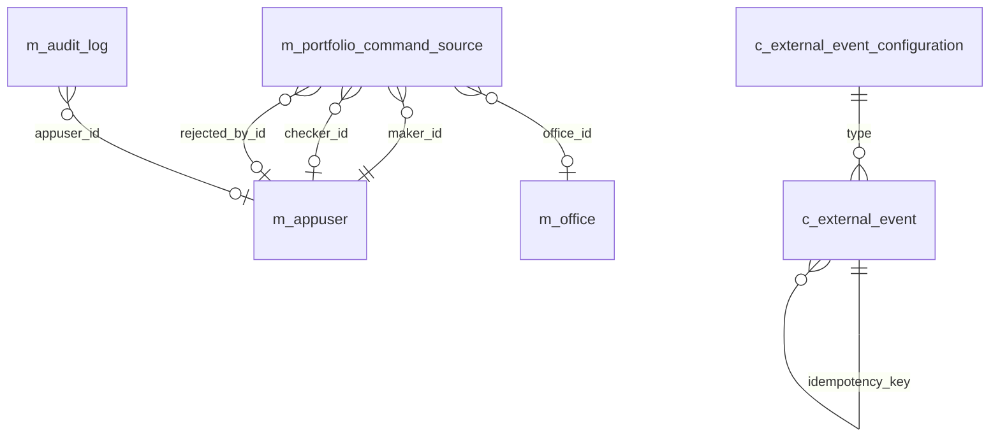

Every write into Apache Fineract is a command — a JSON envelope that flows through the command framework, gets routed to a handler, and produces a deterministic side-effect. Two table clusters back that pipeline. The first records the command itself and its maker-checker lifecycle in `m_portfolio_command_source` (with `m_audit_query` and `m_audit_log` historically used for raw audit log entries). The second is the external-event outbox in `c_external_event` and `c_external_event_configuration`, which captures the business events emitted by command handlers and replays them to downstream subscribers.

The command-source tables are defined in `fineract-command-jdbc/src/main/resources/db/changelog/tenant/module/command/parts/`. The external-event tables come from `fineract-provider`'s changelog and the dedicated `events` module.

## Entity-relationship overview



## m_portfolio_command_source — the command audit

One row per submitted command — successful, pending maker-checker approval, rejected, or under review.

| Column | Type | Notes |
| --- | --- | --- |
| `id` | `BIGINT PK auto` | Surrogate. |
| `action_name` | `VARCHAR(100) NOT NULL` | `CREATE`, `UPDATE`, `DELETE`, `APPROVE`, `DISBURSE`, `REPAYMENT`, `UNDO`, `WAIVEINTERESTCHARGE`, `WRITEOFF`, `CLOSE`, `RECOVERYPAYMENT`, etc. |
| `entity_name` | `VARCHAR(100) NOT NULL` | `LOAN`, `LOANCHARGE`, `SAVINGSACCOUNT`, `CLIENT`, `GROUP`, `OFFICE`, `JOURNALENTRY`, `STAFF`, etc. |
| `office_id` | `BIGINT` → `m_office.id` | Office scope of the command. |
| `group_id` | `BIGINT` → `m_group.id` | Optional group context. |
| `client_id` | `BIGINT` → `m_client.id` | Optional client context. |
| `loan_id` | `BIGINT` → `m_loan.id` | Optional loan context. |
| `savings_account_id` | `BIGINT` → `m_savings_account.id` | Optional savings context. |
| `api_get_url` | `VARCHAR(100)` | Resource URL the command operated on. |
| `subresource_id` | `BIGINT` | Sub-entity id (e.g. loan-charge id). |
| `resource_id` | `BIGINT` | Top-level resource id. |
| `resource_external_id` | `VARCHAR(100)` | Optional external id. |
| `subresource_external_id` | `VARCHAR(100)` | Sub-entity external id. |
| `command_as_json` | `text NOT NULL` | The full request body. |
| `maker_id` | `BIGINT NOT NULL` → `m_appuser.id` | User who submitted the command. |
| `made_on_date` | `datetime NOT NULL` | When submitted. |
| `checker_id` | `BIGINT` → `m_appuser.id` | User who approved (null until approval). |
| `checked_on_date` | `datetime` | When approved / rejected. |
| `processing_result_enum` | `SMALLINT NOT NULL` | 1 processed, 2 awaiting approval, 3 rejected, 4 under processing, 5 error. |
| `product_id` | `BIGINT` | Optional product context. |
| `transaction_id` | `VARCHAR(100)` | Cross-reference to the transaction the command produced. |
| `creditbureau_id` | `BIGINT` | Optional credit bureau context. |
| `organisation_creditbureau_id` | `BIGINT` | Tenant-scoped CB id. |
| `idempotency_key` | `VARCHAR(50)` | Client-supplied idempotency key (added in `0002_command_fix_structure.xml`). |
| `result` | `text` | Result envelope JSON. |
| `result_status_code` | `INT` | HTTP status. |
| `manually_adjusted_or_reversed` | `BOOLEAN` | True when reversed. |

### Foreign keys

- `FK_m_portfolio_command_source_maker` → `m_appuser(id)`
- `FK_m_portfolio_command_source_checker` → `m_appuser(id)`
- `FK_m_portfolio_command_source_office` → `m_office(id)`
- `FK_m_portfolio_command_source_group` → `m_group(id)`
- `FK_m_portfolio_command_source_client` → `m_client(id)`
- `FK_m_portfolio_command_source_loan` → `m_loan(id)`
- `FK_m_portfolio_command_source_savings` → `m_savings_account(id)`

### Indexes

- `made_on_date` for chronological audit reports.
- `(entity_name, resource_id)` for "show all commands against this loan".
- `(maker_id, made_on_date)` for "user activity" reports.
- `(checker_id, checked_on_date)` for maker-checker dashboards.
- `idempotency_key` for the idempotency dedup lookup.
- `(processing_result_enum, made_on_date)` for awaiting-approval queues.

## Maker-checker lifecycle

The same row goes through different states tracked by `processing_result_enum`:

1. Command submitted → row inserted with `processing_result_enum = 2 (awaiting approval)` if the command type is on the maker-checker list (governed by `m_permission.code` rows ending in `_CHECKER`).
2. Checker approves → command handler runs, fields `checker_id` / `checked_on_date` populated, `processing_result_enum = 1` and `result` / `result_status_code` filled in.
3. Checker rejects → `processing_result_enum = 3`, `checker_id` / `checked_on_date` populated, no side effect applied.
4. Idempotent retry of an already-processed command → handler finds an existing row by `idempotency_key`, replays `result` / `result_status_code` to the caller without touching state.

## c_external_event — outbox

The transactional outbox written by command handlers. Read by the external-event publisher and replayed to subscribers (Kafka, webhooks).

| Column | Type | Notes |
| --- | --- | --- |
| `id` | `BIGINT PK auto` | Surrogate. |
| `type` | `VARCHAR(100) NOT NULL` | Event type (`LoanApprovedBusinessEvent`, `LoanDisbursalBusinessEvent`, `LoanRepaymentBusinessEvent`, `LoanChargeRefundBusinessEvent`, `SavingsDepositBusinessEvent`, `ClientCreatedBusinessEvent`, etc.). |
| `category` | `VARCHAR(50) NOT NULL` | Higher-level grouping (`Loan`, `Savings`, `Client`, `Group`, etc.). |
| `business_date` | `DATE NOT NULL` | Business date of the event. |
| `created_at` | `datetime NOT NULL` | System timestamp. |
| `aggregate_root_id` | `BIGINT` | Source entity id (e.g. loan id). |
| `data` | `text NOT NULL` | Serialised JSON payload. |
| `schema` | `VARCHAR(100)` | Schema version of the payload. |
| `status` | `VARCHAR(20) NOT NULL` | `READY_TO_BE_SENT`, `SENT`, `FAILED`. |
| `sent_at` | `datetime` | When publisher dispatched. |
| `idempotency_key` | `VARCHAR(50)` | Dedup key. |
| `event_data` | `bytea` | Optional binary payload form. |

Indexes: `(status, created_at)` to drive the publisher's polling query, `(type, created_at)` for per-type replays, `(aggregate_root_id, type)` for entity replays.

## c_external_event_configuration

One row per registrable event type — toggled by ops to enable / disable publishing.

| Column | Type | Notes |
| --- | --- | --- |
| `type` | `VARCHAR(100) PK` | Event type name (matches `c_external_event.type`). |
| `enabled` | `BOOLEAN NOT NULL` | Master switch. |

The set of rows is seeded by Liquibase changesets every time a new event type ships (e.g. `1004_add_external_event_configuration_for_down_payment_transaction_event.xml`, `1013_add_loan_account_delinquency_pause_changed_event.xml`).

## m_audit_log — legacy audit log

Historical generic audit log used by some entities. Still present in fresh tenants for backwards compatibility.

| Column | Type | Notes |
| --- | --- | --- |
| `id` | `BIGINT PK auto` | Surrogate. |
| `action_name` | `VARCHAR(100) NOT NULL` | Action verb. |
| `entity_name` | `VARCHAR(100) NOT NULL` | Affected entity. |
| `resource_id` | `BIGINT` | Affected id. |
| `subresource_id` | `BIGINT` | Affected sub-id. |
| `maker_id` | `BIGINT NOT NULL` → `m_appuser.id` | Acting user. |
| `made_on_date` | `datetime NOT NULL` | Timestamp. |
| `checker_id` | `BIGINT` → `m_appuser.id` | Approver (legacy). |
| `checked_on_date` | `datetime` | Approval time. |
| `processing_result_enum` | `SMALLINT NOT NULL` | Status. |
| `command_as_json` | `text` | Frozen request payload. |
| `office_id` / `group_id` / `client_id` / `loan_id` / `savings_account_id` | references | Scope fields mirroring `m_portfolio_command_source`. |
| `api_get_url` | `VARCHAR(100)` | Resource URL. |

Modern Fineract treats this as deprecated — `m_portfolio_command_source` is the source of truth. `m_audit` is similarly a legacy variant.

## Companion: m_audit_query

A small per-tenant cache of saved audit queries (filters used by operators). Effectively a key/value of saved search criteria — referenced by the legacy audit UI.

| Column | Type | Notes |
| --- | --- | --- |
| `id` | `BIGINT PK auto` | Surrogate. |
| `name` | `VARCHAR(100) NOT NULL UNIQUE` | Saved query name. |
| `query_string` | `text NOT NULL` | Serialised filter. |
| `appuser_id` | `BIGINT` → `m_appuser.id` | Owner. |

## Foreign keys summary

| Child | Column | Parent |
| --- | --- | --- |
| `m_portfolio_command_source` | `maker_id` / `checker_id` | `m_appuser(id)` |
| `m_portfolio_command_source` | `office_id` | `m_office(id)` |
| `m_portfolio_command_source` | `group_id` | `m_group(id)` |
| `m_portfolio_command_source` | `client_id` | `m_client(id)` |
| `m_portfolio_command_source` | `loan_id` | `m_loan(id)` |
| `m_portfolio_command_source` | `savings_account_id` | `m_savings_account(id)` |
| `m_audit_log` | `maker_id` / `checker_id` | `m_appuser(id)` |
| `c_external_event` | (logical) `type` | `c_external_event_configuration(type)` |

## Indexes summary

| Table | Index | Use |
| --- | --- | --- |
| `m_portfolio_command_source` | `made_on_date` | Audit timeline. |
| `m_portfolio_command_source` | `(entity_name, resource_id)` | Per-entity audit. |
| `m_portfolio_command_source` | `(maker_id, made_on_date)` | User activity. |
| `m_portfolio_command_source` | `(checker_id, checked_on_date)` | Checker dashboards. |
| `m_portfolio_command_source` | `idempotency_key` | Idempotent retries. |
| `m_portfolio_command_source` | `(processing_result_enum, made_on_date)` | Awaiting-approval queue. |
| `c_external_event` | `(status, created_at)` | Publisher polling. |
| `c_external_event` | `(type, created_at)` | Per-type replay. |
| `c_external_event` | `(aggregate_root_id, type)` | Entity replay. |
| `m_audit_log` | `(entity_name, resource_id)` | Legacy audit per entity. |
| `m_audit_log` | `made_on_date` | Legacy timeline. |

## Idempotency in practice

The `idempotency_key` column on `m_portfolio_command_source` was added so clients can safely retry a command without producing duplicate writes. The flow is:

1. The client sends `Idempotency-Key: <uuid>` in the request header.
2. The command framework looks up `m_portfolio_command_source` by `(idempotency_key, command_as_json hash)`.
3. If a row is found and `processing_result_enum = 1` (processed), the framework returns the stored `result` payload and `result_status_code` without re-invoking the handler.
4. If a row is found and `processing_result_enum = 4` (under processing), the framework returns HTTP 409 Conflict to signal "still processing".
5. If no row is found, a fresh command is enqueued and the idempotency key is reserved.

This makes the table the durable backing store for at-least-once REST semantics — the same guarantee Apache Fineract gives Kafka consumers and webhook subscribers through `c_external_event`.

## Worked example: loan disbursement

A successful loan disbursement produces:

- One row in `m_portfolio_command_source` with `entity_name = LOAN`, `action_name = DISBURSE`, `resource_id = <loan id>`, `processing_result_enum = 1`, the request JSON in `command_as_json`, and the produced loan-transaction id in `transaction_id`.
- Multiple rows in `c_external_event` — at minimum `LoanDisbursalBusinessEvent` and `LoanDisbursalTransactionBusinessEvent`, with `aggregate_root_id = <loan id>` and `status = READY_TO_BE_SENT`.
- Each event row's `idempotency_key` carries the same UUID as the command, allowing downstream consumers to de-duplicate.
- Once the external-event publisher dispatches a row, `status` flips to `SENT` and `sent_at` is stamped.

Reversing the disbursement (`UNDODISBURSE` action) inserts another command row plus matching `LoanUndoDisbursalBusinessEvent` outbox rows — the two events share the same `aggregate_root_id` and `transaction_id` so reconciliation downstream is straightforward.

## Reading the audit trail

The two queries the operations team runs most often:

```sql
-- All commands touching a single loan, newest first
SELECT id, action_name, maker_id, made_on_date, processing_result_enum, checker_id
FROM   m_portfolio_command_source
WHERE  entity_name = 'LOAN' AND resource_id = ?
ORDER  BY made_on_date DESC;

-- Awaiting-approval queue for a checker
SELECT id, entity_name, action_name, resource_id, maker_id, made_on_date
FROM   m_portfolio_command_source
WHERE  processing_result_enum = 2
ORDER  BY made_on_date;
```

The corresponding outbox query the publisher polls is:

```sql
SELECT id, type, aggregate_root_id, data
FROM   c_external_event
WHERE  status = 'READY_TO_BE_SENT'
ORDER  BY created_at
LIMIT  ?;
```

The polling query is the reason the `(status, created_at)` index exists — without it the publisher would scan the entire outbox every iteration.

## Retention and archival

Both tables can grow large in busy tenants. Common operational patterns:

- `m_portfolio_command_source` is rarely archived because it is the legal audit trail; deployments usually rely on partitioning by `made_on_date`.
- `c_external_event` rows with `status = SENT` and `sent_at < now() - retention window` can be deleted by a purge job. The platform ships no purge job out of the box; operations teams typically define one with a small SQL window.

## Maker-checker permission codes

The maker-checker pattern is wired through the permissions schema rather than a dedicated config table. For every action that supports four-eyes, two permission codes exist in `m_permission`:

| Plain code | Checker code | Meaning |
| --- | --- | --- |
| `CREATE_LOAN` | `CHECKER_CREATE_LOAN` | Approve a pending loan-create request. |
| `APPROVE_LOAN` | `CHECKER_APPROVE_LOAN` | Approve a pending loan-approval request. |
| `DISBURSE_LOAN` | `CHECKER_DISBURSE_LOAN` | Approve a pending disbursement request. |
| `REPAYMENT_LOAN` | `CHECKER_REPAYMENT_LOAN` | Approve a pending repayment posting. |
| `UPDATE_CLIENT` | `CHECKER_UPDATE_CLIENT` | Approve a pending client-update request. |

When the platform-wide maker-checker flag is on and the user has only the plain permission (not the checker variant), commands are persisted with `processing_result_enum = 2` (awaiting approval) and queued for review.

## External event categories

The categories on `c_external_event` group the type catalogue into roughly the following buckets, which match the modules that emit them:

| Category | Example types |
| --- | --- |
| `Loan` | `LoanApprovedBusinessEvent`, `LoanDisbursalBusinessEvent`, `LoanRepaymentBusinessEvent`, `LoanWrittenOffBusinessEvent`, `LoanChargeOffBusinessEvent` |
| `LoanTransaction` | `LoanRepaymentDueBusinessEvent`, `LoanRefundBusinessEvent`, `LoanAdjustTransactionBusinessEvent` |
| `Savings` | `SavingsActivateBusinessEvent`, `SavingsDepositBusinessEvent`, `SavingsWithdrawalBusinessEvent`, `SavingsInterestPostingBusinessEvent` |
| `Client` | `ClientCreatedBusinessEvent`, `ClientActivateBusinessEvent`, `ClientCloseBusinessEvent` |
| `Group` | `GroupActivateBusinessEvent`, `GroupCloseBusinessEvent` |
| `Share` | `ShareAccountApproveBusinessEvent`, `ShareAccountActivateBusinessEvent` |
| `LoanDelinquency` | `LoanAccountDelinquencyRangeChangeBusinessEvent`, `LoanAccountDelinquencyPauseChangedBusinessEvent` |
| `Investor` | `LoanOwnershipTransferBusinessEvent`, `LoanAccountSnapshotBusinessEvent` |

Each category corresponds to a `BusinessEvent` class in `fineract-core/src/main/java/org/apache/fineract/infrastructure/event/business/domain/`.

The command and audit tables therefore close the loop on every state-changing write: a single row in `m_portfolio_command_source` carries the request, its maker-checker state, and the result envelope; matching rows in `c_external_event` describe the downstream business events that command produced; together they provide the deterministic audit trail and the integration contract for everything that ever happened on the tenant.
