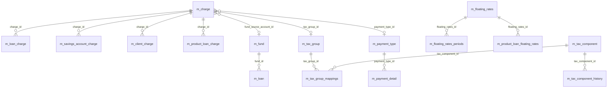

Apache Fineract keeps financial reference data in a tight cluster of small but heavily-referenced tables. Charges (`m_charge`) are reusable fee definitions cross-linked from `m_loan_charge`, `m_savings_account_charge`, and `m_client_charge`. Funds (`m_fund`) tag loans with their source of capital. Floating rates (`m_floating_rates`, `m_floating_rates_periods`) underpin variable-rate lending. Taxes (`m_tax_component`, `m_tax_group`, `m_tax_group_mappings`) handle GST / VAT / WHT on charges and interest. Payment types (`m_payment_type`) drive cash, cheque, bank-transfer, mobile-wallet behaviour and feed GL routing through `acc_product_mapping.payment_type`.

These tables are defined across `fineract-provider/src/main/resources/db/changelog/tenant/parts/0001_initial_schema.xml`, `fineract-charge/src/main/resources/jpa/charge/db/changelog/`, and `fineract-rates/src/main/resources/jpa/rates/db/changelog/`.

## Entity-relationship overview



## m_charge — fee / penalty definition

| Column | Type | Notes |
| --- | --- | --- |
| `id` | `BIGINT PK auto` | Surrogate. |
| `name` | `VARCHAR(100) NOT NULL UNIQUE` | Display name. |
| `currency_code` | `VARCHAR(3) NOT NULL` | Currency. |
| `charge_applies_to_enum` | `SMALLINT NOT NULL` | 1 loan, 2 savings, 3 client, 4 shares. |
| `charge_time_enum` | `SMALLINT NOT NULL` | When the charge is applied — disbursement, specified due date, installment fee, overdue fee, withdrawal fee, monthly fee, annual fee, share account activate, share purchase, share redeem, tranche disbursement. |
| `charge_calculation_enum` | `SMALLINT NOT NULL` | 1 flat, 2 % of amount, 3 % of amount and interest, 4 % of interest, 5 % of disbursement amount, 6 % of total outstanding, 7 % of installment principal, 8 % of installment interest. |
| `charge_payment_mode_enum` | `SMALLINT NOT NULL` | 0 regular, 1 account transfer. |
| `amount` | `DECIMAL(19,6) NOT NULL` | Flat amount or percentage. |
| `fee_on_day` / `fee_on_month` | `SMALLINT` | Day / month for monthly / annual fees. |
| `fee_interval` | `SMALLINT` | Recurrence count. |
| `fee_frequency` | `SMALLINT` | Frequency unit. |
| `is_penalty` | `BOOLEAN NOT NULL` | True for penalties. |
| `is_active` | `BOOLEAN NOT NULL` | Toggle. |
| `is_deleted` | `BOOLEAN NOT NULL` | Soft delete. |
| `min_cap` | `DECIMAL(19,6)` | Lower bound. |
| `max_cap` | `DECIMAL(19,6)` | Upper bound. |
| `income_or_liability_account_id` | `BIGINT` → `acc_gl_account.id` | GL income / liability target. |
| `tax_group_id` | `BIGINT` → `m_tax_group.id` | Optional tax group. |
| `payment_type_id` | `INT` → `m_payment_type.id` | Optional payment-type restriction. |
| `is_free_withdrawal` | `BOOLEAN` | Free-withdrawal toggle on savings. |
| `free_withdrawal_charge_frequency` | `SMALLINT` | Free-withdrawal cadence. |
| `restart_frequency` / `restart_frequency_enum` | `SMALLINT` | Restart period for free-withdrawal counter. |
| `is_payment_type` | `BOOLEAN` | True if the charge depends on payment type. |
| `glim_charge_calculation_enum` | `SMALLINT` | GLIM-specific calc enum. |

### Foreign keys

- `FK_m_charge_gl_account` → `acc_gl_account(id)`
- `FK_m_charge_tax_group` → `m_tax_group(id)`
- `FK_m_charge_payment_type` → `m_payment_type(id)`

### Indexes

- `name` unique.
- `(charge_applies_to_enum, is_active)` for the picker dropdowns.
- `(is_penalty, is_active)` for penalty queries.

## m_fund — funding source

Tags a loan with its source of capital — useful for portfolio reporting and donor-restricted lending.

| Column | Type | Notes |
| --- | --- | --- |
| `id` | `BIGINT PK auto` | Surrogate. |
| `name` | `VARCHAR(255) UNIQUE` | Display. |
| `external_id` | `VARCHAR(100) UNIQUE` | External code. |

`m_loan.fund_id`, `m_product_loan.fund_id`, and `m_external_asset_owner.transfer_fund_id` all point here. Indexes: `name` unique, `external_id` unique.

## m_floating_rates and m_floating_rates_periods

`m_floating_rates`

| Column | Type | Notes |
| --- | --- | --- |
| `id` | `BIGINT PK auto` | Surrogate. |
| `name` | `VARCHAR(200) NOT NULL UNIQUE` | Display. |
| `is_base_lending_rate` | `BOOLEAN NOT NULL` | Marks the central / prime rate. |
| `is_active` | `BOOLEAN NOT NULL` | Toggle. |
| `createdby_id` / `created_date` / `lastmodifiedby_id` / `lastmodified_date` | audit | Auditable. |

`m_floating_rates_periods` — time series of rate values.

| Column | Type | Notes |
| --- | --- | --- |
| `id` | `BIGINT PK auto` | Surrogate. |
| `floating_rates_id` | `BIGINT NOT NULL` → `m_floating_rates.id` | Owning rate. |
| `from_date` | `datetime NOT NULL` | Effective from. |
| `interest_rate` | `DECIMAL(19,6) NOT NULL` | Rate value. |
| `is_differential_to_base_lending_rate` | `BOOLEAN NOT NULL` | True when the row is a spread over BLR. |
| `is_active` | `BOOLEAN NOT NULL` | Toggle. |
| `createdby_id` / `created_date` / `lastmodifiedby_id` / `lastmodified_date` | audit | Auditable. |

Indexes: `m_floating_rates.name` unique, `m_floating_rates_periods.(floating_rates_id, from_date)` for time-bounded lookups used by the schedule recalculator.

Foreign key: `FK_m_floating_rates_periods_floating_rates` → `m_floating_rates(id)` cascade delete.

## m_tax_component — atomic tax

A tax line item, e.g. `GST 18%`.

| Column | Type | Notes |
| --- | --- | --- |
| `id` | `BIGINT PK auto` | Surrogate. |
| `name` | `VARCHAR(100) NOT NULL UNIQUE` | Display. |
| `percentage` | `DECIMAL(19,6) NOT NULL` | Current rate. |
| `start_date` | `DATE` | Effective from. |
| `debit_account_type` | `SMALLINT` | GL account type for debit posting. |
| `debit_account_id` | `BIGINT` → `acc_gl_account.id` | Debit GL account. |
| `credit_account_type` | `SMALLINT` | GL account type for credit posting. |
| `credit_account_id` | `BIGINT` → `acc_gl_account.id` | Credit GL account. |
| `createdby_id` / `created_date` / `lastmodifiedby_id` / `lastmodified_date` | audit | Auditable. |

`m_tax_component_history` is an append-only snapshot of percentage / account changes over time, keyed by `tax_component_id` and `start_date`, used to compute historically-correct tax on backdated transactions.

## m_tax_group and m_tax_group_mappings

`m_tax_group` groups tax components into a reusable set (e.g. `GST + Cess`).

| Column | Type | Notes |
| --- | --- | --- |
| `id` | `BIGINT PK auto` | Surrogate. |
| `name` | `VARCHAR(100) NOT NULL UNIQUE` | Display. |
| `createdby_id` / `created_date` / `lastmodifiedby_id` / `lastmodified_date` | audit | Auditable. |

`m_tax_group_mappings` — many-to-many between groups and components.

| Column | Type | Notes |
| --- | --- | --- |
| `id` | `BIGINT PK auto` | Surrogate. |
| `tax_group_id` | `BIGINT NOT NULL` → `m_tax_group.id` | Owning group. |
| `tax_component_id` | `BIGINT NOT NULL` → `m_tax_component.id` | Member component. |
| `start_date` | `DATE` | Effective from. |
| `end_date` | `DATE` | Effective to. |

Foreign keys: `FK_m_tax_group_mappings_group` → `m_tax_group(id)`, `FK_m_tax_group_mappings_component` → `m_tax_component(id)`. Index on `(tax_group_id, tax_component_id)`.

## m_payment_type

| Column | Type | Notes |
| --- | --- | --- |
| `id` | `BIGINT PK auto` | Surrogate. |
| `value` | `VARCHAR(100) NOT NULL UNIQUE` | Display name (e.g. `Cash`, `Cheque`, `Bank Transfer`, `Mobile Money`, `Card`). |
| `description` | `VARCHAR(500)` | Free-form. |
| `is_cash_payment` | `BOOLEAN NOT NULL` | Drives cash-receipt reporting. |
| `order_position` | `INT NOT NULL` | UI ordering. |
| `code_name` | `VARCHAR(100)` | Code reference. |
| `is_system_defined` | `BOOLEAN` | Built-in vs user-defined. |

Indexed unique on `value`. Referenced from `m_payment_detail.payment_type_id`, `m_charge.payment_type_id`, and `acc_product_mapping.payment_type`.

## m_payment_detail

Optional payment-mode metadata attached to a transaction (loan repayment, savings deposit, share purchase). Each transaction in the ledger optionally points at one of these rows.

| Column | Type | Notes |
| --- | --- | --- |
| `id` | `BIGINT PK auto` | Surrogate. |
| `payment_type_id` | `INT` → `m_payment_type.id` | Mode. |
| `account_number` | `VARCHAR(100)` | Bank account ref. |
| `cheque_number` | `VARCHAR(100)` | Cheque number. |
| `routing_code` | `VARCHAR(100)` | Bank routing code. |
| `receipt_number` | `VARCHAR(100)` | Internal receipt number. |
| `bank_number` | `VARCHAR(100)` | Bank id. |

Foreign key: `FK_m_payment_detail_payment_type` → `m_payment_type(id)`.

Indexes: `payment_type_id`, `cheque_number` (for duplicate cheque protection in some deployments).

## Other reference tables in this cluster

- `m_client_charge` — applied charges on a client (analogous to `m_loan_charge`).
- `m_client_transaction` — ledger of client-charge collections.
- `m_share_account_charge` — charges on share accounts.
- `m_delinquency_bucket`, `m_delinquency_range`, `m_delinquency_classification` — define the per-product delinquency-classification matrix referenced from `m_product_loan.delinquency_bucket_id`.
- `m_dividend_payout` — share-account dividend distribution.

## Foreign keys summary

| Child | Column | Parent |
| --- | --- | --- |
| `m_charge` | `income_or_liability_account_id` | `acc_gl_account(id)` |
| `m_charge` | `tax_group_id` | `m_tax_group(id)` |
| `m_charge` | `payment_type_id` | `m_payment_type(id)` |
| `m_floating_rates_periods` | `floating_rates_id` | `m_floating_rates(id)` |
| `m_tax_group_mappings` | `tax_group_id` | `m_tax_group(id)` |
| `m_tax_group_mappings` | `tax_component_id` | `m_tax_component(id)` |
| `m_tax_component` | `debit_account_id` / `credit_account_id` | `acc_gl_account(id)` |
| `m_payment_detail` | `payment_type_id` | `m_payment_type(id)` |
| `m_loan` | `fund_id` | `m_fund(id)` |
| `m_loan_charge` | `charge_id` | `m_charge(id)` |

## Indexes summary

| Table | Index | Use |
| --- | --- | --- |
| `m_charge` | `name` unique | Lookup. |
| `m_charge` | `(charge_applies_to_enum, is_active)` | Picker. |
| `m_charge` | `(is_penalty, is_active)` | Penalty queries. |
| `m_fund` | `name`, `external_id` unique | Lookup. |
| `m_floating_rates` | `name` unique | Lookup. |
| `m_floating_rates_periods` | `(floating_rates_id, from_date)` | Time lookup. |
| `m_tax_component` | `name` unique | Lookup. |
| `m_tax_group` | `name` unique | Lookup. |
| `m_tax_group_mappings` | `(tax_group_id, tax_component_id)` | Membership lookup. |
| `m_payment_type` | `value` unique | Lookup. |
| `m_payment_detail` | `payment_type_id` | Reporting. |

## Charge lifecycle in the schema

1. Admin creates a fee → row in `m_charge` with `charge_applies_to_enum = 1` (loan), `charge_time_enum = 1` (disbursement), `charge_calculation_enum = 1` (flat), `amount = 50`.
2. Admin adds the charge to a product → row in `m_product_loan_charge` linking the product id and the charge id.
3. Loan is submitted → for every eligible product charge, a row is inserted into `m_loan_charge` copying `is_penalty`, `charge_time_enum`, `charge_calculation_enum`, `amount` from `m_charge` (charges on a loan are snapshots — later edits to `m_charge` do not change in-flight loans).
4. Loan disburses → the disbursement-time charges are due immediately and a `m_loan_transaction` row of type `CHARGE_PAYMENT` is inserted; `m_loan_charge.amount_paid_derived` and `m_loan_charge.amount_outstanding_derived` are updated.
5. Tax — if `m_charge.tax_group_id` is set, the framework looks up `m_tax_group_mappings` rows whose `(start_date, end_date)` contains the charge's effective date, computes the tax on each component, and books additional journal entries to each component's `debit_account_id` / `credit_account_id`.

## Floating-rate lookup at schedule generation

When the schedule generator processes a floating-rate loan, it pulls every `m_floating_rates_periods` row for the linked rate where `from_date <= installment_due_date` and picks the most recent one. The `is_differential_to_base_lending_rate` flag flips the lookup to a two-step process: first find the BLR row for the same date, then add (or subtract) the differential row.

```sql
SELECT interest_rate
FROM   m_floating_rates_periods
WHERE  floating_rates_id = ?
  AND  from_date <= ?
  AND  is_active = true
ORDER  BY from_date DESC
LIMIT  1;
```

The combination of `(floating_rates_id, from_date)` index and the BLR/differential rows lets the platform reconstruct historical rate decisions exactly when reschedules apply.

## Tax component history

Because a tax rate can change mid-loan and the platform must keep historical tax calculations correct, `m_tax_component_history` stores every change.

| Column | Type | Notes |
| --- | --- | --- |
| `id` | `BIGINT PK auto` | Surrogate. |
| `tax_component_id` | `BIGINT NOT NULL` → `m_tax_component.id` | Component being versioned. |
| `percentage` | `DECIMAL(19,6) NOT NULL` | Percentage that applied for the window. |
| `start_date` | `DATE NOT NULL` | Effective from. |
| `end_date` | `DATE` | Effective to (null = current). |

Foreign key: `FK_m_tax_component_history_component` → `m_tax_component(id)`. Index on `(tax_component_id, start_date)`. The current row is the one with `end_date` null; when the percentage changes, the platform closes the current row by setting its `end_date` and inserts a new one with the new `start_date`.

The charges-and-funds reference tables are the small but central "atoms" the portfolio model composes: every fee a borrower pays starts as one row in `m_charge`, every variable-rate loan derives its instalment from rows in `m_floating_rates_periods`, every tax line on a charge or interest accrual references `m_tax_component`, and every cash, cheque, or bank-transfer transaction is tagged through `m_payment_type` and `m_payment_detail` — so the same physical row in those tables is referenced from every other module in Apache Fineract.
