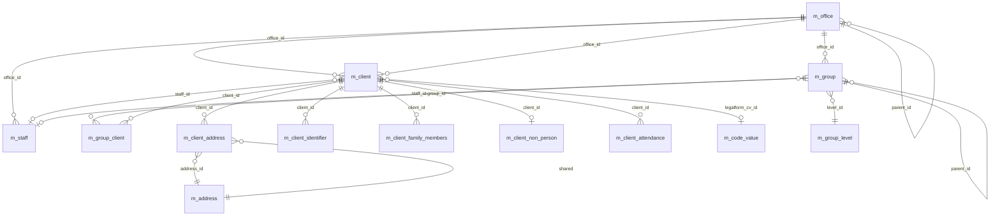

Apache Fineract organises its portfolio in a three-layer hierarchy: offices are the top-level organisational units, clients are people or businesses who hold loans and savings, and groups bind clients together for joint-liability and reporting. Every loan, savings account, share, and charge ultimately resolves to one of these entities through a foreign key. This page maps the tables that capture them, their hierarchical relationships, and the auxiliary tables that hold KYC data — addresses, identifiers, family members, non-person details.

The schema is defined in `fineract-provider/src/main/resources/db/changelog/tenant/parts/0001_initial_schema.xml` (initial), with later refinements added through the same `parts/` directory and `fineract-branch/`.

## Entity-relationship overview

## m_office — branch hierarchy

| Column | Type | Notes |
| --- | --- | --- |
| `id` | `BIGINT PK auto` | Surrogate. |
| `parent_id` | `BIGINT` → `m_office.id` | Self-reference for hierarchy (`Head Office` row has `parent_id` null). |
| `hierarchy` | `VARCHAR(100)` | Materialised path — e.g. `.1.4.7.` — used by data-scope queries. |
| `external_id` | `VARCHAR(100) UNIQUE` | Optional external code. |
| `name` | `VARCHAR(100) NOT NULL UNIQUE` | Display. |
| `opening_date` | `DATE NOT NULL` | When office went live. |

Foreign key: `FK_m_office_m_office` → `m_office(id)` self-reference. Index on `hierarchy` makes the `LIKE '.1.4.%'` data-scope query fast.

Branch contact information lives in the auxiliary `m_office_address` and `m_office_transaction` tables (the latter for inter-office transfers). The `m_office_country` table (introduced via `fineract-branch`) tags offices to ISO country codes.

## m_group — group / centre / federation

| Column | Type | Notes |
| --- | --- | --- |
| `id` | `BIGINT PK auto` | Surrogate. |
| `external_id` | `VARCHAR(100) UNIQUE` | Optional external code. |
| `status_enum` | `INT NOT NULL` | 100 pending, 300 active, 600 closed, 700 transfer-in-progress, 800 transfer-on-hold. |
| `activation_date` | `DATE` | When activated. |
| `office_id` | `BIGINT NOT NULL` → `m_office.id` | Owning branch. |
| `staff_id` | `BIGINT` → `m_staff.id` | Assigned officer. |
| `parent_id` | `BIGINT` → `m_group.id` | Parent group / centre. |
| `level_id` | `INT NOT NULL` → `m_group_level.id` | Hierarchy level. |
| `display_name` | `VARCHAR(100) NOT NULL` | UI label. |
| `hierarchy` | `VARCHAR(100)` | Materialised path. |
| `closure_reason_cv_id` | `INT` → `m_code_value.id` | Closure reason. |
| `closedon_date` / `closedon_userid` | `DATE` / `BIGINT` | Closure audit. |
| `submittedon_date` / `submittedon_userid` | `DATE` / `BIGINT` | Submission audit. |
| `activatedon_userid` | `BIGINT` | Who activated. |
| `account_no` | `VARCHAR(20) NOT NULL` | Generated number. |

Foreign keys: `FK_m_group_office` → `m_office(id)`, `FK_m_group_staff` → `m_staff(id)`, `FK_m_group_parent` → `m_group(id)`, `FK_m_group_level` → `m_group_level(id)`.

Indexes: `external_id` unique, `office_id`, `staff_id`, `parent_id`, `hierarchy`.

## m_group_level — group typology

A small reference table that lists the allowed group levels (e.g. Centre → Group, or just Group). One row per level.

| Column | Type |
| --- | --- |
| `id` | `INT PK auto` |
| `parent_id` | `INT` → `m_group_level.id` |
| `super_parent` | `BOOLEAN NOT NULL` |
| `level_name` | `VARCHAR(100) NOT NULL` |
| `recursable` | `BOOLEAN NOT NULL` |
| `can_have_clients` | `BOOLEAN NOT NULL` |

## m_group_client — many-to-many membership

Join table.

| Column | Type | Notes |
| --- | --- | --- |
| `group_id` | `BIGINT NOT NULL` → `m_group.id` | Composite PK. |
| `client_id` | `BIGINT NOT NULL` → `m_client.id` | Composite PK. |

Foreign keys: `FK_m_group_client_group` → `m_group(id)`, `FK_m_group_client_client` → `m_client(id)`. The composite primary key prevents duplicate membership.

## m_client — the borrower / depositor

The core portfolio entity.

| Column | Type | Notes |
| --- | --- | --- |
| `id` | `BIGINT PK auto` | Surrogate. |
| `account_no` | `VARCHAR(20) NOT NULL UNIQUE` | Generated. |
| `external_id` | `VARCHAR(100) UNIQUE` | External code. |
| `status_enum` | `INT NOT NULL` | 100 pending, 300 active, 600 closed, 700 transfer-in-progress, 800 transfer-on-hold, 900 rejected, 1000 withdrawn-by-client. |
| `sub_status` | `INT` → `m_code_value.id` | Optional sub-status. |
| `activation_date` | `DATE` | When activated. |
| `office_joining_date` | `DATE` | Branch start. |
| `office_id` | `BIGINT NOT NULL` → `m_office.id` | Owning branch. |
| `transfer_to_office_id` | `BIGINT` → `m_office.id` | Pending transfer target. |
| `staff_id` | `BIGINT` → `m_staff.id` | Assigned officer. |
| `firstname` / `middlename` / `lastname` | `VARCHAR(50)` | Personal-name components. |
| `fullname` | `VARCHAR(100)` | Used for non-person clients. |
| `display_name` | `VARCHAR(100) NOT NULL` | Computed for UI. |
| `mobile_no` | `VARCHAR(50) UNIQUE` | Phone. |
| `email_address` | `VARCHAR(50)` | Email. |
| `gender_cv_id` | `INT` → `m_code_value.id` | Gender code. |
| `client_type_cv_id` | `INT` → `m_code_value.id` | Client type. |
| `client_classification_cv_id` | `INT` → `m_code_value.id` | Classification. |
| `legal_form_enum` | `INT` | 1 person, 2 entity. |
| `date_of_birth` | `DATE` | Personal. |
| `image_id` | `BIGINT` → `m_image.id` | Profile picture. |
| `closure_reason_cv_id` / `closedon_date` / `closedon_userid` | reference / date / userid | Closure audit. |
| `reject_reason_cv_id` / `rejectedon_date` / `rejectedon_userid` | reference / date / userid | Rejection audit. |
| `withdraw_reason_cv_id` / `withdrawn_on_date` / `withdraw_on_userid` | reference / date / userid | Withdrawal audit. |
| `reactivated_on_date` / `reactivated_on_userid` | `DATE` / `BIGINT` | Reactivation audit. |
| `submittedon_date` / `submittedon_userid` | `DATE` / `BIGINT` | Submission audit. |
| `activatedon_userid` | `BIGINT` | Who activated. |
| `default_savings_account` | `BIGINT` → `m_savings_account.id` | Default account for transfers. |
| `default_savings_product` | `BIGINT` → `m_savings_product.id` | Default product. |
| `is_staff` | `BOOLEAN NOT NULL` | True if client is also a staff. |
| `proposed_transfer_date` | `DATE` | Pending transfer date. |

### Foreign keys

- `FK_m_client_office` → `m_office(id)`
- `FK_m_client_staff` → `m_staff(id)`
- `FK_m_client_image` → `m_image(id)`
- `FK_m_client_gender` → `m_code_value(id)`
- `FK_m_client_type` → `m_code_value(id)`
- `FK_m_client_classification` → `m_code_value(id)`
- `FK_m_client_sub_status` → `m_code_value(id)`
- `FK_m_client_savings_product` → `m_savings_product(id)`
- `FK_m_client_default_savings` → `m_savings_account(id)`

### Indexes

- `account_no_UNIQUE`, `mobile_no_UNIQUE`, `external_id_UNIQUE` — uniqueness.
- `office_id`, `staff_id`, `status_enum`, `transfer_to_office_id` — query selectivity.
- `display_name` — search.

## m_client_address — many-to-many with m_address

Apache Fineract separates the address row (`m_address`) from the relationship that ties it to a client, allowing multiple address types per client (and theoretically address reuse, though in practice each client owns its address row).

`m_address`

| Column | Type | Notes |
| --- | --- | --- |
| `id` | `BIGINT PK auto` | Surrogate. |
| `street` | `VARCHAR(100)` | Street. |
| `address_line_1` / `address_line_2` / `address_line_3` | `VARCHAR(100)` | Multi-line. |
| `town_village` | `VARCHAR(100)` | City. |
| `city` | `VARCHAR(100)` | City. |
| `county_district` | `VARCHAR(100)` | County. |
| `state_province_id` | `INT` → `m_code_value.id` | State code. |
| `country_id` | `INT` → `m_code_value.id` | Country code. |
| `postal_code` | `VARCHAR(20)` | Postal. |
| `latitude` / `longitude` | `DECIMAL(10,8)` | Geo. |
| `created_by` / `created_on` / `updated_by` / `updated_on` | audit | Audit fields. |

`m_client_address`

| Column | Type | Notes |
| --- | --- | --- |
| `id` | `BIGINT PK auto` | Surrogate. |
| `client_id` | `BIGINT NOT NULL` → `m_client.id` | Client. |
| `address_id` | `BIGINT NOT NULL` → `m_address.id` | Address. |
| `address_type_id` | `INT NOT NULL` → `m_code_value.id` | Permanent / business / other. |
| `is_active` | `BOOLEAN NOT NULL` | Soft toggle. |

Foreign keys: `FK_m_client_address_client` → `m_client(id)`, `FK_m_client_address_address` → `m_address(id)`, `FK_m_client_address_type` → `m_code_value(id)`.

## m_client_identifier — KYC documents

One row per identity document (e.g. national id, passport, driving licence).

| Column | Type | Notes |
| --- | --- | --- |
| `id` | `BIGINT PK auto` | Surrogate. |
| `client_id` | `BIGINT NOT NULL` → `m_client.id` | Owning client. |
| `document_type_cv_id` | `INT NOT NULL` → `m_code_value.id` | Type. |
| `document_key` | `VARCHAR(50) NOT NULL` | Identifier value. |
| `description` | `VARCHAR(500)` | Free-form. |
| `status` | `VARCHAR(100)` | Active / inactive. |

Foreign keys: `FK_m_client_identifier_client` → `m_client(id)`, `FK_m_client_identifier_type` → `m_code_value(id)`. Unique constraint on `(document_type_cv_id, document_key)` prevents reusing the same id under two clients.

## m_client_family_members

Captures dependants and relatives.

| Column | Type | Notes |
| --- | --- | --- |
| `id` | `BIGINT PK auto` | Surrogate. |
| `client_id` | `BIGINT NOT NULL` → `m_client.id` | Owning client. |
| `firstname` / `middlename` / `lastname` / `qualification` | `VARCHAR` | Name fields. |
| `mobile_number` | `VARCHAR(20)` | Phone. |
| `age` | `INT` | Age. |
| `is_dependent` | `BOOLEAN` | Dependant flag. |
| `relationship_cv_id` | `INT` → `m_code_value.id` | Relationship code. |
| `marital_status_cv_id` | `INT` → `m_code_value.id` | Marital status. |
| `gender_cv_id` | `INT` → `m_code_value.id` | Gender. |
| `date_of_birth` | `DATE` | DOB. |
| `profession_cv_id` | `INT` → `m_code_value.id` | Profession. |

## m_client_non_person

When `m_client.legal_form_enum = 2` (entity / corporation), this child row stores the business-specific fields.

| Column | Type | Notes |
| --- | --- | --- |
| `client_id` | `BIGINT PK` → `m_client.id` | One-to-one. |
| `constitution_cv_id` | `INT` → `m_code_value.id` | Constitution. |
| `incorp_no` | `VARCHAR(50)` | Registration number. |
| `incorp_validity_till` | `DATE` | Registration validity. |
| `main_business_line_cv_id` | `INT` → `m_code_value.id` | Industry code. |
| `remarks` | `VARCHAR(500)` | Notes. |

## m_client_attendance

Periodic group / meeting attendance.

| Column | Type | Notes |
| --- | --- | --- |
| `id` | `BIGINT PK auto` | Surrogate. |
| `client_id` | `BIGINT NOT NULL` → `m_client.id` | Client. |
| `meeting_id` | `BIGINT NOT NULL` → `m_meeting.id` | Meeting. |
| `attendance_type_enum` | `SMALLINT NOT NULL` | 1 present, 2 absent, 3 approved leave, 4 unapproved leave. |

## m_staff

Field officers belong to an office and are referenced by clients, groups and loans.

| Column | Type | Notes |
| --- | --- | --- |
| `id` | `BIGINT PK auto` | Surrogate. |
| `office_id` | `BIGINT NOT NULL` → `m_office.id` | Branch. |
| `firstname` / `lastname` | `VARCHAR(50) NOT NULL` | Name. |
| `display_name` | `VARCHAR(100) NOT NULL` | UI. |
| `mobile_no` | `VARCHAR(50) UNIQUE` | Phone. |
| `email_address` | `VARCHAR(50)` | Email. |
| `is_loan_officer` | `BOOLEAN NOT NULL` | Toggle determines assignability. |
| `external_id` | `VARCHAR(100) UNIQUE` | External. |
| `organisational_role_enum` / `organisational_role_parent_staff_id` | `SMALLINT` / `BIGINT` | Org structure. |
| `is_active` | `BOOLEAN NOT NULL` | Soft delete. |
| `joining_date` | `DATE` | Hire date. |
| `image_id` | `BIGINT` → `m_image.id` | Photo. |

## Indexes summary

| Table | Index | Use |
| --- | --- | --- |
| `m_office` | `name` unique, `hierarchy` | Lookup & data scope. |
| `m_group` | `external_id` unique, `office_id`, `staff_id`, `parent_id` | Portfolio queries. |
| `m_client` | `account_no`, `mobile_no`, `external_id` unique | Identity lookup. |
| `m_client` | `office_id`, `staff_id`, `status_enum` | Portfolio reports. |
| `m_group_client` | composite PK | Membership lookup both ways. |
| `m_client_identifier` | unique `(document_type_cv_id, document_key)` | Prevent duplicate IDs. |
| `m_staff` | `external_id`, `mobile_no` unique | Lookup. |

The client model is therefore the schema's "subject" layer — every loan, savings account, share, transaction, and journal entry traces back through office and group/client foreign keys to one of these rows, and the hierarchy strings on offices and groups are what gate every multi-branch data-scope check Apache Fineract enforces.
