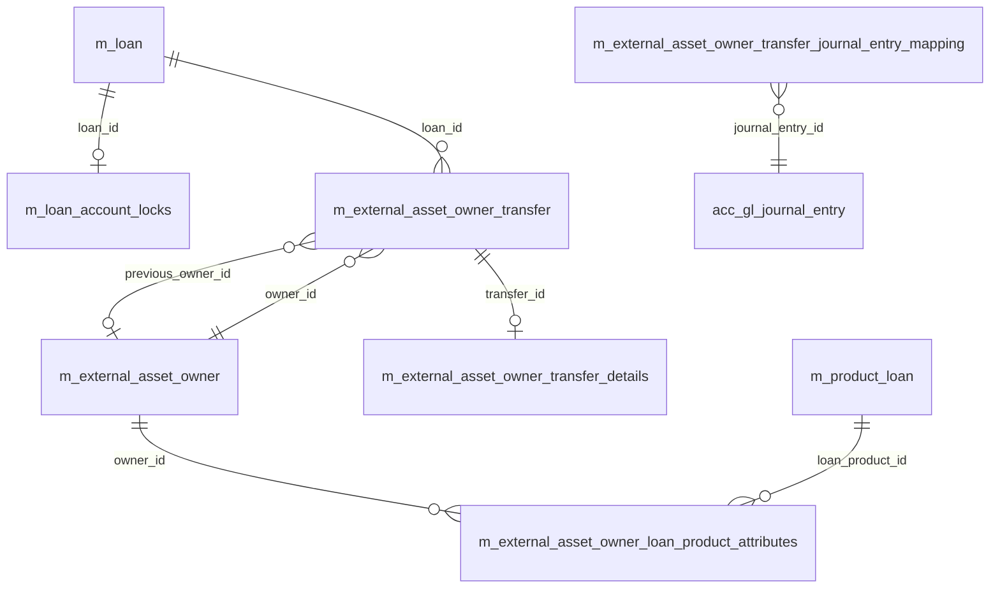

Two distinct concerns share this page because they overlap operationally: the Close-of-Business (COB) account-lock tables, which serialise access between the COB worker and online write commands, and the investor / external-asset-owner tables, which model the sale and transfer of loan portfolios to off-platform investors. Both clusters were added relatively late in Apache Fineract's evolution and live in their own Liquibase modules — `fineract-provider` for the COB locks (`parts/0039_add_loan_account_locks.xml` onwards, plus parallel changesets for savings and working-capital loans) and `fineract-investor/src/main/resources/db/changelog/tenant/module/investor/parts/` for the investor schema.

## Entity-relationship overview



## m_loan_account_locks — COB serialisation lock

The COB worker takes a per-loan lock before processing the loan's COB pipeline and releases it on success. Online write commands consult this table at the start of every loan write to decide whether to proceed, wait, or fail with `LoanAccountLockCannotBeOverruledException`.

| Column | Type | Notes |
| --- | --- | --- |
| `loan_id` | `BIGINT PK` → `m_loan.id` | One-to-one with loan. |
| `lock_owner` | `VARCHAR(100) NOT NULL` | Identifier of the COB step / chunk that holds the lock (`LOAN_COB_CHUNK_PROCESSING_WORKER`, `LOAN_INLINE_COB_PROCESSING`). |
| `lock_placed_on` | `TIMESTAMP NOT NULL` | When the lock was acquired (added back as a typed column in `0048_rework_loan_account_locks.xml`). |
| `lock_placed_on_cob_business_date` | `DATE` | COB business date the lock was placed for — added in `0086_add_cob_business_date_to_loan_account_locks.xml`. |
| `error` | `VARCHAR(255)` | Short error message if the COB run failed. |
| `stacktrace` | `TEXT` | Full stack trace on failure (widened from `VARCHAR(255)` to `TEXT` in `0048_rework_loan_account_locks.xml`). |
| `version` | `BIGINT NOT NULL` | Optimistic lock. |

Foreign key: `fk_loan_id` → `m_loan(id)` on delete restrict.

### Lock owners and their meaning

- `LOAN_COB_CHUNK_PROCESSING_WORKER` — taken by the COB worker when it starts processing the loan; released when the chunk commits. If the worker crashes, the row stays and online writes are blocked until ops clears it.
- `LOAN_INLINE_COB_PROCESSING` — taken when an online command catches up the loan's missed COB on-the-fly (because the COB job is behind by one or more business dates). The same row is then converted to a worker-owned lock when COB next runs.
- `error` / `stacktrace` populated → the COB run failed for this loan and operations must intervene. The check in `0108_precondition_check_cob_loan_account_lock.xml` makes sure the error fields exist before downstream changesets reference them.

Indexes: PK on `loan_id` already gives fast lookup; some deployments add `lock_owner` for monitoring queries.

## Savings and other account lock tables

Upstream Apache Fineract ships only `m_loan_account_locks` for COB serialisation. There is no separate `m_savings_account_locks` or working-capital lock table in the standard distribution — savings COB and any custom pipelines either reuse the same serialisation pattern in a downstream fork or rely on the in-flight transaction boundary instead of a row-level lock table. If a deployment adds one, mirror the column shape of `m_loan_account_locks`.

## m_external_asset_owner — investor registry

Source: `fineract-investor/src/main/resources/db/changelog/tenant/module/investor/parts/0002_asset_schemas.xml`. One row per external party that can take ownership of loans.

| Column | Type | Notes |
| --- | --- | --- |
| `id` | `BIGINT PK auto` | Surrogate. |
| `external_id` | `VARCHAR(100) NOT NULL UNIQUE` | External identifier; constraint `UQ_external_asset_owner_external_id`. |
| `created_by` | `BIGINT` → `m_appuser.id` | Audit. |
| `created_on_utc` | `TIMESTAMP WITH TIME ZONE` (PG) / `DATETIME` (MySQL) | Audit. |
| `last_modified_by` | `BIGINT` → `m_appuser.id` | Audit. |
| `last_modified_on_utc` | `TIMESTAMP WITH TIME ZONE` (PG) / `DATETIME` (MySQL) | Audit. |

Foreign keys: `FK_external_asset_owner_created_by` → `m_appuser(id)` restrict, `FK_external_asset_owner_modified_by` → `m_appuser(id)` restrict.

## m_external_asset_owner_transfer — sale / buyback / intermediary-sale events

The transactional fact table for portfolio sales. One row per planned, executed, or cancelled transfer of a loan to or from an external owner.

| Column | Type | Notes |
| --- | --- | --- |
| `id` | `BIGINT PK auto` | Surrogate. |
| `owner_id` | `BIGINT NOT NULL` → `m_external_asset_owner.id` | The target owner of this transfer. |
| `external_id` | `VARCHAR(100)` | Client-supplied id; uniqueness within `(external_id, status)` enforced by `0010_external_transafer_status_external_transfer_id_constraints.xml`. |
| `external_loan_id` | `VARCHAR(100)` | Loan's external id at the time of transfer. |
| `loan_id` | `BIGINT NOT NULL` → `m_loan.id` | Loan being transferred. |
| `status` | `VARCHAR(50) NOT NULL` | `PENDING`, `ACTIVE`, `BUYBACK`, `CANCELLED`, `DECLINED`. |
| `purchase_price_ratio` | `VARCHAR(50)` | Originally numeric, changed to string in `0004_change_purchase_price_ratio_type.xml` to allow ratio notation like `1:1.2`. |
| `settlement_date` | `DATE NOT NULL` | When cash settles. |
| `effective_date_from` | `DATE NOT NULL` | When the transfer takes effect. |
| `effective_date_to` | `DATE NOT NULL` | Validity end — set to a high sentinel for active transfers, moved on buyback. |
| `transfer_external_id` | `VARCHAR(100)` | Cross-reference between paired sale and buyback rows. |
| `previous_owner_id` | `BIGINT` → `m_external_asset_owner.id` | Previous owner — added in `0020_add_previous_owner_reference.xml` to support intermediary sales. |
| `external_reference_id` | `VARCHAR(100)` | Added in `0016_add_external_reference_id.xml`. |
| `outstanding_interest_strategy` | `VARCHAR(50)` | `CREATE_NEW_TRANSACTION` or `ADJUST_OUTSTANDING` — added in `0018_add_external_asset_owner_transfer_outstanding_interest_strategy.xml`. |
| `created_by` / `created_on_utc` / `last_modified_by` / `last_modified_on_utc` | audit | Auditable. |

### Indexes (across changesets)

- `external_asset_owner_transfer_external_id` on `external_id`
- `external_asset_owner_transfer_status` on `status`
- `external_asset_owner_transfer_settlement_date` on `settlement_date`
- `external_asset_owner_transfer_effective_date_to` on `effective_date_to` (added in `0012_add_external_asset_owner_transfer_index.xml`)
- `external_asset_owner_transfer_loan_id` on `loan_id` (added in `0013_add_additional_asset_owner_indices.xml`)
- `external_asset_owner_transfer_owner_id` on `owner_id`
- Unique constraint on `(external_id, status)` enforced by `0010_…`

Foreign keys: `FK_external_asset_owner_transfer_owner` → `m_external_asset_owner(id)`, `FK_external_asset_owner_transfer_loan` → `m_loan(id)`.

## m_external_asset_owner_transfer_details

Per-transfer money snapshot taken at the moment of execution — added in `0007_add_external_asset_owner_transfer_details.xml`.

| Column | Type | Notes |
| --- | --- | --- |
| `id` | `BIGINT PK auto` | Surrogate. |
| `transfer_id` | `BIGINT NOT NULL UNIQUE` → `m_external_asset_owner_transfer.id` | One-to-one with parent transfer. |
| `total_outstanding_balance_amount` | `NUMERIC(19,6)` | Outstanding loan at transfer. |
| `total_principal_outstanding_balance` | `NUMERIC(19,6)` | Principal outstanding. |
| `total_interest_outstanding_balance` | `NUMERIC(19,6)` | Interest outstanding. |
| `total_fee_charges_outstanding_balance` | `NUMERIC(19,6)` | Fee outstanding. |
| `total_penalty_charges_outstanding_balance` | `NUMERIC(19,6)` | Penalty outstanding. |
| `total_overpaid_amount` | `NUMERIC(19,6)` | Any overpayment. |

Foreign key: `FK_transfer_details_transfer` → `m_external_asset_owner_transfer(id)`.

## m_external_asset_owner_transfer_loan_mapping

Tracks the active loan ownership at a moment in time — used by reporting to determine "which loans does owner X currently own?" without scanning the transfer table.

| Column | Type | Notes |
| --- | --- | --- |
| `id` | `BIGINT PK auto` | Surrogate. |
| `loan_id` | `BIGINT NOT NULL` → `m_loan.id` | Loan. |
| `owner_transfer_id` | `BIGINT NOT NULL` → `m_external_asset_owner_transfer.id` | Active transfer row. |

Indexed on `loan_id`. Updated by the EXTERNAL_ASSET_OWNER_TRANSFER COB step that flips ownership on `effective_date_from`.

## m_external_asset_owner_journal_entry_mapping

Cross-reference between journal entries and the transfers that produced them — used when reversing a transfer, so the offsetting journal entries can be located. Added through `0008_add_mappings.xml`.

| Column | Type | Notes |
| --- | --- | --- |
| `id` | `BIGINT PK auto` | Surrogate. |
| `journal_entry_id` | `BIGINT NOT NULL` → `acc_gl_journal_entry.id` | Linked entry. |
| `owner_transfer_id` | `BIGINT NOT NULL` → `m_external_asset_owner_transfer.id` | Owning transfer. |

`0021_external_owner_reference_in_journal_entry_aggregation.xml` further denormalises a reference into `acc_gl_journal_entry` to enable trial-balance-by-owner reporting.

## m_external_asset_owner_loan_product_attributes

Per-product overrides controlling what an external owner is allowed to do with loans of a given product — added in `0014_add_external_asset_owner_loan_product_configurable_attributes.xml`.

| Column | Type | Notes |
| --- | --- | --- |
| `id` | `BIGINT PK auto` | Surrogate. |
| `external_asset_owner_id` | `BIGINT NOT NULL` → `m_external_asset_owner.id` | Owner. |
| `loan_product_id` | `BIGINT NOT NULL` → `m_product_loan.id` | Product. |
| `transaction_types` | `VARCHAR(2000)` | Comma-separated allowed transaction types. |

Indexed on `(external_asset_owner_id, loan_product_id)` — added in `0017_add_external_asset_owner_loan_product_attr_index.xml`. `0019_add_configurable_allowed_loan_statuses.xml` adds an `allowed_loan_statuses` column that lists the loan statuses (e.g. `ACTIVE`, `CLOSED_OBLIGATIONS_MET`, `WRITTEN_OFF`) for which the owner accepts transfers.

## Foreign keys summary

| Child | Column | Parent |
| --- | --- | --- |
| `m_loan_account_locks` | `loan_id` | `m_loan(id)` |
| `m_external_asset_owner` | `created_by` / `last_modified_by` | `m_appuser(id)` |
| `m_external_asset_owner_transfer` | `owner_id` | `m_external_asset_owner(id)` |
| `m_external_asset_owner_transfer` | `previous_owner_id` | `m_external_asset_owner(id)` |
| `m_external_asset_owner_transfer` | `loan_id` | `m_loan(id)` |
| `m_external_asset_owner_transfer_details` | `transfer_id` | `m_external_asset_owner_transfer(id)` |
| `m_external_asset_owner_transfer_loan_mapping` | `loan_id` | `m_loan(id)` |
| `m_external_asset_owner_transfer_loan_mapping` | `owner_transfer_id` | `m_external_asset_owner_transfer(id)` |
| `m_external_asset_owner_journal_entry_mapping` | `journal_entry_id` | `acc_gl_journal_entry(id)` |
| `m_external_asset_owner_journal_entry_mapping` | `owner_transfer_id` | `m_external_asset_owner_transfer(id)` |
| `m_external_asset_owner_loan_product_attributes` | `external_asset_owner_id` | `m_external_asset_owner(id)` |
| `m_external_asset_owner_loan_product_attributes` | `loan_product_id` | `m_product_loan(id)` |

## Indexes summary

| Table | Index | Use |
| --- | --- | --- |
| `m_loan_account_locks` | PK on `loan_id` | Lock check. |
| `m_external_asset_owner` | unique on `external_id` | Owner lookup. |
| `m_external_asset_owner_transfer` | `external_id`, `status`, `settlement_date`, `effective_date_to`, `loan_id`, `owner_id` | Transfer queries and COB scans. |
| `m_external_asset_owner_transfer_details` | unique on `transfer_id` | 1:1 lookup. |
| `m_external_asset_owner_transfer_loan_mapping` | `loan_id` | Active-ownership lookup. |
| `m_external_asset_owner_loan_product_attributes` | `(external_asset_owner_id, loan_product_id)` | Attribute lookup. |

## Lifecycle of a transfer

1. Operator submits an asset-owner sale → row inserted in `m_external_asset_owner_transfer` with `status = PENDING`, `effective_date_from` in the future, `effective_date_to` set to the sentinel high date.
2. On the morning of `effective_date_from`, the EXTERNAL_ASSET_OWNER_TRANSFER COB step flips `status` to `ACTIVE`, snapshots money fields into `m_external_asset_owner_transfer_details`, inserts a row into `m_external_asset_owner_transfer_loan_mapping`, and posts the journal entries (linked through `m_external_asset_owner_journal_entry_mapping`).
3. Buyback: a new row with `status = BUYBACK` is inserted; on its effective date the prior `ACTIVE` row's `effective_date_to` is closed and ownership flips back.
4. Intermediary sales (`0015_add_intermediary_sale_command.xml`) chain `previous_owner_id` so one loan can pass through multiple investors without losing the audit trail.

## How COB acquires a lock

The `AbstractAccountLockService` and its concrete implementations in `fineract-cob` use a SELECT-then-INSERT idiom that relies on the PK constraint to guard against duplicate locks:

```sql
-- Inside the same transaction:
INSERT INTO m_loan_account_locks
       (loan_id, lock_owner, lock_placed_on, lock_placed_on_cob_business_date, version)
VALUES (?,       ?,          now(),          ?,                                 0);
```

If two threads race for the lock, one of them wins the PK insertion; the loser catches the constraint violation and either waits or throws `LoanAccountLockCannotBeOverruledException`. Successful release deletes the row.

The `lock_placed_on_cob_business_date` column was added precisely so that an online write happening on business date N+1 can detect a stale lock left behind by a failed COB run on business date N and decide whether to overrule it.

## How an online command checks the lock

The `LoanCOBApiFilter` runs in front of every loan write API. It:

1. Loads `m_loan_account_locks` by `loan_id`.
2. If no row → proceeds.
3. If a row exists with `lock_placed_on_cob_business_date < current_business_date - 1` → the lock is stale and an exception is raised that ops must clear manually.
4. If the lock is owned by `LOAN_INLINE_COB_PROCESSING` → the request waits for the inline COB to finish.
5. If the lock is owned by `LOAN_COB_CHUNK_PROCESSING_WORKER` and the COB worker is still alive → the request is rejected with HTTP 409.

This row-level coordination is what lets Apache Fineract run COB and online writes against the same database without classical pessimistic locks.

## How a sale produces journal entries

When the EXTERNAL_ASSET_OWNER_TRANSFER COB step activates a transfer:

1. Reads `m_external_asset_owner_transfer` rows with `status = PENDING` and `effective_date_from = current_business_date`.
2. For each row, computes the transfer amount as outstanding × purchase price ratio.
3. Writes balanced journal entries: debit the new owner's receivable GL, credit the loan portfolio GL, recording any gain or loss against a P&L account.
4. Inserts a row into `m_external_asset_owner_journal_entry_mapping` for each journal entry produced, linking it back to the transfer.
5. Inserts a row into `m_external_asset_owner_transfer_loan_mapping` so the loan is now reported as owned by the external party.
6. Updates `m_external_asset_owner_transfer` setting `status = ACTIVE`.

A buyback follows the reverse sequence and the journal-entry mapping makes it trivial to reverse the original entries by amount.

## Operations queries

Two common operations queries on these clusters:

```sql
-- Loans whose COB lock is stale and needs intervention
SELECT loan_id, lock_owner, lock_placed_on, error
FROM   m_loan_account_locks
WHERE  lock_placed_on_cob_business_date < (
         SELECT date FROM m_business_date WHERE type = 'COB_DATE'
       ) - INTERVAL '1 day';

-- Active ownership map for an owner
SELECT m.loan_id, t.purchase_price_ratio, t.effective_date_from
FROM   m_external_asset_owner_transfer_loan_mapping m
JOIN   m_external_asset_owner_transfer            t ON t.id = m.owner_transfer_id
WHERE  t.owner_id = ?
  AND  t.status   = 'ACTIVE';
```

This pair of clusters captures the two newest concerns in Apache Fineract's data layer: COB locks make COB run safely against an online write workload, and the investor schema lets the platform act as the system-of-record for off-balance-sheet portfolios — both modelled as small, focused table sets that hang off the main loan and savings aggregates.
