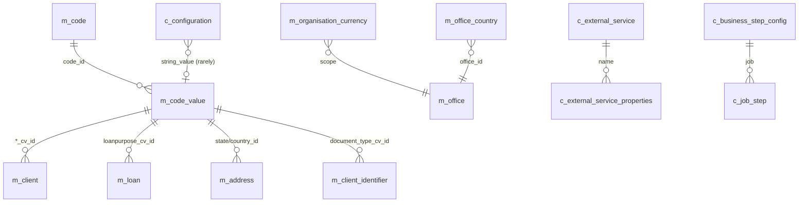

Configuration tables in Apache Fineract hold cross-cutting toggles and reference data that the rest of the schema points at: feature flags (`c_configuration`), the catalogue of external services and their credentials (`c_external_service`), the ordered list of business steps the COB workflow should run (`c_business_step_config`), the per-tenant active currency list (`m_organisation_currency`), and the soft-enumeration system (`m_code` + `m_code_value`) referenced by dozens of `*_cv_id` columns across portfolio tables.

These tables are mostly defined in `fineract-provider/src/main/resources/db/changelog/tenant/parts/0001_initial_schema.xml`, with feature-flag additions and business-step rows landing through later changelog modules.

## Entity-relationship overview

## c_configuration — feature flags

A small but heavily referenced table that toggles global behaviours.

| Column | Type | Notes |
| --- | --- | --- |
| `id` | `BIGINT PK auto` | Surrogate. |
| `name` | `VARCHAR(100) NOT NULL UNIQUE` | Flag identifier (e.g. `maker-checker`, `amazon-S3`, `business-date-enabled`, `cob-date-adjustment`, `meetings-mandatory-for-jlg-loans`, `office-specific-products-enabled`, `allow-double-entries-for-product-mapping`, `min-clients-in-group`, `max-clients-in-group`). |
| `value` | `BIGINT` | Numeric value when applicable. |
| `date_value` | `DATE` | Date value when applicable. |
| `string_value` | `VARCHAR(1000)` | String value when applicable. |
| `enabled` | `BOOLEAN NOT NULL` | Master on/off. |
| `is_trap_door` | `BOOLEAN NOT NULL` | When true the flag can be turned on but not off. |
| `description` | `VARCHAR(300)` | Free-form. |

Indexes: `name` unique.

The `business-date-enabled` row enables the business-date subsystem; `cob-date-adjustment` enables the off-by-one job date adjustment. The maker-checker flag drives the four-eyes review pipeline in `m_portfolio_command_source`.

### Business date companion: `m_business_date`

When `business-date-enabled` is on, this table holds the current business date and the current COB date.

| Column | Type | Notes |
| --- | --- | --- |
| `id` | `BIGINT PK auto` | Surrogate. |
| `type` | `VARCHAR(50) NOT NULL UNIQUE` | `BUSINESS_DATE` or `COB_DATE`. |
| `date` | `DATE NOT NULL` | Current value. |
| `description` | `VARCHAR(255)` | Free-form. |
| `created_date` / `lastmodified_date` / `createdby_id` / `lastmodifiedby_id` | audit | Audit. |

## c_external_service and c_external_service_properties

Apache Fineract talks to S3, SMTP, SMS gateways, and notification services through this catalogue.

`c_external_service`

| Column | Type | Notes |
| --- | --- | --- |
| `id` | `BIGINT PK auto` | Surrogate. |
| `name` | `VARCHAR(50) NOT NULL UNIQUE` | Service id (`S3`, `SMTP_EMAIL`, `SMS`, `NOTIFICATION`). |

`c_external_service_properties`

| Column | Type | Notes |
| --- | --- | --- |
| `name` | `VARCHAR(150) NOT NULL` | Property key. |
| `value` | `VARCHAR(250)` | Property value. |
| `external_service_id` | `BIGINT NOT NULL` → `c_external_service.id` | Owning service. |

Composite primary key on `(name, external_service_id)` ensures one row per property per service. Foreign key: `FK_external_service_properties_service` → `c_external_service(id)`.

## c_business_step_config — COB workflow definition

Defines which Spring Batch steps run inside the Close-of-Business job and in what order.

| Column | Type | Notes |
| --- | --- | --- |
| `id` | `BIGINT PK auto` | Surrogate. |
| `job_name` | `VARCHAR(100) NOT NULL` | Owning job (e.g. `LOAN_CLOSE_OF_BUSINESS`, `LOAN_DELINQUENCY_CLASSIFICATION`). |
| `step_name` | `VARCHAR(100) NOT NULL` | Step name (e.g. `APPLY_CHARGE_TO_OVERDUE_LOANS`, `LOAN_DELINQUENCY_CLASSIFICATION`, `CHECK_LOAN_REPAYMENT_DUE`, `CHECK_LOAN_REPAYMENT_OVERDUE`, `UPDATE_LOAN_ARREARS_AGEING`, `ADD_PERIODIC_ACCRUAL_ENTRIES`, `EXTERNAL_ASSET_OWNER_TRANSFER`, `INCREASE_BUSINESS_DATE_FOR_LOANS`). |
| `step_order` | `INT NOT NULL` | Execution order. |

Unique constraint on `(job_name, step_name)` prevents duplicates. Index on `(job_name, step_order)` drives the runtime lookup.

## m_organisation_currency — active currencies

Per-tenant list of currencies enabled for transactions, scoped from the global `m_currency` catalogue.

| Column | Type | Notes |
| --- | --- | --- |
| `id` | `BIGINT PK auto` | Surrogate. |
| `code` | `VARCHAR(3) NOT NULL UNIQUE` | ISO 4217 code. |
| `decimal_places` | `SMALLINT NOT NULL` | Decimal precision. |
| `currency_multiplesof` | `SMALLINT` | Rounding multiple. |
| `name` | `VARCHAR(50) NOT NULL` | Display. |
| `display_symbol` | `VARCHAR(10)` | UI symbol. |
| `internationalized_name_code` | `VARCHAR(50)` | i18n key. |

The full master `m_currency` table has the same column set and is read-only. `m_organisation_currency` is a copy of the rows the tenant has enabled, so currency lookups don't roundtrip to the master.

## m_office_country — office country tagging

Added through the `fineract-branch` module to tag offices with their country code.

| Column | Type | Notes |
| --- | --- | --- |
| `id` | `BIGINT PK auto` | Surrogate. |
| `office_id` | `BIGINT NOT NULL UNIQUE` → `m_office.id` | One-to-one with office. |
| `country_id` | `INT NOT NULL` → `m_code_value.id` | Country code value. |

Foreign keys: `FK_m_office_country_office` → `m_office(id)`, `FK_m_office_country_country` → `m_code_value(id)`. Unique on `office_id` enforces 1:1.

## m_code — soft enumerations

The core soft-enumeration table. Every column in the portfolio schema named `*_cv_id` ultimately references a row in `m_code_value` whose owning `m_code` row gives it semantic meaning (e.g. the `Gender` code groups Male / Female / Other / Prefer-not-to-say rows).

| Column | Type | Notes |
| --- | --- | --- |
| `id` | `BIGINT PK auto` | Surrogate. |
| `code_name` | `VARCHAR(100) UNIQUE` | Code identifier (`Gender`, `LoanPurpose`, `ClientClassification`, `ClientType`, `MaritalStatus`, `Customer Identifier`, `AddressType`, `Country`, `State`, `BusinessSector`, `IndustrySector`, `SubStatus`, `GroupRole`, etc.). |
| `is_system_defined` | `BOOLEAN NOT NULL` | True when the code itself is wired into platform code paths (gender, address type, country, etc.). System-defined codes cannot be deleted but their values can usually be edited. |

Index: `code_name` unique.

## m_code_value — soft-enumeration values

| Column | Type | Notes |
| --- | --- | --- |
| `id` | `BIGINT PK auto` | Surrogate. |
| `code_id` | `INT NOT NULL` → `m_code.id` | Owning code. |
| `code_value` | `VARCHAR(100) NOT NULL` | Display string. |
| `code_score` | `INT` | Optional numeric weight (used for credit scoring). |
| `code_description` | `VARCHAR(500)` | Description. |
| `order_position` | `INT NOT NULL` | UI ordering. |
| `is_active` | `BOOLEAN NOT NULL` | Soft delete. |
| `is_mandatory` | `BOOLEAN` | When required as a hint for forms. |

Foreign key: `FK_m_code_value_code` → `m_code(id)`. Unique constraint on `(code_id, code_value)` prevents duplicate values within a code. Index on `code_id` for lookup.

## Other reference / configuration tables

### m_currency

Master ISO-4217 currency list shipped with the platform.

| Column | Type | Notes |
| --- | --- | --- |
| `id` | `BIGINT PK auto` | Surrogate. |
| `code` | `VARCHAR(3) NOT NULL UNIQUE` | ISO code. |
| `decimal_places` | `SMALLINT NOT NULL` | Precision. |
| `name` | `VARCHAR(50) NOT NULL` | Display. |
| `display_symbol` | `VARCHAR(10)` | UI symbol. |
| `internationalized_name_code` | `VARCHAR(50)` | i18n key. |

### m_data_entity (data-tables registry)

For each user-defined "data-table" (the platform's flexible per-entity extensions), the registry holds:

| Column | Type | Notes |
| --- | --- | --- |
| `id` | `BIGINT PK auto` | Surrogate. |
| `entity` | `VARCHAR(100) NOT NULL` | Owning entity (`m_client`, `m_loan`, ...). |
| `app_table_name` | `VARCHAR(255) NOT NULL UNIQUE` | Companion table name (e.g. `client_kyc_extra`). |
| `category` | `VARCHAR(50)` | Display grouping. |
| `system_defined` | `BOOLEAN NOT NULL` | Built-in vs user-defined. |

The matching `m_data_entity_permissions` and per-data-table dynamic SQL tables capture access rules and data.

### m_entity_to_entity_mapping & m_entity_to_entity_access

Implements the entity-restrictions feature: which offices may originate which products, which products are restricted to which charges, etc.

| Column | Type | Notes |
| --- | --- | --- |
| `id` | `BIGINT PK auto` | Surrogate. |
| `rel_id` | `BIGINT NOT NULL` → `m_entity_relation.id` | Relation type. |
| `from_id` | `BIGINT NOT NULL` | LHS entity id. |
| `to_id` | `BIGINT NOT NULL` | RHS entity id. |
| `start_date` / `end_date` | `DATE` | Validity window. |

`m_entity_relation` is a small table that lists the relation types (`office-access-to-loan-product`, `office-access-to-savings-product`, etc.).

### Hook configuration

`m_hook`, `m_hook_configuration`, `m_hook_registered_events`, `m_hook_templates` and `m_template` round out the webhook configuration tables — referenced by the configuration UI and consumed by the hook executor at write time.

## Foreign keys overview

| Child | Column | Parent |
| --- | --- | --- |
| `c_external_service_properties` | `external_service_id` | `c_external_service(id)` |
| `m_office_country` | `office_id` | `m_office(id)` |
| `m_office_country` | `country_id` | `m_code_value(id)` |
| `m_code_value` | `code_id` | `m_code(id)` |
| `m_business_date` | n/a | self-contained |
| `m_entity_to_entity_mapping` | `rel_id` | `m_entity_relation(id)` |

## Indexes summary

| Table | Index | Use |
| --- | --- | --- |
| `c_configuration` | `name` unique | Flag lookup. |
| `c_external_service` | `name` unique | Service lookup. |
| `c_external_service_properties` | PK on (name, external_service_id) | Property lookup. |
| `c_business_step_config` | unique `(job_name, step_name)` | Prevent dupes. |
| `c_business_step_config` | `(job_name, step_order)` | Runtime ordering. |
| `m_organisation_currency` | `code` unique | Currency lookup. |
| `m_office_country` | `office_id` unique | 1:1 lookup. |
| `m_code` | `code_name` unique | Code lookup. |
| `m_code_value` | `(code_id, code_value)` unique | De-duplication. |
| `m_business_date` | `type` unique | Single-row-per-type. |

## How m_code_value is referenced

Every portfolio table that needs an open-ended drop-down stores an `INT` column with a `_cv_id` suffix pointing at `m_code_value.id`. Examples:

| Table | Column | Code name |
| --- | --- | --- |
| `m_client` | `gender_cv_id` | `Gender` |
| `m_client` | `client_type_cv_id` | `ClientType` |
| `m_client` | `client_classification_cv_id` | `ClientClassification` |
| `m_client` | `sub_status` | `ClientSubStatus` |
| `m_client_identifier` | `document_type_cv_id` | `Customer Identifier` |
| `m_address` | `state_province_id`, `country_id` | `State`, `Country` |
| `m_client_address` | `address_type_id` | `AddressType` |
| `m_loan` | `loanpurpose_cv_id` | `LoanPurpose` |
| `m_group` | `closure_reason_cv_id` | `GroupClosureReason` |
| `m_client_family_members` | `relationship_cv_id`, `marital_status_cv_id`, `profession_cv_id` | `FamilyMember*` |
| `m_office_country` | `country_id` | `Country` |

Because the cross-table joins are runtime FKs only ("logical" joins — the database does not always declare an FK to `m_code_value` for performance reasons), the integrity check is at the application layer: the `CodeValueRepositoryWrapper` validates that the value referenced belongs to the expected code.

## Reading c_configuration in practice

The `ConfigurationDomainService` exposes the flags as named accessor methods that the rest of the platform calls. Examples:

| Flag | Accessor | Effect when enabled |
| --- | --- | --- |
| `business-date-enabled` | `isBusinessDateEnabled()` | The platform uses `m_business_date` for date math instead of system clock. |
| `cob-date-adjustment` | `isCobDateAdjustmentEnabled()` | COB runs with `business_date - 1`. |
| `maker-checker` | `isMakerCheckerEnabled()` | The command framework routes maker-checker permissions through `m_portfolio_command_source`. |
| `meetings-mandatory-for-jlg-loans` | `isMeetingMandatoryForJLGLoans()` | JLG loan submission requires a calendar entry. |
| `office-specific-products-enabled` | `isOfficeSpecificProductsEnabled()` | Uses `m_entity_to_entity_mapping` to restrict products to offices. |
| `amazon-S3` | `isAmazonS3Enabled()` | Document storage routed through S3 via `c_external_service`. |
| `min-clients-in-group` / `max-clients-in-group` | `getMinClientsInGroup()` / `getMaxClientsInGroup()` | Bounds the number of clients per group. |

`c_configuration.value` carries the integer payload (e.g. `30` for `min-clients-in-group`); `string_value` and `date_value` give the same row alternative payload shapes.

## How c_business_step_config drives COB

The COB job at startup reads `c_business_step_config` filtered by its own `job_name`, sorts by `step_order`, and binds each row to a Spring Batch `Step` bean named the same as `step_name`. If a step name is present in the database but no bean is registered, the job startup fails fast with a clear error — preventing partial COB runs.

To enable a new step in operations, a database INSERT into `c_business_step_config` is sufficient — no platform restart is required as long as the step's bean is already in the classpath.

These reference tables are the system's "control plane": together they decide which features are on, which currencies are in play, which COB steps run in what order, and which soft-enumeration values fill every `*_cv_id` foreign key across the portfolio schema. They change rarely — but every business transaction in Apache Fineract reads them.
