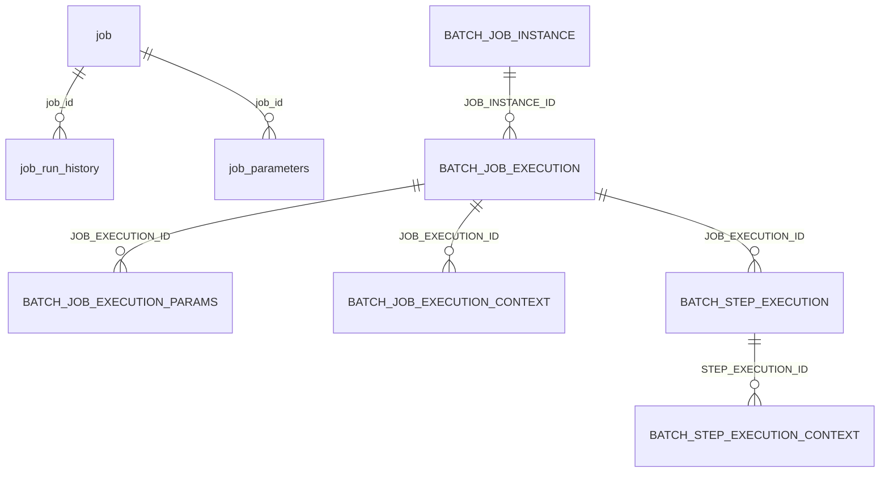

Apache Fineract schedules every recurring job — interest postings, accrual, arrears ageing, delinquency classification, dormancy tracking, COB workflow steps — through two cooperating subsystems:

1. A bespoke scheduler defined by `job` and `job_run_history`, which holds the cron expression, last-run audit, and lock fields per job.
2. The standard Spring Batch metadata schema (`BATCH_JOB_INSTANCE`, `BATCH_JOB_EXECUTION`, `BATCH_STEP_EXECUTION`, plus parameter and context tables) used by jobs implemented as Spring Batch jobs (notably the Close-of-Business workflow and the loan delinquency classifier).

The Fineract-native tables ship in `fineract-provider/src/main/resources/db/changelog/tenant/parts/0001_initial_schema.xml`; the Spring Batch tables come from Spring's own `schema-mysql.sql` and `schema-postgresql.sql` and are wired in through `JobConfig`. This page documents both clusters so you can correlate a row in `job` with its corresponding `BATCH_JOB_EXECUTION` row.

## Entity-relationship overview



## job — the job registry

One row per scheduled job. Inserted at platform bootstrap by `JobRegisterServiceImpl` reading the `@CronTarget` annotations.

| Column | Type | Notes |
| --- | --- | --- |
| `id` | `BIGINT PK auto` | Surrogate. |
| `name` | `VARCHAR(100) NOT NULL` | Display name (`Update loan summary`, `Update loan arrears ageing`, `Add accrual transactions`, `Update loan paid in advance`, `Apply annual fee for savings`, `Apply Holidays To Loans`, `Apply penalty to overdue loans`, `Generate Mandatory Savings Schedule`, `Update Deposit Accounts Maturity details`, `Pay Due Savings Charges`, `Post interest for savings`, `Transfer Interest To Savings`, `Update Accounting Running Balances`, `Update NPA`, `Update loan Arrears Ageing`, `Loan COB`, etc.). |
| `display_name` | `VARCHAR(500) NOT NULL` | Friendly description. |
| `cron_expression` | `VARCHAR(20) NOT NULL` | Quartz-style cron string. |
| `create_time` | `datetime NOT NULL` | When registered. |
| `task_priority` | `SMALLINT NOT NULL` | Thread-pool priority hint. |
| `group_name` | `VARCHAR(100)` | Logical grouping (e.g. `loan`). |
| `previous_run_start_time` | `datetime` | Start of last run. |
| `next_run_time` | `datetime` | When the scheduler will fire next. |
| `job_key` | `VARCHAR(500) NOT NULL` | Quartz job key (`jobName + scheduleName`). |
| `initializing_errorlog` | `VARCHAR(500)` | Captured at startup if any. |
| `is_active` | `BOOLEAN NOT NULL` | Toggle. |
| `currently_running` | `BOOLEAN NOT NULL` | Set when the executor takes the lock. |
| `updates_allowed` | `BOOLEAN NOT NULL` | False for system-managed jobs. |
| `scheduler_group` | `SMALLINT NOT NULL` | Concurrency group for serialisation. |
| `is_misfired` | `BOOLEAN NOT NULL` | True when a run was missed. |
| `node_id` | `SMALLINT NOT NULL DEFAULT 0` | Which Fineract node owns the job (used in clustered deployments). |
| `is_mismatched_job` | `BOOLEAN NOT NULL DEFAULT true` | Set when registry detects code/db mismatch. |
| `cron_expression_for_db` | `VARCHAR(20)` | Stored cron for restart. |
| `instance_id` | `INT` | Optional instance pin. |

Indexes: `name` for lookup by name, `(node_id, is_active)` for clustered scanners.

## job_parameters

Optional per-job parameters supplied at trigger time.

| Column | Type | Notes |
| --- | --- | --- |
| `id` | `BIGINT PK auto` | Surrogate. |
| `job_id` | `BIGINT NOT NULL` → `job.id` | Owning job. |
| `parameter_name` | `VARCHAR(50)` | Key. |
| `parameter_value` | `VARCHAR(50)` | Value. |

## job_run_history — audit

One row per executed run. Used by the `/jobs/{id}/runhistory` API.

| Column | Type | Notes |
| --- | --- | --- |
| `id` | `BIGINT PK auto` | Surrogate. |
| `job_id` | `BIGINT NOT NULL` → `job.id` | Owning job. |
| `version` | `BIGINT NOT NULL` | Monotonic per-job execution counter. |
| `start_time` | `datetime NOT NULL` | When run started. |
| `end_time` | `datetime` | When run ended. |
| `status` | `VARCHAR(10) NOT NULL` | `running`, `success`, `failed`. |
| `error_message` | `VARCHAR(500)` | Top-level error. |
| `trigger_type` | `VARCHAR(25) NOT NULL` | `cron`, `application`, `manual`. |
| `error_log` | `text` | Stack trace. |

Foreign key: `FK_job_run_history_job` → `job(id)` cascade delete. Index on `(job_id, version desc)` for the API's "latest 10 runs" query.

## scheduler_group — concurrency groups

A small table that lists the group ids used by `job.scheduler_group` and the named lock each group serialises on.

| Column | Type |
| --- | --- |
| `id` | `BIGINT PK auto` |
| `group_name` | `VARCHAR(50) NOT NULL UNIQUE` |
| `version` | `BIGINT NOT NULL` |

## scheduler_detail

Singleton row holding the scheduler-wide pause flag and node election state.

| Column | Type | Notes |
| --- | --- | --- |
| `id` | `BIGINT PK auto` | Surrogate (only one row). |
| `is_suspended` | `BOOLEAN NOT NULL` | Pauses every job. |
| `execute_misfired_jobs` | `BOOLEAN NOT NULL` | Recover misfired jobs after restart. |
| `reset_scheduler_on_bootup` | `BOOLEAN NOT NULL` | Reset Quartz tables on bootstrap. |

## Spring Batch metadata tables

Spring Batch (`spring-batch-core`) creates a fixed schema in every Fineract tenant for its own bookkeeping. Apache Fineract uses these tables for jobs implemented as `Job` beans, most importantly the Close-of-Business workflow and the per-loan delinquency classifier.

### BATCH_JOB_INSTANCE

One row per logical job instance (`JOB_NAME` + serialised `JOB_KEY`).

| Column | Type | Notes |
| --- | --- | --- |
| `JOB_INSTANCE_ID` | `BIGINT PK` | Surrogate. |
| `VERSION` | `BIGINT` | Optimistic lock. |
| `JOB_NAME` | `VARCHAR(100) NOT NULL` | E.g. `LOAN_COB`. |
| `JOB_KEY` | `VARCHAR(32) NOT NULL` | Hash of identifying parameters. |

Unique constraint on `(JOB_NAME, JOB_KEY)` — Spring Batch's primary de-duplication.

### BATCH_JOB_EXECUTION

One row per attempt to run a `BATCH_JOB_INSTANCE`.

| Column | Type | Notes |
| --- | --- | --- |
| `JOB_EXECUTION_ID` | `BIGINT PK` | Surrogate. |
| `VERSION` | `BIGINT` | Optimistic lock. |
| `JOB_INSTANCE_ID` | `BIGINT NOT NULL` → `BATCH_JOB_INSTANCE.JOB_INSTANCE_ID` | Owning instance. |
| `CREATE_TIME` | `datetime(6) NOT NULL` | When row inserted. |
| `START_TIME` | `datetime(6)` | When step manager started. |
| `END_TIME` | `datetime(6)` | When manager ended. |
| `STATUS` | `VARCHAR(10)` | `STARTING`, `STARTED`, `STOPPING`, `STOPPED`, `COMPLETED`, `FAILED`, `ABANDONED`, `UNKNOWN`. |
| `EXIT_CODE` | `VARCHAR(2500)` | Exit code (`COMPLETED`, `FAILED`, `NOOP`, etc.). |
| `EXIT_MESSAGE` | `VARCHAR(2500)` | Exit message. |
| `LAST_UPDATED` | `datetime(6)` | Heartbeat. |

Indexed on `(JOB_INSTANCE_ID, CREATE_TIME)` for "latest execution of instance" queries.

### BATCH_JOB_EXECUTION_PARAMS

Job parameters supplied at start time — both identifying and non-identifying.

| Column | Type | Notes |
| --- | --- | --- |
| `JOB_EXECUTION_ID` | `BIGINT NOT NULL` → `BATCH_JOB_EXECUTION.JOB_EXECUTION_ID` | Owning execution. |
| `PARAMETER_NAME` | `VARCHAR(100) NOT NULL` | Parameter key. |
| `PARAMETER_TYPE` | `VARCHAR(100) NOT NULL` | Java type. |
| `PARAMETER_VALUE` | `VARCHAR(2500)` | Serialised value. |
| `IDENTIFYING` | `CHAR(1) NOT NULL` | `Y` / `N`. |

Composite PK on `(JOB_EXECUTION_ID, PARAMETER_NAME)`.

For the Loan COB job, common parameters include `business-date` (the COB target date), `request-id`, and per-instance partition parameters.

### BATCH_JOB_EXECUTION_CONTEXT

Serialised execution-level context used to pass data across restarts.

| Column | Type | Notes |
| --- | --- | --- |
| `JOB_EXECUTION_ID` | `BIGINT PK` → `BATCH_JOB_EXECUTION.JOB_EXECUTION_ID` | One row per execution. |
| `SHORT_CONTEXT` | `VARCHAR(2500) NOT NULL` | First 2500 chars (fast path). |
| `SERIALIZED_CONTEXT` | `text` | Full context. |

### BATCH_STEP_EXECUTION

One row per step within a `BATCH_JOB_EXECUTION`.

| Column | Type | Notes |
| --- | --- | --- |
| `STEP_EXECUTION_ID` | `BIGINT PK` | Surrogate. |
| `VERSION` | `BIGINT NOT NULL` | Optimistic lock. |
| `STEP_NAME` | `VARCHAR(100) NOT NULL` | E.g. `APPLY_CHARGE_TO_OVERDUE_LOANS`. |
| `JOB_EXECUTION_ID` | `BIGINT NOT NULL` → `BATCH_JOB_EXECUTION.JOB_EXECUTION_ID` | Parent execution. |
| `CREATE_TIME` | `datetime(6) NOT NULL` | When created. |
| `START_TIME` | `datetime(6)` | When started. |
| `END_TIME` | `datetime(6)` | When ended. |
| `STATUS` | `VARCHAR(10)` | Same enum as job execution. |
| `COMMIT_COUNT` | `BIGINT` | Number of chunks committed. |
| `READ_COUNT` | `BIGINT` | Items read. |
| `FILTER_COUNT` | `BIGINT` | Items filtered. |
| `WRITE_COUNT` | `BIGINT` | Items written. |
| `READ_SKIP_COUNT` | `BIGINT` | Reader skips. |
| `WRITE_SKIP_COUNT` | `BIGINT` | Writer skips. |
| `PROCESS_SKIP_COUNT` | `BIGINT` | Processor skips. |
| `ROLLBACK_COUNT` | `BIGINT` | Rollbacks. |
| `EXIT_CODE` | `VARCHAR(2500)` | Exit code. |
| `EXIT_MESSAGE` | `VARCHAR(2500)` | Exit message. |
| `LAST_UPDATED` | `datetime(6)` | Heartbeat. |

Indexed on `JOB_EXECUTION_ID` and `STEP_NAME` for status reporting.

### BATCH_STEP_EXECUTION_CONTEXT

Step-level serialised context (used by partitioned step writers to resume).

| Column | Type | Notes |
| --- | --- | --- |
| `STEP_EXECUTION_ID` | `BIGINT PK` → `BATCH_STEP_EXECUTION.STEP_EXECUTION_ID` | Owner. |
| `SHORT_CONTEXT` | `VARCHAR(2500) NOT NULL` | First 2500 chars. |
| `SERIALIZED_CONTEXT` | `text` | Full context. |

### Sequence tables

Spring Batch also maintains `BATCH_STEP_EXECUTION_SEQ`, `BATCH_JOB_EXECUTION_SEQ`, and `BATCH_JOB_SEQ` (or DB-native sequences on PostgreSQL) to generate the primary keys for the above tables — these are infrastructural and never queried by Fineract code.

## Foreign keys summary

| Child | Column | Parent |
| --- | --- | --- |
| `job_run_history` | `job_id` | `job(id)` |
| `job_parameters` | `job_id` | `job(id)` |
| `BATCH_JOB_EXECUTION` | `JOB_INSTANCE_ID` | `BATCH_JOB_INSTANCE` |
| `BATCH_JOB_EXECUTION_PARAMS` | `JOB_EXECUTION_ID` | `BATCH_JOB_EXECUTION` |
| `BATCH_JOB_EXECUTION_CONTEXT` | `JOB_EXECUTION_ID` | `BATCH_JOB_EXECUTION` |
| `BATCH_STEP_EXECUTION` | `JOB_EXECUTION_ID` | `BATCH_JOB_EXECUTION` |
| `BATCH_STEP_EXECUTION_CONTEXT` | `STEP_EXECUTION_ID` | `BATCH_STEP_EXECUTION` |

## Indexes summary

| Table | Index | Use |
| --- | --- | --- |
| `job` | `name` | Lookup. |
| `job` | `(node_id, is_active)` | Clustered scan. |
| `job_run_history` | `(job_id, version desc)` | Recent runs. |
| `BATCH_JOB_INSTANCE` | unique `(JOB_NAME, JOB_KEY)` | De-dup. |
| `BATCH_JOB_EXECUTION` | `(JOB_INSTANCE_ID, CREATE_TIME desc)` | Latest execution. |
| `BATCH_STEP_EXECUTION` | `(JOB_EXECUTION_ID)` | Status report. |

## Correlating job_run_history and BATCH_JOB_EXECUTION

A single COB run produces:

- One row in `job_run_history` with `job_id = <job.id for COB>`, `trigger_type`, `start_time`, `end_time`, `status`.
- One row in `BATCH_JOB_INSTANCE` with `JOB_NAME = LOAN_COB` and a `JOB_KEY` derived from `(business-date, request-id)` parameters.
- One row in `BATCH_JOB_EXECUTION` referencing the instance.
- Two parameter rows in `BATCH_JOB_EXECUTION_PARAMS` (the business date and the request id).
- Per-step rows in `BATCH_STEP_EXECUTION` — one per `c_business_step_config` row for the COB job.

The cross-reference between the two systems is by wall-clock time: there is no shared id. Operations dashboards typically join `job_run_history.start_time` with `BATCH_JOB_EXECUTION.START_TIME` within a small window.

## Querying job execution status

The most useful operational queries:

```sql
-- Was the most recent COB run successful?
SELECT status, start_time, end_time, error_message
FROM   job_run_history
WHERE  job_id = (SELECT id FROM job WHERE name = 'Loan COB')
ORDER  BY version DESC
LIMIT  1;

-- Which step of the most recent COB execution failed?
SELECT se.STEP_NAME, se.STATUS, se.EXIT_CODE, se.EXIT_MESSAGE,
       se.READ_COUNT, se.WRITE_COUNT, se.WRITE_SKIP_COUNT
FROM   BATCH_STEP_EXECUTION se
WHERE  se.JOB_EXECUTION_ID = (
         SELECT MAX(JOB_EXECUTION_ID)
         FROM   BATCH_JOB_EXECUTION je
         JOIN   BATCH_JOB_INSTANCE  ji ON je.JOB_INSTANCE_ID = ji.JOB_INSTANCE_ID
         WHERE  ji.JOB_NAME = 'LOAN_COB'
       )
ORDER  BY se.STEP_EXECUTION_ID;
```

## Cluster behaviour

When multiple Apache Fineract nodes share a tenant database, the `node_id` column on `job` pins each job to a specific node. The scheduler on each node periodically scans `job` filtered by `node_id` and ignores jobs that belong to a sibling.

Spring Batch's metadata schema is shared across all nodes; the `BATCH_JOB_EXECUTION.LAST_UPDATED` column doubles as a heartbeat that a node updates while a step is alive. Sibling nodes use that heartbeat to detect crashed jobs and decide whether to take over.

## Misfired jobs

If the scheduler is paused (`scheduler_detail.is_suspended = true`) or the node is offline when a trigger should fire, the job is marked as misfired. On startup, if `scheduler_detail.execute_misfired_jobs = true`, the scheduler will run misfired jobs once on resume.

`job.is_misfired` reflects the most recent misfire state for the row, and the operational UI surfaces it on the jobs dashboard so ops can decide whether to force-run.

The relationship between the two clusters is loose but real: when the Fineract scheduler trigger fires a Spring Batch job, `job_run_history` and `BATCH_JOB_EXECUTION` will both gain one row for the same wall-clock execution. The Fineract row is what the admin UI shows under "Recent runs", and the Spring Batch rows are what the developer reaches for when they need step-level chunk counts, skip stats, or restart context.
