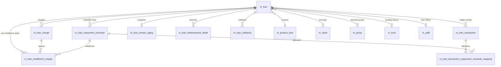

The loan data model is the heart of Apache Fineract's portfolio. Every loan application — whether disbursed, awaiting approval, written off, or closed — lives in a tightly connected cluster of `m_loan_*` tables that store the aggregate root, its repayment schedule, the running transaction ledger, applied charges, and a denormalised arrears snapshot. The Liquibase changelog `fineract-provider/src/main/resources/db/changelog/tenant/parts/0001_initial_schema.xml` and the incremental updates under `fineract-loan/src/main/resources/db/changelog/tenant/module/loan/parts/` together define the schema described on this page.

The model has stayed deliberately denormalised: rather than recomputing balances on every query, write operations on the `Loan` JPA entity (`fineract-loan/src/main/java/org/apache/fineract/portfolio/loanaccount/domain/Loan.java`) mutate `*_derived` columns on `m_loan` and rewrite `m_loan_arrears_aging`. Reads — including the loan summary endpoints and Pentaho reports — pull straight from those columns.

## Entity-relationship overview

## m_loan — the aggregate root

`m_loan` is the row-per-loan core table. It carries every parameter captured at submission, every status timestamp, and every derived running total used by the summary endpoints. The table was introduced in changeset `1` of `0001_initial_schema.xml` and is referenced from dozens of FK relationships across the schema.

### Identity and lifecycle columns

| Column | Type | Notes |
| --- | --- | --- |
| `id` | `BIGINT PK auto` | Surrogate key. |
| `account_no` | `VARCHAR(20) NOT NULL UNIQUE` | Human-readable account number assigned by `AccountNumberGenerator`. |
| `external_id` | `VARCHAR(100) UNIQUE` | Optional client-supplied identifier. |
| `loan_status_id` | `SMALLINT NOT NULL` | `LoanStatus` enum — 100 submitted, 200 approved, 300 active, 600 closed, 601 written off, 700 overpaid. |
| `loan_type_enum` | `SMALLINT NOT NULL` | `AccountType` — 1 individual, 2 group, 3 JLG, 4 GLIM. |
| `version` | `INT` | JPA `@Version` for optimistic locking. |

### Ownership FKs

| Column | Type | References |
| --- | --- | --- |
| `client_id` | `BIGINT` | `m_client.id` (nullable when group loan). |
| `group_id` | `BIGINT` | `m_group.id` (nullable when individual). |
| `glim_id` | `BIGINT` | `glim_accounts.id` for GLIM products. |
| `product_id` | `BIGINT NOT NULL` | `m_product_loan.id`. |
| `fund_id` | `BIGINT` | `m_fund.id`. |
| `loan_officer_id` | `BIGINT` | `m_staff.id`. |
| `loanpurpose_cv_id` | `INT` | `m_code_value.id`. |

### Money and term configuration

| Column | Type | Notes |
| --- | --- | --- |
| `currency_code` | `VARCHAR(3) NOT NULL` | ISO 4217 code; `currency_digits` and `currency_multiplesof` carry rounding rules. |
| `principal_amount_proposed` | `DECIMAL(19,6) NOT NULL` | Originally requested amount. |
| `principal_amount` | `DECIMAL(19,6) NOT NULL` | Amount after submit-time adjustments. |
| `approved_principal` | `DECIMAL(19,6) NOT NULL` | Set on approval. |
| `net_disbursal_amount` | `DECIMAL(19,6) NOT NULL` | Principal minus charges due at disbursement. |
| `arrearstolerance_amount` | `DECIMAL(19,6)` | Threshold below which a loan is not flagged in arrears. |
| `nominal_interest_rate_per_period` | `DECIMAL(19,6)` | Rate per `interest_period_frequency_enum`. |
| `annual_nominal_interest_rate` | `DECIMAL(19,6)` | Normalised annual rate. |
| `interest_method_enum` | `SMALLINT NOT NULL` | 0 declining balance, 1 flat. |
| `is_floating_interest_rate` | `BOOLEAN` | Pairs with `interest_rate_differential`. |
| `term_frequency` / `term_period_frequency_enum` | `SMALLINT` | Loan length and unit. |
| `repay_every` / `repayment_period_frequency_enum` | `SMALLINT NOT NULL` | Installment cadence. |
| `number_of_repayments` | `SMALLINT NOT NULL` | Installment count. |
| `amortization_method_enum` | `SMALLINT NOT NULL` | 0 equal principal, 1 equal installments. |

### Workflow date / user pairs

Each lifecycle step records both a date and the user who triggered it:
`submittedon_date` / `submittedon_userid`, `approvedon_date` / `approvedon_userid`, `disbursedon_date` / `disbursedon_userid`, `closedon_date` / `closedon_userid`, plus derived `expected_disbursedon_date`, `expected_firstrepaymenton_date`, `expected_maturedon_date`, `maturedon_date`, `writtenoffon_date`, `rescheduledon_date`.

### Derived running totals

All `*_derived` columns are `DECIMAL(19,6) NOT NULL DEFAULT 0` and are updated by `LoanSummaryWrapper` on every transaction. They include `principal_disbursed_derived`, `principal_repaid_derived`, `principal_writtenoff_derived`, `principal_outstanding_derived`, the matching `interest_*_derived`, `fee_charges_*_derived`, `penalty_charges_*_derived`, plus the aggregate fields `total_expected_repayment_derived`, `total_repayment_derived`, `total_expected_costofloan_derived`, `total_costofloan_derived`, `total_waived_derived`, `total_writtenoff_derived`, `total_outstanding_derived`, `total_overpaid_derived`.

### Foreign keys on m_loan

- `fk_m_loan_client` → `m_client(id)`
- `fk_m_loan_group` → `m_group(id)`
- `fk_m_loan_product` → `m_product_loan(id)`
- `fk_m_loan_fund` → `m_fund(id)`
- `fk_m_loan_officer` → `m_staff(id)`
- `fk_m_loan_purpose` → `m_code_value(id)`
- `fk_m_loan_glim` → `glim_accounts(id)`
- `fk_m_loan_transaction_processing_strategy` → `m_loan_transaction_processing_strategy(id)`

### Key indexes

| Index | Columns | Purpose |
| --- | --- | --- |
| `loan_account_no_UNIQUE` | `account_no` | Lookup by account number. |
| `loan_externalid_UNIQUE` | `external_id` | Lookup by external id. |
| `FK7C885877240145` | `client_id` | Borrower portfolio joins. |
| `FKB6F935D87179A0CB` | `group_id` | Group portfolio joins. |
| `FK_m_loan_m_product_loan` | `product_id` | Product reporting. |
| `loan_officer_id` | `loan_officer_id` | Officer pipeline queries. |
| `loan_status_id` | `loan_status_id` | Active-loan scans. |

## m_loan_repayment_schedule — installment plan

Generated when the loan is approved and rebuilt during reschedules. Each row is one installment.

| Column | Type | Notes |
| --- | --- | --- |
| `id` | `BIGINT PK auto` | Surrogate. |
| `loan_id` | `BIGINT NOT NULL` | FK → `m_loan.id`. |
| `fromdate` | `DATE` | Period start (null on first row in some legacy data). |
| `duedate` | `DATE NOT NULL` | Installment due date. |
| `installment` | `SMALLINT NOT NULL` | Sequence — 1, 2, 3 … |
| `principal_amount` | `DECIMAL(19,6)` | Scheduled principal. |
| `principal_completed_derived` | `DECIMAL(19,6)` | Principal paid so far. |
| `principal_writtenoff_derived` | `DECIMAL(19,6)` | Principal written off on this installment. |
| `interest_amount` | `DECIMAL(19,6)` | Scheduled interest. |
| `interest_completed_derived` | `DECIMAL(19,6)` | Interest paid. |
| `interest_writtenoff_derived` | `DECIMAL(19,6)` | Interest written off. |
| `interest_waived_derived` | `DECIMAL(19,6)` | Interest waived. |
| `accrual_interest_derived` | `DECIMAL(19,6)` | Accrued (vs collected) interest. |
| `fee_charges_amount` | `DECIMAL(19,6)` | Scheduled fees. |
| `fee_charges_completed_derived` | `DECIMAL(19,6)` | Fee charges paid. |
| `penalty_charges_amount` | `DECIMAL(19,6)` | Scheduled penalty. |
| `total_paid_in_advance_derived` | `DECIMAL(19,6)` | Amount allocated before due date. |
| `total_paid_late_derived` | `DECIMAL(19,6)` | Amount allocated after due date. |
| `completed_derived` | `BOOLEAN NOT NULL` | True when installment fully repaid. |
| `obligations_met_on_date` | `DATE` | Date the installment was first cleared. |
| `is_additional` | `BOOLEAN` | Added by reschedule extension. |
| `recalculated_interest_component` | `DECIMAL(19,6)` | Recomputed by recalculation jobs. |
| `is_re_aged` | `BOOLEAN` | Reset by re-age action (added in `1020_add_re_aged_flag_to_loan_installment.xml`). |

Foreign key: `FK488B92AA40BE0710` → `m_loan(id)` on delete cascade. Composite uniqueness on `(loan_id, installment)` is enforced.

Indexes: `loan_id` and `(loan_id, duedate)` support due-date queries used by the arrears scanner.

## m_loan_transaction — the ledger

Every disbursement, repayment, waiver, write-off, refund, charge-off, and reversal is one row.

| Column | Type | Notes |
| --- | --- | --- |
| `id` | `BIGINT PK auto` | Surrogate. |
| `loan_id` | `BIGINT NOT NULL` | FK → `m_loan.id`. |
| `office_id` | `BIGINT NOT NULL` | FK → `m_office.id` — branch where transaction was booked. |
| `payment_detail_id` | `BIGINT` | FK → `m_payment_detail.id`. |
| `transaction_type_enum` | `SMALLINT NOT NULL` | See `LoanTransactionType`. |
| `transaction_date` | `DATE NOT NULL` | Effective business date. |
| `submitted_on_date` | `DATE NOT NULL` | System date when entered. |
| `amount` | `DECIMAL(19,6) NOT NULL` | Total transaction amount. |
| `principal_portion_derived` | `DECIMAL(19,6)` | Split applied to principal. |
| `interest_portion_derived` | `DECIMAL(19,6)` | Split applied to interest. |
| `fee_charges_portion_derived` | `DECIMAL(19,6)` | Split applied to fee charges. |
| `penalty_charges_portion_derived` | `DECIMAL(19,6)` | Split applied to penalty charges. |
| `overpayment_portion_derived` | `DECIMAL(19,6)` | Excess overpayment held. |
| `unrecognized_income_portion` | `DECIMAL(19,6)` | Used by NPL accounting. |
| `outstanding_loan_balance_derived` | `DECIMAL(19,6)` | Post-transaction balance. |
| `manually_adjusted_or_reversed` | `BOOLEAN NOT NULL` | True if reversal/adjustment. |
| `is_reversed` | `BOOLEAN NOT NULL` | Excluded from totals when true. |
| `external_id` | `VARCHAR(100)` | Client correlation id. |
| `reversed_on_date` | `DATE` | Set when reversal posted. |
| `reversal_external_id` | `VARCHAR(100)` | Reversal correlation id (changelog `0019_refactor_loan_transaction.xml`). |

### Transaction type values

`1` disbursement, `2` repayment, `3` contra, `4` waive interest, `5` repayment at disbursement, `6` write-off, `7` marked for rescheduling, `8` recovery repayment, `9` waive charges, `10` accrual, `12` initiate transfer, `13` approve transfer, `14` withdraw transfer, `15` reject transfer, `16` refund, `17` charge payment, `18` refund for active loan, `19` income posting, `20` credit balance refund, `21` merchant issued refund, `22` payout refund, `23` goodwill credit, `24` charge refund, `25` chargeback, `26` charge adjustment, `27` charge-off, `28` down payment, `29` reage, `30` reamortize, `31` interest payment waiver, `32` accrual activity, `33` capitalized income, `34` accrual adjustment, `35` interest refund.

Foreign keys: `FKCFCEA42640BE0710` → `m_loan(id)`, `FK_loan_transaction_payment_detail` → `m_payment_detail(id)`, `FK_loan_transaction_office` → `m_office(id)`.

Indexes: `loan_id`, `(loan_id, transaction_date)`, `external_id`, and `reversal_external_id` for idempotent reversal lookup.

## m_loan_transaction_repayment_schedule_mapping — allocation

Joins a transaction to the installment(s) it paid off and records the per-installment split. Introduced to support the new transaction processing strategies that allow partial allocations.

| Column | Type |
| --- | --- |
| `id` | `BIGINT PK auto` |
| `loan_transaction_id` | `BIGINT NOT NULL` → `m_loan_transaction.id` |
| `loan_repayment_schedule_id` | `BIGINT NOT NULL` → `m_loan_repayment_schedule.id` |
| `amount` / `principal_portion_derived` / `interest_portion_derived` / `fee_charges_portion_derived` / `penalty_charges_portion_derived` | `DECIMAL(19,6)` |

## m_loan_charge — charges applied to a loan

| Column | Type | Notes |
| --- | --- | --- |
| `id` | `BIGINT PK auto` | Surrogate. |
| `loan_id` | `BIGINT NOT NULL` → `m_loan.id` | Owning loan. |
| `charge_id` | `BIGINT NOT NULL` → `m_charge.id` | Reference definition. |
| `is_penalty` | `BOOLEAN NOT NULL` | Copy of `m_charge.is_penalty`. |
| `charge_time_enum` | `SMALLINT NOT NULL` | When the charge is due (disbursement, specified due date, installment fee, overdue, etc.). |
| `charge_calculation_enum` | `SMALLINT NOT NULL` | Flat / % principal / % interest / % outstanding. |
| `calculation_percentage` | `DECIMAL(19,6)` | Percentage when applicable. |
| `calculation_on_amount` | `DECIMAL(19,6)` | Base amount for percentage. |
| `charge_amount_or_percentage` | `DECIMAL(19,6) NOT NULL` | Final amount or rate. |
| `amount` | `DECIMAL(19,6) NOT NULL` | Effective charge amount. |
| `amount_paid_derived` / `amount_waived_derived` / `amount_writtenoff_derived` / `amount_outstanding_derived` | `DECIMAL(19,6)` | Running splits. |
| `due_for_collection_as_of_date` | `DATE` | Earliest collectable date. |
| `is_paid_derived` | `BOOLEAN NOT NULL` | Closed when fully cleared. |
| `waived` | `BOOLEAN NOT NULL` | Set on waive transaction. |
| `min_cap` / `max_cap` | `DECIMAL(19,6)` | Cap floors. |
| `external_id` | `VARCHAR(100)` | Added in `0008_loan_charge_add_external_id.xml`. |
| `submitted_on_date` | `DATE` | Audit field added in `1001_add_audit_fields_to_loan_charge.xml`. |

Foreign keys: `FK__m_loan_charge_m_loan` → `m_loan(id)`, `FK__m_loan_charge_m_charge` → `m_charge(id)`.

`m_loan_installment_charge` spreads an installment-fee row across schedule installments with FKs to both `m_loan_charge.id` and `m_loan_repayment_schedule.id` and the split amount columns mirrored from `m_loan_charge`.

## m_loan_arrears_aging — denormalised snapshot

Maintained by `UpdateLoanArrearsAgeingTasklet`. One row per loan currently in arrears.

| Column | Type | Notes |
| --- | --- | --- |
| `loan_id` | `BIGINT PK` → `m_loan.id` | One snapshot per loan. |
| `principal_overdue_derived` | `DECIMAL(19,6)` | Sum of overdue principal portions. |
| `interest_overdue_derived` | `DECIMAL(19,6)` | Sum of overdue interest. |
| `fee_charges_overdue_derived` | `DECIMAL(19,6)` | Overdue fees. |
| `penalty_charges_overdue_derived` | `DECIMAL(19,6)` | Overdue penalties. |
| `total_overdue_derived` | `DECIMAL(19,6)` | Sum across the four components. |
| `overdue_since_date_derived` | `DATE` | Earliest unpaid `duedate`. |

Foreign key: `FK_m_loan_arrears_aging_loan` → `m_loan(id)` cascade delete.

## m_loan_disbursement_detail — tranches

Stores expected and actual disbursement tranches for multi-disbursement loans.

| Column | Type | Notes |
| --- | --- | --- |
| `id` | `BIGINT PK auto` | Surrogate. |
| `loan_id` | `BIGINT NOT NULL` → `m_loan.id` | Owning loan. |
| `expected_disburse_date` | `DATE NOT NULL` | Planned tranche date. |
| `disbursedon_date` | `DATE` | Actual; null until disbursed. |
| `principal` | `DECIMAL(19,6) NOT NULL` | Tranche principal. |
| `net_disbursal_amount` | `DECIMAL(19,6)` | Tranche net. |
| `is_reversed` | `BOOLEAN NOT NULL` | Soft delete. |

## Supporting tables in the cluster

- `m_loan_paid_in_advance` — derived totals of advance payments per loan.
- `m_loan_overdue_installment_charge` — pairs an overdue installment with the penalty charge it triggered (used by the overdue-charge job).
- `m_loan_recalculation_details` — per-loan flags for interest recalculation.
- `m_loan_term_variations` — overrides such as adjusted EMIs.
- `m_loan_rescheduling_request` and `m_loan_reschedule_request_term_variations_mapping` — capture reschedule requests and the term variations they produced.
- `m_loan_repayment_schedule_history` — versioned snapshots taken before each reschedule.
- `m_loan_installment_charge` — explained above.
- `m_loan_transaction_relation` — chargeback / refund chains added in newer changelogs.
- `m_loan_installment_delinquency_tag` — per-installment delinquency state added in `1008_add_loan_installment_delinquency_tag.xml`.
- `m_loan_charge_paid_by` — links a transaction to the charge(s) it paid.

Together these tables provide a complete event-sourced view (transactions) on top of a denormalised current-state view (`m_loan` derived columns + `m_loan_arrears_aging`), which is what makes Apache Fineract's reporting layer fast while keeping the audit trail immutable.
