A loan product in Apache Fineract is a reusable template: it captures default amounts, interest, terms, accounting rules, eligible charges, and the processing strategy that downstream `m_loan` rows inherit at submission time. The schema is rooted at `m_product_loan` and spreads across a dozen ancillary tables that hold product-scoped charges, recalculation flags, payment allocation rules, processing strategies, and the product-mix matrix that controls cross-sell.

Liquibase ownership has shifted over time: the original tables live in `fineract-provider/src/main/resources/db/changelog/tenant/parts/0001_initial_schema.xml`, while later product attributes (auto down payment, schedule processing types, charge-off behaviour, fixed length, interest refunds) have been bolted on through the `fineract-loan` module changelog.

## Entity-relationship overview

```mermaid
erDiagram
    m_product_loan ||--o{ m_product_loan_charge : "eligible charges"
    m_product_loan ||--o| m_product_loan_recalculation_details : "recalc config"
    m_product_loan ||--o| m_product_loan_guarantee_details : "guarantee config"
    m_product_loan ||--o{ m_product_loan_variable_installment_config : "variable installments"
    m_product_loan ||--o{ m_product_loan_variations_borrower_cycle : "cycle-based variations"
    m_product_loan ||--o{ m_product_loan_floating_rates : "floating rate link"
    m_product_loan ||--o{ m_product_loan_configurable_attributes : "overridable attrs"
    m_product_loan }o--|| m_loan_transaction_processing_strategy : "strategy"
    m_product_loan }o--o| m_fund : "funding source"
    m_product_loan ||--o{ m_product_mix : "lhs of mix"
    m_product_mix }o--|| m_product_loan : "rhs of mix"
    m_product_loan ||--o{ m_product_loan_payment_allocation_rule : "allocation"
    m_product_loan_charge }o--|| m_charge : "charge"
    m_product_loan ||--o{ m_loan : "instantiated as"
```

## m_product_loan — the product definition

| Column | Type | Notes |
| --- | --- | --- |
| `id` | `BIGINT PK auto` | Surrogate. |
| `short_name` | `VARCHAR(4) NOT NULL UNIQUE` | Short code used on reports. |
| `name` | `VARCHAR(100) NOT NULL UNIQUE` | Display name. |
| `description` | `VARCHAR(500)` | Long description. |
| `fund_id` | `BIGINT` → `m_fund.id` | Optional funding source. |
| `loan_transaction_strategy_id` | `BIGINT NOT NULL` → `m_loan_transaction_processing_strategy.id` | Default processing strategy. |
| `currency_code` | `VARCHAR(3) NOT NULL` | ISO currency. |
| `currency_digits` | `SMALLINT NOT NULL` | Decimal places. |
| `currency_multiplesof` | `SMALLINT` | Rounding multiple. |
| `principal_amount` | `DECIMAL(19,6) NOT NULL` | Default principal. |
| `min_principal_amount` / `max_principal_amount` | `DECIMAL(19,6)` | Validation bounds. |
| `nominal_interest_rate_per_period` | `DECIMAL(19,6) NOT NULL` | Default rate. |
| `min_nominal_interest_rate_per_period` / `max_nominal_interest_rate_per_period` | `DECIMAL(19,6)` | Bounds. |
| `interest_period_frequency_enum` | `SMALLINT NOT NULL` | 2 month, 3 year, etc. |
| `annual_nominal_interest_rate` | `DECIMAL(19,6) NOT NULL` | Derived annual rate. |
| `interest_method_enum` | `SMALLINT NOT NULL` | 0 declining, 1 flat. |
| `interest_calculated_in_period_enum` | `SMALLINT NOT NULL` | Daily vs same-as-repayment. |
| `repay_every` / `repayment_period_frequency_enum` | `SMALLINT NOT NULL` | Default cadence. |
| `number_of_repayments` | `SMALLINT NOT NULL` | Default installment count. |
| `min_number_of_repayments` / `max_number_of_repayments` | `SMALLINT` | Bounds. |
| `amortization_method_enum` | `SMALLINT NOT NULL` | 0 equal principal, 1 equal installments. |
| `arrearstolerance_amount` | `DECIMAL(19,6)` | Tolerance before arrears. |
| `accounting_type` | `SMALLINT NOT NULL` | 1 none, 2 cash, 3 accrual periodic, 4 accrual upfront. |
| `loan_product_counter` | `INT` | Auto-incremented account number seed. |
| `overdue_days_for_npa` | `INT` | Days past due to mark NPA. |
| `min_days_between_disbursal_and_first_repayment` | `INT` | Constraint. |
| `account_moves_out_of_npa_only_on_arrears_completion` | `BOOLEAN` | NPA exit rule. |
| `principal_threshold_for_last_installment` | `DECIMAL(5,2)` | Tail balance rule. |
| `can_define_fixed_emi_amount` | `BOOLEAN` | Allows fixed EMI override. |
| `instalment_amount_in_multiples_of` | `SMALLINT` | Rounding. |
| `external_id` | `VARCHAR(100)` | Optional external code. |
| `start_date` / `close_date` | `DATE` | Product window of availability. |
| `allow_partial_period_interest_calcualtion` | `BOOLEAN NOT NULL` | Pro-rate first period. |
| `is_linked_to_floating_interest_rates` | `BOOLEAN NOT NULL` | Pairs with `m_product_loan_floating_rates`. |
| `is_interest_recalculation_enabled` | `BOOLEAN NOT NULL` | Pairs with recalculation details. |
| `days_in_year_enum` / `days_in_month_enum` | `SMALLINT NOT NULL` | 1 actual, 360, 365. |
| `allow_multiple_disbursals` | `BOOLEAN NOT NULL` | Tranche support flag. |
| `max_tranche_count` | `INT` | Tranche cap. |
| `outstanding_loan_balance` | `DECIMAL(19,6)` | Tranche limit. |
| `over_applied_calculation_type` | `VARCHAR(10)` | `flat` or `percentage` — `0007_product_loan_higher_than_applied_loan_amount_management.xml`. |
| `over_applied_number` | `INT` | Companion to above. |
| `disallow_expected_disbursements` | `BOOLEAN` | Added in `0006_product_loan_disallow_expected_disbursements.xml`. |
| `enable_auto_repayment_for_down_payment` | `BOOLEAN` | `1003_add_loan_product_auto_repayment_down_payment_configuration.xml`. |
| `enable_down_payment` | `BOOLEAN` | Down payment toggle. |
| `disbursed_amount_percentage_for_down_payment` | `DECIMAL(19,6)` | Down payment %. |
| `repayment_start_date_type` | `INT` | From `1005_add_loan_product_repayment_start_date_configuration.xml` — 1 disbursement, 2 submitted-on. |
| `loan_schedule_type` | `VARCHAR(40)` | `CUMULATIVE` / `PROGRESSIVE` — `1010_introduce_loan_schedule_type_configuration.xml`. |
| `loan_schedule_processing_type` | `VARCHAR(40)` | `HORIZONTAL` / `VERTICAL` — `1012_introduce_loan_schedule_processing_type_configuration.xml`. |
| `charge_off_behaviour` | `VARCHAR(40)` | Default / accelerate-maturity / regular — `1023_add_charge_off_behaviour.xml`. |
| `fixed_length` | `INT` | Fixed-length loan — `1019_add_fixed_length.xml`. |
| `enable_installment_level_delinquency` | `BOOLEAN` | Toggle. |
| `enable_income_capitalization` | `BOOLEAN` | `1027_add_capitalized_income_transaction_type.xml`. |
| `supports_interest_refund` | `BOOLEAN` | `1022_add_interest_refund_support.xml`. |
| `pre_closure_strategy_id` | `BIGINT` | `1025_store_pre_closure_strategy_to_loan_level.xml`. |
| `installment_amount_in_multiples_of` | `SMALLINT` | `1029_add_installment_amount_in_multiples_of_to_loan.xml`. |

### Foreign keys

- `FK_ltp_PPI` → `m_loan_transaction_processing_strategy(id)`
- `FK_m_product_loan_m_fund` → `m_fund(id)`
- `FK_m_product_loan_delinquency_bucket` → `m_delinquency_bucket(id)`

### Indexes

- `unq_short_name` on `short_name`
- `unq_name` on `name`
- `external_id` on `external_id`
- `start_date` and `close_date` for date-window queries.

## m_product_loan_charge

A simple link table — many-to-many between products and the charges eligible to be applied to loans of that product.

| Column | Type | Notes |
| --- | --- | --- |
| `product_loan_id` | `BIGINT NOT NULL` → `m_product_loan.id` | Part of composite PK. |
| `charge_id` | `BIGINT NOT NULL` → `m_charge.id` | Part of composite PK. |

Foreign keys: `FK_m_product_loan_charge_m_product_loan`, `FK_m_product_loan_charge_m_charge`. Primary key on the pair prevents duplicates.

## m_product_loan_recalculation_details

Per-product configuration for interest recalculation. Present only when `m_product_loan.is_interest_recalculation_enabled = true`.

| Column | Type | Notes |
| --- | --- | --- |
| `id` | `BIGINT PK auto` | Surrogate. |
| `product_id` | `BIGINT NOT NULL UNIQUE` → `m_product_loan.id` | Owning product. |
| `pre_close_interest_calculation_strategy` | `SMALLINT NOT NULL` | 1 till pre-close date, 2 till rest frequency date. |
| `compounding_method_enum` | `SMALLINT NOT NULL` | 0 none, 1 interest, 2 fee, 3 fee+interest. |
| `loan_compounding_frequency_enum` | `SMALLINT` | 1 same as repayment, 2 daily, 3 weekly, 4 monthly. |
| `compounding_frequency_interval` | `INT` | Period count. |
| `compounding_frequency_nth_day_enum` | `SMALLINT` | Nth day rule. |
| `compounding_frequency_weekday_enum` | `SMALLINT` | Day of week. |
| `compounding_frequency_on_day` | `SMALLINT` | Day of month. |
| `rest_frequency_type_enum` | `SMALLINT NOT NULL` | 1 same as repayment, 2 daily, 3 weekly, 4 monthly. |
| `rest_frequency_interval` | `INT NOT NULL` | Period count. |
| `rest_frequency_nth_day_enum` | `SMALLINT` | Nth day rule. |
| `rest_frequency_weekday_enum` | `SMALLINT` | Day of week. |
| `rest_frequency_on_day` | `SMALLINT` | Day of month. |
| `arrears_based_on_original_schedule` | `BOOLEAN` | Toggle. |
| `is_compounding_to_be_posted_as_transaction` | `BOOLEAN` | Toggle. |
| `allow_compounding_on_eod` | `BOOLEAN` | End-of-day toggle. |

Foreign key: `FK_m_product_loan_recalculation_details_m_product_loan` → `m_product_loan(id)` on delete cascade.

## m_loan_transaction_processing_strategy

Catalogue of how repayments are split across components. Strategies are referenced by name from `Loan` and by id from `m_product_loan`.

| Column | Type | Notes |
| --- | --- | --- |
| `id` | `BIGINT PK auto` | Surrogate. |
| `code` | `VARCHAR(100) NOT NULL UNIQUE` | Programmatic identifier (`mifos-standard-strategy`, `heavensfamily-strategy`, `creocore-strategy`, `rbi-india-strategy`, `principal-interest-penalties-fees-order-strategy`, `interest-principal-penalties-fees-order-strategy`, `early-repayment-strategy`, `advanced-payment-allocation-strategy`, `due-penalty-fee-interest-principal-in-advance-principal-penalty-fee-interest-strategy`). |
| `name` | `VARCHAR(255) NOT NULL` | UI label. |
| `sort_order` | `INT` | Display ordering. |

Indexed on `code` (unique). The `advanced-payment-allocation-strategy` row drives the more complex per-installment allocation rules below.

## m_product_loan_payment_allocation_rule

Per-product allocation rule introduced in `1002_add_payment_allocation_rule.xml` and used only by `advanced-payment-allocation-strategy`.

| Column | Type | Notes |
| --- | --- | --- |
| `id` | `BIGINT PK auto` | Surrogate. |
| `loan_product_id` | `BIGINT NOT NULL` → `m_product_loan.id` | Owning product. |
| `transaction_type` | `VARCHAR(50) NOT NULL` | `DEFAULT`, `DOWN_PAYMENT`, `REPAYMENT`, `MERCHANT_ISSUED_REFUND`, etc. |
| `future_installment_allocation_rule` | `VARCHAR(40) NOT NULL` | `NEXT_INSTALLMENT`, `LAST_INSTALLMENT`, `REAMORTIZATION`. |
| `allocation_types` | `VARCHAR(500) NOT NULL` | JSON-ish ordered list of `PAST_DUE_PENALTY`, `PAST_DUE_FEE`, `PAST_DUE_PRINCIPAL`, `PAST_DUE_INTEREST`, `DUE_PENALTY`, `DUE_FEE`, `DUE_PRINCIPAL`, `DUE_INTEREST`, `IN_ADVANCE_PRINCIPAL`, `IN_ADVANCE_INTEREST`, `IN_ADVANCE_PENALTY`, `IN_ADVANCE_FEE`. |

Foreign key: `FK_payment_allocation_rule_loan_product_id` → `m_product_loan(id)` cascade delete. Index on `(loan_product_id, transaction_type)`.

A sibling `m_product_loan_credit_allocation_rule` table — added in `1016_add_credit_allocation_rule.xml` — captures the symmetric credit-side allocations for chargebacks.

## m_product_loan_floating_rates

Links a product to its floating-rate definition.

| Column | Type | Notes |
| --- | --- | --- |
| `id` | `BIGINT PK auto` | Surrogate. |
| `loan_product_id` | `BIGINT NOT NULL UNIQUE` → `m_product_loan.id` | One-to-one. |
| `floating_rates_id` | `BIGINT NOT NULL` → `m_floating_rates.id` | Reference. |
| `interest_rate_differential` | `DECIMAL(19,6) NOT NULL` | Spread over base. |
| `min_differential_lending_rate` / `default_differential_lending_rate` / `max_differential_lending_rate` | `DECIMAL(19,6)` | Bounds. |
| `is_floating_interest_rate_calculation_allowed` | `BOOLEAN NOT NULL` | Toggle. |

## m_product_loan_guarantee_details

Configuration captured when the product mandates guarantor deposits.

| Column | Type | Notes |
| --- | --- | --- |
| `id` | `BIGINT PK auto` | Surrogate. |
| `loan_product_id` | `BIGINT NOT NULL UNIQUE` → `m_product_loan.id` | Product link. |
| `mandatory_guarantee` | `DECIMAL(19,5) NOT NULL` | % required. |
| `minimum_guarantee_from_own_funds` / `minimum_guarantee_from_guarantor_funds` | `DECIMAL(19,5)` | Floor amounts. |

## m_product_loan_variable_installment_config

Per-product min/max gap and amount rules when the product allows variable installments.

| Column | Type |
| --- | --- |
| `id` | `BIGINT PK auto` |
| `loan_product_id` | `BIGINT NOT NULL UNIQUE` → `m_product_loan.id` |
| `minimum_gap` / `maximum_gap` | `INT` |

## m_product_loan_variations_borrower_cycle

Cycle-based variations — different principal / number-of-repayments / interest bands by borrower's loan cycle number.

| Column | Type | Notes |
| --- | --- | --- |
| `id` | `BIGINT PK auto` | Surrogate. |
| `loan_product_id` | `BIGINT NOT NULL` → `m_product_loan.id` | Product. |
| `borrower_cycle_number` | `INT NOT NULL` | E.g. 1, 2, 3. |
| `value_condition` | `INT NOT NULL` | `EQUAL`/`GREATER_THAN` enum. |
| `param_type` | `INT NOT NULL` | Which param this row varies (principal, repayments, interest). |
| `default_value` | `DECIMAL(19,6) NOT NULL` | Default for the cycle. |
| `min_value` / `max_value` | `DECIMAL(19,6)` | Bounds. |

## m_product_loan_configurable_attributes

A row-per-product matrix of booleans flagging which schedule attributes the user is allowed to override at submission.

Columns: `amortization_method_enum`, `interest_method_enum`, `loan_transaction_strategy_id`, `interest_calculated_in_period_enum`, `arrearstolerance_amount`, `repay_every`, `moratorium`, `grace_on_arrears_ageing` — each `BOOLEAN NOT NULL`. The PK is `(loan_product_id)` referencing `m_product_loan.id`.

## m_product_mix

The product cross-sell matrix — `(product_id, restricted_product_id)` rows are pairs that may not coexist on the same client.

| Column | Type | Notes |
| --- | --- | --- |
| `id` | `BIGINT PK auto` | Surrogate. |
| `product_id` | `BIGINT NOT NULL` → `m_product_loan.id` | Primary product. |
| `restricted_product_id` | `BIGINT NOT NULL` → `m_product_loan.id` | Restricted product. |

Indexes: `(product_id, restricted_product_id)` is unique to prevent duplicate restriction rows.

## Indexes summary

| Table | Index | Purpose |
| --- | --- | --- |
| `m_product_loan` | `unq_short_name`, `unq_name`, `external_id` | Lookup. |
| `m_product_loan` | `start_date`, `close_date` | Availability filter. |
| `m_product_loan_charge` | composite PK | De-dup. |
| `m_product_loan_recalculation_details` | unique on `product_id` | 1:1 link. |
| `m_loan_transaction_processing_strategy` | unique on `code` | Strategy registry. |
| `m_product_loan_payment_allocation_rule` | `(loan_product_id, transaction_type)` | Lookup at repayment. |
| `m_product_mix` | unique on pair | De-dup restriction rows. |

## Snapshot vs reference behaviour

A subtle but important property of this cluster: most product fields are **snapshotted** onto `m_loan` at submission and the in-flight loan no longer cares if the product is edited. A small number are kept as **live references** because they need to evolve over the life of the loan.

| Behaviour | Examples | Why |
| --- | --- | --- |
| Snapshot to `m_loan` | `nominal_interest_rate_per_period`, `repay_every`, `number_of_repayments`, `amortization_method_enum`, `interest_method_enum`, `currency_code` | The borrower agreed to specific terms; later product changes must not retroactively rewrite their contract. |
| Live reference (`m_loan.product_id`) | `accounting_type`, `delinquency_bucket_id`, charge-off behaviour | These drive runtime behaviour (journal entries, delinquency classification) that should track operational policy changes. |
| Live reference plus separate snapshot | Charges via `m_product_loan_charge` + `m_loan_charge` | Eligible charges live on the product; the actual charges applied to a loan are copied. |

This pattern is why the schema duplicates so many fields between `m_product_loan` and `m_loan` — they are the same logical quantity but stored at two different times of validity.

## Worked example: creating a loan from a product

1. Operator picks loan product id 42.
2. The submission API validates that the requested principal lies between `m_product_loan.min_principal_amount` and `m_product_loan.max_principal_amount`, similarly for rate and term.
3. If `m_product_loan_configurable_attributes` has a row for product 42 with `interest_method_enum = true`, the operator is allowed to override the interest method; otherwise it is copied from the product.
4. A `m_loan` row is inserted with most fields copied from `m_product_loan`.
5. For every eligible row in `m_product_loan_charge` whose `charge_time_enum = mandatory disbursement`, a `m_loan_charge` row is inserted snapshotting the charge.
6. If the product is floating-rate (`is_linked_to_floating_interest_rates`), the matching `m_product_loan_floating_rates` row defines the spread; the floating-rate schedule generator pulls live values from `m_floating_rates_periods` at every recalculation.

## Indexes summary

| Table | Index | Purpose |
| --- | --- | --- |
| `m_product_loan` | `unq_short_name`, `unq_name`, `external_id` | Lookup. |
| `m_product_loan` | `start_date`, `close_date` | Availability filter. |
| `m_product_loan_charge` | composite PK | De-dup. |
| `m_product_loan_recalculation_details` | unique on `product_id` | 1:1 link. |
| `m_loan_transaction_processing_strategy` | unique on `code` | Strategy registry. |
| `m_product_loan_payment_allocation_rule` | `(loan_product_id, transaction_type)` | Lookup at repayment. |
| `m_product_loan_floating_rates` | unique on `loan_product_id` | 1:1 link. |
| `m_product_mix` | unique on pair | De-dup restriction rows. |

These tables form the read-only "shape" of a product that the loan write platform copies into every new `m_loan` row at submission. Most fields on `m_loan` are direct snapshots taken from the matching field on `m_product_loan` — which is why Apache Fineract can let product definitions drift over time without invalidating in-flight loans.
