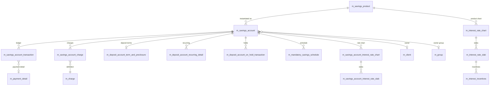

The savings data model in Apache Fineract handles savings accounts, fixed deposits, recurring deposits, and share-linked deposit overflows. Like the loan cluster, it follows an event-sourced ledger pattern: every credit, debit, interest posting, hold, fee, and reversal lives in `m_savings_account_transaction`, while the owning `m_savings_account` row keeps denormalised balances and lifecycle state. Deposit-specific behaviour (terms, premature closure, interest rate charts) layers on through `m_deposit_account_*` tables that share the same primary key with `m_savings_account`.

The base tables are defined in `fineract-provider/src/main/resources/db/changelog/tenant/parts/0001_initial_schema.xml`, with later additions migrated through `fineract-savings/src/main/resources/db/changelog/tenant/module/savings/parts/`.

## Entity-relationship overview

## m_savings_account — the account aggregate

| Column | Type | Notes |
| --- | --- | --- |
| `id` | `BIGINT PK auto` | Surrogate. |
| `account_no` | `VARCHAR(20) NOT NULL UNIQUE` | Generated number. |
| `external_id` | `VARCHAR(100) UNIQUE` | Optional external id. |
| `client_id` | `BIGINT` → `m_client.id` | Owner client. |
| `group_id` | `BIGINT` → `m_group.id` | Owner group. |
| `product_id` | `BIGINT NOT NULL` → `m_savings_product.id` | Product template. |
| `field_officer_id` | `BIGINT` → `m_staff.id` | Officer. |
| `status_enum` | `SMALLINT NOT NULL` | 100 submitted, 200 approved, 300 active, 400 transfer-in-progress, 500 transfer-on-hold, 600 closed, 700 rejected, 800 withdrawn-by-client, 900 dormant, 1000 escheat. |
| `sub_status_enum` | `SMALLINT NOT NULL` | 0 none, 100 inactive, 200 dormant, 300 escheat, 400 block, 500 block credit, 600 block debit. |
| `account_type_enum` | `SMALLINT NOT NULL` | 1 individual, 2 group, 3 JLG, 4 GSIM. |
| `deposit_type_enum` | `SMALLINT NOT NULL` | 100 savings deposit, 200 fixed deposit, 300 recurring deposit. |
| `submittedon_date` / `submittedon_userid` | `DATE` / `BIGINT` | Submission audit. |
| `approvedon_date` / `approvedon_userid` | `DATE` / `BIGINT` | Approval audit. |
| `rejectedon_date` / `rejectedon_userid` | `DATE` / `BIGINT` | Rejection audit. |
| `withdrawnon_date` / `withdrawnon_userid` | `DATE` / `BIGINT` | Withdrawal audit. |
| `activatedon_date` / `activatedon_userid` | `DATE` / `BIGINT` | Activation audit. |
| `closedon_date` / `closedon_userid` | `DATE` / `BIGINT` | Closure audit. |
| `currency_code` / `currency_digits` / `currency_multiplesof` | `VARCHAR(3)` / `SMALLINT` / `SMALLINT` | Currency. |
| `nominal_annual_interest_rate` | `DECIMAL(19,6) NOT NULL` | Configured rate. |
| `interest_compounding_period_enum` | `SMALLINT NOT NULL` | 1 daily, 4 monthly, 5 quarterly, 6 semi-annual, 7 annual, 8 no compounding. |
| `interest_posting_period_enum` | `SMALLINT NOT NULL` | When interest is credited. |
| `interest_calculation_type_enum` | `SMALLINT NOT NULL` | 1 daily balance, 2 average daily balance. |
| `interest_calculation_days_in_year_type_enum` | `SMALLINT NOT NULL` | 360 or 365. |
| `min_required_opening_balance` | `DECIMAL(19,6)` | Opening floor. |
| `lockin_period_frequency` / `lockin_period_frequency_enum` | `INT` / `SMALLINT` | Lock-in. |
| `withdrawal_fee_amount` | `DECIMAL(19,6)` | Per-withdrawal fee. |
| `withdrawal_fee_type_enum` | `SMALLINT` | 1 flat, 2 % of amount. |
| `withdrawal_fee_for_transfer` | `BOOLEAN NOT NULL` | Toggle. |
| `allow_overdraft` | `BOOLEAN NOT NULL` | Enables overdraft. |
| `overdraft_limit` | `DECIMAL(19,6)` | Floor of balance. |
| `nominal_annual_interest_rate_overdraft` | `DECIMAL(19,6)` | OD rate. |
| `min_overdraft_for_interest_calculation` | `DECIMAL(19,6)` | OD threshold. |
| `enforce_min_required_balance` | `BOOLEAN NOT NULL` | Toggle. |
| `min_required_balance` | `DECIMAL(19,6)` | Floor balance. |
| `min_balance_for_interest_calculation` | `DECIMAL(19,6)` | Interest calc threshold. |
| `total_deposits_derived` | `DECIMAL(19,6) NOT NULL` | Running total. |
| `total_withdrawals_derived` | `DECIMAL(19,6) NOT NULL` | Running total. |
| `total_interest_earned_derived` | `DECIMAL(19,6) NOT NULL` | Posted interest. |
| `total_interest_posted_derived` | `DECIMAL(19,6) NOT NULL` | Already credited. |
| `total_withdrawal_fees_derived` / `total_fees_charge_derived` / `total_penalty_charge_derived` | `DECIMAL(19,6)` | Charge totals. |
| `account_balance_derived` | `DECIMAL(19,6) NOT NULL` | Current available balance. |
| `min_balance_for_interest_calculation` | `DECIMAL(19,6)` | Floor. |
| `on_hold_funds_derived` | `DECIMAL(19,6) NOT NULL` | Held amount. |
| `total_overdraft_interest_derived` | `DECIMAL(19,6)` | OD interest accrued. |
| `start_interest_calculation_date` | `DATE` | Date interest started accruing. |
| `lockedin_until_date_derived` | `DATE` | Computed lock-in end. |
| `is_lien_allowed` | `BOOLEAN` | Added in `0010_lien_allowed_on_savings_account_products.xml`. |
| `last_interest_calculation_date` | `DATE` | Snapshot used by posting job. |
| `interest_posted_till_date` | `DATE` | Closes posting window. |
| `version` | `INT` | Optimistic lock. |

### Foreign keys

- `FKSA00000001` → `m_client(id)`
- `FKSA00000002` → `m_group(id)`
- `FKSA00000003` → `m_savings_product(id)`
- `FKSA00000004` → `m_staff(id)`

### Indexes

- `sa_account_no_UNIQUE` on `account_no`
- `sa_externalid_UNIQUE` on `external_id`
- `FKSA_status_enum` on `status_enum`
- `FKSA_client_id` on `client_id`
- `FKSA_group_id` on `group_id`
- `FKSA_product_id` on `product_id`

## m_savings_account_transaction — the savings ledger

| Column | Type | Notes |
| --- | --- | --- |
| `id` | `BIGINT PK auto` | Surrogate. |
| `savings_account_id` | `BIGINT NOT NULL` → `m_savings_account.id` | Owning account. |
| `office_id` | `BIGINT NOT NULL` → `m_office.id` | Branch. |
| `payment_detail_id` | `BIGINT` → `m_payment_detail.id` | Payment metadata. |
| `transaction_type_enum` | `SMALLINT NOT NULL` | 1 deposit, 2 withdrawal, 3 interest posting, 4 withdrawal fee, 5 annual fee, 6 waive charges, 7 pay charge, 8 dividend payout, 9 initiate transfer, 10 approve transfer, 11 withdraw transfer, 12 reject transfer, 13 written off, 14 overdraft interest, 15 reverse savings transactions, 16 manual interest income posting, 17 manual interest expense posting, 18 amount on hold, 19 release amount, 20 escheat, 21 deduct holds, 22 accrual. |
| `transaction_date` | `DATE NOT NULL` | Business date. |
| `amount` | `DECIMAL(19,6) NOT NULL` | Gross amount. |
| `running_balance_derived` | `DECIMAL(19,6)` | Post-transaction balance. |
| `cumulative_balance_derived` | `DECIMAL(19,6)` | Average-daily-balance helper. |
| `balance_end_date_derived` | `DATE` | Up to which `cumulative_balance` applies. |
| `balance_number_of_days_derived` | `INT` | Days the balance stood. |
| `overdraft_amount_derived` | `DECIMAL(19,6)` | OD portion. |
| `created_date` | `datetime NOT NULL` | System timestamp. |
| `appuser_id` | `BIGINT` | Acting user. |
| `is_reversed` | `BOOLEAN NOT NULL` | Soft delete. |
| `is_manual` | `BOOLEAN NOT NULL` | True when posted by user vs system. |
| `release_id_of_hold_amount` | `BIGINT` | Link from release back to hold. |
| `reason_for_block` | `VARCHAR(100)` | Added in `0009_hold_reason_savings_account.xml`. |
| `is_loan_disbursement` | `BOOLEAN` | True when linked to a disbursement transfer. |
| `is_lien_transaction` | `BOOLEAN` | Lien-aware withdrawal flag. |
| `ref_no` | `VARCHAR(36) UNIQUE` | Unique constraint tightened in `0016_changed_unique_constraint_of_ref_no.xml`. |
| `transaction_id` | `BIGINT` | Cross-reference to another transaction (transfers / reversals — see `0005_savings_transaction_reversal.xml`). |
| `submitted_on_date` | `DATE` | System date. |

Foreign keys: `FK_savings_acc_trans_savings` → `m_savings_account(id)`, `FK_savings_acc_trans_office` → `m_office(id)`, `FK_savings_acc_trans_payment_detail` → `m_payment_detail(id)`.

Indexes: `savings_account_id`, `(savings_account_id, transaction_date)`, `ref_no` (unique), `transaction_type_enum`.

## m_savings_account_charge

| Column | Type | Notes |
| --- | --- | --- |
| `id` | `BIGINT PK auto` | Surrogate. |
| `savings_account_id` | `BIGINT NOT NULL` → `m_savings_account.id` | Owning account. |
| `charge_id` | `BIGINT NOT NULL` → `m_charge.id` | Definition. |
| `is_penalty` | `BOOLEAN NOT NULL` | Copy of definition. |
| `charge_time_enum` | `SMALLINT NOT NULL` | Withdrawal, monthly, annual, etc. |
| `charge_calculation_enum` | `SMALLINT NOT NULL` | Flat or %. |
| `calculation_percentage` / `calculation_on_amount` | `DECIMAL(19,6)` | When %. |
| `charge_amount_or_percentage` | `DECIMAL(19,6)` | Effective amount. |
| `amount` | `DECIMAL(19,6) NOT NULL` | Total to collect. |
| `amount_paid_derived` / `amount_waived_derived` / `amount_writtenoff_derived` / `amount_outstanding_derived` | `DECIMAL(19,6)` | Splits. |
| `charge_due_date` | `DATE` | Next collection date. |
| `fee_on_month` / `fee_on_day` | `SMALLINT` | Monthly fee config. |
| `fee_interval` | `SMALLINT` | Recurrence. |
| `inactivated_on_date` | `DATE` | Soft delete. |
| `is_paid_derived` / `is_active` / `waived` | `BOOLEAN` | State flags. |

Foreign keys: `FKSAC_charge` → `m_charge(id)`, `FKSAC_savings` → `m_savings_account(id)`.

## m_savings_account_interest_rate_chart and slabs

Per-account snapshot of the product's rate chart taken at submission.

`m_savings_account_interest_rate_chart`

| Column | Type | Notes |
| --- | --- | --- |
| `id` | `BIGINT PK auto` | Surrogate. |
| `savings_account_id` | `BIGINT NOT NULL` → `m_savings_account.id` | Owner. |
| `name` | `VARCHAR(100) NOT NULL` | Display. |
| `description` | `VARCHAR(200)` | Description. |
| `from_date` | `DATE NOT NULL` | Effective from. |
| `end_date` | `DATE` | Effective until. |
| `is_primary_grouping_by_amount` | `BOOLEAN NOT NULL` | Slab grouping order. |

`m_savings_account_interest_rate_slab`

| Column | Type | Notes |
| --- | --- | --- |
| `id` | `BIGINT PK auto` | Surrogate. |
| `savings_account_interest_rate_chart_id` | `BIGINT NOT NULL` | Chart owner. |
| `description` | `VARCHAR(200)` | Description. |
| `period_type_enum` | `SMALLINT NOT NULL` | 1 days, 2 weeks, 3 months, 4 years. |
| `from_period` / `to_period` | `INT` | Tenure range. |
| `amount_range_from` / `amount_range_to` | `DECIMAL(19,6)` | Amount range. |
| `annual_interest_rate` | `DECIMAL(19,6) NOT NULL` | Rate for this slab. |
| `currency_code` | `VARCHAR(3) NOT NULL` | Currency. |

Foreign keys: `FK_msairs_chart_id` → `m_savings_account_interest_rate_chart(id)`. The product-side equivalents are `m_interest_rate_chart` / `m_interest_rate_slab` / `m_interest_incentives`, all keyed on `m_savings_product.id`.

## Deposit-specific tables

`m_deposit_account_term_and_preclosure`

| Column | Type | Notes |
| --- | --- | --- |
| `id` | `BIGINT PK auto` | Surrogate. |
| `savings_account_id` | `BIGINT NOT NULL UNIQUE` → `m_savings_account.id` | One-to-one with FD/RD account. |
| `deposit_amount` | `DECIMAL(19,6)` | Deposit principal. |
| `maturity_amount` | `DECIMAL(19,6)` | Expected at maturity. |
| `maturity_date` | `DATE` | Computed. |
| `expected_firstdeposit_on_date` | `DATE` | Expected first deposit. |
| `interest_carried_forward_on_top_up` | `DECIMAL(19,6)` | Top-up interest. |
| `deposit_period` | `INT` | Term length. |
| `deposit_period_frequency_enum` | `SMALLINT` | 0 days, 1 weeks, 2 months, 3 years. |
| `on_account_closure_enum` | `SMALLINT NOT NULL` | 100 withdraw, 200 transfer to savings, 300 reinvest. |
| `pre_closure_penal_applicable` | `BOOLEAN NOT NULL` | Toggle. |
| `pre_closure_penal_interest` | `DECIMAL(19,6)` | Penalty rate. |
| `pre_closure_penal_interest_on_enum` | `SMALLINT` | 1 whole tenure, 2 till premature withdrawal. |
| `min_deposit_term` / `max_deposit_term` | `INT` | Bounds. |
| `min_deposit_term_type_enum` / `max_deposit_term_type_enum` | `SMALLINT` | Bounds units. |
| `in_multiples_of_deposit_term` | `INT` | Granularity. |
| `transfer_interest_to_linked_account` | `BOOLEAN NOT NULL` | Toggle. |
| `transfer_to_savings_account_id` | `BIGINT` → `m_savings_account.id` | Linked account. |
| `expected_maturity_date` | `DATE` | Computed. |

`m_deposit_account_recurring_detail`

| Column | Type | Notes |
| --- | --- | --- |
| `id` | `BIGINT PK auto` | Surrogate. |
| `savings_account_id` | `BIGINT NOT NULL UNIQUE` → `m_savings_account.id` | One-to-one with RD account. |
| `mandatory_recommended_deposit_amount` | `DECIMAL(19,6) NOT NULL` | Expected per-period amount. |
| `total_overdue_amount` | `DECIMAL(19,6)` | Running overdue. |
| `no_of_overdue_installments` | `INT` | Running overdue count. |
| `is_mandatory` | `BOOLEAN NOT NULL` | Toggle. |
| `allow_withdrawal` | `BOOLEAN NOT NULL` | Toggle. |
| `adjust_advance_towards_future_payments` | `BOOLEAN NOT NULL` | Toggle. |
| `is_calendar_inherited` | `BOOLEAN NOT NULL` | Use calendar table. |

`m_deposit_account_on_hold_transaction` records guarantor / hold movements that affect available balance independently of the ledger.

`m_mandatory_savings_schedule` is the RD-equivalent of the loan repayment schedule — one expected deposit row per period.

## m_savings_product

Top-level product definition. Most fields mirror those on `m_savings_account` because account rows are snapshots of the product at submission. Key extras:

| Column | Type | Notes |
| --- | --- | --- |
| `name` | `VARCHAR(100) UNIQUE` | Display. |
| `short_name` | `VARCHAR(4) UNIQUE` | Short code. |
| `description` | `VARCHAR(500)` | Description. |
| `accounting_type` | `SMALLINT NOT NULL` | 1 none, 2 cash, 3 accrual periodic, 4 accrual upfront. |
| `is_dormancy_tracking_active` | `BOOLEAN` | Enables dormancy job. |
| `days_to_inactive` / `days_to_dormancy` / `days_to_escheat` | `INT` | Dormancy thresholds. |
| `with_hold_tax` | `BOOLEAN` | Tax toggle. |
| `tax_group_id` | `BIGINT` → `m_tax_group.id` | Tax matrix. |
| `is_lien_allowed` | `BOOLEAN` | Lien availability — `0010_lien_allowed_on_savings_account_products.xml`. |

## Interest posting flow

When the "Post interest for savings" job runs:

1. Selects every active `m_savings_account` row that has accrued interest up to the posting date.
2. Sums interest from `m_savings_account_transaction` rows of type 22 (accrual) since `last_interest_calculation_date`.
3. Inserts a new transaction of type 3 (interest posting) with `amount` = accrued interest, `running_balance_derived` updated.
4. Updates `total_interest_earned_derived`, `total_interest_posted_derived`, `account_balance_derived`, and `interest_posted_till_date` on `m_savings_account`.
5. Books the matching journal entries through `acc_product_mapping` for the (savings product, interest-on-savings) financial activity.

## Dormancy and escheat

If `m_savings_product.is_dormancy_tracking_active = true`, the dormancy job inspects `m_savings_account` rows looking for accounts with no debit transactions in the last `days_to_inactive` days:

1. After `days_to_inactive` → `sub_status_enum = 100` (inactive).
2. After `days_to_dormancy` → `sub_status_enum = 200` (dormant).
3. After `days_to_escheat` → `status_enum = 1000` (escheat); balance is moved to a sundry account through `m_savings_account_transaction` type 20.

## Hold and lien

`m_deposit_account_on_hold_transaction` rows independently reduce the available balance without producing a ledger entry. The `is_lien_allowed` flag at product level (added in `0010_lien_allowed_on_savings_account_products.xml`) plus the `is_lien_transaction` field on `m_savings_account_transaction` together control whether a withdrawal is permitted to take the balance below the lien minimum.

## Refunds and reversals

Reversal of a savings transaction (added in `0005_savings_transaction_reversal.xml`) sets `is_reversed = true` on the original row and inserts a new compensating row whose `transaction_id` points back at the reversed row. Both rows participate in `running_balance_derived` calculations only once — the reversed row is skipped on subsequent balance recomputations.

## Indexes summary

| Table | Index | Purpose |
| --- | --- | --- |
| `m_savings_account` | `account_no`, `external_id` unique | Lookup. |
| `m_savings_account` | `client_id`, `group_id`, `product_id`, `status_enum` | Portfolio scans. |
| `m_savings_account_transaction` | `savings_account_id`, `(savings_account_id, transaction_date)` | Ledger scan. |
| `m_savings_account_transaction` | `ref_no` unique | Idempotent posting. |
| `m_savings_account_charge` | `(savings_account_id, charge_id)` | Per-account lookup. |
| `m_deposit_account_term_and_preclosure` | unique on `savings_account_id` | 1:1. |
| `m_deposit_account_recurring_detail` | unique on `savings_account_id` | 1:1. |
| `m_mandatory_savings_schedule` | `(savings_account_id, duedate)` | Schedule scan. |

The savings model therefore mirrors the loan model in spirit — a product table, a snapshot account table, a ledger of transactions, a charges table, and rate charts — but is enriched by the deposit-specific term, premature-closure, and recurring-schedule tables that turn the same `m_savings_account` row into a fixed deposit or recurring deposit account.
