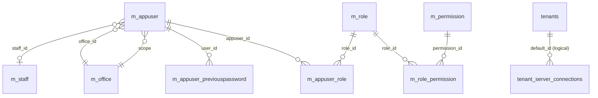

Authentication and authorisation in Apache Fineract rest on a classic users / roles / permissions schema. The principal table `m_appuser` holds login credentials, scope (office and optional staff link), password history, and a `force_change_password` toggle. Role assignment is many-to-many through `m_appuser_role` and permission assignment is many-to-many through `m_role_permission`. The `m_permission` table is the catalogue of every permission code recognised by the platform, and is seeded by Liquibase at every release. On top of that, a separate `fineract_default_db.tenants` registry running in its own datasource lists the tenants and their per-tenant database connections.

The core auth tables are defined in `fineract-provider/src/main/resources/db/changelog/tenant/parts/0001_initial_schema.xml`. The tenants registry is defined in the bootstrap changelog under `fineract-provider/src/main/resources/db/changelog/default/`.

## Entity-relationship overview



## m_appuser — the user principal

| Column | Type | Notes |
| --- | --- | --- |
| `id` | `BIGINT PK auto` | Surrogate. |
| `is_deleted` | `BOOLEAN NOT NULL` | Soft delete. |
| `office_id` | `BIGINT NOT NULL` → `m_office.id` | Home office; bounds data scope through office hierarchy. |
| `staff_id` | `BIGINT` → `m_staff.id` | Optional staff link. |
| `username` | `VARCHAR(100) NOT NULL UNIQUE` | Login id. |
| `firstname` | `VARCHAR(100) NOT NULL` | First name. |
| `lastname` | `VARCHAR(100) NOT NULL` | Last name. |
| `password` | `VARCHAR(255) NOT NULL` | Hashed password. |
| `password_never_expires` | `BOOLEAN NOT NULL` | Skips age-based rotation. |
| `email` | `VARCHAR(100) NOT NULL` | Contact email. |
| `firsttime_login_remaining` | `BOOLEAN NOT NULL` | Forces password reset on first login. |
| `nonexpired` | `BOOLEAN NOT NULL` | Spring Security `accountNonExpired`. |
| `nonlocked` | `BOOLEAN NOT NULL` | `accountNonLocked`. |
| `nonexpired_credentials` | `BOOLEAN NOT NULL` | `credentialsNonExpired`. |
| `enabled` | `BOOLEAN NOT NULL` | `enabled`. |
| `last_time_password_updated` | `DATE NOT NULL` | Used by password policy. |
| `cannot_change_password` | `BOOLEAN` | Override for service accounts. |
| `is_self_service_user` | `BOOLEAN NOT NULL` | True for borrower-facing portal users (governs which APIs they can call). |

### Foreign keys

- `FK_m_appuser_office` → `m_office(id)`
- `FK_m_appuser_staff` → `m_staff(id)`

### Indexes

- `username` unique.
- `office_id` for branch-scoped queries.
- `staff_id` for portal lookups.

## m_role — RBAC role

| Column | Type | Notes |
| --- | --- | --- |
| `id` | `BIGINT PK auto` | Surrogate. |
| `name` | `VARCHAR(100) NOT NULL UNIQUE` | Display id (e.g. `Super user`, `Branch Manager`, `Teller`, `Loan Officer`). |
| `description` | `VARCHAR(500)` | Free-form. |
| `is_disabled` | `SMALLINT NOT NULL` | 0 active, 1 disabled. |
| `is_self_service_role` | `BOOLEAN NOT NULL` | True if assigned to self-service users only. |

Index: `name` unique.

## m_permission — permission catalogue

Seeded at every release by Liquibase changesets that bundle new permission codes for newly added APIs.

| Column | Type | Notes |
| --- | --- | --- |
| `id` | `BIGINT PK auto` | Surrogate. |
| `grouping` | `VARCHAR(45)` | Display group (`portfolio`, `transaction_loan`, `transaction_savings`, `accounting`, `report`, `configuration`, `authorisation`, ...). |
| `code` | `VARCHAR(100) NOT NULL UNIQUE` | Action code in `ACTION_ENTITY` form (`CREATE_LOAN`, `APPROVE_LOAN`, `DISBURSE_LOAN`, `UPDATE_CLIENT`, `READ_CLIENT`, `CHECKER_DISBURSE_LOAN`, etc.). The `CHECKER_` prefix denotes a four-eyes approver permission. |
| `entity_name` | `VARCHAR(100)` | E.g. `LOAN`. |
| `action_name` | `VARCHAR(100)` | E.g. `CREATE`. |
| `can_maker_checker` | `BOOLEAN NOT NULL` | Whether the action supports four-eyes. |

Index: `code` unique.

## m_role_permission — many-to-many role↔permission

| Column | Type | Notes |
| --- | --- | --- |
| `role_id` | `BIGINT NOT NULL` → `m_role.id` | Composite PK. |
| `permission_id` | `BIGINT NOT NULL` → `m_permission.id` | Composite PK. |

Foreign keys: `FK_m_role_permission_role` → `m_role(id)`, `FK_m_role_permission_permission` → `m_permission(id)`.

The composite primary key prevents duplicates. The `Super user` role is granted `ALL_FUNCTIONS` and bypasses individual permission checks.

## m_appuser_role — many-to-many user↔role

| Column | Type | Notes |
| --- | --- | --- |
| `appuser_id` | `BIGINT NOT NULL` → `m_appuser.id` | Composite PK. |
| `role_id` | `BIGINT NOT NULL` → `m_role.id` | Composite PK. |

Foreign keys: `FK_m_appuser_role_appuser` → `m_appuser(id)`, `FK_m_appuser_role_role` → `m_role(id)`.

## m_appuser_previouspassword — password history

Enforces "no password reuse for last N passwords" policy.

| Column | Type | Notes |
| --- | --- | --- |
| `id` | `BIGINT PK auto` | Surrogate. |
| `user_id` | `BIGINT NOT NULL` → `m_appuser.id` | Owning user. |
| `password` | `VARCHAR(255) NOT NULL` | Hash. |
| `removal_date` | `datetime NOT NULL` | When this entry was archived (i.e. when the current password changed). |

Index: `(user_id, removal_date desc)` returns recent passwords for the policy check.

## Password validation policy

`m_password_validation_policy` and `m_password_validation_policy_history` hold the active password complexity rules. One row per policy with the regex / length / mandatory-character flags; one history row per change so admins can audit policy edits.

| `m_password_validation_policy` Column | Type | Notes |
| --- | --- | --- |
| `id` | `BIGINT PK auto` | Surrogate. |
| `regex` | `VARCHAR(100) NOT NULL` | Java regex enforced at change-password time. |
| `description` | `text` | Human description. |
| `key` | `VARCHAR(255) NOT NULL UNIQUE` | Policy identifier (`SIMPLE`, `MEDIUM`, `STRONG`). |
| `active` | `BOOLEAN NOT NULL` | Toggle. |

## m_appuser_client_mapping — self-service client link

| Column | Type | Notes |
| --- | --- | --- |
| `id` | `BIGINT PK auto` | Surrogate. |
| `appuser_id` | `BIGINT NOT NULL` → `m_appuser.id` | Self-service user. |
| `client_id` | `BIGINT NOT NULL` → `m_client.id` | Linked client. |

Indexed unique on `(appuser_id, client_id)`. Used by self-service auth checks to make sure a portal user can only operate on the clients they own.

## tenants registry (separate database)

Apache Fineract is multi-tenant. A separate database holds the tenants registry (`fineract_default_db.tenants`) and one row per per-tenant connection. The main application reads it at startup to route each request to the right tenant database.

### tenants

| Column | Type | Notes |
| --- | --- | --- |
| `id` | `BIGINT PK auto` | Surrogate. |
| `identifier` | `VARCHAR(100) NOT NULL UNIQUE` | Tenant identifier sent in the `Fineract-Platform-TenantId` header. |
| `name` | `VARCHAR(100) NOT NULL` | Display. |
| `timezone_id` | `VARCHAR(100) NOT NULL` | JVM timezone. |
| `country_id` | `INT` | Optional country. |
| `joined_date` | `DATE` | Tenant onboarding date. |
| `created_date` | `datetime NOT NULL` | Audit. |
| `lastmodified_date` | `datetime` | Audit. |
| `oltp_id` | `BIGINT NOT NULL` → `tenant_server_connections.id` | Live OLTP connection. |
| `report_id` | `BIGINT NOT NULL` → `tenant_server_connections.id` | Read-replica connection used for reports. |

Indexes: `identifier` unique, `oltp_id`, `report_id`.

### tenant_server_connections

| Column | Type | Notes |
| --- | --- | --- |
| `id` | `BIGINT PK auto` | Surrogate. |
| `schema_server` | `VARCHAR(100) NOT NULL` | DB host. |
| `schema_server_port` | `VARCHAR(10) NOT NULL` | DB port. |
| `schema_name` | `VARCHAR(100) NOT NULL` | Database / schema name. |
| `schema_username` | `VARCHAR(100) NOT NULL` | Username. |
| `schema_password` | `VARCHAR(100) NOT NULL` | Encrypted password. |
| `schema_connection_parameters` | `VARCHAR(255)` | JDBC params. |
| `auto_update` | `BOOLEAN NOT NULL` | Run Liquibase on startup. |
| `pool_initial_size` / `pool_maximum_active_connections` / `pool_min_idle` / `pool_max_idle` | `INT NOT NULL` | HikariCP sizing. |
| `pool_test_on_borrow` | `BOOLEAN NOT NULL` | Validate connection. |
| `pool_validation_interval` | `INT NOT NULL` | Validation period. |
| `pool_remove_abandoned` | `BOOLEAN NOT NULL` | Abandon detection. |
| `pool_remove_abandoned_timeout` | `INT NOT NULL` | Timeout. |
| `pool_log_abandoned` | `BOOLEAN NOT NULL` | Toggle. |
| `pool_abandon_when_percentage_full` | `INT NOT NULL` | Threshold. |
| `pool_test_while_idle` | `BOOLEAN NOT NULL` | Background validation. |
| `pool_time_between_eviction_runs_millis` | `INT NOT NULL` | Evictor interval. |
| `pool_min_evictable_idle_time_millis` | `INT NOT NULL` | Eviction age. |
| `pool_suspect_timeout` | `INT NOT NULL` | Soft timeout. |
| `master_password_hash` | `VARCHAR(100)` | Used by reading encrypted passwords. |
| `readonly` | `BOOLEAN NOT NULL` | Marks read-only replicas. |

### oauth_access_token — OAuth bearer cache

When the OAuth profile is enabled, Spring's `oauth_access_token` and `oauth_refresh_token` tables back the issued-tokens cache. Each row carries the encrypted bearer token, the username it was issued to, and its expiry timestamp. These tables are infrastructural — Fineract code never SELECTs from them directly.

## Foreign keys summary

| Child | Column | Parent |
| --- | --- | --- |
| `m_appuser` | `office_id` | `m_office(id)` |
| `m_appuser` | `staff_id` | `m_staff(id)` |
| `m_appuser_role` | `appuser_id` | `m_appuser(id)` |
| `m_appuser_role` | `role_id` | `m_role(id)` |
| `m_role_permission` | `role_id` | `m_role(id)` |
| `m_role_permission` | `permission_id` | `m_permission(id)` |
| `m_appuser_previouspassword` | `user_id` | `m_appuser(id)` |
| `m_appuser_client_mapping` | `appuser_id` | `m_appuser(id)` |
| `m_appuser_client_mapping` | `client_id` | `m_client(id)` |
| `tenants` | `oltp_id`, `report_id` | `tenant_server_connections(id)` |

## Indexes summary

| Table | Index | Use |
| --- | --- | --- |
| `m_appuser` | `username` unique | Login. |
| `m_appuser` | `office_id` | Branch scope. |
| `m_role` | `name` unique | Lookup. |
| `m_permission` | `code` unique | Permission check. |
| `m_role_permission` | composite PK | De-dup. |
| `m_appuser_role` | composite PK | De-dup. |
| `m_appuser_previouspassword` | `(user_id, removal_date desc)` | History scan. |
| `m_appuser_client_mapping` | unique `(appuser_id, client_id)` | Self-service link. |
| `tenants` | `identifier` unique | Tenant routing. |

## Authorization check at runtime

When a request hits a write endpoint:

1. Spring Security loads the user from `m_appuser` by `username`, fails if `is_deleted = true`, `nonexpired`, `nonlocked`, `nonexpired_credentials`, or `enabled` is false.
2. The user's roles are loaded by joining `m_appuser_role` with `m_role` filtered by `is_disabled = 0`.
3. The aggregated permissions are loaded by joining `m_role_permission` with `m_permission` over the role set.
4. The command framework computes the required permission code from the action (`CREATE_LOAN`, `APPROVE_LOAN`, etc.).
5. If the maker-checker flag is on globally (`c_configuration.name = 'maker-checker'`), and the user is granted only `CHECKER_<ACTION>` (not the plain action), the request is routed to maker-checker review.
6. If the user has the plain permission, the command runs immediately.

## Self-service portal

Self-service users — borrowers using the mobile app — have `is_self_service_user = true` and only ever hold roles where `is_self_service_role = true`. Every self-service permission code is prefixed with `READ_` (no writes are allowed). At runtime the service layer additionally restricts queries to the clients listed in `m_appuser_client_mapping`.

## Data-scoping by office hierarchy

For a regular (non-self-service) user, every "read all" query rewrites:

```sql
SELECT ... FROM m_loan l
JOIN   m_office o ON l.<office-resolved field>
WHERE  o.hierarchy LIKE :userOfficeHierarchy || '%'
```

The `m_appuser.office_id` and the corresponding `m_office.hierarchy` value give every user a scope that includes their own office and every descendant office. This is the platform's main multi-branch isolation mechanism — it's why every portfolio query joins to `m_office` even when no office data is selected.

## Tenant routing flow

1. Request comes in with `Fineract-Platform-TenantId: alpha` header.
2. `TenantsRequestFilter` reads the tenant identifier and looks up `tenants` in the registry database.
3. Returns the `tenant_server_connections` row referenced by `oltp_id`.
4. The `HikariCP` connection pool for `alpha` is obtained (or created) using `schema_server`, `schema_server_port`, `schema_name`, `schema_username`, `schema_password`.
5. All subsequent JDBC calls during the request run against that pool.
6. Reports are routed similarly through `report_id` to a (typically read-replica) connection.

## Password rotation

The password validation policy works against `m_appuser_previouspassword`. On a password change:

1. The new password is hashed.
2. The last N hashed passwords for the user are loaded ordered by `removal_date desc` (N is configurable; default 3).
3. If any of them matches the new hash, the change is rejected.
4. On success, the current `m_appuser.password` is archived into `m_appuser_previouspassword` with `removal_date = now()`.
5. `m_appuser.last_time_password_updated` is updated and `m_appuser.firsttime_login_remaining` is cleared.

This schema gives Apache Fineract the standard RBAC primitives plus two distinguishing features: maker-checker through the `CHECKER_*` permission codes (interpreted by the command framework when it routes to `m_portfolio_command_source`), and data-scoping through the user's office hierarchy (every "read all" query is rewritten to add a `m_office.hierarchy LIKE '<user-office-hierarchy>%'` filter).
