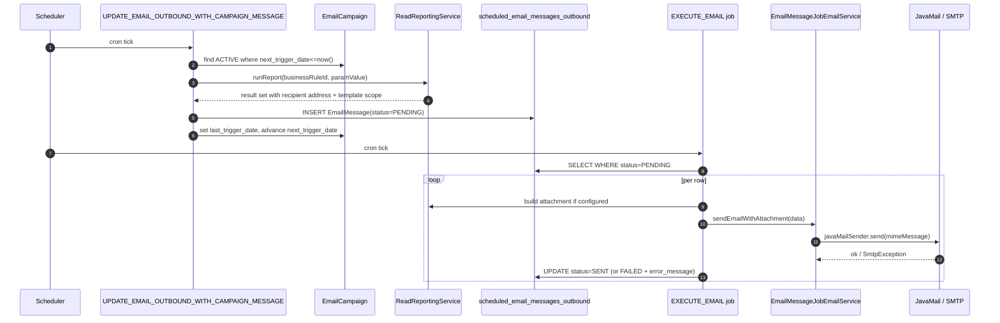

Apache Fineract's *email campaign* subsystem turns a Pentaho stretchy report into a periodic, templated email blast. It lives under `org.apache.fineract.infrastructure.campaigns.email` (with the worker pieces in `…campaigns.jobs.executeemail` and `…campaigns.jobs.updateemailoutboundwithcampaignmessage`) and is built around four moving parts:

* the `EmailCampaign` entity (table `scheduled_email_campaign`) — the *what* and *when*,
* the `EmailMessage` entity (table `scheduled_email_messages_outbound`) — the *queue*,
* the `EmailConfiguration` entity (table holding SMTP credentials) — the *how*,
* and two scheduled jobs (`UPDATE_EMAIL_OUTBOUND_WITH_CAMPAIGN_MESSAGE`, `EXECUTE_EMAIL`) — the *driver*.

## Package layout

```
infrastructure/campaigns/email/
├── EmailApiConstants.java
├── ScheduledEmailConstants.java
├── api/
│   ├── EmailApiResource.java            /v1/email
│   ├── EmailCampaignApiResource.java    /v1/email/campaign
│   └── EmailConfigurationApiResource.java /v1/email/configuration
├── data/        validators and DTOs
├── domain/
│   ├── EmailCampaign.java               scheduled_email_campaign
│   ├── EmailCampaignType.java           DIRECT / SCHEDULE / TRIGGERED
│   ├── EmailCampaignStatus.java         PENDING / ACTIVE / CLOSED
│   ├── EmailConfiguration.java          c_email_configuration (key/value)
│   ├── EmailMessage.java                scheduled_email_messages_outbound
│   ├── EmailMessageStatusType.java      PENDING / SENT / DELIVERED / FAILED
│   ├── ScheduledEmailAttachmentFileFormat.java
│   └── ScheduledEmailStretchyReportParamDateOption.java
├── exception/
├── handler/     command handlers for create/update/activate/close/reactivate
└── service/
    ├── EmailCampaignDomainService               business‑event listener for TRIGGERED type
    ├── EmailCampaignReadPlatformService         /v1/email/campaign GETs
    ├── EmailCampaignWritePlatformService        commands
    ├── EmailConfigurationReadPlatformService    /v1/email/configuration GET
    ├── EmailConfigurationWritePlatformService   /v1/email/configuration PUT
    ├── EmailMessageJobEmailService              JavaMail send wrapper
    └── EmailReadPlatformService / WriteService  the /v1/email message queue API
```

## The `EmailCampaign` entity

The table is `scheduled_email_campaign`. Selected columns:

| Column | Type | Notes |
|---|---|---|
| `campaign_name` | `VARCHAR` | Operator‑facing label. |
| `campaign_type` | `INT` | One of `EmailCampaignType` (`DIRECT=1`, `SCHEDULE=2`, `TRIGGERED=3`). |
| `business_rule_id` | `BIGINT` | FK to `stretchy_report` — the SQL that produces the recipient list. |
| `param_value` | `LONGTEXT` | JSON map of parameters passed to the stretchy report. |
| `status_enum` | `INT` | One of `EmailCampaignStatus`. |
| `email_subject` | `VARCHAR` | Mustache subject template. |
| `email_message` | `TEXT` | Mustache body template. |
| `email_attachment_file_format` | `VARCHAR` | Optional — `XLS`, `PDF`, `CSV`, `XLSX` from `ScheduledEmailAttachmentFileFormat`. |
| `stretchy_report_id` | `BIGINT` | Optional second report used to build the *attachment*. |
| `stretchy_report_param_map` | `LONGTEXT` | JSON parameter map for that attachment report. |
| `recurrence` | `VARCHAR` | iCal RRULE (`FREQ=DAILY;…`). |
| `recurrence_start_date` | `TIMESTAMP` | When the schedule begins. |
| `next_trigger_date` | `TIMESTAMP` | Computed; what the job looks at. |
| `last_trigger_date` | `TIMESTAMP` | When the campaign last ran. |
| `submittedon_date`, `submittedon_userid` | | Maker. |
| `approvedon_date`, `approvedon_userid` | | Checker activator. |
| `closedon_date`, `closedon_userid` | | Closer. |
| `is_visible` | `BOOLEAN` | Soft‑hide from the operator UI. |
| `previous_run_status` | `VARCHAR` | Last run outcome (debug aid). |

The corresponding Java declaration is:

```java
@Entity
@Table(name = "scheduled_email_campaign")
@Getter @Setter @NoArgsConstructor
@Accessors(chain = true)
public class EmailCampaign extends AbstractPersistableCustom<Long> {

    @Column(name = "campaign_name", nullable = false)   private String        campaignName;
    @Column(name = "campaign_type", nullable = false)   private Integer       campaignType;
    @ManyToOne @JoinColumn(name = "business_rule_id")   private Report        businessRuleId;
    @Column(name = "param_value")                       private String        paramValue;
    @Column(name = "status_enum", nullable = false)     private Integer       status;
    @Column(name = "email_subject", nullable = false)   private String        emailSubject;
    @Column(name = "email_message", nullable = false)   private String        emailMessage;
    @Column(name = "email_attachment_file_format")      private String        emailAttachmentFileFormat;
    @ManyToOne @JoinColumn(name = "stretchy_report_id") private Report        stretchyReport;
    @Column(name = "stretchy_report_param_map")         private String        stretchyReportParamMap;
    @Column(name = "recurrence")                        private String        recurrence;
    @Column(name = "next_trigger_date")                 private LocalDateTime nextTriggerDate;
    @Column(name = "last_trigger_date")                 private LocalDateTime lastTriggerDate;
    @Column(name = "recurrence_start_date")             private LocalDateTime recurrenceStartDate;
    @Column(name = "is_visible")                        private boolean       isVisible;
    // … maker/checker fields …
}
```

### Campaign types

```java
public enum EmailCampaignType {
    DIRECT(1,    "emailCampaignStatusType.direct"),
    SCHEDULE(2,  "emailCampaignStatusType.schedule"),
    TRIGGERED(3, "emailCampaignStatusType.triggered");
}
```

* **DIRECT** — operator hits *Send now*. The campaign runs once.
* **SCHEDULE** — recurring; `recurrence` (RRULE) plus `recurrence_start_date` define when. The `UPDATE_EMAIL_OUTBOUND_WITH_CAMPAIGN_MESSAGE` job picks it up at `next_trigger_date`.
* **TRIGGERED** — sent in response to a business event (loan approved, etc.) — listeners in `EmailCampaignDomainService` route the event back into message creation.

### Campaign status

```java
public enum EmailCampaignStatus {
    INVALID(0,   "emailCampaignStatus.invalid"),
    PENDING(100, "emailCampaignStatus.pending"),
    ACTIVE(300,  "emailCampaignStatus.active"),
    CLOSED(600,  "emailCampaignStatus.closed");
}
```

The state machine is `PENDING → ACTIVE → CLOSED`, with a `REACTIVATE` command allowed from `CLOSED` back to `ACTIVE`.

## The outbound queue — `EmailMessage`

Per‑recipient rows live in `scheduled_email_messages_outbound`:

```java
@Entity
@Table(name = "scheduled_email_messages_outbound")
public class EmailMessage extends AbstractPersistableCustom<Long> {

    @ManyToOne @JoinColumn(name = "group_id")        private Group         group;
    @ManyToOne @JoinColumn(name = "client_id")       private Client        client;
    @ManyToOne @JoinColumn(name = "staff_id")        private Staff         staff;
    @ManyToOne @JoinColumn(name = "campaign_id")     private EmailCampaign emailCampaign;
    @Column(name = "status_enum",   nullable = false) private Integer       statusType;
    @Column(name = "email_address", nullable = false) private String        emailAddress;
    @Column(name = "email_subject", nullable = false) private String        emailSubject;
    @Column(name = "message",       nullable = false) private String        message;
    @Column(name = "campaign_name")                   private String        campaignName;
    @Column(name = "submittedon_date")                private LocalDate     submittedOnDate;
    @Column(name = "error_message")                   private String        errorMessage;
}
```

`statusType` walks through `EmailMessageStatusType`:

| Value | Meaning |
|---|---|
| `INVALID(0)` | Default; never seen in practice. |
| `PENDING(100)` | Queued; ready for `EXECUTE_EMAIL`. |
| `SENT(200)` | Handed to JavaMail without error. |
| `DELIVERED(300)` | Confirmed by the SMTP server (rarely advanced — `SENT` is the practical terminal state). |
| `FAILED(400)` | JavaMail threw — `error_message` holds the cause. |

## The SMTP gateway — `EmailConfiguration`

SMTP credentials are stored as plain key/value rows in `c_email_configuration`:

```java
@Entity
public class EmailConfiguration extends AbstractPersistableCustom<Long> {
    @Column(name = "name",  nullable = false) private String name;
    @Column(name = "value", nullable = false) private String value;
}
```

The well‑known names mirror Spring's `JavaMailSenderImpl`:

| `name` | Example `value` |
|---|---|
| `SMTP_USERNAME` | `noreply@fineract.local` |
| `SMTP_PASSWORD` | `********` |
| `SMTP_HOST` | `smtp.gmail.com` |
| `SMTP_PORT` | `587` |
| `SMTP_USE_TLS` | `true` |
| `SMTP_FROM_EMAIL` | `noreply@fineract.local` |
| `SMTP_FROM_NAME` | `Fineract Notifications` |

These are exposed read/write through `/v1/email/configuration`:

| Verb | Path | Body | Effect |
|---|---|---|---|
| `GET` | `/v1/email/configuration` | — | Returns every `EmailConfiguration` row. |
| `PUT` | `/v1/email/configuration` | JSON map of `name → value` | Upserts each row in one transaction. |

The send‑side bean `EmailMessageJobEmailServiceImpl` reads the rows via `ExternalServicesReadPlatformService.getSMTPCredentials()` and constructs a fresh `JavaMailSenderImpl` per message — there is no connection pool:

```java
JavaMailSenderImpl javaMailSenderImpl = new JavaMailSenderImpl();
javaMailSenderImpl.setHost(smtpCredentialsData.getHost());
javaMailSenderImpl.setPort(Integer.parseInt(smtpCredentialsData.getPort()));
javaMailSenderImpl.setUsername(smtpCredentialsData.getUsername());
javaMailSenderImpl.setPassword(smtpCredentialsData.getPassword());
javaMailSenderImpl.setJavaMailProperties(this.getJavaMailProperties(smtpCredentialsData, javaMailSenderImpl.getJavaMailProperties()));

// … MimeMessage with attachments …
mimeMessageHelper.setFrom(smtpCredentialsData.getFromEmail());
javaMailSenderImpl.send(mimeMessage);
```

The standard `mail.smtp.starttls.enable`, `mail.smtp.auth`, `mail.smtp.ssl.trust` and `mail.transport.protocol=smtp` properties are always set; `useTLS` simply toggles the starttls layer.

## REST surface — `/v1/email`

| Verb | Path | Purpose |
|---|---|---|
| `GET` | `/v1/email` | List all `EmailMessage` rows. |
| `GET` | `/v1/email/pendingEmail` | Filter on `status_enum = PENDING`. |
| `GET` | `/v1/email/sentEmail` | Filter on `SENT`. |
| `GET` | `/v1/email/failedEmail` | Filter on `FAILED`. |
| `GET` | `/v1/email/messageByStatus` | Free‑form filter by status. |
| `POST` | `/v1/email` | Enqueue a single ad‑hoc message. |
| `GET` | `/v1/email/{id}` | Retrieve one. |
| `PUT` | `/v1/email/{id}` | Update a pending message. |
| `DELETE` | `/v1/email/{id}` | Drop a pending message. |

## REST surface — `/v1/email/campaign`

| Verb | Path | Purpose |
|---|---|---|
| `GET` | `/v1/email/campaign` | List campaigns. |
| `GET` | `/v1/email/campaign/{id}` | Retrieve one. |
| `POST` | `/v1/email/campaign` | Create. |
| `PUT` | `/v1/email/campaign/{id}` | Update (only while `PENDING`). |
| `POST` | `/v1/email/campaign/{id}?command=…` | `activate`, `close`, `reactivate`. |
| `POST` | `/v1/email/campaign/preview` | Render the Mustache against sample data without sending. |
| `GET` | `/v1/email/campaign/template` | Look up usable Pentaho reports. |
| `DELETE` | `/v1/email/campaign/{id}` | Delete (only while `PENDING`). |

## End to end — the `EXECUTE_EMAIL` job



The `EXECUTE_EMAIL` Spring Batch job is declared in `ExecuteEmailConfig`:

```java
@Bean
protected Step executeEmailStep() {
    return new StepBuilder(JobName.EXECUTE_EMAIL.name(), jobRepository)
            .tasklet(executeEmailTasklet(), transactionManager).build();
}

@Bean
public Job executeEmailJob() {
    return new JobBuilder(JobName.EXECUTE_EMAIL.name(), jobRepository)
            .start(executeEmailStep()).incrementer(new RunIdIncrementer()).build();
}
```

The tasklet body, abbreviated:

```java
final List<EmailMessage> emailMessages =
        emailMessageRepository.findByStatusType(EmailMessageStatusType.PENDING.getValue());
// for each message: build attachment, sendEmailWithAttachment, set status to SENT
emailMessage.setStatusType(EmailMessageStatusType.SENT.getValue());
```

If `sendEmailWithAttachment` throws, the tasklet catches it, sets the message status to `FAILED(400)` and persists the exception message into `error_message` — the row is **not** retried automatically.

## Permissions

| Command | Permission codes |
|---|---|
| Create campaign | `CREATE_EMAIL_CAMPAIGN`, `CREATE_EMAIL_CAMPAIGN_CHECKER` |
| Update campaign | `UPDATE_EMAIL_CAMPAIGN`, `UPDATE_EMAIL_CAMPAIGN_CHECKER` |
| Activate / close / reactivate | `ACTIVATE_*`, `CLOSE_*`, `REACTIVATE_EMAIL_CAMPAIGN` |
| Delete | `DELETE_EMAIL_CAMPAIGN` |
| Configuration | `UPDATE_EMAIL_CONFIGURATION` |

## Operational tips

<Tip>
Build campaigns iteratively: create as `DIRECT`, use `POST /v1/email/campaign/preview` to verify the Mustache renders against representative data, then re‑create as `SCHEDULE` with a recurrence once happy.
</Tip>

<Warning>
`EmailMessageJobEmailServiceImpl` builds a fresh `JavaMailSenderImpl` per message and SMTP is synchronous — a large recurring campaign will hold the `EXECUTE_EMAIL` step open. For thousands of recipients, run the job on a dedicated batch instance via the [scheduler partitioning](/runtime/profiles-and-instance-modes) and consider externalising to a queue.
</Warning>

* **Attachments.** If `email_attachment_file_format` is set, the tasklet runs `stretchyReport` with `stretchy_report_param_map` to generate a PDF/XLS/CSV and attaches it. The format enum is `ScheduledEmailAttachmentFileFormat`.
* **Dates in report params.** Date parameters that follow a sliding window (yesterday, last month) use `ScheduledEmailStretchyReportParamDateOption` keywords so the same campaign keeps working on every run.
* **Retries.** None are built in. A `FAILED` row stays `FAILED`; manual reset is via `PUT /v1/email/{id}` flipping the status back to `PENDING`.

## Related reading

* [Notification and campaigns overview](/notification/overview) — context.
* [Templates](/notification/templates) — Mustache mechanics shared with campaign bodies.
* [SMS campaigns](/notification/sms-campaigns) — sister subsystem with identical command shape.
* [Hooks](/notification/hooks) — push individual events outward instead of running batched campaigns.
