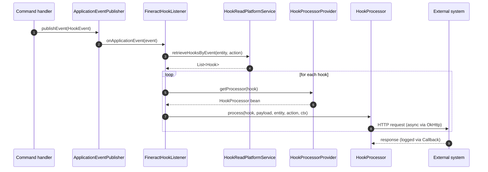

Apache Fineract's *Hooks* subsystem lets operators wire any *entity action* — `loan` `approve`, `client` `create`, `savings` `deposit`, etc. — to an outbound HTTP call. The dispatcher fires whenever the matching command commits; the destination, the protocol and the payload shape are pluggable via the `HookProcessor` SPI. This page documents the *delivery side*: how `FineractHookListener` reads registered hooks, how `HookProcessorProvider` resolves the right processor and how the four shipped processors talk to their respective backends.

If you want the lower‑level *hook framework* (the `HookEvent` spring event, registration tables, JSON schemas), see [/core/hooks](/core/hooks); this page assumes a hook is already configured and concentrates on what happens after it fires.

## Package layout

```
infrastructure/hooks/
├── api/
│   ├── HookApiResource.java        /v1/hooks
│   └── HookApiConstants.java       webTemplateName, smsTemplateName, …
├── command/                        Create / Update / Delete commands
├── data/                           HookData, HookEventData, HookCreateRequest, …
├── domain/
│   ├── Hook.java                   m_hook
│   ├── HookConfiguration.java      m_hook_configuration       (field_name=field_value)
│   ├── HookResource.java           m_hook_registered_events   (entity/action subscription)
│   ├── HookTemplate.java           m_hook_template            (one row per backend type)
│   └── HookSchema.java             field schema per template
├── listener/
│   ├── HookListener.java           ApplicationListener<HookEvent>
│   └── FineractHookListener.java   dispatcher
├── processor/
│   ├── HookProcessor.java          SPI
│   ├── HookProcessorProvider.java  resolves SPI impl by template name
│   ├── ProcessorHelper.java        OkHttp + Retrofit factory, callbacks
│   ├── WebHookProcessor.java       Web template
│   ├── TwilioHookProcessor.java    SMS Bridge template (legacy name)
│   ├── MessageGatewayHookProcessor.java   Message Gateway template
│   └── ElasticSearchHookProcessor.java    Elastic Search template
└── service/                        Read & write platform services

infrastructure/hooks/event/         (in fineract-core)
├── HookEvent.java                  the ApplicationEvent
└── HookEventSource.java            (entityName, actionName) tuple
```

## The `Hook` entity

`Hook` (table `m_hook`) is the operator‑facing registration:

```java
@Entity
public final class Hook extends AbstractAuditableCustom {

    @Column(name = "name", nullable = false, length = 100)   private String  name;
    @Column(name = "is_active", nullable = false)            private Boolean isActive;

    @OneToMany …                                              private Set<HookResource>     events = new HashSet<>();
    @OneToMany …                                              private Set<HookConfiguration> config = new HashSet<>();
    @ManyToOne … @JoinColumn(name = "template_id")            private HookTemplate          template;
    @ManyToOne … @JoinColumn(name = "ugd_template_id")        private Template              ugdTemplate;
}
```

* `name` — operator label.
* `isActive` — only active hooks fire.
* `template` (`HookTemplate`) — the *kind* of backend (`Web`, `SMS Bridge`, `Message Gateway`, `Elastic Search`). The `HookProcessorProvider` switches on `template.getName()`.
* `config` — key/value pairs (`HookConfiguration`: `field_name`, `field_value`, `field_type`) that the processor reads (URL, content type, API key, SMS provider id, …).
* `events` — the `(entityName, actionName)` subscriptions in `m_hook_registered_events`.
* `ugdTemplate` — an optional `Template` row used to *shape* the outgoing payload before it leaves Fineract (see [Templates](/notification/templates)).

### `HookConfiguration` and `HookResource`

```java
@Entity @Table(name = "m_hook_configuration")
public class HookConfiguration extends AbstractPersistableCustom<Long> {
    @ManyToOne … private Hook hook;
    @Column(name = "field_type",  nullable = false, length = 20)  private String fieldType;
    @Column(name = "field_name",  nullable = false, length = 100) private String fieldName;
    @Column(name = "field_value", nullable = false, length = 100) private String fieldValue;
}

@Entity @Table(name = "m_hook_registered_events")
public class HookResource extends AbstractPersistableCustom<Long> {
    @ManyToOne … private Hook hook;
    @Column(name = "entity_name", nullable = false, length = 45) private String entityName;
    @Column(name = "action_name", nullable = false, length = 45) private String actionName;
}
```

The well‑known `field_name` values come from `HookApiConstants`:

| Constant | Used by |
|---|---|
| `Payload URL` (`payloadURLName`) | Web, Elastic Search, Message Gateway |
| `Content Type` (`contentTypeName`) | Web (`json` vs `form`) |
| `SMS Provider` (`smsProviderName`) | Twilio / SMS Bridge |
| `SMS Provider Account Id` (`smsProviderAccountIdName`) | Twilio |
| `SMS Provider Token` (`smsProviderTokenIdName`) | Twilio |
| `Phone Number` (`phoneNumberName`) | Twilio |
| `Api Key` (`apiKeyName`) | SMS Bridge |
| `SMS Provider Id` (`SMSProviderIdParamName`) | Message Gateway |

`HookSchema` describes the valid field shape per `HookTemplate` so the UI can render a form when creating hooks.

## The four shipped templates

`HookApiConstants` exposes the well‑known names:

```java
public static final String webTemplateName           = "Web";
public static final String elasticSearchTemplateName = "Elastic Search";
public static final String smsTemplateName           = "SMS Bridge";
public static final String httpSMSTemplateName       = "Message Gateway";
```

`HookProcessorProvider.getProcessor(hook)` switches on that name:

```java
public HookProcessor getProcessor(final Hook hook) {
    HookProcessor processor;
    final String templateName = hook.getTemplate().getName();
    if (templateName.equalsIgnoreCase(smsTemplateName)) {
        processor = applicationContext.getBean("twilioHookProcessor",       TwilioHookProcessor.class);
    } else if (templateName.equals(webTemplateName)) {
        processor = applicationContext.getBean("webHookProcessor",          WebHookProcessor.class);
    } else if (templateName.equals(elasticSearchTemplateName)) {
        processor = applicationContext.getBean("elasticSearchHookProcessor",ElasticSearchHookProcessor.class);
    } else if (templateName.equals(httpSMSTemplateName)) {
        processor = applicationContext.getBean("messageGatewayHookProcessor",MessageGatewayHookProcessor.class);
    } else {
        processor = null;
    }
    return processor;
}
```

| Template | Bean name | Processor class | Backend |
|---|---|---|---|
| `Web` | `webHookProcessor` | `WebHookProcessor` | Arbitrary HTTP endpoint, JSON or form‑urlencoded. |
| `SMS Bridge` | `twilioHookProcessor` | `TwilioHookProcessor` | Twilio API. |
| `Message Gateway` | `messageGatewayHookProcessor` | `MessageGatewayHookProcessor` | Fineract Message Gateway (same bridge used by [SMS campaigns](/notification/sms-campaigns)). |
| `Elastic Search` | `elasticSearchHookProcessor` | `ElasticSearchHookProcessor` | Elasticsearch index ingest. |

## The SPI

`HookProcessor` is the smallest possible SPI:

```java
public interface HookProcessor {
    void process(Hook hook, String payload, String entityName, String actionName,
                 FineractContext context) throws Exception;
}
```

Adding a new backend means writing a `@Component("myHookProcessor")` that implements this interface, registering a `HookTemplate` row with a new name and teaching `HookProcessorProvider` (or refactoring it to look beans up by template name).

## End to end



`FineractHookListener` reads as:

```java
@Override
public void onApplicationEvent(final HookEvent event) {
    try {
        ThreadLocalContextUtil.init(event.getContext());

        final AppUser appUser = event.getAppUser();
        final HookEventSource hookEventSource = (HookEventSource) event.getSource();
        final FineractContext fineractContext = event.getContext();
        final String entityName = hookEventSource.getEntityName();
        final String actionName = hookEventSource.getActionName();
        final String payload    = event.getPayload();

        final List<Hook> hooks = hookReadPlatformService
                .retrieveHooksByEvent(entityName, actionName);

        for (final Hook hook : hooks) {
            final HookProcessor processor = hookProcessorProvider.getProcessor(hook);
            try {
                processor.process(hook, payload, entityName, actionName, fineractContext);
            } catch (Throwable e) {
                log.error("Hook {} failed in HookProcessor {} for tenantIdentifier/user {}/{}, " +
                          "entityName: {}, actionName: {}, payload {} ",
                          hook.getId(), processor.getClass().getSimpleName(),
                          fineractContext.getTenantContext().getTenantIdentifier(),
                          appUser.getDisplayName(), entityName, actionName, payload, e);
            }
        }
    } finally {
        ThreadLocalContextUtil.reset();
    }
}
```

Two important properties:

* **Listener is synchronous to the publisher.** A slow webhook will block the thread that committed the command — make sure outbound calls go through the OkHttp enqueue path described below.
* **Exceptions are swallowed.** A failed hook is *logged* and the loop moves to the next hook. The originating transaction has already committed — there is no automatic rollback or replay.

## The Web hook processor in detail

`WebHookProcessor.process(...)` reads the URL and content type from `HookConfiguration` and delegates to `sendRequest(...)`:

```java
@Override
public void process(final Hook hook, final String payload, final String entityName,
                    final String actionName, final FineractContext context) {

    final Set<HookConfiguration> config = hook.getConfig();
    String url = "", contentType = "";
    for (final HookConfiguration conf : config) {
        if (conf.getFieldName().equals(payloadURLName))  url         = conf.getFieldValue();
        if (conf.getFieldName().equals(contentTypeName)) contentType = conf.getFieldValue();
    }
    sendRequest(url, contentType, payload, entityName, actionName, context);
}

@SuppressWarnings("unchecked")
private void sendRequest(final String url, final String contentType, final String payload,
                         final String entityName, final String actionName, final FineractContext context) {

    final String fineractEndpointUrl = System.getProperty("baseUrl");
    final WebHookService service = processorHelper.createWebHookService(url);
    final Callback callback       = processorHelper.createCallback(url);

    if (contentType.equalsIgnoreCase("json") || contentType.contains("json")) {
        final JsonObject json = JsonParser.parseString(payload).getAsJsonObject();
        service.sendJsonRequest(entityName, actionName,
                        context.getTenantContext().getTenantIdentifier(), fineractEndpointUrl, json)
               .enqueue(callback);
    } else {
        Map<String, String> map = new HashMap<>();
        map = new Gson().fromJson(payload, map.getClass());
        service.sendFormRequest(entityName, actionName,
                        context.getTenantContext().getTenantIdentifier(), fineractEndpointUrl, map)
               .enqueue(callback);
    }
}
```

### Headers added on the wire

`WebHookService` (a Retrofit interface) sets four custom headers on every JSON or form post:

| Header | Source | Purpose |
|---|---|---|
| `X-Fineract-Entity` | `entityName` | e.g. `loan`, `client`. |
| `X-Fineract-Action` | `actionName` | e.g. `approve`, `create`. |
| `Fineract-Platform-TenantId` | `context.getTenantContext().getTenantIdentifier()` | The originating tenant. |
| `X-Fineract-Endpoint` | `System.getProperty("baseUrl")` | The Fineract base URL — receivers can call back to fetch more context. |

```java
@POST(".")
Call<Void> sendJsonRequest(@Header(ENTITY_HEADER)   String entityHeader,
                           @Header(ACTION_HEADER)   String actionHeader,
                           @Header(TENANT_HEADER)   String tenantHeader,
                           @Header(ENDPOINT_HEADER) String endpointHeader,
                           @Body JsonObject result);

@FormUrlEncoded
@POST(".")
Call<Void> sendFormRequest(@Header(ENTITY_HEADER)   String entityHeader,
                           @Header(ACTION_HEADER)   String actionHeader,
                           @Header(TENANT_HEADER)   String tenantHeader,
                           @Header(ENDPOINT_HEADER) String endpointHeader,
                           @FieldMap Map<String, String> params);
```

The base URL of the Retrofit client *is* the configured `Payload URL`, so the `@POST(".")` value is intentional — the request goes to the URL verbatim, not to a sub‑path.

### Async via `enqueue` + Callback

`ProcessorHelper.createCallback(url)` builds a Retrofit `Callback` that simply logs status and failures:

```java
public Callback createCallback(final String url) {
    return new Callback() {
        @Override public void onResponse(Call call, retrofit2.Response response) {
            LOG.debug("URL: {} - Status: {}", url, response.code());
        }
        @Override public void onFailure(Call call, Throwable t) {
            LOG.error("URL: {} - Retrofit failure occurred", url, t);
        }
    };
}
```

That is the entirety of the result handling — *neither* a non‑2xx response *nor* a network failure causes Fineract to retry. The hook attempt is fire‑and‑forget.

## Retries

<Warning>
There is **no automatic retry** built into the shipped processors. A `4xx`/`5xx` response is logged at `DEBUG` (status only); a `Throwable` is logged at `ERROR`. The originating command has already committed and the in‑memory `Call` is discarded.
</Warning>

If you need at‑least‑once semantics:

1. Put a durable queue (RabbitMQ, Kafka, SQS) between Fineract and the real consumer; point the `Payload URL` at the queue producer.
2. Or replace the shipped `WebHookProcessor` with one that persists outbox rows and a scheduled job that drains them — the same pattern used by [SMS campaigns](/notification/sms-campaigns) for `sms_messages_outbound`.
3. Or hook `ProcessorHelper.createCallback(url, payload)` (the two‑arg overload exists for exactly this) into a retry/back‑off framework before enqueueing.

## TLS posture

`ProcessorHelper` ships a *permissive* SSL context that trusts every certificate:

```java
private SSLContext createInsecureSSLContext() throws NoSuchAlgorithmException, KeyManagementException {
    SSLContext insecureSSLContext = SSLContext.getInstance("TLS");
    insecureSSLContext.init(null, new TrustManager[] { insecureX509TrustManager }, new SecureRandom());
    return insecureSSLContext;
}
```

This is convenient for internal HTTPS endpoints with private CAs, but it means a misconfigured `Payload URL` will silently hit *any* HTTPS host. Treat hook URLs as trusted configuration.

## REST surface — `/v1/hooks`

| Verb | Path | Purpose |
|---|---|---|
| `GET` | `/v1/hooks` | List hooks. |
| `GET` | `/v1/hooks/{hookId}` | Retrieve one. |
| `GET` | `/v1/hooks/template` | Lookup options — available `HookTemplate`s and their `HookSchema`. |
| `POST` | `/v1/hooks` | Create. |
| `PUT` | `/v1/hooks/{hookId}` | Update. |
| `DELETE` | `/v1/hooks/{hookId}` | Delete. |

Permissions follow the standard pattern: `CREATE_HOOK`, `UPDATE_HOOK`, `DELETE_HOOK`, `READ_HOOK` (and `_CHECKER` variants where maker‑checker is enabled).

## A worked example — Web hook on loan approval

1. **Register the events**. `m_hook_registered_events` gets one row: `entity_name=LOAN`, `action_name=APPROVE`.
2. **Configure the destination**. `m_hook_configuration` gets `Payload URL=https://intake.partner.example/fineract`, `Content Type=json`.
3. **Optional payload shaping**. Point `Hook.ugdTemplate` at a `Template` row that Mustache‑renders the loan and client documents into a flat JSON before send.
4. **Activate**. `is_active=true`.
5. **Fire**. A loan officer's `LoanWritePlatformService.approveLoan(...)` commits. The handler publishes `HookEvent(source=HookEventSource("LOAN","APPROVE"), payload=…)`. `FineractHookListener` picks it up post‑commit, resolves the registered hook, runs `WebHookProcessor.process(...)` which Retrofit‑enqueues an HTTP `POST` with headers:

   ```
   X-Fineract-Entity: LOAN
   X-Fineract-Action: APPROVE
   Fineract-Platform-TenantId: default
   X-Fineract-Endpoint: https://fineract.local
   Content-Type: application/json

   { … the rendered payload … }
   ```

## Cross references

* [Hooks framework](/core/hooks) — the lower‑level plumbing in `fineract-core`: `HookEvent`, registration, JSON schemas.
* [Notification and campaigns overview](/notification/overview) — pick between hooks vs campaigns vs in‑app notifications.
* [Templates](/notification/templates) — how `Hook.ugdTemplate` shapes payloads.
* [SMS campaigns](/notification/sms-campaigns) — the `Message Gateway` template targets the same bridge used by SMS campaigns.

<Note>
If you find yourself reaching for retries, queues, or fan‑out across many subscribers, consider the [external event bus](/core/external-events) instead of Hooks — it's designed for durable, multi‑consumer downstream delivery, whereas Hooks remain best for synchronous, low‑volume integration with one well‑known endpoint.
</Note>
