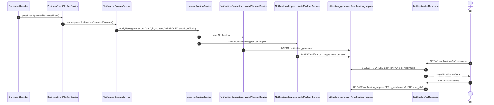

Apache Fineract emits small bell‑icon style notifications to its back‑office users whenever a domain event happens (a loan is approved, a savings account is created, a center is registered, and so on). The mechanism is small but spans three packages — the transport `NotificationData` and `UserNotificationService` interface in `fineract-core`, two JPA entities (`Notification`, `NotificationMapper`) in `fineract-provider`, and the JAX‑RS resource that the UI polls.

## Package layout

```
fineract-core/src/main/java/org/apache/fineract/notification/
├── data/      NotificationData
└── service/   UserNotificationService

fineract-provider/src/main/java/org/apache/fineract/notification/
├── api/       NotificationApiResource
│              NotificationApiResourceSwagger
├── domain/    Notification              (table: notification_generator)
│              NotificationMapper        (table: notification_mapper)
└── service/   NotificationDomainService          (registers business‑event listeners)
              NotificationReadPlatformService     (paginated lookup, mark‑all‑read)
              NotificationWritePlatformService    (insert into notification_mapper)
              NotificationGeneratorReadRepositoryWrapper / WritePlatformService
              NotificationMapperReadRepositoryWrapper / WritePlatformService
              UserNotificationServiceImpl         (fan‑out helper)
```

## The two tables

There are two JPA entities backing two tables, in a header/detail style.

### `notification_generator` — `Notification`

`org.apache.fineract.notification.domain.Notification` carries one row per event:

```java
@Entity
@Table(name = "notification_generator")
public class Notification extends AbstractPersistableCustom<Long> {

    @Column(name = "object_type")          private String        objectType;
    @Column(name = "object_identifier")    private Long          objectIdentifier;
    @Column(name = "action")               private String        action;
    @Column(name = "actor")                private Long          actorId;
    @Column(name = "is_system_generated")  private boolean       isSystemGenerated;
    @Column(name = "notification_content") private String        notificationContent;
    @Column(name = "created_at")           private LocalDateTime createdAt;
}
```

* `objectType` / `objectIdentifier` — the entity that triggered the notification, e.g. `loan` / `42`.
* `action` — the verb, e.g. `created`, `approved`, `closed`.
* `actorId` — the `AppUser.id` that performed the change (or `null` when system‑generated).
* `isSystemGenerated` — `true` when the notification originated from a scheduled job or other automated process rather than a user request.
* `notificationContent` — the rendered text that the UI shows.

### `notification_mapper` — `NotificationMapper`

A `Notification` is fanned out into one `NotificationMapper` row per *recipient*:

```java
@Entity
@Table(name = "notification_mapper")
public class NotificationMapper extends AbstractPersistableCustom<Long> {

    @ManyToOne @JoinColumn(name = "notification_id") private Notification  notification;
    @ManyToOne @JoinColumn(name = "user_id")         private AppUser       userId;
    @Column(name = "is_read")                        private boolean       isRead;
    @Column(name = "created_at")                     private LocalDateTime createdAt;
}
```

The split is deliberate: the *content* of an event is shared, but each user has their own read/unread flag. Marking a notification read therefore only touches `notification_mapper.is_read`, never the parent.

## `NotificationData` transport

The DTO `org.apache.fineract.notification.data.NotificationData` is what every service method returns and what the API serializes:

```java
@Data
@NoArgsConstructor
@Accessors(chain = true)
public class NotificationData implements Serializable {
    private Long       id;
    private String     objectType;
    private Long       objectId;
    private String     action;
    private Long       actorId;
    private String     content;
    private boolean    isRead;
    private boolean    isSystemGenerated;
    private String     tenantIdentifier;
    private String     createdAt;
    private Long       officeId;
    private Set<Long>  userIds;
}
```

`tenantIdentifier`, `officeId` and `userIds` are populated only when the DTO is used as an **event payload** flowing to topic listeners (e.g. the WebSocket push channel) — the API read path leaves them empty.

## The pipeline end to end



The `Listener` classes inside `NotificationDomainServiceImpl` (one inner class per `BusinessEvent`) translate the event into the abstract `notifyUsers(permission, objectType, objectId, content, action, actorId, officeId)` call. The implementation in `UserNotificationServiceImpl` decides *who* receives the notification by combining:

* the `permission` argument — only users whose role grants the matching code receive a row,
* `officeId` — the office hierarchy of the actor restricts the search,
* explicit exclusion of the `actorId` so users do not notify themselves.

## `UserNotificationService`

The contract lives in `fineract-core`:

```java
public interface UserNotificationService {

    void notifyUsers(String permission, String objectType, Long objectIdentifier,
                     String notificationContent, String eventType,
                     Long appUserId, Long officeId);

    boolean hasUnreadUserNotifications(Long appUserId);

    void notifyUsers(NotificationData notificationData);
}
```

The first overload is the one that domain code calls in‑process. The second is an *envelope* form, used by background channels that already have a fully populated `NotificationData` (for example, a stretchy‑report driven campaign that wants to also drop in‑app notifications).

The implementation `UserNotificationServiceImpl` (in `fineract-provider`) wires together the four repositories: it first persists a `Notification`, then for every resolved recipient persists a `NotificationMapper`. Both writes go through dedicated *write platform service* beans rather than raw repositories so they participate cleanly in the platform transaction and audit conventions.

## Read service contract

`NotificationReadPlatformService` exposes four methods:

```java
public interface NotificationReadPlatformService {
    boolean                       hasUnreadNotifications(Long appUserId);
    Page<NotificationData>        getAllUnreadNotifications(SearchParameters searchParameters);
    Page<NotificationData>        getAllNotifications(SearchParameters searchParameters);
    void                          updateNotificationReadStatus();
}
```

`updateNotificationReadStatus()` flips every `notification_mapper.is_read` for the **currently authenticated user** to `true` in a single SQL update — there is no per‑id mark‑read; the UI either shows everything or marks everything read.

## The JAX‑RS resource — `/v1/notifications`

The full resource is short. It only exposes two operations.

```java
@Path("/v1/notifications")
@Component
@Tag(name = "Notification", description = "Notification API resources")
@RequiredArgsConstructor
public class NotificationApiResource {

    private final PlatformSecurityContext context;
    private final NotificationReadPlatformService notificationReadPlatformService;
    private final ApiRequestParameterHelper apiRequestParameterHelper;
    private final ToApiJsonSerializer<NotificationData> toApiJsonSerializer;
    private final SqlValidator sqlValidator;

    @GET
    @Produces({ MediaType.APPLICATION_JSON })
    public String getAllNotifications(@Context UriInfo uriInfo,
            @QueryParam("orderBy")  String  orderBy,
            @QueryParam("limit")    Integer limit,
            @QueryParam("offset")   Integer offset,
            @QueryParam("sortOrder")String  sortOrder,
            @QueryParam("isRead")   boolean isRead) { … }

    @PUT
    public void update() {
        this.context.authenticatedUser();
        this.notificationReadPlatformService.updateNotificationReadStatus();
    }
}
```

### Listing notifications

| Verb | Path | Query parameters | Returns |
|---|---|---|---|
| `GET` | `/v1/notifications` | `isRead`, `limit`, `offset`, `orderBy`, `sortOrder` | `Page<NotificationData>` |

The resource:

1. resolves the caller through `PlatformSecurityContext.authenticatedUser()` — so notifications are always scoped to the JWT/BasicAuth principal.
2. validates `orderBy` and `sortOrder` with `SqlValidator` (anti‑SQLi: only column‑name shaped tokens pass).
3. builds a `SearchParameters` and dispatches to `getAllUnreadNotifications` when `isRead=false` (the default) or `getAllNotifications` when `isRead=true`.

There is no separate "single notification" endpoint — the UI lists pages of notifications and never references one by id.

### Marking everything read

| Verb | Path | Body | Effect |
|---|---|---|---|
| `PUT` | `/v1/notifications` | none | Sets `is_read = true` on every `notification_mapper` belonging to the caller. |

## What events trigger notifications

`NotificationDomainServiceImpl` registers `BusinessEventListener`s in its `init()`:

* Client / Group / Center: `ClientCreateBusinessEvent`, `GroupsCreateBusinessEvent`, `CentersCreateBusinessEvent`.
* Loan: `LoanCreatedBusinessEvent`, `LoanApprovedBusinessEvent`, `LoanCloseBusinessEvent`, `LoanCloseAsRescheduleBusinessEvent`, `LoanChargebackTransactionBusinessEvent`, `LoanTransactionMakeRepaymentPostBusinessEvent`, `LoanProductCreateBusinessEvent`.
* Savings: `SavingsCreateBusinessEvent`, `SavingsApproveBusinessEvent`, `SavingsCloseBusinessEvent`, `SavingsDepositBusinessEvent`, `SavingsPostInterestBusinessEvent`.
* Fixed/recurring deposits: `FixedDepositAccountCreateBusinessEvent`, `RecurringDepositAccountCreateBusinessEvent`.
* Shares: `ShareAccountCreateBusinessEvent`, `ShareAccountApproveBusinessEvent`, `ShareProductDividentsCreateBusinessEvent`.

To wire in your own listener, add another `addPostBusinessEventListener(...)` call in `NotificationDomainServiceImpl.init()` and implement an inner listener class that calls `userNotificationService.notifyUsers(...)`.

<Note>
Listeners run **post‑commit**: a notification only appears once the originating transaction has committed. This avoids the classic "you got a notification for a loan that doesn't exist yet" race.
</Note>

## Pagination behaviour

`SearchParameters` is the common pagination/sort DTO used across the platform.

| Parameter | Default | Notes |
|---|---|---|
| `limit` | server default | When omitted, the read service returns one server‑side page. |
| `offset` | `0` | Standard offset pagination. |
| `orderBy` | `created_at` (in the read impl SQL) | Validated by `SqlValidator`. |
| `sortOrder` | `DESC` | Validated by `SqlValidator`. |
| `isRead` | `false` | Boolean filter. |

The response shape is:

```json
{
  "totalFilteredRecords": 42,
  "pageItems": [
    {
      "id": 18,
      "objectType": "loan",
      "objectId": 7,
      "action": "approved",
      "actorId": 3,
      "content": "Loan 7 has been approved",
      "isRead": false,
      "isSystemGenerated": false,
      "createdAt": "2024-04-10T14:23:11"
    }
  ]
}
```

## Cross‑cutting concerns

* **Multi‑tenancy.** Reads and writes run through the standard tenant‑routing data source, so every `notification_generator` / `notification_mapper` row belongs to one tenant.
* **Security.** The `GET` and `PUT` are both gated only by `context.authenticatedUser()` — there is no fine‑grained permission code. The recipient set, however, is filtered by the *permission code passed to `notifyUsers`* on the producer side.
* **Audit.** Both entities extend `AbstractPersistableCustom<Long>`, not `AbstractAuditableCustom`, so they are deliberately not audited via `mifosx_audit` — they are *themselves* the audit trail for events.

## Pitfalls

<Warning>
The `PUT /v1/notifications` endpoint marks **every** notification for the caller as read in one UPDATE — there is no per‑id endpoint. UIs that want a per‑item experience must overlay client‑side state.
</Warning>

* The notification *content* is a final string at insertion time; there is no template re‑rendering on read. If you fix a typo in your listener after the fact, historical rows keep the old wording.
* `notifyUsers` is synchronous within the post‑commit listener — slow recipient resolution will slow down the originating command.
* The `actor` column allows `null` for system‑generated notifications; UIs should handle that.

## Related reading

* [Notification and campaigns overview](/notification/overview) — where this fits in the wider notification picture.
* [Hooks](/notification/hooks) — for external push notifications instead of in‑app rows.
* [Templates](/notification/templates) — if you want notification *content* to be Mustache‑rendered.
