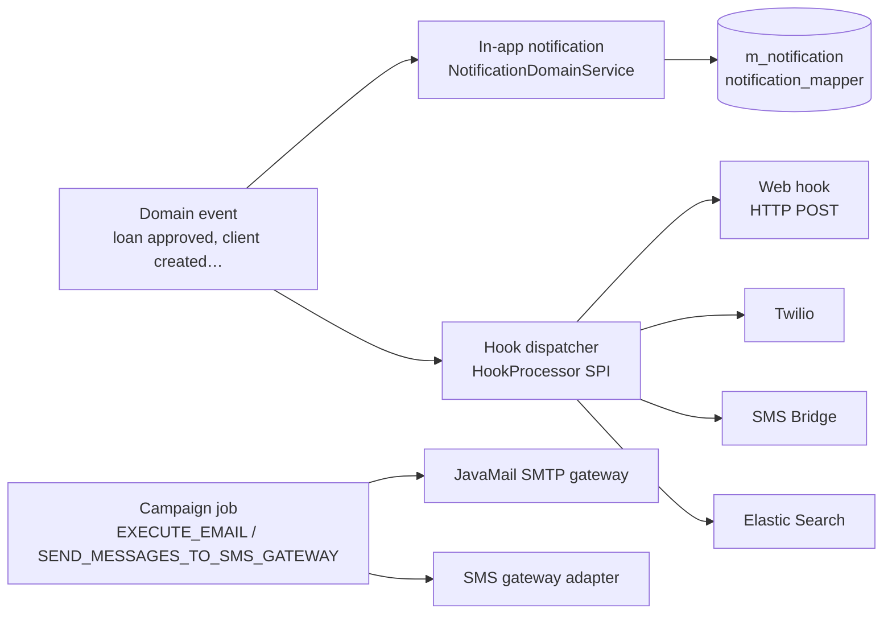
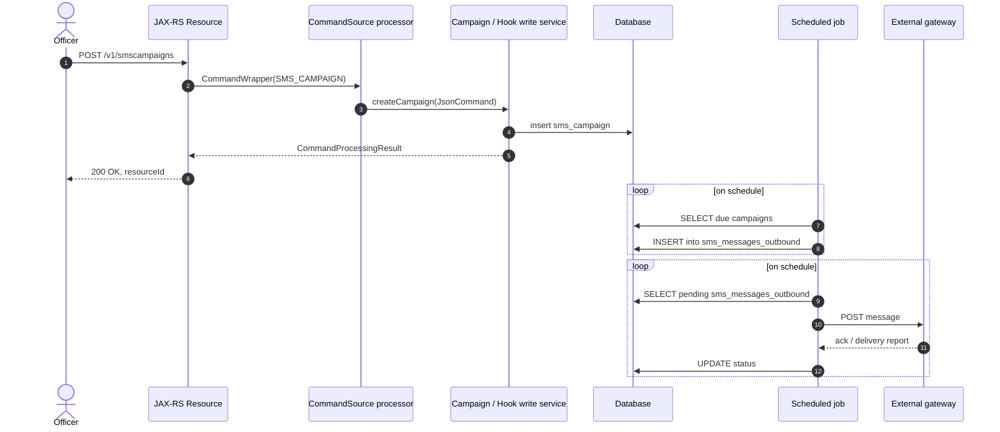
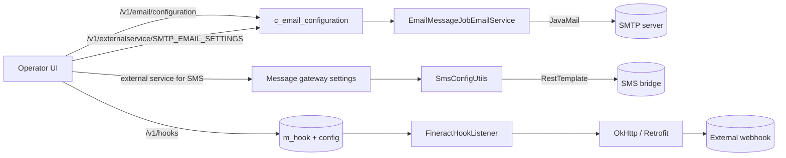

Apache Fineract bundles several loosely coupled subsystems for telling people that something has happened. There are in‑app notifications (the bell icon in the web UI), email and SMS *campaigns* that target lists of clients, *templates* that interpolate loan or client data into a message body, and a generic *Hooks* mechanism that fires HTTP requests to external systems when entities change. They share infrastructure — the scheduled job framework, the commands pipeline, the platform security context — but each has its own entities, API resource and write platform service.

This page is the orientation guide. Each child page drills into one subsystem and links back here. All paths below are repo‑relative inside the `apache/fineract` source tree.

## Where the code lives

In‑app notifications are split across two modules. The transport objects and the cross‑cutting `UserNotificationService` sit in `fineract-core`; the JAX‑RS resource, mappers and write services sit in `fineract-provider`.

```
fineract-core/src/main/java/org/apache/fineract/notification/
├── data/      NotificationData
└── service/   UserNotificationService

fineract-provider/src/main/java/org/apache/fineract/notification/
├── api/       NotificationApiResource, NotificationApiResourceSwagger
└── service/   NotificationReadPlatformService, NotificationWritePlatformService,
              NotificationMapperReadRepositoryWrapper, NotificationMapperWritePlatformService,
              NotificationGeneratorReadRepositoryWrapper, NotificationGeneratorWritePlatformService,
              NotificationDomainService, UserNotificationServiceImpl
```

Campaigns live entirely in `fineract-provider`:

```
fineract-provider/src/main/java/org/apache/fineract/infrastructure/campaigns/
├── constants/     Campaign-wide constants
├── helper/        Shared helpers
├── email/         api/ data/ domain/ exception/ handler/ service/
├── sms/           api/ constants/ data/ domain/ exception/ handler/ mapper/ serialization/ service/
└── jobs/          executeemail/
                  executereportmailingjobs/
                  getdeliveryreportsfromsmsgateway/
                  sendmessagetosmsgateway/
                  updateemailoutboundwithcampaignmessage/
                  updatesmsoutboundwithcampaignmessage/
```

Templates and Hooks are independent infrastructure packages:

```
fineract-provider/src/main/java/org/apache/fineract/template/
├── api/      TemplatesApiResource
├── command/  Template{Create,Update,Delete}Command
├── data/     Template{Create,Update,Delete}{Request,Response}, TemplateData
├── domain/   Template, TemplateMapper, TemplateEntity, TemplateType, TemplateFunctions
└── service/  TemplateDomainService, TemplateMergeService, TrustModifier

fineract-provider/src/main/java/org/apache/fineract/infrastructure/hooks/
├── api/        HookApiResource, HookApiConstants
├── domain/     Hook, HookConfiguration, HookResource, HookTemplate, HookSchema
└── processor/  HookProcessor, HookProcessorProvider,
               WebHookProcessor, WebHookService, ProcessorHelper,
               TwilioHookProcessor, MessageGatewayHookProcessor, ElasticSearchHookProcessor
```

## The four delivery channels



* **In‑app notifications** are written into `m_notification` and exposed at `GET /v1/notifications`. They are user‑targeted and addressed by user id via `notification_mapper`.
* **Email campaigns** schedule periodic emails by running a *Pentaho stretchy report*, formatting it through a Mustache template and delivering via JavaMail. The `EXECUTE_EMAIL` job drains them.
* **SMS campaigns** support three trigger types — `DIRECT`, `SCHEDULE` and `TRIGGERED` — and write rows to `sms_messages_outbound`, which the `SEND_MESSAGES_TO_SMS_GATEWAY` job ships to the configured gateway.
* **Hooks** are a generic SPI. A `Hook` row binds a `HookTemplate` (Web, SMS Bridge, Twilio, Elastic Search) to a set of events; when a matching event fires the `HookProcessorProvider` resolves the right `HookProcessor` and dispatches a payload.

## Templates and rendering

Every campaign body is a [Mustache](https://mustache.github.io/) template. The reusable infrastructure is the `Template` entity (`template/domain/Template.java`) and `TemplateMergeService`, which combines:

* the literal `text` of the template,
* zero or more `TemplateMapper` rows that point at REST endpoints (URLs from which JSON is fetched and exposed under a key in the template scope),
* a request payload supplied by the caller.

The same mechanism is reused by email/SMS campaigns to interpolate the result of a stretchy report into the message body, and by Hooks to render a payload before POSTing it to a webhook URL.

## Scheduled jobs

Notifications and campaigns lean heavily on the Spring Batch jobs registered through `JobName` (in `fineract-core`). The relevant entries are:

| `JobName` constant | Display name | Purpose |
|---|---|---|
| `UPDATE_SMS_OUTBOUND_WITH_CAMPAIGN_MESSAGE` | Update SMS Outbound with Campaign Message | Walk active SMS campaigns and queue messages. |
| `SEND_MESSAGES_TO_SMS_GATEWAY` | Send Messages to SMS Gateway | Push pending rows from `sms_messages_outbound`. |
| `GET_DELIVERY_REPORTS_FROM_SMS_GATEWAY` | Get Delivery Reports from SMS Gateway | Poll the gateway for status updates. |
| `UPDATE_EMAIL_OUTBOUND_WITH_CAMPAIGN_MESSAGE` | Update Email Outbound with campaign message | Build email messages from due campaigns. |
| `EXECUTE_EMAIL` | Execute Email | Send queued emails via JavaMail. |

Each job has its own package under `infrastructure/campaigns/jobs/` containing a Spring Batch `…Config` class (that registers the `Step` and `Job` against `JobName.X.name()`) and a `…Tasklet` that does the work.

## Permissions

Every campaign action is wrapped in a Maker‑Checker command (`SMS_CAMPAIGN`, `EMAIL_CAMPAIGN`, `HOOK`, etc.) and gated by a permission code. The standard CRUD pattern (`CREATE_*`, `UPDATE_*`, `DELETE_*`, `ACTIVATE_*`, `CLOSE_*`, `REACTIVATE_*`) applies, so a typical four‑eyes setup needs `CREATE_SMS_CAMPAIGN`, `CREATE_SMS_CAMPAIGN_CHECKER`, etc., on the relevant roles.

## How the pieces fit at runtime



The same pattern repeats for email campaigns (with `email_messages` and JavaMail in place of `sms_messages_outbound` and the gateway) and for in‑app notifications (with the `NotificationDomainService` raising events synchronously from inside command handlers).

## Subsystem map

<CardGroup cols={2}>
  <Card title="In-app notification service" icon="bell" href="/notification/notification-service">
    The `m_notification` table, `NotificationData`, the read/write services and `/v1/notifications`.
  </Card>
  <Card title="Email campaigns" icon="envelope" href="/notification/email-campaigns">
    `EmailCampaign`, the SMTP `EmailConfiguration`, recurring schedules and the `EXECUTE_EMAIL` job.
  </Card>
  <Card title="SMS campaigns" icon="message" href="/notification/sms-campaigns">
    `SmsCampaign` with DIRECT / SCHEDULE / TRIGGERED triggers, `sms_messages_outbound` and the gateway jobs.
  </Card>
  <Card title="Templates" icon="file-code" href="/notification/templates">
    Mustache‑rendered `Template`, `TemplateMapper`, the `TemplateMergeService` and `/v1/templates`.
  </Card>
  <Card title="Hooks" icon="webhook" href="/notification/hooks">
    `Hook`, `HookProcessor` SPI, the Web / Twilio / SMS Bridge / Elastic Search processors.
  </Card>
  <Card title="Hooks framework" icon="link" href="/core/hooks">
    Cross‑link: the lower‑level Hooks plumbing in `fineract-core`.
  </Card>
</CardGroup>

## Picking the right mechanism

<Tip>
Use **in‑app notifications** for back‑office messages targeting Fineract users (loan officers, supervisors). Use **email** or **SMS campaigns** for outbound messages targeting clients. Use **hooks** when you need to push entity changes to a *separate system* — a data warehouse, an external CRM, an analytics pipeline.
</Tip>

| Need | Use |
|---|---|
| "Tell the loan officer their loan was approved." | In‑app notification + email hook. |
| "Send all clients with overdue loans a reminder once a day." | SMS campaign, `SCHEDULE` trigger, stretchy report. |
| "Send a welcome SMS the moment a client is activated." | SMS campaign, `TRIGGERED` trigger on `CLIENT_ACTIVATE`. |
| "Index every loan transaction into Elastic." | Hook with the Elastic Search template. |
| "Forward every approved loan event to a partner REST API." | Hook with the Web template. |

## Configuration prerequisites

* **Email** — the `c_email_configuration` table must hold valid SMTP host, port, username, password, `useTLS` and `fromAddress` rows before any email campaign can be activated. See [Email campaigns](/notification/email-campaigns).
* **SMS** — campaigns reference an `sms_campaign.provider_id` which must point at a registered SMS gateway (Twilio, an SMS Bridge, etc.). See [SMS campaigns](/notification/sms-campaigns).
* **Hooks** — the target HookTemplate (Web, Twilio, SMS Bridge, Elastic Search) ships with Fineract; you only need to register a `Hook` row binding events to the template. See [Hooks](/notification/hooks).

## Data model summary

The five most important tables across all four subsystems:

| Table | Owned by | Purpose |
|---|---|---|
| `notification_generator` | In‑app | One row per emitted event (object, action, content). |
| `notification_mapper` | In‑app | One row per *recipient* with `is_read`. |
| `scheduled_email_campaign` | Email | Campaign definition (subject, body, recurrence, report). |
| `scheduled_email_messages_outbound` | Email | Outbound queue, each row a JavaMail send. |
| `c_email_configuration` | Email | Key/value SMTP settings (host, port, user, pass, TLS). |
| `sms_campaign` | SMS | Campaign definition with `campaign_trigger_type`. |
| `sms_messages_outbound` | SMS | Outbound queue, joined to a `provider_id`. |
| `m_template` / `m_templatemappers` | Templates | Mustache body + remote scope mappers. |
| `m_hook` / `m_hook_configuration` / `m_hook_registered_events` / `m_hook_template` | Hooks | Hook registration with key/value config and event subscriptions. |

## Choosing trigger and delivery semantics

The campaign subsystems share an *iCal RRULE* recurrence model and an enumerated trigger type. The table summarises which combinations make sense:

| Trigger type | Email | SMS | When the message is built | When it is delivered |
|---|---|---|---|---|
| `DIRECT` | ✅ | ✅ | At `activate` time. | Next run of the outbound‑update job. |
| `SCHEDULE` | ✅ | ✅ | When `next_trigger_date <= now()`. | Outbound‑update job, then send job. |
| `TRIGGERED` | ✅ (limited) | ✅ | Synchronously from a `BusinessEvent` listener. | Immediately, in the listener thread. |

For `TRIGGERED` campaigns:

* SMS support is comprehensive — `SmsCampaignDomainServiceImpl` registers listeners for the common entity lifecycle events.
* Email support is narrower; you may need to add a listener if you want a per‑event email.

For both `DIRECT` and `SCHEDULE`, the *Pentaho stretchy report* referenced by `business_rule_id` produces the recipient list. A single report row maps to a single message; columns in the row are exposed as Mustache scope keys.

## How configuration flows into delivery



The campaign jobs read the same SMTP credentials that the rest of the platform uses (via `ExternalServicesPropertiesReadPlatformService`), so reusing existing email infrastructure is encouraged. SMS uses an intermediate `Message Gateway` (a separate Fineract subproject); Hooks talk directly via OkHttp.

## Failure handling at a glance

| Subsystem | Failure mode | Visible state | Auto‑retry |
|---|---|---|---|
| In‑app notifications | Listener throws inside post‑commit | Logged; row not inserted. | No. |
| Email campaigns | JavaMail throws | `email_messages.status_enum = FAILED(400)`; `error_message` populated. | No — manual reset. |
| SMS campaigns | Bridge POST throws | `sms_messages_outbound` left at `WAITING_FOR_DELIVERY_REPORT(150)`. | Delivery‑report job retries reads, not writes. |
| Hooks | Webhook returns non‑2xx or throws | Logged in `FineractHookListener`. | No. |

For any production install, plan the manual or external mechanism that handles these.

## Next steps

<Note>
The campaign and notification subsystems were not designed to scale to millions of messages per minute — they assume a typical micro‑finance institution's volume. For high‑throughput outbound messaging, plug an external queue in front of the SMS / SMTP gateways and let Fineract's tasklets only enqueue.
</Note>

Continue with the [In‑app notification service](/notification/notification-service) for the `m_notification` pipeline, or jump to [Hooks](/notification/hooks) for the generic event‑to‑HTTP dispatcher. Each of the per‑subsystem pages contains the full entity schema, REST surface and job wiring; this overview is the orientation map.
