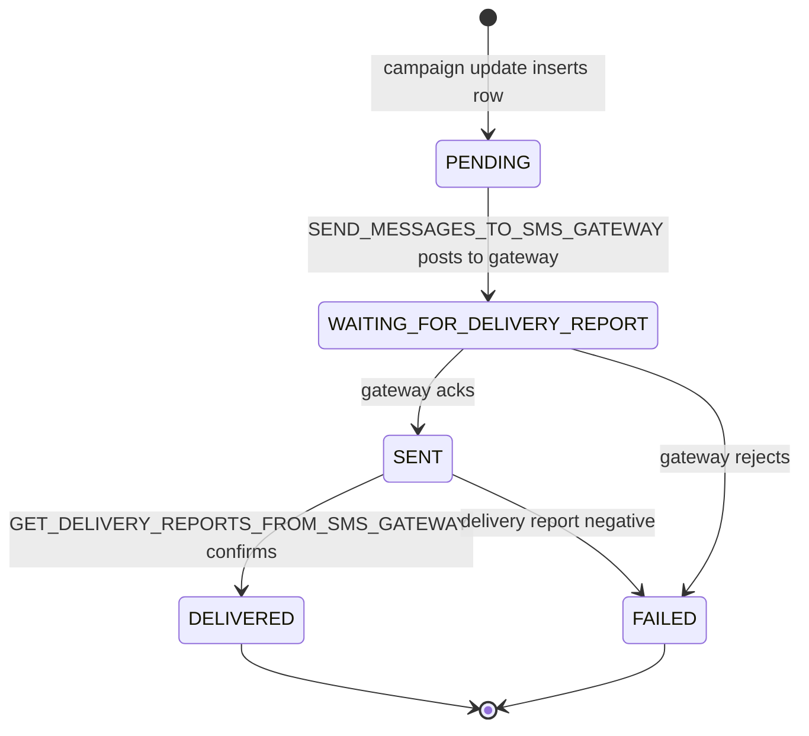
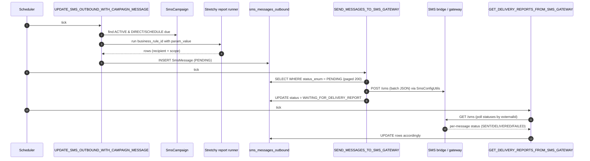

Apache Fineract's SMS subsystem is a near‑twin of [email campaigns](/notification/email-campaigns) with two important differences: outbound delivery talks to an *external HTTP SMS gateway* (rather than to JavaMail) and a fourth status — `WAITING_FOR_DELIVERY_REPORT` — captures the fact that SMS delivery is asynchronous and confirmed by polling.

The code lives in two cooperating packages:

* `org.apache.fineract.infrastructure.campaigns.sms` — campaign entity, write services and REST resource.
* `org.apache.fineract.infrastructure.sms` — the `SmsMessage` queue, the scheduled gateway sender, configuration helpers.

## Package layout

```
infrastructure/campaigns/sms/
├── api/                   SmsCampaignApiResource
├── constants/             SmsCampaignTriggerType, SmsCampaignStatus, SmsCampaignConstants
├── data/                  SmsCampaignData, validators, MessageGatewayConfigurationData
├── domain/                SmsCampaign            (table: sms_campaign)
│                          SmsCampaignRepository
│                          SmsCampaignStatusEnumerations
├── exception/             Domain-specific exceptions
├── handler/               Command handlers (create / update / activate / close / …)
├── mapper/                Row mappers
├── serialization/         JSON command-from-API parser
└── service/               SmsCampaignDomainService      (BUS event listener)
                           SmsCampaignReadPlatformService
                           SmsCampaignWritePlatformService

infrastructure/sms/
├── domain/                SmsMessage             (table: sms_messages_outbound)
├── scheduler/             SmsMessageScheduledJobService(Impl)
└── service/               SmsReadPlatformService, SmsWritePlatformService

infrastructure/campaigns/helper/SmsConfigUtils.java
infrastructure/campaigns/jobs/
├── updatesmsoutboundwithcampaignmessage/   UPDATE_SMS_OUTBOUND_WITH_CAMPAIGN_MESSAGE
├── sendmessagetosmsgateway/                SEND_MESSAGES_TO_SMS_GATEWAY
└── getdeliveryreportsfromsmsgateway/       GET_DELIVERY_REPORTS_FROM_SMS_GATEWAY
```

## The `SmsCampaign` entity

The table is `sms_campaign`. Schema (selected columns):

| Column | Type | Notes |
|---|---|---|
| `campaign_name` | `VARCHAR` | Operator‑facing label. |
| `campaign_type` | `INT` | Reserved / always `SMS`. |
| `campaign_trigger_type` | `INT` | `DIRECT=1`, `SCHEDULE=2`, `TRIGGERED=3` (see `SmsCampaignTriggerType`). |
| `provider_id` | `BIGINT` | FK into the registered SMS gateway list. `null` allowed for in‑app notifications only. |
| `business_rule_id` | `BIGINT` | FK to `stretchy_report` — defines the recipient set. |
| `param_value` | `LONGTEXT` | JSON parameters for the report. |
| `status_enum` | `INT` | `PENDING=100`, `ACTIVE=300`, `CLOSED=600` (see `SmsCampaignStatus`). |
| `message` | `TEXT` | Mustache body. |
| `recurrence` | `VARCHAR` | iCal RRULE (only when `SCHEDULE`). |
| `recurrence_start_date` | `TIMESTAMP` | Schedule anchor. |
| `next_trigger_date`, `last_trigger_date` | `TIMESTAMP` | Computed; advanced by the update job. |
| `is_notification` | `BOOLEAN` | Drop a copy into the in‑app notification stream too. |
| `is_visible` | `BOOLEAN` | Soft hide. |
| `submittedon_*`, `approvedon_*`, `closedon_*` | | Maker‑checker bookkeeping. |

The Java declaration:

```java
@Entity
public class SmsCampaign extends AbstractPersistableCustom<Long> {

    @Column(name = "campaign_name",         nullable = false) private String        campaignName;
    @Column(name = "campaign_type",         nullable = false) private Integer       campaignType;
    @Column(name = "campaign_trigger_type", nullable = false) private Integer       triggerType;
    @Column(name = "provider_id")                             private Long          providerId;
    @ManyToOne @JoinColumn(name = "business_rule_id")         private Report        businessRuleId;
    @Column(name = "param_value")                             private String        paramValue;
    @Column(name = "status_enum",   nullable = false)         private Integer       status;
    @Column(name = "message",       nullable = false)         private String        message;
    @Column(name = "recurrence")                              private String        recurrence;
    @Column(name = "next_trigger_date")                       private LocalDateTime nextTriggerDate;
    @Column(name = "last_trigger_date")                       private LocalDateTime lastTriggerDate;
    @Column(name = "recurrence_start_date")                   private LocalDateTime recurrenceStartDate;
    @Column(name = "is_visible")                              private boolean       isVisible;
    @Column(name = "is_notification")                         private boolean       isNotification;
    // … maker/checker fields …
}
```

### Trigger types

```java
public enum SmsCampaignTriggerType {
    INVALID(-1, "triggerType.invalid"),
    DIRECT(1,   "triggerType.direct"),
    SCHEDULE(2, "triggerType.schedule"),
    TRIGGERED(3,"triggerType.triggered");
}
```

| Trigger | When does the campaign send | Required fields |
|---|---|---|
| `DIRECT` | Once, immediately on `command=activate`. | `business_rule_id`, `message`. |
| `SCHEDULE` | At every fire of `recurrence`, starting `recurrence_start_date`. | `recurrence`, `recurrence_start_date`, `business_rule_id`, `message`. |
| `TRIGGERED` | Reactive to a domain business event (client activated, loan disbursed, etc.). | `message`, listener wired in `SmsCampaignDomainService`. |

The campaign exposes helpers to introspect the trigger type:

```java
public boolean isDirect()    { return SmsCampaignTriggerType.fromInt(triggerType).equals(DIRECT); }
public boolean isSchedule()  { return SmsCampaignTriggerType.fromInt(triggerType).equals(SCHEDULE); }
public boolean isTriggered() { return SmsCampaignTriggerType.fromInt(triggerType).equals(TRIGGERED); }
```

### Campaign status

```java
public enum SmsCampaignStatus {
    INVALID(-1,  "smsCampaignStatus.invalid"),
    PENDING(100, "smsCampaignStatus.pending"),
    ACTIVE(300,  "smsCampaignStatus.active"),
    CLOSED(600,  "smsCampaignStatus.closed");
}
```

State machine: `PENDING → ACTIVE → CLOSED`, with a `REACTIVATE` command from `CLOSED` back to `ACTIVE`.

## The outbound queue — `SmsMessage`

Per‑message rows go into `sms_messages_outbound`:

```java
@Entity
@Table(name = "sms_messages_outbound")
public class SmsMessage extends AbstractPersistableCustom<Long> {

    @Column(name = "external_id")                                  private String        externalId;
    @ManyToOne @JoinColumn(name = "group_id")                      private Group         group;
    @ManyToOne @JoinColumn(name = "client_id")                     private Client        client;
    @ManyToOne @JoinColumn(name = "staff_id")                      private Staff         staff;
    @ManyToOne @JoinColumn(name = "campaign_id")                   private SmsCampaign   smsCampaign;
    @Column(name = "status_enum",        nullable = false)         private Integer       statusType;
    @Column(name = "mobile_no",          length = 50)              private String        mobileNo;
    @Column(name = "message",            nullable = false)         private String        message;
    @Column(name = "submittedon_date")                             private LocalDate     submittedOnDate;
    @Column(name = "delivered_on_date")                            private LocalDateTime deliveredOnDate;
    @Column(name = "is_notification")                              private boolean       isNotification;
}
```

`externalId` is the message id assigned by the *gateway* on accept; it's the key the delivery‑report poll looks up.

### Status transitions

```java
public enum SmsMessageStatusType {
    PENDING(100, "smsMessageStatusType.pending"),
    WAITING_FOR_DELIVERY_REPORT(150, "smsMessageStatusType.waitingForDeliveryReport"),
    SENT(200,    "smsMessageStatusType.sent"),
    DELIVERED(300,"smsMessageStatusType.delivered"),
    FAILED(400,  "smsMessageStatusType.failed");
}
```



## Gateway adapter — `MessageGatewayConfigurationData`, `SmsConfigUtils`

Fineract does **not** speak to Twilio / Africa's Talking / etc. directly. Instead it ships messages to an *intermediate SMS bridge* (also called the *Message Gateway* — typically the `fineract-message-gateway` companion service) over HTTP. The bridge then translates to whichever SMS provider is configured.

The bridge address comes from `ExternalServicesPropertiesReadPlatformService` and is assembled by `SmsConfigUtils.getMessageGateWayRequestURI(...)`:

```java
@Component
public class SmsConfigUtils {
    public Map<String, Object> getMessageGateWayRequestURI(
            final String apiEndPoint, String apiQueueResourceDatas) { … }
}
```

It returns a `Map` with two keys — `"uri"` (a built `java.net.URI` like `https://bridge/sms`) and `"entity"` (a Spring `HttpEntity` carrying the JSON body and standard headers). The senders only have to `restTemplate.exchange(uri, POST, entity, …)`.

`MessageGatewayConfigurationData` is the in‑memory view of the bridge configuration; `SmsCampaignConstants.SMS` ("sms") is the conventional endpoint suffix.

## REST surface — `/v1/smscampaigns`

| Verb | Path | Purpose |
|---|---|---|
| `GET` | `/v1/smscampaigns/template` | Look up available reports, providers and trigger types. |
| `POST` | `/v1/smscampaigns` | Create. |
| `GET` | `/v1/smscampaigns` | List. |
| `GET` | `/v1/smscampaigns/{id}` | Retrieve one (returns `SmsCampaignData`). |
| `PUT` | `/v1/smscampaigns/{id}` | Update (only while `PENDING`). |
| `POST` | `/v1/smscampaigns/{id}?command=…` | `activate`, `close`, `reactivate`. |
| `POST` | `/v1/smscampaigns/preview` | Render Mustache against sample report rows. |
| `DELETE` | `/v1/smscampaigns/{id}` | Delete (only while `PENDING`). |

Every write goes through the standard `CommandsSourceWritePlatformService` so it can be queued by maker‑checker.

## End to end — three jobs

The lifecycle of a campaign message uses three distinct scheduled jobs.



### `UPDATE_SMS_OUTBOUND_WITH_CAMPAIGN_MESSAGE`

Declared in `UpdateSmsOutboundWithCampaignMessageConfig`:

```java
return new StepBuilder(JobName.UPDATE_SMS_OUTBOUND_WITH_CAMPAIGN_MESSAGE.name(), jobRepository)…
return new JobBuilder(JobName.UPDATE_SMS_OUTBOUND_WITH_CAMPAIGN_MESSAGE.name(), jobRepository)…
```

The tasklet iterates active `DIRECT` / `SCHEDULE` campaigns whose `next_trigger_date <= now()`, runs the business rule report, renders the Mustache message per row and inserts one `SmsMessage` in `PENDING` per recipient.

### `SEND_MESSAGES_TO_SMS_GATEWAY`

`SendMessageToSmsGatewayTasklet` pages through `findByStatusType(PENDING.getValue(), pageRequest)` 200 rows at a time:

```java
PageRequest pageRequest = PageRequest.of(0, pageLimit);
org.springframework.data.domain.Page<SmsMessage> pendingMessages =
        smsMessageRepository.findByStatusType(SmsMessageStatusType.PENDING.getValue(), pageRequest);

while (pendingMessageIterator.hasNext()) {
    SmsMessage smsData = pendingMessageIterator.next();
    if (smsData.isNotification()) {
        smsData.setStatusType(SmsMessageStatusType.WAITING_FOR_DELIVERY_REPORT.getValue());
        toSendNotificationMessages.add(smsData);
    } else {
        SmsMessageApiQueueResourceData apiQueueResourceData = SmsMessageApiQueueResourceData.instance(
                smsData.getId(), tenantIdentifier, null, null,
                smsData.getMobileNo(), smsData.getMessage(),
                smsData.getSmsCampaign().getProviderId());
        apiQueueResourceDataCollection.add(apiQueueResourceData);
        smsData.setStatusType(SmsMessageStatusType.WAITING_FOR_DELIVERY_REPORT.getValue());
        toSaveMessages.add(smsData);
    }
}

smsMessageRepository.saveAll(toSaveMessages);
smsMessageRepository.flush();
taskExecutor.execute(new SmsTask(ThreadLocalContextUtil.getTenant(), apiQueueResourceDataCollection));
```

Two important details:

1. **Status flips to `WAITING_FOR_DELIVERY_REPORT(150)` before the HTTP call** — so a crash mid‑post does not double‑send.
2. **Notification‑style messages (`is_notification = true`) are not posted to the gateway at all.** They are handed to `notificationSenderService.sendNotification(...)` for the in‑app channel.

The HTTP post itself uses `SmsConfigUtils.getMessageGateWayRequestURI("sms", apiQueueResourceDatas)` and a shared `RestTemplate`.

### `GET_DELIVERY_REPORTS_FROM_SMS_GATEWAY`

Declared in `GetDeliveryReportsFromSmsGatewayConfig` and runs the inverse: polls the bridge for status updates on rows in `WAITING_FOR_DELIVERY_REPORT` or `SENT`, then advances them to `DELIVERED` or `FAILED`. `SmsReadPlatformServiceImpl` exposes companion lookups:

```java
"… where smo.status_enum in (" +
    SmsMessageStatusType.WAITING_FOR_DELIVERY_REPORT.getValue() + "," +
    SmsMessageStatusType.SENT.getValue() + ") …"
```

## Triggered campaigns

When `triggerType = TRIGGERED`, `SmsCampaignDomainServiceImpl` registers `BusinessEventListener`s in `init()`. On the relevant event it:

1. Runs the campaign's stretchy report (often with the event's entity id as a parameter).
2. Renders the Mustache `message` against each row.
3. Calls `SmsMessageScheduledJobServiceImpl.sendTriggeredMessage(messages, providerId)` to ship them immediately rather than wait for the batch.

```java
public void sendTriggeredMessage(Collection<SmsMessage> smsMessages, long providerId) {
    // build SmsMessageApiQueueResourceData per message, POST to bridge
}
```

## Permissions

| Command | Permission codes |
|---|---|
| Create | `CREATE_SMS_CAMPAIGN`, `CREATE_SMS_CAMPAIGN_CHECKER` |
| Update | `UPDATE_SMS_CAMPAIGN`, `UPDATE_SMS_CAMPAIGN_CHECKER` |
| Activate / close / reactivate | `ACTIVATE_*`, `CLOSE_*`, `REACTIVATE_SMS_CAMPAIGN` |
| Delete | `DELETE_SMS_CAMPAIGN` |

## Operational notes

<Tip>
For *transactional* SMS (one specific event → one specific recipient) use `TRIGGERED`. For *bulk* SMS (everyone with overdue loans) use `SCHEDULE` and let the stretchy report do the segmentation.
</Tip>

<Warning>
The gateway adapter assumes the SMS bridge is reachable from every Fineract instance that runs the batch jobs. In multi‑instance deployments only the *batch* instance needs egress to the bridge — pin the SMS jobs to that node via [profile configuration](/runtime/profiles-and-instance-modes).
</Warning>

* **Idempotency.** The `externalId` returned by the bridge is the de‑duplication key for delivery reports. If you replace the bridge mid‑flight, ensure the new bridge respects the same id space or pending rows become unrecoverable.
* **In‑app fallback.** Setting `is_notification = true` on the campaign drops a copy into [in‑app notifications](/notification/notification-service); useful for *both* SMS *and* the bell icon.
* **Failure handling.** A `FAILED` row needs to be re‑queued manually (`PUT` the message back to `PENDING`); the gateway poller does not retry.

## Related reading

* [Notification and campaigns overview](/notification/overview).
* [Email campaigns](/notification/email-campaigns) — same command shape, different transport.
* [Templates](/notification/templates) — Mustache details.
* [Hooks](/notification/hooks) — push entity events to an external system as an alternative to TRIGGERED campaigns.
