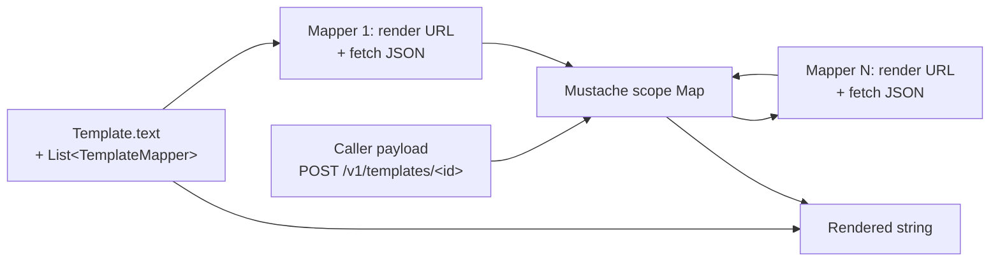
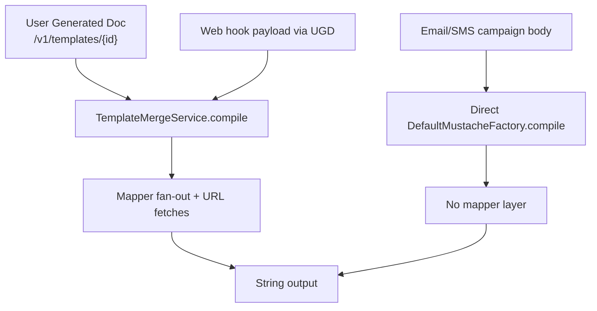

Apache Fineract calls them *User Generated Documents* (UGDs) in the UI, but at the code level they are simply `org.apache.fineract.template.domain.Template` rows that hold a *Mustache* string plus a list of *mappers*. The same primitive backs UGDs, email/SMS campaign bodies, and the payload renderer used by some Hook processors. Everything routes through one bean — `TemplateMergeServiceImpl` — which compiles the Mustache text once and fans data into a `Map<String, Object>` *scope*.

## Package layout

```
template/
├── api/
│   └── TemplatesApiResource.java         /v1/templates
├── command/
│   ├── TemplateCreateCommand.java
│   ├── TemplateUpdateCommand.java
│   └── TemplateDeleteCommand.java
├── data/
│   ├── TemplateData.java
│   ├── TemplateMapperData.java
│   ├── TemplateCreate{Request,Response}.java
│   ├── TemplateUpdate{Request,Response}.java
│   └── TemplateDelete{Request,Response}.java
├── domain/
│   ├── Template.java                     m_template
│   ├── TemplateMapper.java               m_templatemappers + join table
│   ├── TemplateEntity.java               CLIENT, LOAN
│   ├── TemplateType.java                 DOCUMENT, SMS
│   ├── TemplateFunctions.java            static helpers exposed in scope
│   └── TemplateRepository.java
└── service/
    ├── TemplateDomainService(Impl)       CRUD + lookup by entity/type
    ├── TemplateMergeService(Impl)        compile + execute
    └── TrustModifier.java                permissive TLS for mapper fetches
```

## Two entities, one join table

### `m_template` — `Template`

```java
@Entity
@Table(name = "m_template",
       uniqueConstraints = { @UniqueConstraint(columnNames = { "name" }, name = "unq_name") })
@Getter @Setter @NoArgsConstructor @Accessors(chain = true)
public class Template extends AbstractPersistableCustom<Long> {

    @Column(name = "name", nullable = false, unique = true)
    private String name;

    @Enumerated
    @JsonSerialize(using = TemplateEntitySerializer.class)
    private TemplateEntity entity;             // CLIENT, LOAN

    @Enumerated
    @JsonSerialize(using = TemplateTypeSerializer.class)
    private TemplateType type;                 // DOCUMENT, SMS

    @Column(name = "text", columnDefinition = "longtext", nullable = false)
    private String text;                       // the Mustache body

    @OrderBy(value = "mapperorder")
    @OneToMany(targetEntity = TemplateMapper.class,
               cascade = CascadeType.ALL, fetch = FetchType.EAGER)
    @JoinTable(name = "m_template_m_templatemappers",
        joinColumns        = { @JoinColumn(name = "m_template_id",  referencedColumnName = "id") },
        inverseJoinColumns = { @JoinColumn(name = "mappers_id",     referencedColumnName = "id", unique = true) })
    private List<TemplateMapper> mappers;
}
```

* `name` — globally unique; the lookup key from REST clients.
* `entity` (`TemplateEntity`) — `CLIENT(0)` or `LOAN(1)`. Helps the UI decide which tab to display the template on.
* `type` (`TemplateType`) — `DOCUMENT(0)` or `SMS(2)` (note: `EMAIL(1)` is commented out in source).
* `text` — the literal Mustache string. Anything `{{ … }}` is a tag.
* `mappers` — zero or more `TemplateMapper` rows in *evaluation order*. Each fetches a remote JSON document and binds it under a key in the scope.

### `m_templatemappers` — `TemplateMapper`

```java
@Entity
public class TemplateMapper extends AbstractPersistableCustom<Long> {
    @Column(name = "mapperorder") private int    mapperorder;
    @Column(name = "mapperkey")   private String mapperkey;
    @Column(name = "mappervalue") private String mappervalue;
}
```

* `mapperkey` — the scope variable name; once a mapper resolves, the template can reference `{{mapperkey.someField}}`.
* `mappervalue` — *itself* a Mustache template. It is rendered first (with the current scope), then the result is treated as a URL and fetched. The JSON response body is parsed and bound under `mapperkey`.

The `mapperorder` column lets a later mapper reference an earlier mapper's output in its URL.

## Render pipeline

`TemplateMergeServiceImpl.compile(TemplateData template, Map<String, Object> scopes)`:

```java
@Override
public String compile(final TemplateData template, final Map<String, Object> scopes) {
    scopes.put("static", TemplateFunctions.INSTANCE);

    var mf = new DefaultMustacheFactory();
    var mustache = mf.compile(new StringReader(template.getText()), template.getName());

    compiledMapFromMappers(asMap(template.getMappers()), scopes);

    expandMapArrays(scopes);

    var stringWriter = new StringWriter();
    mustache.execute(stringWriter, scopes);

    return stringWriter.toString();
}
```

The mapper fan‑out walks the ordered list:

```java
private void compiledMapFromMappers(final Map<String, String> data, final Map<String, Object> scopes) {
    final MustacheFactory mf = new DefaultMustacheFactory();
    if (data != null) {
        for (final Map.Entry<String, String> entry : data.entrySet()) {
            final Mustache mappersMustache = mf.compile(new StringReader(entry.getValue()), "");
            final StringWriter stringWriter = new StringWriter();
            mappersMustache.execute(stringWriter, scopes);
            String url = stringWriter.toString();
            if (!url.startsWith("http")) {
                url = scopes.get("BASE_URI") + url;
            }
            try {
                scopes.put(entry.getKey(), getMapFromUrl(url));
            } catch (final IOException e) {
                log.error("getCompiledMapFromMappers() failed", e);
            }
        }
    }
}
```



`getMapFromUrl(url)` performs an HTTP GET — if `Content-Type` is `text/plain` the body is stuffed under `src`, otherwise the JSON is parsed by Jackson and the resulting map is bound directly. Relative mapper URLs are resolved against `BASE_URI`, which the caller seeds in the scope (typically the Fineract base URL itself).

<Note>
Mapper fetches happen synchronously during render — slow mappers will slow down every notification that uses the template. Cache aggressively on the upstream side.
</Note>

## Built‑in scope helpers

`TemplateFunctions` is a tiny utility object bound under the scope key `static`:

```java
public final class TemplateFunctions {
    public static final TemplateFunctions INSTANCE = new TemplateFunctions();
    public static String now() { … }
}
```

That means templates can write `{{static.now}}` to inline the current timestamp. The class is intentionally small — new helpers belong here rather than in ad‑hoc template scopes.

## Permissions and trust modifier

`TemplateMergeServiceImpl` cooperates with `SecurityContextHolder` to refuse template rendering by anonymous principals; the Mustache‑expanded URL is then fetched by `TrustModifier` — a deliberately permissive `X509TrustManager` so internal HTTPS endpoints with self‑signed certs work out of the box. Don't expose templates with mapper URLs that point at untrusted hosts.

<Warning>
`TrustModifier` disables TLS hostname verification for mapper fetches. Treat mapper URLs as *configuration*, not *input* — they must come from trusted operators only. Validation of submitted templates is what stands between you and SSRF.
</Warning>

## REST surface — `/v1/templates`

The resource is short. Selected endpoints:

| Verb | Path | Purpose |
|---|---|---|
| `GET` | `/v1/templates` | List templates, optionally filtered by `?entityId=` and `?typeId=`. |
| `GET` | `/v1/templates/template` | Look up template options (entity / type enums) for create UIs. |
| `GET` | `/v1/templates/{templateId}` | Retrieve the entity itself (text + mappers). |
| `GET` | `/v1/templates/{templateId}/template` | Same payload, structured for the create UI. |
| `POST` | `/v1/templates` | Create. |
| `PUT` | `/v1/templates/{templateId}` | Update. |
| `DELETE` | `/v1/templates/{templateId}` | Delete. |
| `POST` | `/v1/templates/{templateId}` | **Render**. Body is the request scope; response is the rendered string. |

The resource class shape, abbreviated:

```java
@Path("/v1/templates")
@Consumes({ MediaType.APPLICATION_JSON })
@Produces({ MediaType.APPLICATION_JSON })
@Component
@Tag(name = "templates", description = """
        User Generated Documents (alternatively, Templates) are used for end-user features
        such as custom user defined document generation (AKA UGD). They are based on
        {{ moustache }} templates. …""")
@RequiredArgsConstructor
public class TemplatesApiResource {
    public static final String ID            = "id";
    public static final String PARAM_TEMPLATE = "template";

    private final TemplateDomainService   templateService;
    private final TemplateMergeServiceImpl templateMergeService;
    private final CommandDispatcher       dispatcher;
}
```

Write operations are *dispatched* through `CommandDispatcher` so they participate in maker‑checker; the matching commands live next door under `template/command/` (`TemplateCreateCommand`, `TemplateUpdateCommand`, `TemplateDeleteCommand`).

### Sample create

```json
POST /v1/templates
{
  "name": "loan-approval-email",
  "entity": "loan",
  "type": "Document",
  "text": "Dear {{client.displayName}},\n\nLoan {{loanId}} for {{amount}} {{currency}} was approved on {{static.now}}.",
  "mappers": [
    {
      "mapperorder": 0,
      "mapperkey":   "client",
      "mappervalue": "/fineract-provider/api/v1/clients/{{clientId}}"
    }
  ]
}
```

### Sample render

```json
POST /v1/templates/42
{
  "loanId":   17,
  "clientId": 9,
  "amount":   1000,
  "currency": "USD",
  "BASE_URI": "https://fineract.local"
}
```

The mapper renders `/fineract-provider/api/v1/clients/9`, fetches that JSON, binds it under `client`, and then the body Mustache resolves `{{client.displayName}}` from the fetched document.

## Enumerations

```java
public enum TemplateEntity {
    @SerializedName("client") CLIENT(0, "client"),
    @SerializedName("loan")   LOAN(1,   "loan");
}

public enum TemplateType {
    @SerializedName("Document") DOCUMENT(0, "Document"),
    // @SerializedName("E-Mail") EMAIL(1, "E-Mail")   // reserved, currently commented out
    @SerializedName("SMS")      SMS(2,      "SMS");
}
```

Adding a new entity (e.g. `SAVINGS`) means extending both the enum and the JSON serializer; campaigns that filter by entity (`TemplateDomainService.getAllByEntityAndType`) pick it up automatically.

## How campaigns use templates

Email and SMS campaigns embed Mustache directly in their `email_message` / `email_subject` / `message` columns rather than referencing a `Template` row — the rendering goes through the same `DefaultMustacheFactory` but skips the `m_template` lookup. The shared infrastructure (mapper resolution, `TemplateFunctions`) is therefore available *only* when `TemplateMergeService.compile(...)` is invoked directly; campaign bodies are pure Mustache against the report row scope.



If a campaign needs the mapper machinery, it should reference a `Template` row by `ugdTemplate` (`Hook.ugdTemplate`) or fetch it via `/v1/templates/{id}` before send.

## Permissions

The standard CRUD codes apply:

| Action | Permission |
|---|---|
| Create | `CREATE_TEMPLATE`, `CREATE_TEMPLATE_CHECKER` |
| Update | `UPDATE_TEMPLATE`, `UPDATE_TEMPLATE_CHECKER` |
| Delete | `DELETE_TEMPLATE`, `DELETE_TEMPLATE_CHECKER` |
| Read / render | `READ_TEMPLATE` |

## Operational tips

<Tip>
Render the template in a unit test before binding it to a campaign — `DefaultMustacheFactory` failures only show up at render time. Use the `/v1/templates/{id}` (POST) endpoint with sample data as a quick "preview" loop.
</Tip>

* **Idempotency.** Renders are pure; the same scope + same template always yields the same string. Mapper HTTP responses are not cached, so each render incurs the round trips.
* **Scope keys to avoid.** `static`, `BASE_URI` and every mapper `mapperkey` you declare are reserved per render.
* **Failure mode.** A failed mapper fetch is logged and the key is left *unbound*; Mustache silently substitutes empty string. Templates therefore quietly degrade rather than throwing — design defensive Mustache (e.g. `{{#client}}{{displayName}}{{/client}}`).

## Related reading

* [Notification and campaigns overview](/notification/overview).
* [Email campaigns](/notification/email-campaigns) — campaign bodies are Mustache too.
* [SMS campaigns](/notification/sms-campaigns) — same.
* [Hooks](/notification/hooks) — `Hook.ugdTemplate` points at a `Template` row for payload shaping.
