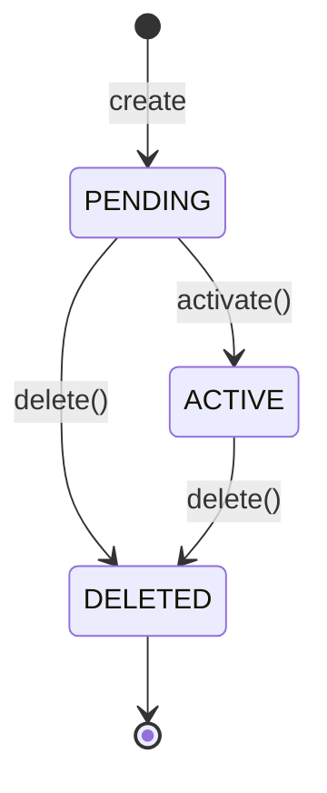
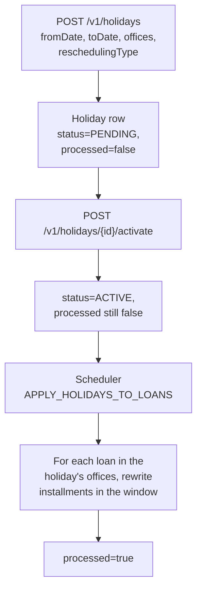
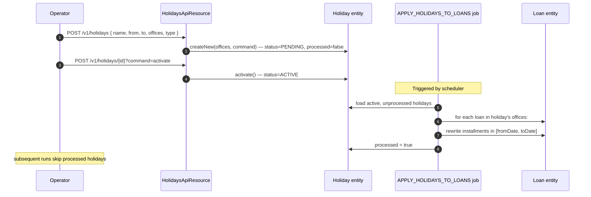

Apache Fineract lets each tenant declare named holidays that automatically push loan repayments off the holiday window and onto a business day. A holiday is owned by one or more offices, carries a date range, and selects between two reschedule strategies — move to the next scheduled repayment, or move to an explicit date. The actual loan-schedule rewrite happens off-line in a scheduled job, `APPLY_HOLIDAYS_TO_LOANS`, so a brand-new holiday does not block the API thread. The domain mapping lives in `fineract-core/src/main/java/org/apache/fineract/organisation/holiday/domain/Holiday.java`.

## Entity shape

`Holiday extends AbstractPersistableCustom<Long>`, mapped to `m_holiday` with the unique constraint `holiday_name` on `name`.

| Field | Column | Notes |
| --- | --- | --- |
| `name` | `name`, length 100 | Unique. Display name (e.g. "National Day 2025"). |
| `fromDate` | `from_date` | Inclusive start of the holiday window. |
| `toDate` | `to_date` | Inclusive end of the holiday window. |
| `repaymentsRescheduledTo` | `repayments_rescheduled_to` | Target date when `reschedulingType = RESCHEDULETOSPECIFICDATE`; `null` otherwise. |
| `reschedulingType` | `rescheduling_type` | Int code — `RescheduleType` enum. |
| `status` | `status_enum` | Int code — `HolidayStatusType` enum. |
| `processed` | `processed` | Boolean. Flipped by the batch job once schedules are rewritten. |
| `description` | `description`, length 100 | Free text. |
| `offices` | join table `m_holiday_office` | `@ManyToMany(EAGER) Set<Office>`. The holiday applies to these offices. |

`AbstractPersistableCustom` provides the `id` PK; the `processed` flag is `false` on insert and only the batch job flips it to `true`.

## Reschedule type

`RescheduleType` (in the same package) is the holiday-side strategy enum — distinct from the working-days `RepaymentRescheduleType`.

```java
public enum RescheduleType {
    INVALID(0,                       "rescheduletype.invalid"),
    RESCHEDULETOSPECIFICDATE(2,      "rescheduletype.rescheduletospecificdate"),
    RESCHEDULETONEXTREPAYMENTDATE(1, "rescheduletype.rescheduletonextrepaymentdate");
}
```

- **`RESCHEDULETOSPECIFICDATE` (2)** — push every repayment that falls inside `[fromDate, toDate]` to `repaymentsRescheduledTo`. Typical use: a multi-day public holiday closed by a known re-opening date.
- **`RESCHEDULETONEXTREPAYMENTDATE` (1)** — collapse the affected installment into the *next* installment of the same loan. The `repaymentsRescheduledTo` column is forced to `null` on update because no explicit date is needed.

`Holiday.update` enforces the relationship — when the type is changed to `RESCHEDULETONEXTREPAYMENTDATE`, the rescheduled-to date is cleared:

```java
if (newValue.equals(RescheduleType.RESCHEDULETONEXTREPAYMENTDATE.getValue())) {
    this.repaymentsRescheduledTo = null;
}
```

## Status lifecycle

`HolidayStatusType` defines the publication state machine:



The `activate()` and `delete()` methods on the entity guard these transitions:

```java
public void activate() {
    if (!currentStatus.isPendingActivation()) {
        baseDataValidator.reset().failWithCodeNoParameterAddedToErrorCode(
            "not.in.pending.for.activation.state");
        // throws if invalid
    }
    this.status = HolidayStatusType.ACTIVE.getValue();
}

public void delete() {
    if (currentStatus.isDeleted()) {
        baseDataValidator.reset().failWithCodeNoParameterAddedToErrorCode(
            "already.in.deleted.state");
    }
    this.status = HolidayStatusType.DELETED.getValue();
}
```

A `PENDING` holiday is fully editable — `fromDate`, `toDate`, `repaymentsRescheduledTo`, and the offices set can all be changed via `update(JsonCommand)`. Once `ACTIVE`, those four are locked; only `name`, `description`, and `reschedulingType` may change. The validation block raises `cannot.edit.holiday.in.active.state` for forbidden edits.

## Office scoping

The `m_holiday_office` join table associates a holiday with a non-empty set of offices. Loans booked at any of those offices are affected by the holiday. Common patterns:

- **National holiday** — attach to the head office and every branch.
- **Regional holiday** — attach only to the branches in the affected region.
- **Office anniversary** — attach only to that single office.

`Holiday.update(Set<Office> newOffices)` is a separate signature that swaps the office set wholesale. It returns `true` if the set actually changed, so the write-platform service can decide whether to bump the audit row.

## End-to-end flow



The loans that get rewritten satisfy three predicates:

1. The loan's office is in `Holiday.offices`.
2. The loan is open (active, in-arrears or otherwise non-closed) on a date within `[fromDate, toDate]`.
3. The loan has at least one unpaid scheduled installment whose `dueDate` falls inside the window.

For each affected installment, the job applies the `reschedulingType`:

- **Specific date** — the installment's `dueDate` is set to `repaymentsRescheduledTo`. Multiple installments in the window collapse onto that one date.
- **Next repayment date** — the installment's amounts roll into the next future installment that lies outside the holiday window, and the affected installment is removed.

The work is idempotent — replays use the `processed` flag to short-circuit.

<Warning>
The job runs against active holidays only. A holiday left in `PENDING` will never rewrite any schedule, even if its window has passed. Always call the `activate` command after creating a holiday.
</Warning>

## The `/v1/holidays` API

| Method | Path | Permission | Purpose |
| --- | --- | --- | --- |
| `GET` | `/v1/holidays?officeId=` | `READ_HOLIDAY` | List holidays for an office. |
| `GET` | `/v1/holidays/template` | `READ_HOLIDAY` | Reschedule-type options and office picker. |
| `GET` | `/v1/holidays/{holidayId}` | `READ_HOLIDAY` | Single holiday. |
| `POST` | `/v1/holidays` | `CREATE_HOLIDAY` | Create in `PENDING`. |
| `POST` | `/v1/holidays/{holidayId}?command=activate` | `ACTIVATE_HOLIDAY` | Transition to `ACTIVE`. |
| `PUT` | `/v1/holidays/{holidayId}` | `UPDATE_HOLIDAY` | Apply the `Holiday.update` delta. |
| `DELETE` | `/v1/holidays/{holidayId}` | `DELETE_HOLIDAY` | Soft-delete via `Holiday.delete()`. |

Mutating calls go through `CommandsSourceWritePlatformService` and produce maker-checker rows in `m_portfolio_command_source`.

## Interaction with working days

The working-days entity (`WorkingDays`, `m_working_days`) and the holiday entity are complementary:

- **Working days** govern the recurring weekly pattern — Saturday and Sunday are typically non-working.
- **Holidays** are one-off date ranges layered on top.

When a loan installment lands on a calendar date, the schedule engine asks:

1. Is the date inside an active, in-window `Holiday` for the loan's office? If yes, apply the holiday `reschedulingType`.
2. Otherwise, is the date a non-working day per `WorkingDays.recurrence`? If yes, apply the working-days `RepaymentRescheduleType`.

Holidays win when both apply; the holiday's specific-date target is not re-shifted for being non-working.

## The batch job

`APPLY_HOLIDAYS_TO_LOANS` is registered by the scheduler with the standard tenant-aware lock. It is normally configured to run once daily, after end-of-day close. The job query selects loans whose office matches any unprocessed active holiday and walks each loan's installments to rewrite the schedule. The journal entries for already-posted transactions are not rewritten — the holiday only affects future dues.

<Note>
A holiday whose window lies entirely in the past still has effect if any loan still has unpaid installments inside the window; the rescheduling pushes those installments forward as if the holiday were processed on time.
</Note>

## Worked example

A two-day national holiday on 25–26 December applied to the whole institution, with `RESCHEDULETOSPECIFICDATE = 2025-12-29`:

- Loan #5001 has installment #4 due 2025-12-25 (5,000) and installment #5 due 2026-01-01 (5,000).
- The job moves installment #4 to 2025-12-29 and leaves installment #5 untouched.

Same holiday with `RESCHEDULETONEXTREPAYMENTDATE`:

- The job removes installment #4 and folds its 5,000 amount into installment #5, which becomes 10,000 due 2026-01-01.

<CardGroup cols={2}>
  <Card title="Working Days" href="/organisation/working-days">
    Weekly recurrence and non-working-day fall-through behaviour.
  </Card>
  <Card title="Offices" href="/organisation/offices">
    Holidays attach to one or more offices via `m_holiday_office`.
  </Card>
</CardGroup>

## Lifecycle sequence



## Holiday vs working-days vs allow-transactions

The three knobs combine differently for *scheduling* (when is the next installment due) versus *posting* (can a transaction be booked on this date).

| Date predicate | Scheduling behaviour | Posting behaviour |
| --- | --- | --- |
| In active holiday window | Installment shifted per holiday `reschedulingType` | Rejected unless `allow-transactions-on-non_workingday = true`. |
| Not in holiday, but non-working day per RRULE | Installment shifted per `WorkingDays.repaymentReschedulingType` | Rejected unless `allow-transactions-on-non_workingday = true`. |
| Regular working day | Installment kept on the date | Accepted. |

The holiday entity owns the scheduling shift only; the posting rejection is governed by the global configuration toggle described on the working-days page.

## Audit and reporting

- Every create/activate/update/delete is logged through `CommandsSourceWritePlatformService`, producing a `m_portfolio_command_source` row that participates in maker-checker.
- The `processed` boolean is the operational truth — a holiday that is `ACTIVE` but with `processed = false` is the work queue for the next job run.
- The history report "Holidays applied" pulls active and processed holidays for an office and shows the count of installments rewritten.

## Common pitfalls

- **Creating a holiday after disbursing affected loans.** The job will still rewrite their schedules at the next run — but the existing repayment-schedule preview the customer was shown is now stale. Re-send the schedule.
- **Setting the rescheduled date inside the holiday window.** `repaymentsRescheduledTo` must be a working day outside `[fromDate, toDate]`; the validator catches both rules.
- **Forgetting to activate.** A `PENDING` holiday has zero effect. The activate command is non-optional.
- **Holiday spans a working-days change.** If the RRULE is also being changed, run the working-days update first so the schedule engine reads a consistent calendar.

## Working with the offices set

Two API patterns for managing the office collection on a holiday:

- **Initial creation** — the request body includes `offices: [{officeId: 5}, {officeId: 12}, ...]`. The factory `Holiday.createNew(offices, command)` resolves each id to an `Office` and links the holiday.
- **Subsequent edit** — while `PENDING`, the same `offices` array can be sent on a PUT. The wholesale `update(Set<Office>)` swap replaces the link rows.

For institution-wide holidays where every office should be affected, the common pattern is to enumerate every office id rather than introduce a sentinel "all offices" value — this keeps the schema predicate `WHERE office_id = ?` simple at the read layer.

## Edge cases

- **Same-day holiday.** `fromDate = toDate` is supported. The window is a single day; the rescheduled date must be a future working day.
- **Overlapping holidays for the same office.** Multiple active holidays may cover the same date in the same office. The schedule engine resolves them in `id` order, applying the earliest-created first; for installments rewritten in the first pass, the second holiday becomes a no-op.
- **Holiday for a closed loan.** Closed loans are not rewritten — the closure date already supersedes the schedule. Re-opened loans are reconsidered at the next batch run.
- **Holiday with `repaymentsRescheduledTo` on a holiday.** Validated at create time — the target must not lie inside another active holiday window in the same office.

## Read-side data

`HolidayData` (in `fineract-provider/.../organisation/holiday/data/`) is the JSON projection returned by the API. It carries the bands and the office list expanded into id+name pairs for the UI.

The "Office holidays" report joins `m_holiday`, `m_holiday_office`, and `m_office` so users can browse holidays by office and by date range. The report includes the `processed` flag so reconciliation teams can quickly spot stale entries.

## Validation summary

- `name` is required and unique tenant-wide.
- `fromDate <= toDate`.
- `reschedulingType` must be `RESCHEDULETONEXTREPAYMENTDATE` or `RESCHEDULETOSPECIFICDATE` — `INVALID` is rejected.
- When `reschedulingType = RESCHEDULETOSPECIFICDATE`, `repaymentsRescheduledTo` is required and must lie outside `[fromDate, toDate]`.
- When `reschedulingType = RESCHEDULETONEXTREPAYMENTDATE`, `repaymentsRescheduledTo` is forced to `null` on update.
- `offices` must contain at least one office id.
- A holiday in `ACTIVE` status cannot have its `fromDate`, `toDate`, `repaymentsRescheduledTo`, or office set changed; only `name`, `description`, and `reschedulingType` may be edited.
- A holiday in `DELETED` status is a no-op for the batch job and cannot be re-activated.
