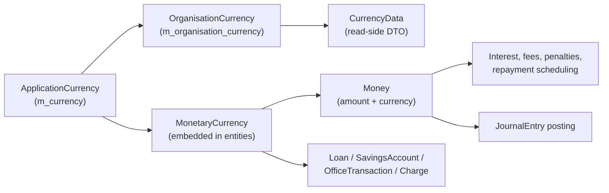

Apache Fineract handles money through a small but central trio of types — `ApplicationCurrency` is the tenant-wide catalogue row, `MonetaryCurrency` is the embeddable currency-stamp used inside every monetary entity, and `Money` is the immutable amount-plus-currency value object that flows through the calculation paths. They all live in `fineract-core/src/main/java/org/apache/fineract/organisation/monetary/domain/`.

## `ApplicationCurrency` — the catalogue entry

`ApplicationCurrency extends AbstractPersistableCustom<Long>`, mapped to `m_currency`. Each row defines a single currency the tenant supports, with the rounding policy the platform uses for that currency.

| Field | Column | Notes |
| --- | --- | --- |
| `code` | `code`, length 3 | ISO 4217 code: `USD`, `EUR`, `KES`, `INR`, ... |
| `decimalPlaces` | `decimal_places` | Required. 2 for most fiat, 0 for `JPY` / `KRW`, more for some crypto. |
| `inMultiplesOf` | `currency_multiplesof` | Optional. Smallest tradable unit — e.g. 50 for a currency rounded to half-cents. |
| `name` | `name`, length 50 | Display name: "US Dollar". |
| `nameCode` | `internationalized_name_code`, length 50 | i18n key for the display name. |
| `displaySymbol` | `display_symbol`, length 10 | `$`, `€`, `Ksh`. |

Two helpers shape consumption:

```java
public static ApplicationCurrency from(ApplicationCurrency currency,
        int decimalPlaces, Integer inMultiplesOf);

public OrganisationCurrency toOrganisationCurrency();
public CurrencyData toData();
```

`from(...)` produces a derived row with overridden rounding for a product that wants tighter precision than the catalogue default. `toOrganisationCurrency()` materialises the per-tenant view (`OrganisationCurrency`) used by configuration dialogs. `toData()` is the read-side projection (`CurrencyData`) embedded in API responses.

`OrganisationCurrency` is a sibling entity mapped to `m_organisation_currency` that records which catalogue codes are actively enabled for the tenant — the catalogue is global, the per-tenant pick is narrower.

## `MonetaryCurrency` — the embeddable currency stamp

`MonetaryCurrency` is an `@Embeddable`. It is **not** a row of its own — instead it is inlined into every monetary entity to stamp the currency context of an amount.

```java
@Embeddable
public class MonetaryCurrency {
    @Column(name = "currency_code", length = 3, nullable = false)
    private String code;

    @Column(name = "currency_digits", nullable = false)
    private int digitsAfterDecimal;

    @Column(name = "currency_multiplesof")
    private Integer inMultiplesOf;

    private transient CurrencyData currencyData;
}
```

When you see `@Embedded MonetaryCurrency` inside `Loan`, `SavingsAccount`, `LoanProduct`, `SavingsProduct`, `OfficeTransaction`, `JournalEntry`-adjacent rows and so on, those three columns are inlined into the owning table. The embedding pattern means every amount on the row is already paired with its rounding policy, and there is no separate join to resolve the currency.

The factories:

```java
public MonetaryCurrency copy();
public static MonetaryCurrency fromApplicationCurrency(ApplicationCurrency a);
public static MonetaryCurrency fromCurrencyData(CurrencyData currencyData);
public CurrencyData toData();
```

`copy()` is the safe way to clone the stamp into a new entity. `fromApplicationCurrency` is the standard way to lift a catalogue row down into a product or account. `toData()` materialises the read-side `CurrencyData` and lazily caches it on the transient field — repeated calls on the same instance reuse the same `CurrencyData`.

## `Money` — the immutable amount

`Money` is the canonical "amount in a currency" type. It is immutable, comparable, and its constructor enforces the currency's rounding policy.

```java
public class Money implements Comparable<Money> {
    private final BigDecimal amount;
    private final CurrencyData currency;
    private final transient MathContext mc;
}
```

The private constructor — the only path to a `Money` instance — applies two rules in order:

1. **`stripTrailingZeros`** on the input amount to normalise the unscaled form.
2. **Multiples-of rounding** when `decimalPlaces == 0`, `inMultiplesOf > 0`, and the amount is positive: snap the value to the nearest multiple via `roundToMultiplesOf(amount, inMultiplesOf)`.
3. **Decimal-place scaling** — `setScale(decimalPlaces, mc.getRoundingMode())` clamps to the currency's precision using the configured rounding mode.

This means you cannot construct a `Money` with rogue precision. A currency with `decimalPlaces = 2` will always carry an `amount` with exactly two fractional digits. A currency with `decimalPlaces = 0` and `inMultiplesOf = 50` rounds 4,723 to 4,700.

### Factories

```java
Money.of(CurrencyData currency, BigDecimal amount);
Money.of(MonetaryCurrency currency, BigDecimal amount);
Money.zero(MonetaryCurrency currency);
Money.total(Money... monies);
Money.total(Iterable<? extends Money> monies);
```

`zero` returns an instance with `amount = 0` already scaled to the currency. `total` requires at least one input and walks the rest via `plus`. A currency mismatch in `plus` / `minus` raises an `IllegalArgumentException` — the platform never coerces between currencies silently.

### Arithmetic

`Money` exposes the usual operators — `plus`, `minus`, `multipliedBy`, `dividedBy`, `negated`, `abs`, plus comparison helpers `isGreaterThan`, `isLessThan`, `isEqualTo`, `isZero`. Each operation:

1. Asserts the operand currency matches.
2. Applies the configured `MathContext` (default precision is decided by `MoneyHelper.getMathContext()`, sourced from the `MoneyHelper` global config).
3. Re-applies the multiples-of and decimal-place rounding so the result is a well-formed amount in the same currency.

The rounding mode comes from `MoneyHelper`. By default it is `HALF_EVEN` (banker's rounding), but the deployment can override it via configuration to switch to `HALF_UP` or `HALF_DOWN` for jurisdictions where that is mandated.

## Wiring across the platform



- `ApplicationCurrency` is the source of truth.
- `OrganisationCurrency` is the per-tenant enabled subset.
- `MonetaryCurrency` is embedded into the row that owns money.
- `Money` is what calculation code passes around.
- `CurrencyData` is what the API returns.

## Worked rounding example

Take a Kenyan-shilling product with `decimalPlaces = 0` and `inMultiplesOf = 50`:

- Loan principal calculation produces `BigDecimal("12347.36")`.
- `Money.of(KES, 12347.36)` strips trailing zeros (no-op), notices `decimalPlaces == 0` and `inMultiplesOf == 50`, rounds to 12,350, then `setScale(0)` yields `12350`.
- Adding `Money.of(KES, 25)` to it yields `Money.of(KES, 12375)` after the same rounding pipeline.

Compare USD with `decimalPlaces = 2`, `inMultiplesOf = null`:

- `Money.of(USD, "100.005")` ends up at `100.00` or `100.01` depending on `HALF_EVEN` vs `HALF_UP`.

## The `/v1/currencies` API

| Method | Path | Permission | Purpose |
| --- | --- | --- | --- |
| `GET` | `/v1/currencies` | `READ_CURRENCY` | List enabled (and optionally all catalogue) currencies. |
| `PUT` | `/v1/currencies` | `UPDATE_CURRENCY` | Swap the set of enabled currency codes for the tenant. |

The PUT body is `{ "currencies": ["USD", "EUR", "KES"] }` — the call replaces the `m_organisation_currency` set wholesale.

`GET /v1/currencies?fields=selectedCurrencyOptions,currencyOptions` returns both halves: the currently-enabled set, and the catalogue rows available for selection.

## Where `MonetaryCurrency` and `Money` show up

- **Loans** — `Loan` embeds a `MonetaryCurrency` and every principal/interest/fee figure is read as a `Money`. The interest calculators take `Money` arguments and return `Money`.
- **Savings accounts** — same pattern; the balance, the accruals, the postings are all `Money`-typed.
- **Charges** — both flat and percentage charges produce a `Money` against the owning account's currency.
- **Office transactions** — see `OfficeTransaction.currency` (embedded) and `OfficeTransaction.transactionAmount` (raw `BigDecimal`, lifted into `Money` on read).
- **Journal entries** — the GL posting carries a `currencyCode` string; the matching `MonetaryCurrency` is resolved by the read-side mappers when running trial balance.

<Note>
The `inMultiplesOf` column is enforced only when `decimalPlaces == 0` and the multiple is positive. Configuring it on a two-decimal currency has no runtime effect — it is silently ignored by `Money`'s constructor.
</Note>

## Validation notes

- `code` is the database key in the API path for `OrganisationCurrency` operations. Mixing case (e.g. `usd`) is rejected.
- An enabled currency cannot be removed from `OrganisationCurrency` while any loan or savings product references it.
- `decimalPlaces` can be increased on a catalogue row, but decreasing it requires that no existing `Money` instance carry more precision — practically, this is gated by the migration scripts rather than the API.

<CardGroup cols={2}>
  <Card title="Offices" href="/organisation/offices">
    `OfficeTransaction` embeds a `MonetaryCurrency` and carries a `Money`-typed amount.
  </Card>
  <Card title="Provisioning Criteria" href="/organisation/provisioning-criteria">
    Provisioning percentages produce GL entries in the loan's `MonetaryCurrency`.
  </Card>
</CardGroup>

## `CurrencyData` — the wire shape

`CurrencyData` is a simple record-style DTO returned by every monetary endpoint. It carries `code`, `name`, `decimalPlaces`, `inMultiplesOf`, `displaySymbol`, and `nameCode`. The same shape appears nested under every loan, savings, charge, and journal-entry response so clients can render amounts without a second round trip.

```json
{
  "code": "KES",
  "name": "Kenyan Shilling",
  "decimalPlaces": 0,
  "inMultiplesOf": 50,
  "displaySymbol": "Ksh",
  "nameCode": "currency.KES",
  "displayLabel": "Kenyan Shilling (Ksh)"
}
```

The `displayLabel` is computed server-side from `name`, `displaySymbol`, and `code` so the UI does not have to reproduce the conventions.

## `OrganisationCurrency` — the per-tenant enabled set

`OrganisationCurrency` is the per-tenant table that lists which catalogue codes are enabled. Selecting a currency for use in a tenant means inserting a row in `m_organisation_currency` derived from the catalogue row. Removing it requires no product or account to reference it.

The two repository wrappers — `OrganisationCurrencyRepositoryWrapper` and `ApplicationCurrencyRepositoryWrapper` — present uniform `findOneWithNotFoundDetection` semantics so calls do not have to handle Optionals manually.

## Equality and hashing

`MonetaryCurrency` does **not** override `equals` and `hashCode`. Two instances that share the same `code`, `digitsAfterDecimal`, and `inMultiplesOf` are not equal by reference. This is deliberate — the embeddable is JPA-managed, and equality semantics live on the owning entity. If you need to compare two currencies, compare their `code` strings; if you need to compare two amounts, compare two `Money` instances via `equals` (which delegates to `BigDecimal.compareTo` to ignore trailing-zero noise).

## When `Money` returns a different scale

The `setScale` call in the constructor uses the configured rounding mode. Subtle behaviour to know:

- Adding `Money.of(USD, 100.00)` and `Money.of(USD, 0.005)` with `HALF_EVEN` returns `100.00`, not `100.01`.
- Adding the same with `HALF_UP` returns `100.01`.
- `dividedBy(BigDecimal divisor)` uses the configured `MathContext` precision (typically 19 digits) for the intermediate division, then snaps back to the currency's decimal places.

For complex interest formulas, the platform keeps intermediate `BigDecimal` values at high precision and converts to `Money` only at the boundary where a stored amount is required.

## Cross-currency handling

Apache Fineract does not perform currency conversion as a core platform feature. Loans, savings, accounts, and postings are single-currency objects. The `OfficeTransaction` row records inter-office cash movements only within a single currency — moving USD between two offices is one transaction; moving USD-to-EUR requires two transactions and an external FX bookkeeping convention. Multi-currency reporting is the responsibility of the analytics layer.

## Operational tips

- **Seed currencies during install.** The catalogue starts empty in some Liquibase variants. Run the `seed-currencies` migration to load the standard ISO set, then enable the subset you need via `PUT /v1/currencies`.
- **Do not edit decimals on a live currency.** Increasing decimals is safe; decreasing them silently truncates stored amounts on the next write. If you must reduce precision, run a migration that re-scales every monetary column for that currency code.
- **Use the symbol consistently.** The `displaySymbol` is the only field the UI shows for the prefix/suffix on amounts. Make sure it matches local convention before opening to customers.
- **Watch `inMultiplesOf` for currencies you do not control.** Setting `inMultiplesOf = 100` on USD does nothing because USD has two decimals — but it might confuse future maintainers. Leave the column null unless `decimalPlaces` is zero.

## `MoneyHelper` — the global math context

`MoneyHelper` exposes a single static method `getMathContext()` that returns the platform-wide `MathContext` used by `Money` and by interest calculators. The default is precision 19 with `HALF_EVEN` rounding. The configuration source is the `fineract.money.*` properties in `application.properties` or the equivalent environment variables.

```text
fineract.money.precision = 19
fineract.money.rounding-mode = HALF_EVEN
```

Changing the rounding mode globally affects every freshly-computed `Money` instance. It does **not** rewrite already-stored amounts. The recommended migration approach is to set the desired mode at install time and never change it; tax authorities and IFRS reporting depend on consistent rounding throughout the loan lifecycle.

## Embedded-column conventions across entities

Wherever `MonetaryCurrency` is embedded, the three columns appear with the same names — `currency_code`, `currency_digits`, `currency_multiplesof`. A loan row, a savings-account row, and a charge row all share that triple. This consistency means:

- The same query template works for every monetary entity.
- Read-side projections can resolve the human-readable currency name with a single lookup join to `m_currency` regardless of the source table.
- Bulk-import templates use the same column header for currency code across spreadsheets.

## Test coverage

The `fineract-core/src/test/java/org/apache/fineract/organisation/monetary/` directory exercises:

- `Money` arithmetic with mixed precision inputs.
- `roundToMultiplesOf` boundary cases (exact multiple, halfway between multiples, negative input).
- `MonetaryCurrency` round-tripping through `CurrencyData`.
- `ApplicationCurrency.from` derivation with overridden decimal places.

The tests double as living documentation for behaviour that is not obvious from reading the production code alone — for example, the exact rounding pattern when `inMultiplesOf = 50` and the input lies exactly on a multiple of 25.
