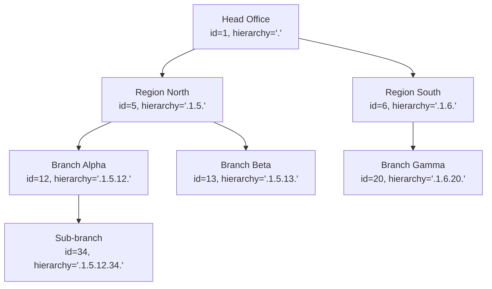
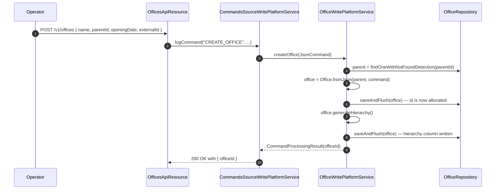

Apache Fineract models a microfinance institution as a tree of offices rooted at a single head office. Every business object — clients, groups, loans, savings, journal entries, staff, tellers, holidays — belongs to exactly one office, and visibility/permission checks traverse the office tree using a denormalised `hierarchy` string. The JPA mapping lives in `fineract-core/src/main/java/org/apache/fineract/organisation/office/domain/Office.java`, and the REST surface is in `fineract-provider/.../organisation/office/api/OfficesApiResource.java`.

## Entity shape

`Office extends AbstractPersistableCustom<Long>` and is mapped to the `m_office` table with two uniqueness constraints — `name` (`name_org`) and `external_id` (`externalid_org`). It is `Serializable` because callers sometimes pass office references across the command/event boundary.

| Field | Column | Notes |
| --- | --- | --- |
| `parent` | `parent_id` | `@ManyToOne(LAZY) Office`. `null` only for the head office. |
| `children` | `parent_id` (inverse) | `@OneToMany(LAZY) List<Office>` — same FK as `parent`, walked top-down. |
| `name` | `name`, length 100 | Trimmed on save, unique across the tenant. |
| `hierarchy` | `hierarchy`, length 50 | Materialised path — see below. |
| `openingDate` | `opening_date` | Required `LocalDate`. Anchors what business dates the office can transact on. |
| `externalId` | `external_id`, length 100 | Optional, unique. Wrapped in the `ExternalId` value type. |

`AbstractPersistableCustom<Long>` supplies the `id` PK and the equals/hashCode based on it. There is no audit mixin on Office — creation and update audit columns are not part of the canonical schema.

## Construction

The two factory methods are the only sanctioned entry points:

```java
public static Office headOffice(String name, LocalDate openingDate, ExternalId externalId);
public static Office fromJson(Office parentOffice, JsonCommand command);
```

`headOffice` is called exactly once per tenant during database seeding — its `parent` is `null` and its `hierarchy` is generated as the string `"."`. Every subsequent office is created through `fromJson`, which reads `name`, `openingDate`, and `externalId` from the JSON command body and links the new instance to the supplied parent. The private constructor calls `parent.addChild(this)` so the in-memory parent/child collection stays consistent before flush.

## The `hierarchy` string

The hierarchy column is a materialised path of office ids, dot-separated, with leading and trailing dots. It is produced by `generateHierarchy()` after the parent has been resolved:

```java
public void generateHierarchy() {
    if (this.parent != null) {
        this.hierarchy = this.parent.hierarchyOf(getId());
    } else {
        this.hierarchy = ".";
    }
}

private String hierarchyOf(final Long id) {
    return this.hierarchy + id.toString() + ".";
}
```

Concrete examples:

- Head office (id `1`) — `"."`
- Region office under head office (id `5`) — `".1.5."`
- Branch under that region (id `12`) — `".1.5.12."`
- Sub-branch under that branch (id `34`) — `".1.5.12.34."`

The dot delimiters at both ends make prefix queries safe: a user permitted to act on office `5` can be authorised against everything that satisfies `hierarchy LIKE '.1.5.%'` without false-matching office `50` or `500`. This pattern is what `AppUser.getOffice().getHierarchy()` plus the JDBC mappers compose to scope clients, loans, savings, and reports to a manager's reach.

## Parent and child relationships

The collection-side helpers do exactly two things — they keep the in-memory graph honest and they walk it for membership tests.

```java
public void update(final Office newParent) {
    if (this.parent == null) {
        throw new RootOfficeParentCannotBeUpdated();
    }
    if (identifiedBy(newParent.getId())) {
        throw new CannotUpdateOfficeWithParentOfficeSameAsSelf(getId(), newParent.getId());
    }
    this.parent = newParent;
    generateHierarchy();
}
```

Re-parenting is only allowed for non-root offices, and an office is forbidden from becoming its own parent. The `hierarchy` is regenerated immediately so the column stays in sync with the parent FK.

`doesNotHaveAnOfficeInHierarchyWithId(officeId)` and the private `hasAnOfficeInHierarchyWithId` recurse the in-memory child collection. These are used during validation when, for example, a sub-office is allowed to be created only if the acting user's office sits at or above the proposed parent in the tree.

`loadLazyCollections()` forces a `children.size()` read so callers that want the subtree pre-fetched before leaving a transaction can do so explicitly.

## JSON update semantics

`Office.update(JsonCommand command)` follows the standard Fineract pattern — it returns a `Map<String, Object>` of fields that actually changed, suitable for the command-source audit row. Recognised parameters are `parentId`, `openingDate`, `name`, and `externalId`. Two invariants are enforced:

- Passing `parentId` on the head office throws `RootOfficeParentCannotBeUpdated`.
- The presence-and-change check for `parentId` uses `isChangeInLongParameterNamed`, so the FK is only written when the value actually differs.

The opening date and external id checks use the same delta-pattern (`isChangeInLocalDateParameterNamed`, `isChangeInStringParameterNamed`), and the external id is normalised through `ExternalIdFactory.produce`.

## Office tree at a glance



A manager rooted at `.1.5.` sees Region North and everything below it. A teller rooted at `.1.5.12.` only sees Branch Alpha and its sub-branch.

## Inter-office money movement: `OfficeTransaction`

`OfficeTransaction` (`fineract-provider/.../office/domain/OfficeTransaction.java`, table `m_office_transaction`) records bookable money flows between two offices — typically cash-in-transit between a head office and a branch, or a top-up from a regional cash pool.

| Field | Column | Notes |
| --- | --- | --- |
| `from` | `from_office_id` | Source office, `LAZY` `@ManyToOne`. |
| `to` | `to_office_id` | Destination office, `LAZY` `@ManyToOne`. |
| `transactionDate` | `transaction_date` | `LocalDate`, required. |
| `currency` | embedded `MonetaryCurrency` | Inlines `currency_code`, `currency_digits`, `currency_multiplesof`. |
| `transactionAmount` | `transaction_amount` | `DECIMAL(19,6)`. |
| `description` | `description`, length 100 | Free text. |

The only factory is:

```java
public static OfficeTransaction fromJson(Office fromOffice, Office toOffice,
        Money amount, JsonCommand command);
```

Both `from` and `to` are optional at the field level — one-sided records are valid for legacy flows where the counterparty is external (deposit into the head office from outside the institution). The currency is taken from the supplied `Money`, so the amount and the currency stamp always come from the same value object.

`OfficeTransaction` is intentionally narrow. It is a journal of cash hand-offs between offices — the corresponding general-ledger postings are produced by the accounting layer and the linked `JournalEntry` rows carry their own office reference.

## The `/v1/offices` API

The Jersey resource exposes the conventional CRUD surface plus the inter-office transfer endpoint.

| Method | Path | Permission | Purpose |
| --- | --- | --- | --- |
| `GET` | `/v1/offices` | `READ_OFFICE` | List offices, optionally with template and order-by query parameters. |
| `GET` | `/v1/offices/template` | `READ_OFFICE` | Template payload (allowed parents, opening-date hints). |
| `GET` | `/v1/offices/{officeId}` | `READ_OFFICE` | Single office by id, optionally `template=true` for picklists. |
| `POST` | `/v1/offices` | `CREATE_OFFICE` | Create a child office under `parentId`. |
| `PUT` | `/v1/offices/{officeId}` | `UPDATE_OFFICE` | Apply the `Office.update` delta. |
| `POST` | `/v1/officetransactions` | `CREATE_OFFICETRANSACTION` | Record an `OfficeTransaction`. |
| `GET` | `/v1/officetransactions` | `READ_OFFICETRANSACTION` | List recent inter-office transactions. |

Every mutating call routes through `CommandsSourceWritePlatformService`, so the create/update bodies become rows in `m_portfolio_command_source` and can be replayed by the maker-checker workflow.

<Note>
Offices have no soft-delete in Apache Fineract. Once a child object (client, loan, journal entry) references an office, the office row is permanently retained — re-parent it or rename it rather than removing it.
</Note>

## Operational concerns

- **Opening date** — `isOpeningDateBefore` / `isOpeningDateAfter` guard every dated business event tied to the office. Client activation, loan submission, journal entry posting, and the cashier start date all check that the event is on or after `openingDate`.
- **Hierarchy length** — the column is capped at 50 characters. With numeric ids this comfortably supports an institution with five-plus tiers; deeper trees should reuse ids carefully or shorten the office numbering scheme.
- **Lazy children** — both `parent` and `children` are `FetchType.LAZY`. Read paths that need the full subtree (for example, the office tree picker in reports) should invoke `loadLazyCollections()` inside the transaction.
- **External id** — the `ExternalId` wrapper allows downstream systems to address an office by their own identifier; the `externalid_org` unique index prevents accidental aliasing.

## Lifecycle of a typical office tree

The bootstrap migration that ships with every Apache Fineract install inserts exactly one head office row with id `1`, name `"Head Office"`, opening date set to a sentinel past date, and hierarchy `"."`. The rest of the tree is built up at runtime through `POST /v1/offices`:



The double `saveAndFlush` is intentional. `generateHierarchy()` depends on `getId()`, which is only assigned after the first flush, so the hierarchy column is written in a second pass. Read-side queries that join `m_office` to a permission scope assume the column is populated; a half-saved row would break those joins.

## Bulk import

Offices participate in the generic bulk-import framework. The importer reads a spreadsheet, walks each row through `OfficeImportHandler`, and submits a `CREATE_OFFICE` command per row. Two operational notes:

- The spreadsheet must be sorted so parents appear before children — the importer resolves `parentName` to an id by looking it up in the rows already imported.
- A failed row aborts only that row; previously-imported rows remain. The audit trail in `m_portfolio_command_source` records the partial state.

## Common queries

The `office_id` and `hierarchy` columns are indexed; the typical permission filter is:

```sql
SELECT l.* FROM m_loan l
JOIN m_office lo ON lo.id = l.office_id
WHERE lo.hierarchy LIKE :userOfficeHierarchy || '%';
```

The prefix-match leverages the leading and trailing dots in the hierarchy string and lets the planner use the index on `hierarchy` in PostgreSQL or MySQL.

## Office-bound child entities

A short enumeration of the most important rows that carry an `office_id` FK and therefore inherit the office's hierarchy scoping:

| Table | FK | Notes |
| --- | --- | --- |
| `m_client` | `office_id` | Direct ownership. |
| `m_group` | `office_id` | Direct ownership; centres roll up to groups. |
| `m_loan` | `office_id` | The loan's home branch. |
| `m_savings_account` | `office_id` | Same pattern as loans. |
| `m_staff` | `office_id` | The staff's home branch. |
| `acc_gl_journal_entry` | `office_id` | Posting scope for GL closure and trial balance. |
| `m_holiday_office` | `office_id` | Many-to-many link to `m_holiday`. |
| `m_tellers` | `office_id` | Cash tills live in an office. |
| `m_office_transaction` | `from_office_id`, `to_office_id` | Inter-office cash movements. |

<CardGroup cols={2}>
  <Card title="Staff" href="/organisation/staff">
    Loan officers and managers belong to an office and inherit its hierarchy.
  </Card>
  <Card title="Holidays" href="/organisation/holidays">
    Holiday calendars are attached to one or more offices.
  </Card>
</CardGroup>

## Practical tips

- **Plan the tree before you build it.** The hierarchy column is generated bottom-up from numeric ids; offices created early get short hierarchy strings, late ones get longer ones. Avoid creating a deep test tree before production launch.
- **Re-parenting cascades.** Moving an office under a new parent rewrites the office's own hierarchy. The hierarchies of its descendants must be regenerated as well — the write-platform service walks the subtree and updates each row.
- **External ids are your friend.** Use the `externalId` column to address offices by your back-office system's identifier. The column is unique and indexed, so lookups by external id are as fast as lookups by id.
- **Do not delete offices.** Once any child row references the office, the FK keeps it pinned. Decommission by re-parenting or by renaming with a suffix like `(closed 2024-Q4)`.

## Validation summary

- `name` is required, trimmed, and unique tenant-wide.
- `openingDate` is required.
- `parentId` is required for non-root offices and must refer to an existing office with `openingDate <= newOffice.openingDate`.
- The head office (the row with `parent_id IS NULL`) cannot be updated to have a parent.
- An office cannot be its own parent — `CannotUpdateOfficeWithParentOfficeSameAsSelf` is thrown.
- `externalId` is optional and unique tenant-wide; deletion is by setting to `null` or unique replacement.
- `hierarchy` is system-generated; it cannot be set directly through the API.
