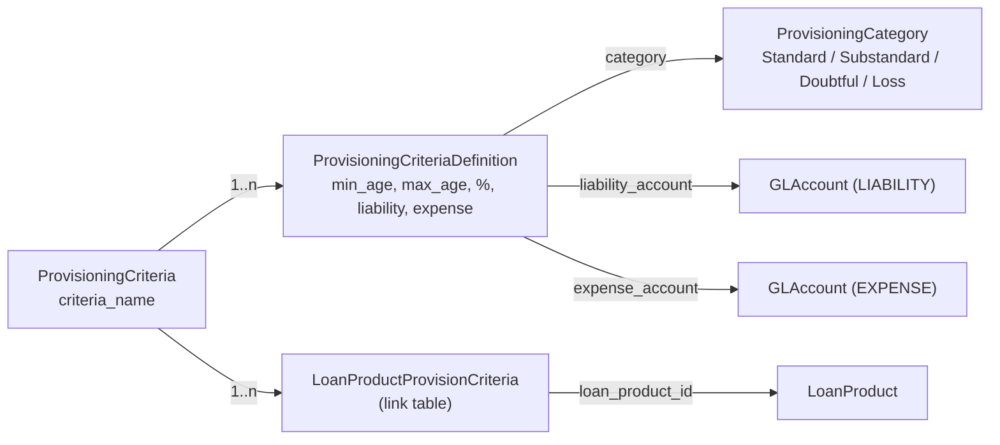
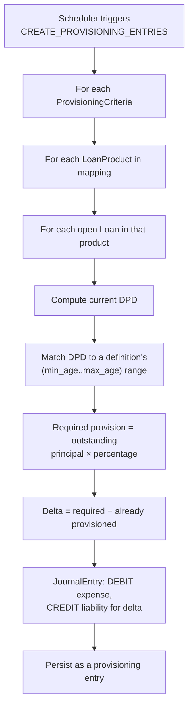
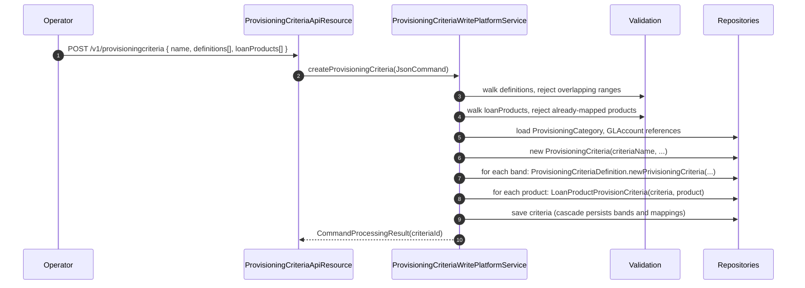

Apache Fineract supports IFRS-style loan loss provisioning by letting the institution declare days-past-due (DPD) bands, each band carrying a percentage of outstanding principal to be expensed and parked in a liability account. A `ProvisioningCriteria` row groups several `ProvisioningCriteriaDefinition` bands, applies that set to one or more loan products, and is consumed by the provisioning batch job to produce general-ledger postings. The domain lives in `fineract-provider/src/main/java/org/apache/fineract/organisation/provisioning/domain/`.

## Module map

```text
fineract-provider/.../organisation/provisioning/
├── domain/
│   ├── ProvisioningCategory.java               // named DPD category
│   ├── ProvisioningCriteria.java               // named criteria, owns bands + products
│   ├── ProvisioningCriteriaDefinition.java     // one DPD band + percentage + accounts
│   └── LoanProductProvisionCriteria.java       // link table to loan products
├── api/                                         // REST surface
├── data/                                        // read-side DTOs
├── service/                                     // write platform service
└── handler/                                     // command handlers
```

## `ProvisioningCategory` — the band name

`ProvisioningCategory extends AbstractPersistableCustom<Long>` maps to `m_provision_category` with unique constraint `category_name`. Categories are tenant-wide labels — "Standard", "Substandard", "Doubtful", "Loss" are the canonical four — and they exist independently of any criteria.

| Field | Column | Notes |
| --- | --- | --- |
| `categoryName` | `category_name` | Unique. |
| `categoryDescription` | `description` | Free text. |

Categories are factory-created from JSON:

```java
public static ProvisioningCategory fromJson(JsonCommand jsonCommand) {
    final String categoryName  = jsonCommand.stringValueOfParameterNamed("categoryname");
    final String description    = jsonCommand.stringValueOfParameterNamed("description");
    return new ProvisioningCategory(categoryName, description);
}
```

A category is a *type* of provisioning level — the percentage and the DPD range live one level down, on the criteria definition.

## `ProvisioningCriteriaDefinition` — one DPD band

`ProvisioningCriteriaDefinition extends AbstractPersistableCustom<Long>` maps to `m_provisioning_criteria_definition`. Each row is exactly one band — a DPD range, a percentage, and the two GL accounts to post to.

| Field | Column | Notes |
| --- | --- | --- |
| `criteria` | `criteria_id` | Owning `@ManyToOne ProvisioningCriteria`. Required. |
| `provisioningCategory` | `category_id` | Required `@ManyToOne ProvisioningCategory`. The "Standard / Substandard / Doubtful / Loss" label. |
| `minimumAge` | `min_age` | Long. Lowest DPD (inclusive) in this band. |
| `maximumAge` | `max_age` | Long. Highest DPD (inclusive) in this band. |
| `provisioningPercentage` | `provision_percentage` | `BigDecimal`. Percentage of outstanding principal to provision. |
| `liabilityAccount` | `liability_account` | Required `@ManyToOne GLAccount`. The provision reserve account. |
| `expenseAccount` | `expense_account` | Required `@ManyToOne GLAccount`. The expense account hit when the provision is recognised. |

The static factory is the only construction path:

```java
public static ProvisioningCriteriaDefinition newPrivisioningCriteria(
        ProvisioningCriteria criteria,
        ProvisioningCategory provisioningCategory,
        Long minimumAge,
        Long maximumAge,
        BigDecimal provisioningPercentage,
        GLAccount liabilityAccount,
        GLAccount expenseAccount);
```

The `update` setter accepts a fresh set of `(minAge, maxAge, percentage, liability, expense)` — categories are not re-assignable on an existing band.

### Non-overlap invariant

The single business-rule guard on definitions:

```java
public boolean isOverlapping(ProvisioningCriteriaDefinition def) {
    return this.minimumAge <= def.maximumAge
        && def.minimumAge <= this.maximumAge;
}
```

The write-platform service walks every pair of definitions when a criteria is saved and rejects the payload if any pair returns `true`. The bands must form a non-overlapping cover of the DPD axis; gaps are allowed (loans whose DPD falls in a gap are simply not provisioned at that level), but two bands cannot both claim DPD = 45.

## `ProvisioningCriteria` — the named bundle

`ProvisioningCriteria extends AbstractAuditableCustom` (and so carries the standard created/modified-by audit columns) and maps to `m_provisioning_criteria`, uniquely constrained on `criteria_name`.

| Field | Column | Notes |
| --- | --- | --- |
| `criteriaName` | `criteria_name` | Unique. |
| `provisioningCriteriaDefinition` | inverse-mapped | `Set<ProvisioningCriteriaDefinition>` with `CascadeType.ALL`, orphan-removal `EAGER`. |
| `loanProductMapping` | inverse-mapped | `Set<LoanProductProvisionCriteria>` linking to loan products. |

The criteria is the unit you create and manage from the API. Its `update(JsonCommand, List<LoanProduct>)` performs three things:

1. Detects a change in `criteriaName` and applies it.
2. Computes the diff between the current loan-product mapping and the desired one — products to drop are removed from `loanProductMapping`, products to add are inserted as fresh `LoanProductProvisionCriteria` rows.
3. Returns a `Map<String, Object>` of actual changes for the maker-checker audit trail.

A second overload, `update(ProvisioningCriteriaDefinitionData, GLAccount, GLAccount)`, locates the band by id and delegates to `ProvisioningCriteriaDefinition.update` — used by the per-band edit path.

## `LoanProductProvisionCriteria` — the link to products

This small entity maps the criteria onto loan products. Its primary purpose is enforcing the constraint that a single loan product cannot be governed by two criteria simultaneously — the database surfaces a uniqueness violation if the same loan product is added twice, and the write-platform service refuses to save criteria whose product set already belongs to another criteria.

## Entity relationships



## A worked configuration

A simple four-band criteria — the textbook IFRS structure:

| Category | Min DPD | Max DPD | Percentage | Liability acct | Expense acct |
| --- | --- | --- | --- | --- | --- |
| Standard | 0 | 30 | 1 | `LIA-PROV-STD` | `EXP-PROV-STD` |
| Substandard | 31 | 90 | 25 | `LIA-PROV-SUB` | `EXP-PROV-SUB` |
| Doubtful | 91 | 180 | 50 | `LIA-PROV-DBT` | `EXP-PROV-DBT` |
| Loss | 181 | 9999 | 100 | `LIA-PROV-LOSS` | `EXP-PROV-LOSS` |

Apply this criteria to loan products *Personal Loan* and *Group Loan* and the batch job will, for every open loan in those products, bucket the loan by its current DPD and post a provisioning entry. A 91-day loan with outstanding principal 10,000 produces:

- DEBIT `EXP-PROV-DBT` 5,000
- CREDIT `LIA-PROV-DBT` 5,000

If the loan rolls into the 181+ band on the next run, the entry is the *delta* — additional 5,000 on each side — not a fresh full amount, so the cumulative provision balance ends up correct.

## The provisioning entries job

A scheduled job (`CREATE_PROVISIONING_ENTRIES`, registered through the `accounting.provisioning` service starter) drives the workflow:



The job is idempotent in the sense that running it twice on the same day re-computes deltas — already-posted provisions are not duplicated because the read uses the running balance. The `accounting/provisioning` page documents the journal-entry side of this in detail.

## The `/v1/provisioningcriteria` API

| Method | Path | Permission | Purpose |
| --- | --- | --- | --- |
| `GET` | `/v1/provisioningcriteria` | `READ_PROVISIONINGCRITERIA` | List all criteria. |
| `GET` | `/v1/provisioningcriteria/template` | `READ_PROVISIONINGCRITERIA` | Categories, loan products, eligible GL accounts. |
| `GET` | `/v1/provisioningcriteria/{id}` | `READ_PROVISIONINGCRITERIA` | Full payload including bands and products. |
| `POST` | `/v1/provisioningcriteria` | `CREATE_PROVISIONINGCRITERIA` | Create criteria with bands and product mapping in one body. |
| `PUT` | `/v1/provisioningcriteria/{id}` | `UPDATE_PROVISIONINGCRITERIA` | Edit name, bands, or product set. |
| `DELETE` | `/v1/provisioningcriteria/{id}` | `DELETE_PROVISIONINGCRITERIA` | Remove a criteria not in use. |

A parallel set of endpoints under `/v1/provisioningcategory` manages categories — create, update, list, delete.

<Warning>
Bands must not overlap on the DPD axis. The platform refuses to save a criteria with any two definitions where `[min_age, max_age]` ranges intersect — `ProvisioningCriteriaDefinition.isOverlapping` is the predicate.
</Warning>

## Validation summary

- `criteriaName` is unique tenant-wide.
- Each definition's `min_age <= max_age`.
- Definitions within one criteria must not overlap on `[min_age, max_age]`.
- `provisioningPercentage` is a non-negative `BigDecimal`; values above 100 are accepted (some accounting standards mandate over-provisioning for severely overdue accounts) but flagged in the UI.
- `liabilityAccount` must be of type LIABILITY and enabled; `expenseAccount` must be of type EXPENSE and enabled.
- A loan product can be governed by at most one active criteria; the write-platform service rejects re-binding without first removing the product from the previous criteria.

## Cross-links

<CardGroup cols={2}>
  <Card title="Provisioning postings" href="/accounting/provisioning">
    The journal-entry side — how the `CREATE_PROVISIONING_ENTRIES` job translates these bands into GL postings and how they roll up in trial balance.
  </Card>
  <Card title="GL accounts" href="/accounting/gl-accounts">
    The liability and expense accounts referenced by each definition.
  </Card>
</CardGroup>

## Operational tips

- Pre-create the GL accounts for each band before opening the provisioning criteria UI — the template endpoint filters by account type and enabled status, so missing accounts simply will not appear.
- Use a coarse band structure (4–5 categories) rather than fine-grained DPD increments. The batch job time scales linearly with `criteria × bands × products × open-loans`, and a five-band structure is enough for almost all regulators.
- Run `CREATE_PROVISIONING_ENTRIES` at end-of-day, after the `APPLY_HOLIDAYS_TO_LOANS` job — the latter can change the DPD bucket of a loan when an installment is shifted forward.
- Keep the percentages and band boundaries under maker-checker. Edits to the criteria have first-of-the-month impact on the provision balance for the entire institution; the four-eyes audit is well worth the latency.

## End-to-end create sequence



The validation that rejects overlapping bands and re-used loan products runs **before** any row is persisted. The `CascadeType.ALL` on the band collection ensures the criteria row and its bands save in one flush.

## Run-time provisioning calculation

When the batch job runs, the read query that drives it is roughly:

```sql
SELECT l.id, l.product_id, l.outstanding_principal,
       DATEDIFF(CURRENT_DATE, MIN(s.duedate)) AS dpd
FROM   m_loan l
JOIN   m_loan_repayment_schedule s ON s.loan_id = l.id
WHERE  l.loan_status_id = 300
   AND s.completed_derived = false
GROUP  BY l.id;
```

For each open loan, the engine picks the highest unpaid installment's DPD, looks up the matching `ProvisioningCriteriaDefinition` band, and computes the required provision against `outstanding_principal`. The journal entry posted is the delta vs the previously-recorded provision for that loan in the `m_loan_provisioning_history` table.

## Reporting

The provisioning module ships with built-in reports that surface:

- **Current provisioning balance** by loan product and by branch.
- **Movement** between provisioning runs (the delta posted at each run).
- **Loans crossing band boundaries** — useful for early warning.

These reports read from the `m_loan_provisioning_history` table and the `acc_gl_journal_entry` rows tagged with the provisioning transaction prefix.

## Common pitfalls

- **Forgetting to map products.** A criteria with no loan products in `loanProductMapping` produces zero journal entries — the job has nothing to bucket.
- **Leaving a gap.** Two bands like `[0, 30]` and `[60, 90]` leave loans at DPD = 31..59 un-provisioned. The validator does not require coverage, only non-overlap. Audit your bands.
- **Editing during a run.** Avoid changing percentages while `CREATE_PROVISIONING_ENTRIES` is executing. The job loads the criteria once at start; mid-run edits do not take effect until the next run, but they may confuse the audit trail.
- **Disabled GL accounts.** Disabling a liability or expense account that a band references does not invalidate the band — the next run will fail with a `gl-account-not-found-or-disabled` error. Re-enable or repoint the band before disabling.
