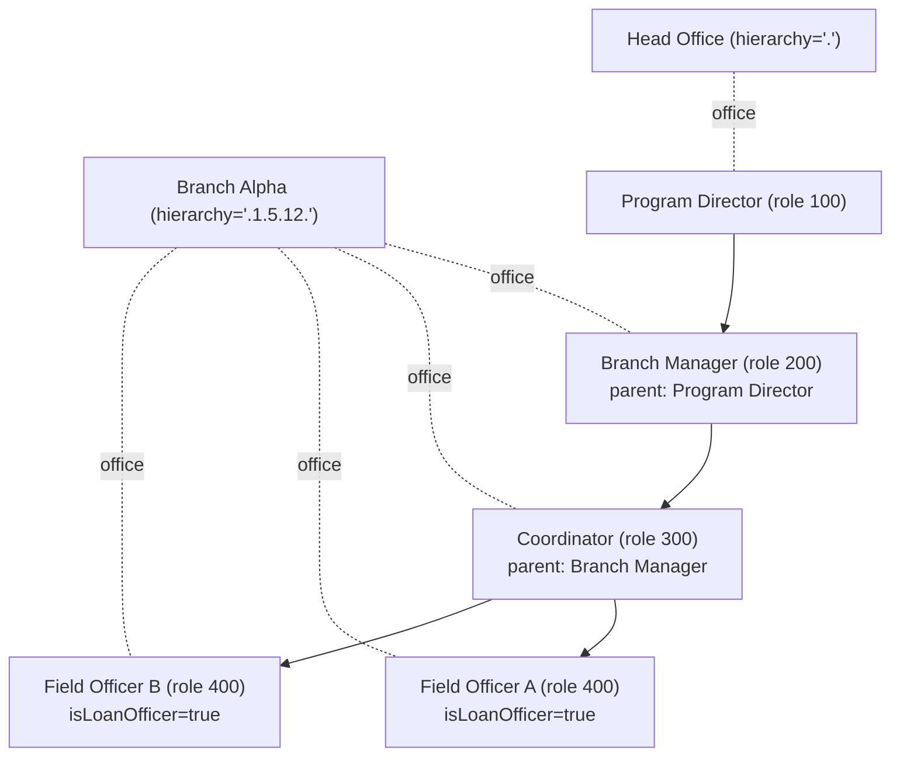
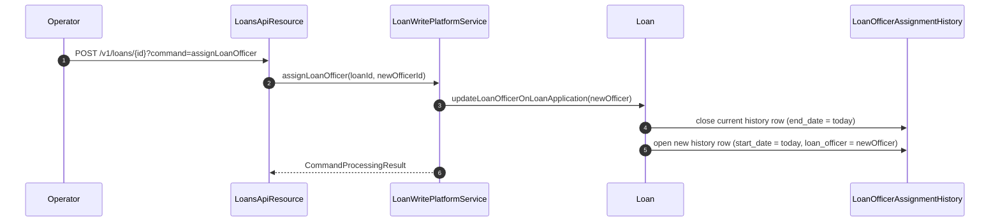

In Apache Fineract a `Staff` row represents a human worker attached to a single office — a loan officer riding the village circuit, a branch manager, a coordinator, or a back-office accountant. Loans, savings accounts, clients, and groups are all linked to staff rows for portfolio-by-officer reporting and for permission checks. The mapping lives in `fineract-core/src/main/java/org/apache/fineract/organisation/staff/domain/Staff.java`, and the REST surface lives in `fineract-provider/.../organisation/staff/api/StaffApiResource.java`.

## Entity shape

`Staff extends AbstractPersistableCustom<Long>` and maps to the `m_staff` table. Three unique constraints — `display_name`, `external_id`, and `mobile_no` — keep contact information unambiguous across the tenant.

| Field | Column | Notes |
| --- | --- | --- |
| `firstname` | `firstname`, length 50 | First name. |
| `lastname` | `lastname`, length 50 | Last name. |
| `displayName` | `display_name`, length 100 | Composed name shown in pickers. Unique. |
| `mobileNo` | `mobile_no`, length 50 | Required, unique. |
| `externalId` | `external_id`, length 100 | Optional, unique. Plain `String` (not the `ExternalId` wrapper used by Office). |
| `emailAddress` | `email_address`, length 50 | Optional, unique. |
| `office` | `office_id` | `@ManyToOne Office`, required. Drives the staff's reach via `Office.hierarchy`. |
| `loanOfficer` | `is_loan_officer` | Boolean. Gates assignment to loans and the LoanOfficerAssignmentHistory trail. |
| `organisationalRoleType` | `organisational_role_enum` | Integer code, decoded by `StaffOrganisationalRoleType`. |
| `active` | `is_active` | Boolean. Inactive staff are hidden from active-only pickers. |
| `joiningDate` | `joining_date` | `LocalDate`. |
| `organisationalRoleParentStaff` | `organisational_role_parent_staff_id` | Optional `@ManyToOne Staff` — reports-to chain. |
| `imageId` | `image_id` | Optional FK to the `m_image` row that stores the headshot. |

Lombok `@Getter @Setter` covers the accessors. Two helpers — `isNotLoanOfficer()` and `isNotActive()` — are marked `@Deprecated(forRemoval = true)` because they were accidentally pulled into the API serializer.

## Organisational role types

`StaffOrganisationalRoleType` is the canonical enumeration of seniority codes. Values are stored as integers in `organisational_role_enum` and the parent staff FK lets each role chain upward to its supervisor.

```java
public enum StaffOrganisationalRoleType {
    INVALID(0, "staffOrganisationalRoleType.invalid"),
    PROGRAM_DIRECTOR(100, "staffOrganisationalRoleType.programDirector"),
    BRANCH_MANAGER(200, "staffOrganisationalRoleType.branchManager"),
    FIELD_OFFICER_COORDINATOR(300, "staffOrganisationalRoleType.coordinator"),
    FIELD_OFFICER(400, "staffOrganisationalRoleType.fieldAgent");
}
```

The integer ladder (100/200/300/400) encodes seniority: a 100 sits above a 200, which sits above a 300. The `organisationalRoleParentStaff` FK is the explicit reports-to link — for example, a `FIELD_OFFICER` rolls up to a `FIELD_OFFICER_COORDINATOR`, who rolls up to a `BRANCH_MANAGER`.

## Reach via office hierarchy

Staff inherit the visibility of their office. Every domain object the staff member can act on must satisfy two checks:

1. The acting user belongs to a staff row whose office hierarchy is an ancestor of the target row's office hierarchy (`hierarchy LIKE '.1.5.%'`).
2. If the row carries a `staff_id` (loan officer, savings field officer, group staff), and the operation is loan-officer scoped, that staff is the acting staff or one of their descendants in the reports-to chain.



The dotted lines are the `office` FK; the solid arrows are `organisationalRoleParentStaff`.

## The `loanOfficer` flag

`is_loan_officer` is the single boolean that decides whether a staff row can be selected as the responsible officer on a loan or on a group. The portfolio code paths that consume it include:

- Loan creation and reassignment — `Loan.updateLoanOfficerOnLoanApplication`, `Loan.reassignLoanOfficer`. Only staff with `loanOfficer = true` are valid.
- The `loan-officer-to-center-hierarchy` mapping in groups, used for delinquency reports.
- `LoanOfficerAssignmentHistory` rows, which preserve the chain of officers who held a loan over its lifetime — see the loan rescheduling module for the reassignment workflow.
- Savings account field officers are also drawn from this pool when the savings product is configured to require an officer.

Toggling `loanOfficer` off on a staff who still holds open assignments is rejected at the API layer — the staff must be unassigned (or the loans reassigned) first.

## Active vs inactive

`is_active` controls whether the staff row appears in active-only API listings. Inactive staff:

- Are excluded from `?status=active` and from the default staff picker template.
- Can still appear on historic loans and savings — the FK is not cleared on deactivation.
- Cannot be set as the responsible officer on new loans or savings.

The joining date is the lower bound on every dated assignment — a loan officer cannot own a loan dated before their `joiningDate`.

## The image attachment

`imageId` is an optional FK to the `m_image` table managed by the document storage subsystem. The image is uploaded and removed through the dedicated images endpoints:

| Method | Path | Purpose |
| --- | --- | --- |
| `POST` | `/v1/staff/{staffId}/images` | Upload headshot. |
| `GET` | `/v1/staff/{staffId}/images` | Fetch the image as a binary stream. |
| `DELETE` | `/v1/staff/{staffId}/images` | Remove the linkage and the underlying file. |

The staff row stores only the FK; the file lives wherever the `ContentRepository` implementation places it (local filesystem or S3 depending on `fineract.content.*` settings).

## The `/v1/staff` API

The staff REST surface is in `StaffApiResource.java`. It is intentionally minimal — there is no soft delete and no bulk import dedicated path beyond the generic `bulkimport` framework.

| Method | Path | Permission | Purpose |
| --- | --- | --- | --- |
| `GET` | `/v1/staff` | `READ_STAFF` | List staff. Filters: `officeId`, `status` (`active`/`inactive`/`all`), `loanOfficersOnly`. |
| `GET` | `/v1/staff/template` | `READ_STAFF` | Office picklist and joining-date defaults. |
| `GET` | `/v1/staff/{staffId}` | `READ_STAFF` | Single staff row. |
| `POST` | `/v1/staff` | `CREATE_STAFF` | Create staff under `officeId`. |
| `PUT` | `/v1/staff/{staffId}` | `UPDATE_STAFF` | Update mutable fields. |

The mutating calls go through `CommandsSourceWritePlatformService`, which means every create and update generates a row in `m_portfolio_command_source` and is replayable through the maker-checker mechanism.

## Update semantics

The staff write platform service performs the standard delta detection. Notable rules:

- `office_id` can be changed only when the staff is reassigned through the formal transfer command — a casual PUT on the staff endpoint does not move them between offices.
- `is_loan_officer` cannot be flipped to `false` if open loan assignments exist.
- `joiningDate` cannot be moved forward past the start date of any existing assignment.
- `mobile_no`, `display_name`, `email_address`, and `external_id` are subject to their unique indexes — duplicate values are rejected by the database constraint and surfaced as a validation error.

<Note>
Staff and `AppUser` are separate concepts. A staff row identifies a worker for portfolio assignment; an `AppUser` (security principal) optionally links to a staff row via `m_appuser.staff_id`. Not every staff has a login, and not every login is a portfolio-bearing staff.
</Note>

## Cross-links

<CardGroup cols={2}>
  <Card title="Offices" href="/organisation/offices">
    The office hierarchy that staff inherit through `Staff.office`.
  </Card>
  <Card title="Teller" href="/organisation/teller">
    Cashiers are staff rows assigned to a teller for a date range.
  </Card>
</CardGroup>

## Practical tips

- When sourcing the list of officers for a branch, use `GET /v1/staff?officeId=12&status=active&loanOfficersOnly=true` — this is the exact filter combination the loan and group UIs rely on.
- The `displayName` uniqueness constraint sometimes forces operational creativity for common names — the convention in larger deployments is `Firstname Lastname (Branch)`.
- The deprecated `isNotLoanOfficer` / `isNotActive` helpers are still on the wire format. Treat them as derived booleans and prefer the positive `isLoanOfficer` / `isActive` accessors going forward.
- For staff reassignment between offices, prefer the dedicated transfer commands so the audit trail captures the move correctly rather than mutating `office_id` directly.

## Loan-officer assignment trail

Loans track their officer over time through `LoanOfficerAssignmentHistory` (`m_loan_officer_assignment_history`). Each row captures one tenure — `loan_id`, `loan_officer_id`, `start_date`, and `end_date`. When the loan is reassigned, the active history row is closed by setting its `end_date`, and a fresh history row is opened with the new officer.



A loan can also be temporarily un-assigned (officer set to `null`) — the history row is closed without opening a replacement. The portfolio-by-officer report uses these history rows to compute officer balances as of any past date.

## Bulk staff import

Staff participate in the bulk-import framework. The spreadsheet template is downloadable through the `bulkimport` endpoints; the importer:

1. Validates each row's office reference against the existing tree.
2. Submits `CREATE_STAFF` commands one at a time, so a partial failure does not roll back already-imported rows.
3. Records the per-row outcome in `m_import_document` for audit.

## Self-service users and the staff link

Apache Fineract's self-service mobile module distinguishes the customer-facing user (`m_appuser` with `is_self_service_user = true`) from the staff-facing user. A staff row may be linked to an internal `m_appuser` for back-office login, but customer self-service users are never tied to a `Staff`. The `staff_id` column on `m_appuser` is optional — back-office logins for permission-only users (auditors, system administrators) leave it `null`.

## Read-side projections

The data layer exposes a handful of DTOs in `fineract-core/.../staff/data/`:

- `StaffData` — id, displayName, office id and name, isLoanOfficer, isActive, joiningDate, externalId, mobileNo, emailAddress.
- `StaffAccountSummaryCollectionData` — used by the loan-officer dashboard to roll up the staff member's clients, groups, loans and savings.
- `BulkTransferLoanOfficerData` — payload for the loan-officer bulk-transfer command.

These DTOs are materialised by JDBC mappers in the service layer and feed the JSON responses on the API surface.

## Loan-officer bulk transfer

A common operational need is reassigning an entire portfolio when a loan officer leaves or rotates branches. The dedicated endpoint:

```
POST /v1/loans/loanreassignment
```

accepts a body with `fromLoanOfficerId`, `toLoanOfficerId`, `assignmentDate`, and an optional list of `loans` ids — empty list means all open loans currently owned by the source. The command opens a fresh `LoanOfficerAssignmentHistory` row per loan and closes the previous one, all inside a single transaction. The maker-checker layer captures the command in `m_portfolio_command_source` like every other mutating call.

For group loans, the equivalent bulk operation lives under `/v1/groups/{groupId}` with `command=assignStaff`.

## Validation summary

- `mobileNo` is required and unique tenant-wide.
- `displayName` is required (computed if not supplied) and unique tenant-wide.
- `externalId` and `emailAddress` are optional and unique when present.
- `office_id` must reference an existing office whose `openingDate` is on or before `joiningDate`.
- `joiningDate` must not be in the future at creation time.
- `loanOfficer = false` cannot be applied when open loan assignments exist for the staff.
- `active = false` (deactivation) cannot be applied when open loans, groups, or savings reference the staff as responsible officer.

## Hierarchy walks at scale

Branches with hundreds of staff and dozens of nested roles benefit from caching the reports-to chain. The repository wrapper provides:

- `findOneWithNotFoundDetection(staffId)` — strict load with a 404-style failure if the row is missing.
- `findByOfficeHierarchyWithNotFoundDetection(hierarchy)` — preload all staff whose office sits at or below a hierarchy prefix.

The second method is the one to use when building the portfolio-by-officer dashboard for a branch manager. The hierarchy parameter is the manager's own office hierarchy; the result includes the manager's direct reports and everyone below them.

## A note on naming

`displayName` is the field that appears in pickers, on loan applications, and on receipts. The platform does not auto-compute it from `firstname + lastname` — the API caller must provide it explicitly, which leaves room for institutional naming conventions (suffixes for branch identification, initials for privacy in shared dashboards, transliteration for non-Latin scripts).

## Worked example: branch onboarding

A new sub-branch with one branch manager and three field officers, all hired the same day:

1. **Create the office** — `POST /v1/offices` with parent set to the regional office.
2. **Create the branch manager** — `POST /v1/staff` with `officeId` set to the new sub-branch, `isLoanOfficer: false`, `organisationalRoleType: 200`, and `organisationalRoleParentStaff` pointing at the regional manager.
3. **Create the three field officers** — three `POST /v1/staff` calls with `isLoanOfficer: true`, `organisationalRoleType: 400`, and `organisationalRoleParentStaff` pointing at the branch manager from step 2.
4. **Upload images** — `POST /v1/staff/{id}/images` for each, supplying the headshot.
5. **Link login accounts** — `POST /v1/users` for each staff with `staffId` set, granting roles for loan origination and customer service.

After step 5, the dashboard for the regional manager shows the new sub-branch and its officers as direct reports, and the loan origination flow includes the three field officers in the responsible-officer picker.

## Auditing changes

Every create, update, image upload, and reassignment generates a row in `m_portfolio_command_source` through the standard write-platform path. The maker-checker workflow can wrap any of these calls — typical configurations require checker approval on:

- Staff creation (so payroll has visibility).
- Office reassignment (so the audit trail is signed off).
- Toggling `is_loan_officer` (so the responsible-officer pool stays under control).
- Bulk loan-officer transfers (so portfolio movements are reviewed).

Routine edits like phone-number updates or email changes are usually left as maker-only operations.
