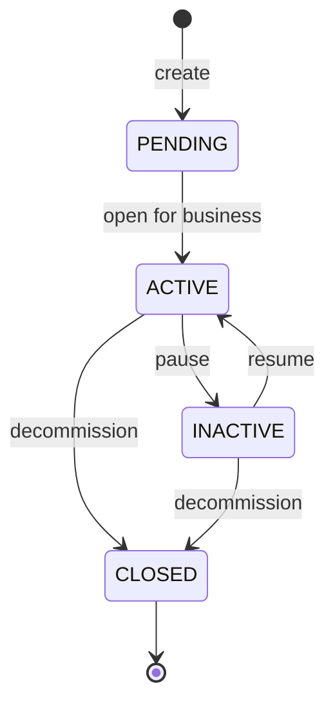
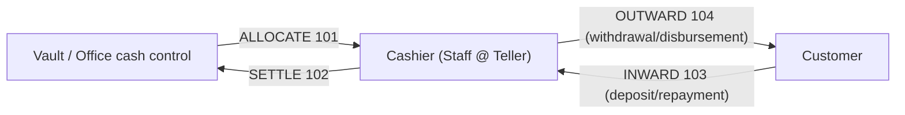
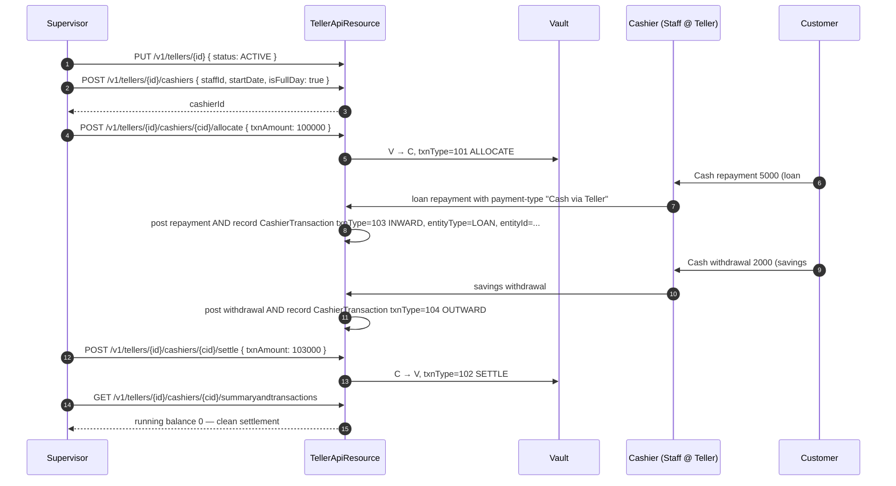

The teller module in Apache Fineract — sometimes called the cash management module — models physical or logical cash tills that live inside an office. A `Teller` is the till itself (with a state machine and a date window). A `Cashier` is a staff member assigned to that till for a date range. `CashierTransaction` rows record cash movements through that assignment: allocations from the vault, settlements back to the vault, and the cash-in / cash-out side of customer payments. The module lives entirely in the `fineract-branch` Gradle module, under `org.apache.fineract.organisation.teller`.

## Module layout

```text
fineract-branch/src/main/java/org/apache/fineract/organisation/teller/domain/
├── Teller.java                 // m_tellers
├── TellerStatus.java           // enum: PENDING/ACTIVE/INACTIVE/CLOSED
├── TellerTransaction.java      // legacy/aux journal
├── TellerJournal.java          // running running balance audit
├── Cashier.java                // m_cashiers
├── CashierTransaction.java     // m_cashier_transactions
├── CashierTxnType.java         // ALLOCATE/SETTLE/CASH_IN/CASH_OUT
└── model/                      // read-side row mappers
```

## Teller — the till

`Teller extends AbstractPersistableCustom<Long>`, mapped to `m_tellers`. A single unique constraint, `ux_tellers_name`, prevents duplicate teller names per tenant.

| Field | Column | Notes |
| --- | --- | --- |
| `office` | `office_id` | Required `@ManyToOne(LAZY) Office`. The till exists inside one office. |
| `debitAccount` | `debit_account_id` | Optional `@ManyToOne(EAGER) GLAccount` — cash-on-hand control account. |
| `creditAccount` | `credit_account_id` | Optional `@ManyToOne(EAGER) GLAccount` — counterpart for settlement postings. |
| `name` | `name`, length 100 | Display name. Unique tenant-wide. |
| `description` | `description`, length 500 | Free text. |
| `startDate` | `valid_from` | When the till begins operating. |
| `endDate` | `valid_to` | Planned decommission date. |
| `status` | `state` | Integer code decoded by `TellerStatus`. |
| `cashiers` | inverse mapped | `@OneToMany(LAZY) Set<Cashier>`. |

The factory:

```java
public static Teller fromJson(final Office tellerOffice, final JsonCommand command);
```

reads `name`, `description`, `startDate`, `endDate`, and `status` from the JSON body and resolves the office from the URL path parameter. The lifecycle is governed by `TellerStatus`:

```java
public enum TellerStatus {
    INVALID(0,   "tellerStatusType.invalid"),
    PENDING(100, "tellerStatusType.pending"),
    ACTIVE(300,  "tellerStatusType.active"),
    INACTIVE(400,"tellerStatusType.inactive"),
    CLOSED(600,  "tellerStatusType.closed");
}
```

Tellers move through these states monotonically — a teller is created in `PENDING`, transitions to `ACTIVE` once the till is opened for business, may be parked in `INACTIVE` between shifts, and is `CLOSED` permanently when decommissioned. `Teller.update` accepts a new status value, validates it through `TellerStatus.fromInt`, and rejects the `INVALID` sentinel.



`initializeLazyCollections()` forces a fetch of the office id and the cashier set — useful when callers need a fully-hydrated `Teller` outside the original transaction.

## Cashier — staff at a till

`Cashier extends AbstractPersistableCustom<Long>`, mapped to `m_cashiers` with the unique constraint `ux_cashiers_staff_teller` over `(staff_id, teller_id)` — a given staff cannot be assigned to the same teller twice concurrently.

| Field | Column | Notes |
| --- | --- | --- |
| `office` | `@Transient` | Resolved from the URL, not persisted. |
| `staff` | `staff_id` | Required `@ManyToOne(LAZY) Staff`. Staff must be active. |
| `teller` | `teller_id` | Required `@ManyToOne(LAZY) Teller`. |
| `description` | `description`, length 500 | Reason or shift notes. |
| `startDate` | `start_date` | Required. Assignment opens here. |
| `endDate` | `end_date` | Required. Assignment closes here. |
| `isFullDay` | `full_day` | If `true`, the assignment spans the whole business day; the time fields are ignored. |
| `startTime` | `start_time`, length 10 | `HH:mm`, only when not full-day. |
| `endTime` | `end_time`, length 10 | `HH:mm`, only when not full-day. |

The factory `Cashier.fromJson(office, teller, staff, startTime, endTime, command)` validates that the supplied teller and staff resolve and that the date window falls within the teller's `valid_from`/`valid_to`.

Time handling is split because of the `full_day` flag — the update path reads `hourStartTime`, `minStartTime`, `hourEndTime`, `minEndTime` JSON parameters and stitches them into the `HH:mm` string. The helpers `getHourFromStartTime`, `getMinFromStartTime`, `getHourFromEndTime`, `getMinFromEndTime` parse the stored string back into longs for the delta-detection path.

## CashierTransaction — the cash journal

`CashierTransaction` (mapped to `m_cashier_transactions`) records every movement of cash through a cashier's assignment.

| Field | Column | Notes |
| --- | --- | --- |
| `cashier` | `cashier_id` | Required `@ManyToOne(LAZY)`. |
| `txnType` | `txn_type` | Integer code; see `CashierTxnType` below. |
| `txnDate` | `txn_date` | Business date. |
| `txnAmount` | `txn_amount` | `DECIMAL(19,6)`. Always positive — direction is in `txnType`. |
| `txnNote` | `txn_note` | Free text. |
| `entityType` | `entity_type` | When the txn is sourced from a loan or savings payment, the owner kind. |
| `entityId` | `entity_id` | The owner row id. |
| `createdDate` | `created_date` | System timestamp (`DateUtils.getLocalDateTimeOfSystem()`). |
| `currencyCode` | `currency_code` | ISO 3-letter code. |

`CashierTxnType` is a small value class — not an enum — so additional codes can be registered without breaking the static singleton pattern:

```java
public static final CashierTxnType ALLOCATE        = new CashierTxnType(101, "Allocate Cash");
public static final CashierTxnType SETTLE          = new CashierTxnType(102, "Settle Cash");
public static final CashierTxnType INWARD_CASH_TXN = new CashierTxnType(103, "Cash In");
public static final CashierTxnType OUTWARD_CASH_TXN= new CashierTxnType(104, "Cash Out");
```

- **ALLOCATE (101)** — vault hands cash to the cashier at start of shift.
- **SETTLE (102)** — cashier hands cash back to the vault at end of shift.
- **INWARD_CASH_TXN (103)** — cash received from a customer (loan repayment, savings deposit). Usually produced as a side effect of the loan/savings transaction, with `entityType` set to `LOAN` or `SAVINGS` and `entityId` referencing the originating transaction row.
- **OUTWARD_CASH_TXN (104)** — cash paid to a customer (loan disbursement, savings withdrawal).

## Cash flow lifecycle



A clean shift always opens with one or more `ALLOCATE` rows and closes with one or more `SETTLE` rows. In between, the inward and outward transactions are entered as customer payments come in. The sum is the cashier's cash drawer position, and the running balance is materialised by the read-side queries that drive the cashier summary report.

## The `/v1/tellers` API

The Jersey resource exposes both the teller CRUD and the cashier sub-resource.

| Method | Path | Permission | Purpose |
| --- | --- | --- | --- |
| `GET` | `/v1/tellers` | `READ_TELLER` | List tellers, filtered by office. |
| `GET` | `/v1/tellers/{tellerId}` | `READ_TELLER` | Single teller. |
| `POST` | `/v1/tellers` | `CREATE_TELLER` | Create teller. |
| `PUT` | `/v1/tellers/{tellerId}` | `UPDATE_TELLER` | Update name/dates/status. |
| `DELETE` | `/v1/tellers/{tellerId}` | `DELETE_TELLER` | Delete a pending teller. |
| `GET` | `/v1/tellers/{tellerId}/cashiers` | `READ_CASHIER` | List cashiers for the teller. |
| `POST` | `/v1/tellers/{tellerId}/cashiers` | `CREATE_CASHIER` | Allocate a staff member to the teller. |
| `PUT` | `/v1/tellers/{tellerId}/cashiers/{cashierId}` | `UPDATE_CASHIER` | Adjust window / full-day / times. |
| `DELETE` | `/v1/tellers/{tellerId}/cashiers/{cashierId}` | `DELETE_CASHIER` | Remove an unused assignment. |
| `POST` | `/v1/tellers/{tellerId}/cashiers/{cashierId}/allocate` | `ALLOCATECASHTOCASHIER_CASHIER` | Record an `ALLOCATE` cash transaction. |
| `POST` | `/v1/tellers/{tellerId}/cashiers/{cashierId}/settle` | `SETTLECASHFROMCASHIER_CASHIER` | Record a `SETTLE` cash transaction. |
| `GET` | `/v1/tellers/{tellerId}/cashiers/{cashierId}/transactions` | `READ_CASHIERTRANSACTION` | Read transactions and the running balance for the cashier. |
| `GET` | `/v1/tellers/{tellerId}/cashiers/{cashierId}/summaryandtransactions` | `READ_CASHIERTRANSACTION` | Summary plus paged transactions. |

## Constraints and invariants

- **Office consistency** — both `Cashier.staff.office` and `Cashier.teller.office` must be the same office. The validator rejects cross-office assignments.
- **Date window inside teller window** — `Cashier.startDate ≥ Teller.startDate` and `Cashier.endDate ≤ Teller.endDate` when the teller's `valid_to` is set.
- **No overlapping full-day assignments** — two `isFullDay = true` cashier rows for the same teller cannot share a date.
- **Cash conservation** — the running balance of `txnAmount` (signed by `txnType`) on a cashier should land at zero at settlement; the summary report surfaces a non-zero balance prominently.
- **Status gating** — only `ACTIVE` tellers may host new cashier assignments and cash transactions. `INACTIVE` is the pause state for short interruptions, while `CLOSED` is terminal.

<Warning>
The `Cashier` mapping declares `office` with `@Transient`. The office is not stored on the row — it is resolved from the URL `{officeId}` path parameter at request time. Read paths must hydrate the office themselves if they need it.
</Warning>

## Cross-links

<CardGroup cols={2}>
  <Card title="Staff" href="/organisation/staff">
    Cashier assignments draw from the staff pool of the same office.
  </Card>
  <Card title="Offices" href="/organisation/offices">
    Tellers live inside an office and inherit its currency/hierarchy.
  </Card>
</CardGroup>

## A day in the life of a teller

The mental model is simple: a teller is the cash drawer; a cashier is the person staffing it for a shift; transactions are the things that move money in and out.



The pairing of business transaction (loan repayment, savings withdrawal) and cashier transaction is what binds the customer-facing posting to the physical cash flow. The `entityType` / `entityId` fields on `CashierTransaction` are the back-reference.

## Read-side surface

The `model/` sub-package in the teller domain hosts read-side row mappers used by the JDBC-backed read service:

- `CashierData` — the basic row for a cashier listing.
- `CashierTransactionData` — single transaction row, with the human-readable txn type.
- `CashierTransactionsWithSummaryData` — paginated transactions plus aggregate totals per `txnType` for the cashier-summary report.
- `TellerData` and `TellerCashierData` — composite reads for the teller dashboard.

These DTOs back the JSON responses returned by the API, and they pull from the read-only replica when the deployment is configured with `fineract.mode.read-enabled = true`.

## Integration with payment types

Cash payment types in Apache Fineract carry an `is-cash-payment` flag. When a loan or savings transaction is posted with such a payment type, the platform automatically generates the matching `CashierTransaction` provided:

1. The acting user has a `staff_id` on `m_appuser`.
2. That staff has an active cashier assignment whose date window covers the transaction date.
3. The cashier's teller is `ACTIVE`.

If any of these is missing, the customer-facing transaction is posted but the cashier-side record is skipped — surfacing a reconciliation gap in the cashier summary. The recommended operational discipline is to keep each cash payment type linked to a teller-aware transaction flow.

## TellerJournal and the running balance

`TellerJournal` is a dedicated audit table that records every cash movement at the teller level. It is computed by aggregating `CashierTransaction` rows by `cashier_id` and timestamp, and it underpins the cashier-summary report.

Read-side queries that produce the running balance:

```sql
SELECT
  SUM(CASE WHEN txn_type IN (101, 103) THEN  txn_amount ELSE 0 END) -
  SUM(CASE WHEN txn_type IN (102, 104) THEN  txn_amount ELSE 0 END) AS net_drawer
FROM   m_cashier_transactions
WHERE  cashier_id = :cashierId;
```

The convention is: ALLOCATE (101) and INWARD (103) credit the drawer; SETTLE (102) and OUTWARD (104) debit it. A clean shift returns zero after the final SETTLE.

## Validation summary

- `Teller.name` is required and unique.
- `Teller.startDate <= Teller.endDate` when both are set.
- `Teller.status` must be in `{PENDING, ACTIVE, INACTIVE, CLOSED}` — the `INVALID` sentinel is rejected.
- `Cashier.startDate <= Cashier.endDate`; both must lie inside the teller's window.
- `Cashier.staff.office_id == Cashier.teller.office_id`.
- When `Cashier.isFullDay = false`, both `startTime` and `endTime` must be valid `HH:mm` strings.
- Two full-day cashiers cannot share a date on the same teller.
- `CashierTransaction.txnAmount` must be positive — negative values are encoded by `txnType`.

## Operational tips

- **Open the shift, then load cash.** Create the cashier assignment first, then post the ALLOCATE transaction. The reverse fails because the allocate endpoint requires the cashier id.
- **Always settle.** Closing a shift without a SETTLE leaves the cashier with a non-zero balance and the next ALLOCATE adds to it. Use the summary report at end of day.
- **Reconcile per teller, not per cashier.** When two cashiers share a teller over a day (morning and afternoon shifts), the till balance must match end-of-day; the per-cashier balances individually may not.
- **Keep teller dates aligned with the office calendar.** A teller's `valid_to` past the office closure date will allow cashier rows to be created on dates the office is shut.
