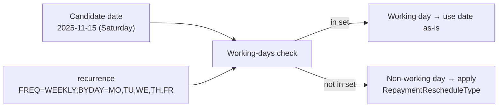
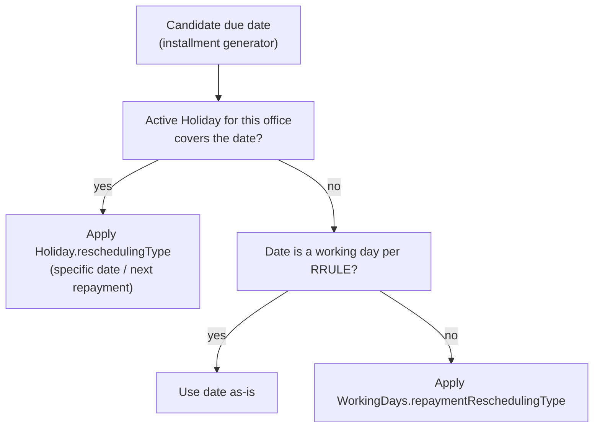
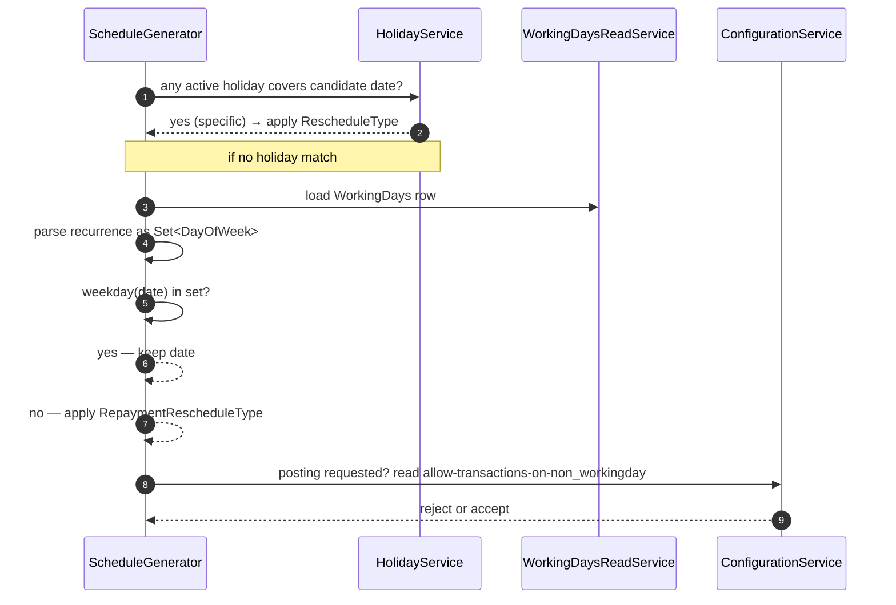

Working days in Apache Fineract are a single tenant-wide record that describes which weekdays the institution operates on, and what to do when a loan installment, savings posting, or charge would otherwise fall on a day the office is closed. Unlike holidays, this is a recurring pattern rather than a one-off date range — and it is stored as an iCalendar `RRULE` string for forward compatibility with calendar interchange. The mapping lives in `fineract-core/src/main/java/org/apache/fineract/organisation/workingdays/domain/WorkingDays.java`.

## Entity shape

`WorkingDays extends AbstractPersistableCustom<Long>` and maps to the single-row table `m_working_days`. There is exactly one row per tenant; the entity has no office FK because the working-days pattern is institution-wide.

| Field | Column | Notes |
| --- | --- | --- |
| `recurrence` | `recurrence`, length 100 | iCalendar `RRULE` string. Encodes which weekdays are working. |
| `repaymentReschedulingType` | `repayment_rescheduling_enum` | Int code — `RepaymentRescheduleType` enum. |
| `extendTermForDailyRepayments` | `extend_term_daily_repayments` | Boolean. |
| `extendTermForRepaymentsOnHolidays` | `extend_term_holiday_repayment` | Boolean. |

`@Builder`, `@Getter`, `@Setter`, and `@FieldNameConstants` from Lombok cover the boilerplate. Updates are applied via the write-platform service through the standard `JsonCommand` delta pattern.

## The `RRULE` recurrence

The `recurrence` column stores a single iCalendar recurrence rule that enumerates working weekdays. The most common values:

| Pattern | RRULE |
| --- | --- |
| Mon–Fri only | `FREQ=WEEKLY;INTERVAL=1;BYDAY=MO,TU,WE,TH,FR` |
| Mon–Sat | `FREQ=WEEKLY;INTERVAL=1;BYDAY=MO,TU,WE,TH,FR,SA` |
| Six-day, closed Friday (Middle East) | `FREQ=WEEKLY;INTERVAL=1;BYDAY=SA,SU,MO,TU,WE,TH` |
| Every day | `FREQ=WEEKLY;INTERVAL=1;BYDAY=MO,TU,WE,TH,FR,SA,SU` |

Apache Fineract parses the rule with the iCal4j library that already underpins the loan calendar machinery. Whenever a candidate date needs to be tested, the rule is evaluated as a set of allowed `DayOfWeek` values and the date's weekday is checked for membership.



## `RepaymentRescheduleType`

When a candidate due date falls outside the working pattern, the entity-level enum decides what to do.

```java
public enum RepaymentRescheduleType {
    INVALID(0,                              "RepaymentRescheduleType.invalid"),
    SAME_DAY(1,                             "RepaymentRescheduleType.same.day"),
    MOVE_TO_NEXT_WORKING_DAY(2,             "RepaymentRescheduleType.move.to.next.working.day"),
    MOVE_TO_NEXT_REPAYMENT_MEETING_DAY(3,   "RepaymentRescheduleType.move.to.next.repayment.meeting.day"),
    MOVE_TO_PREVIOUS_WORKING_DAY(4,         "RepaymentRescheduleType.move.to.previous.working.day"),
    MOVE_TO_NEXT_MEETING_DAY(5,             "RepaymentRescheduleType.move.to.next.meeting.day");
}
```

- **`SAME_DAY` (1)** — leave the installment on the non-working day. The customer technically owes on a closed day; the cashier accepts the payment the next working day, and the installment is marked paid as of the original due date.
- **`MOVE_TO_NEXT_WORKING_DAY` (2)** — push the installment forward to the next working weekday. The most widely used option.
- **`MOVE_TO_NEXT_REPAYMENT_MEETING_DAY` (3)** — for group loans that meet on a fixed weekly day, snap to the next scheduled meeting date even if that skips one or more working days.
- **`MOVE_TO_PREVIOUS_WORKING_DAY` (4)** — pull the installment back to the previous working day. Useful for end-of-month due dates where institutions prefer to recognise income before the calendar boundary.
- **`MOVE_TO_NEXT_MEETING_DAY` (5)** — like option 3, but used for the broader calendar-event-driven schedule rather than a group's own meeting.

The single predicate published by the enum is `isMoveToNextRepaymentDay()`, used by the loan schedule generator to distinguish group-meeting alignment from plain calendar movement.

## Term extension flags

The two booleans on `WorkingDays` modulate whether the *term* of the loan (i.e. the total number of installments) gets extended when adjustments happen.

| Flag | Meaning |
| --- | --- |
| `extendTermForDailyRepayments` | For daily-frequency loans, when an installment is moved off a non-working day, also push out the last installment to keep the total count constant. Without this flag, two installments collapse onto the next working day. |
| `extendTermForRepaymentsOnHolidays` | For installments moved off a holiday window (per `Holiday.reschedulingType`), extend the term so the loan maturity slides forward by the holiday length. |

These flags are read by the loan schedule generator at disbursement and at every recompute. They do not affect already-paid installments — only future-dated ones.

## Allow transactions on non-working days

Whether a *manual* transaction (cash receipt, cash payment, journal entry) can be posted on a non-working day is governed not by `WorkingDays` itself but by the global configuration toggle `allow-transactions-on-non_workingday` in `c_configuration`. The working-days entity controls the *scheduling* side; the configuration toggles the *posting* side.

| Configuration toggle | Effect |
| --- | --- |
| `allow-transactions-on-non_workingday = true` | A transaction with a business date that falls on a non-working day is accepted. |
| `allow-transactions-on-non_workingday = false` | The write-platform validator throws `transactions.not.allowed.on.non.workingday` and the call is rejected. |

In practice, most production tenants leave the toggle `false` to keep cashier discipline aligned with the working calendar, and use `MOVE_TO_NEXT_WORKING_DAY` to keep customers from ever facing a Saturday/Sunday due date.

## End-to-end fallthrough order



Holidays beat working-days. The schedule engine resolves a holiday first; only when no holiday matches does it test the weekly RRULE.

## Reading and updating

The endpoint surface is intentionally minimal — there is one row, queried by id `1`:

| Method | Path | Permission | Purpose |
| --- | --- | --- | --- |
| `GET` | `/v1/workingdays` | `READ_WORKINGDAYS` | Read the current working-days row. |
| `GET` | `/v1/workingdays/template` | `READ_WORKINGDAYS` | Available reschedule-type options. |
| `PUT` | `/v1/workingdays` | `UPDATE_WORKINGDAYS` | Apply changes to recurrence / flags / type. |

The PUT body accepts `recurrence`, `repaymentRescheduleType`, `extendTermForDailyRepayments`, and `extendTermForRepaymentsOnHolidays`. The change goes through `CommandsSourceWritePlatformService`, so the maker-checker workflow can wrap it.

<Warning>
Changing the working-days pattern does not retroactively rewrite already-generated loan schedules. Existing loans keep the schedule they had at disbursement; only loans newly generated or explicitly recalculated will use the new pattern.
</Warning>

## Validation notes

- `recurrence` is required and must parse as a valid `RRULE`. A bad rule is rejected by iCal4j before the row is written.
- `repaymentReschedulingType` must be in `RepaymentRescheduleType` excluding `INVALID(0)`.
- The flags default to `false`. They can be toggled independently — daily-frequency extension does not imply holiday-extension and vice versa.

## Interaction surface

The working-days entity participates in:

- **Loan schedule generation** — every new installment date is filtered through the RRULE.
- **Charge due-date computation** — periodic charges follow the same rule.
- **Savings interest-posting cycles** — posting dates that land on a non-working day are shifted by the same rule.
- **Standing-instruction execution** — recurring transfers honour the working-days pattern.
- **Recurring deposit installment dates** — RD products consult the working calendar.

<CardGroup cols={2}>
  <Card title="Holidays" href="/organisation/holidays">
    Layer one-off holiday windows on top of the weekly pattern.
  </Card>
  <Card title="Offices" href="/organisation/offices">
    Loans and savings always belong to an office; the working-days pattern is institution-wide.
  </Card>
</CardGroup>

## Migration history

The working-days row is seeded by the initial Liquibase changeset shipped with Apache Fineract. The default is Monday–Friday with `MOVE_TO_NEXT_WORKING_DAY` and both extend flags off. Tenants relocating to a six-day or atypical week update the row through the API; the migration does not need to be re-run.

## Worked schedule examples

### Five-day week, `MOVE_TO_NEXT_WORKING_DAY`

A weekly loan with installment due dates 2025-11-01 (Saturday), 2025-11-08 (Saturday), 2025-11-15 (Saturday) becomes, after rescheduling, 2025-11-03 (Monday), 2025-11-10 (Monday), 2025-11-17 (Monday). The term is unchanged.

### Five-day week, `MOVE_TO_PREVIOUS_WORKING_DAY`

The same loan becomes 2025-10-31 (Friday), 2025-11-07 (Friday), 2025-11-14 (Friday). Same term, dates pulled earlier.

### Daily loan with `extendTermForDailyRepayments = true`

A 30-day daily loan disbursed Monday 2025-11-03 lands on Saturday and Sunday installments 5 and 6. Without the flag, those two installments collapse onto the next Monday — the loan ends with 28 installments. With the flag set, two extra installments are appended at the tail and the loan ends with the original 30 installments.

### Holiday extension example

A loan with a 1-week holiday window applied via `RESCHEDULETOSPECIFICDATE` and `extendTermForRepaymentsOnHolidays = true` has its maturity date pushed forward by the holiday length, so the final installment retains its original spacing relative to its predecessor.

## Internal flow



The schedule generator is the one place these three sources converge. The configuration toggle gates the posting path; the working-days row gates the scheduling path; the holiday entity overrides both for its window.

## Edge cases worth knowing

- **Every-day RRULE.** Setting `BYDAY=MO,TU,WE,TH,FR,SA,SU` effectively disables the working-days check. Every date is a working day and `repaymentReschedulingType` never fires. Useful for purely digital, 24/7 deployments.
- **Single-day RRULE.** Restricting to one day per week (e.g. group-meeting Saturdays) is supported but makes `MOVE_TO_NEXT_WORKING_DAY` produce week-long shifts. Combine with `MOVE_TO_NEXT_REPAYMENT_MEETING_DAY` to anchor on the meeting cadence instead.
- **RRULE without BYDAY.** Invalid — the RRULE must enumerate working days explicitly.
- **Flip-flopping the flags.** Changing the extend-term booleans affects only newly-generated schedules. Existing loans keep their schedule until a manual recompute is requested.

## Validation summary

- `recurrence` is required and must be a syntactically valid `RRULE`.
- The RRULE must enumerate at least one day in `BYDAY`.
- `repaymentReschedulingType` must be one of `SAME_DAY`, `MOVE_TO_NEXT_WORKING_DAY`, `MOVE_TO_NEXT_REPAYMENT_MEETING_DAY`, `MOVE_TO_PREVIOUS_WORKING_DAY`, `MOVE_TO_NEXT_MEETING_DAY` — `INVALID` is rejected.
- `extendTermForDailyRepayments` and `extendTermForRepaymentsOnHolidays` default to `false` and are independent of each other.

## Read-side projection

`WorkingDaysData` is the JSON shape returned by `GET /v1/workingdays`. It exposes `recurrence`, the resolved repayment reschedule type with its int code and i18n label, and the two extend flags. The template endpoint adds the full list of `RepaymentRescheduleType` options for picker rendering.

## How the configuration toggle is wired

The `allow-transactions-on-non_workingday` configuration is read at request-validation time by the loan, savings, and journal-entry write-platform services. The toggle is loaded through `ConfigurationDomainServiceJpa.allowTransactionsOnNonWorkingDay()`, which caches the value within a transaction and falls back to `false` when the configuration row is absent. Production tenants typically leave it disabled and rely on the working-days reschedule to keep due dates off non-working days entirely.

## Interaction with the calendar module

Apache Fineract also has a richer per-product calendar (`m_calendar`, `m_calendar_instance`) that drives group-meeting cycles and loan-repayment frequency. Working days act as a final filter on top of those calendars — a meeting that lands on a non-working day is shifted by `RepaymentRescheduleType`. Group loans whose calendar uses a weekly cadence on Saturday in a Mon–Fri working-days tenant will see every installment shifted to Monday unless the `MOVE_TO_NEXT_REPAYMENT_MEETING_DAY` option is selected, which keeps the meeting on its native day.

## Cross-module touchpoints

The working-days entity is consulted by:

- **Loan schedule generation** — every newly-generated installment date.
- **Loan transaction validation** — when posting repayment or charge collection.
- **Savings interest posting** — when computing posting dates that fall on closed days.
- **Recurring deposit installment generation** — RD products use the same calendar fall-through.
- **Standing instructions** — automated transfers consult both holidays and working-days before firing.
- **Charge accrual** — periodic fees follow the working calendar.

A single row drives all of these, which is why the platform exposes a single PUT endpoint rather than per-product overrides. A regulator-mandated change to the week structure ripples through every product in a consistent way.

## Operational tips

- **Set the working calendar before disbursing any loans.** Loans generated against a default Mon–Fri pattern will keep that pattern unless explicitly recomputed; changing the working days afterwards leaves a long tail of legacy schedules.
- **Audit the RRULE.** A small typo (`BYDAY=MO,TU,W,TH,FR` instead of `WE`) silently turns Wednesday into a non-working day. The validator catches truly malformed rules but accepts any valid weekday set.
- **Test rescheduling on a sandbox.** Picking between `MOVE_TO_NEXT_WORKING_DAY` and `MOVE_TO_NEXT_REPAYMENT_MEETING_DAY` is a policy decision; run a few group loans through both options in a non-production tenant to confirm the cash-flow timing matches your business plan.
- **Avoid `SAME_DAY` unless required.** It produces customer-facing due dates on closed days, which is confusing on receipts and reminder messages.

## How the iCal4j parse works

The `recurrence` string is fed into `net.fortuna.ical4j.model.Recur` once per request. The parser interprets `BYDAY` into an internal `Recur.DayList`, which the working-days service converts to a `Set<DayOfWeek>` for quick membership tests. Other RRULE features (`UNTIL`, `COUNT`, `INTERVAL` other than 1) are parsed but unused — only weekday membership matters for the working-days check.

Maintainers who want richer calendar logic (e.g., honour `UNTIL` to phase-in a new schedule mid-year) can extend the working-days service to consult those fields. The entity itself is stable; only the consumer logic needs updating.

## API quickstart

A full round-trip to flip a tenant from Mon–Fri to Mon–Sat:

```http
GET /v1/workingdays
HTTP/1.1 200 OK
{
  "id": 1,
  "recurrence": "FREQ=WEEKLY;INTERVAL=1;BYDAY=MO,TU,WE,TH,FR",
  "repaymentRescheduleType": { "id": 2, "code": "MOVE_TO_NEXT_WORKING_DAY" },
  "extendTermForDailyRepayments": false,
  "extendTermForRepaymentsOnHolidays": false
}
```

```http
PUT /v1/workingdays
{
  "recurrence": "FREQ=WEEKLY;INTERVAL=1;BYDAY=MO,TU,WE,TH,FR,SA",
  "repaymentRescheduleType": 2,
  "extendTermForDailyRepayments": false,
  "extendTermForRepaymentsOnHolidays": false
}
```

The PUT body is the same shape as the GET response; the platform applies only the fields that have changed and returns the set of actual deltas in the command-processing result.
