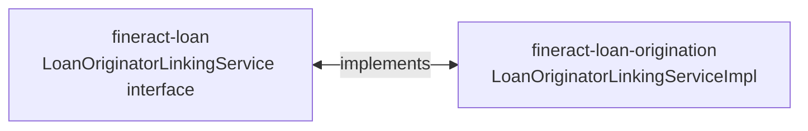

This page traces an application from inbound request to persisted
originator-mapping. It complements
[Loan origination overview](/origination/overview), which covers the
domain model.

The end-to-end actor is `LoanOriginatorLinkingServiceImpl`, the
implementation of `LoanOriginatorLinkingService` that the loan write
service calls at well-defined points in the application lifecycle.

## The wire payload

A loan submit request can carry an optional `originators` JSON array:

```json
{
  "clientId": 42,
  "productId": 7,
  "principal": 50000,
  "loanTermFrequency": 12,
  "loanTermFrequencyType": 2,
  "originators": [
    {
      "originatorId": 11,
      "externalId": "ACME-AGENT-001",
      "channelTypeId": 19
    },
    {
      "externalId": "ACME-BRANCH-LON"
    }
  ]
}
```

Either `originatorId` or `externalId` resolves to a `LoanOriginator`.
The `LoanApplicationOriginatorData` DTO captures the parsed entry. The
optional `channelTypeId` lets the application override the originator's
default channel for this specific loan (e.g. an agent who normally
operates online but routed this case through a branch).

## End-to-end flow

```mermaid
sequenceDiagram
    participant API as Loan submit API
    participant LoanWrite as LoanWritePlatformService
    participant Link as LoanOriginatorLinkingServiceImpl
    participant Valid as LoanApplicationOriginatorDataValidator
    participant Repo as LoanOriginatorRepository
    participant MapRepo as LoanOriginatorMappingRepository

    API->>LoanWrite: submitLoanApplication(JsonCommand)
    LoanWrite->>LoanWrite: persist Loan in SUBMITTED state
    LoanWrite->>Link: processOriginatorsForLoanApplication(loanId, originatorsJsonArray)
    loop For each entry in array
        Link->>Valid: validateAndExtract(jsonObject)
        Valid-->>Link: LoanApplicationOriginatorData
        Link->>Repo: find by id or external id
        Repo-->>Link: LoanOriginator
        Link->>Link: ensure status == ACTIVE
        Link->>MapRepo: save new LoanOriginatorMapping
    end
    Link-->>LoanWrite: void
    LoanWrite-->>API: CommandProcessingResult{loanId}
```

## Stage 1: submit

`LoanWritePlatformServiceJpaRepositoryImpl.submitLoanApplication`
persists the loan in `SUBMITTED_AND_PENDING_APPROVAL` status, then calls
the linking service:

```java
@Transactional
@Override
public void processOriginatorsForLoanApplication(final Long loanId,
                                                 final JsonArray originatorsArray) {
    if (originatorsArray == null || originatorsArray.isEmpty()) {
        return;
    }
    log.debug("Processing {} originators for loan application {}",
              originatorsArray.size(), loanId);

    final Set<Long> attachedOriginatorIds = new HashSet<>();

    for (final JsonElement element : originatorsArray) {
        if (!element.isJsonObject()) { continue; }
        final JsonObject jsonObject = element.getAsJsonObject();
        final LoanApplicationOriginatorData originatorData =
                validator.validateAndExtract(jsonObject);
        // …resolve, validate ACTIVE, persist mapping…
    }
}
```

<Steps>
  <Step title="Skip when empty">
    A null or empty array is the no-op path. Existing applications that
    don't care about originators pay no overhead beyond a single null
    check.
  </Step>
  <Step title="Validate JSON entry">
    `LoanApplicationOriginatorDataValidator.validateAndExtract` enforces:
    exactly one of `originatorId` / `externalId` present, both fields
    non-blank, optional `channelTypeId` resolves to a real code value.
  </Step>
  <Step title="Resolve the originator">
    Lookup goes through `LoanOriginatorRepository` — by ID when present,
    otherwise by external ID. Missing originators throw
    `LoanOriginatorNotFoundException`.
  </Step>
  <Step title="Enforce ACTIVE status">
    Inactive or pending originators raise `LoanOriginatorNotActiveException`
    — preventing payroll attribution to a deactivated agent.
  </Step>
  <Step title="Dedupe">
    The `attachedOriginatorIds` set rejects duplicate entries within the
    same array. Two distinct mappings to the same originator on the
    same loan are nonsensical.
  </Step>
  <Step title="Persist mapping">
    `LoanOriginatorMapping.create(loanId, originator)` is saved through
    `LoanOriginatorMappingRepository`.
  </Step>
</Steps>

## Stage 2: modify application

The write service exposes a separate operation for editing originators
on an already-submitted application. It runs only while the loan is
still in submitted status — `LoanNotInSubmittedStatusException` blocks
edits to approved or disbursed loans, since their originator attribution
is by then in use by downstream payouts and reports.

<Warning>
  Once the loan moves past submitted, **originator mappings are
  immutable**. To correct a wrong attribution after approval, withdraw
  the loan and resubmit. This is intentional: revenue-share posting
  uses the mapping as its source of truth, and silent edits would
  rewrite history.
</Warning>

## Stage 3: read enrichment

The `enricher/` package provides a response decorator that adds a
`loanOriginators` block to loan read endpoints. The shape mirrors the
submit payload:

```json
{
  "loan": {
    "id": 1234,
    "loanOriginators": [
      {
        "originatorId": 11,
        "externalId": "ACME-AGENT-001",
        "name": "Acme Lead Broker",
        "channelType": { "id": 19, "name": "Mobile" }
      }
    ]
  }
}
```

Enrichment is opt-in via the module property — when the module is off,
the block is absent.

## Document attachments

This module does **not** manage documents. KYC packets, ID scans, and
similar artefacts attach to clients and loans via the core
`fineract-document` module. The handoff is purely metadata: the
originator that introduced the application doesn't own the application's
files.

## Bridge contract

```java
package org.apache.fineract.portfolio.loanaccount.service;

public interface LoanOriginatorLinkingService {
    void processOriginatorsForLoanApplication(Long loanId, JsonArray originatorsArray);
    // additional methods for modify and removal
}
```

This interface ships with `fineract-loan`. The implementation lives in
`fineract-loan-origination` and is wired in only when the module is on.
When off, the loan write service injects a noop implementation provided
by Spring's `@ConditionalOnMissingBean`.



## Validation rules in one place

<AccordionGroup>
  <Accordion title="JSON shape">
    Each `originators[]` entry must be an object. Arrays of strings or
    nulls are silently skipped — keeping the integration forgiving for
    clients that build the payload dynamically.
  </Accordion>
  <Accordion title="Identity">
    Exactly one of `originatorId` / `externalId` is required. Supplying
    both is allowed only if they resolve to the same row.
  </Accordion>
  <Accordion title="Status">
    Originator must be `ACTIVE`. The status check is per-call: if an
    originator is deactivated mid-batch the next entry sees the new
    status.
  </Accordion>
  <Accordion title="Dedup">
    Within one submit call, each originator id appears at most once.
    Across submits, the same originator can appear on many loans.
  </Accordion>
  <Accordion title="Race handling">
    A `DataIntegrityViolationException` with SQL state class `23`
    (integrity constraint violation) on the mapping insert is mapped to
    `LoanOriginatorMappingAlreadyExistsException` — preventing a
    duplicate mapping created by a concurrent submitter.
  </Accordion>
</AccordionGroup>

## Error surface

| Exception | Cause | HTTP |
| --- | --- | --- |
| `LoanOriginatorNotFoundException` | id / externalId doesn't resolve | 404 |
| `LoanOriginatorNotActiveException` | originator status is PENDING / INACTIVE | 403 |
| `LoanOriginatorDuplicateExternalIdException` | external id collision on create | 409 |
| `LoanOriginatorMappingAlreadyExistsException` | duplicate (loan, originator) pair | 409 |
| `LoanOriginatorMappingNotFoundException` | remove called on missing mapping | 404 |
| `LoanOriginatorCannotBeDeletedException` | originator has live mappings | 409 |
| `LoanNotInSubmittedStatusException` | modify called after approval | 403 |

All exceptions are mapped to RFC-7807 problem responses by the global
exception handler.

## Worked example

<Tabs>
  <Tab title="Happy path">
    1. Operator creates a `BROKER` code value, then an originator with
       external ID `ACME-AGENT-001` in `PENDING` status.
    2. Operator activates the originator (status → `ACTIVE`).
    3. A submit call references the originator by external ID.
    4. The linking service creates a mapping row. Audit columns record
       which user submitted the loan.
    5. Read endpoints now surface the originator alongside the loan.
  </Tab>
  <Tab title="Originator deactivated mid-flight">
    1. The submit payload includes two originators.
    2. The first is `ACTIVE` and is mapped successfully.
    3. Between iterations, another operator deactivates the second
       originator.
    4. The status check on the second iteration throws
       `LoanOriginatorNotActiveException`. The transaction rolls back
       and *neither* mapping is persisted — keeping the loan's
       attribution all-or-nothing.
  </Tab>
</Tabs>

## Related references

<CardGroup cols={2}>
  <Card title="Origination overview" href="/origination/overview" icon="user-tie" />
  <Card title="Loan lifecycle" href="/loan/loan-application-lifecycle" icon="circle-play" />
  <Card title="Loan write service" href="/loan/loan-handlers" icon="pen-to-square" />
  <Card title="Audit and command framework" href="/core/commands-framework" icon="shield" />
</CardGroup>

<Tip>
  When integrating an external CRM, drive the originator catalog with
  the CRM's IDs as `externalId`. Submit payloads can then carry only
  external IDs, side-stepping the internal `originatorId` and keeping
  the two systems in sync.
</Tip>
