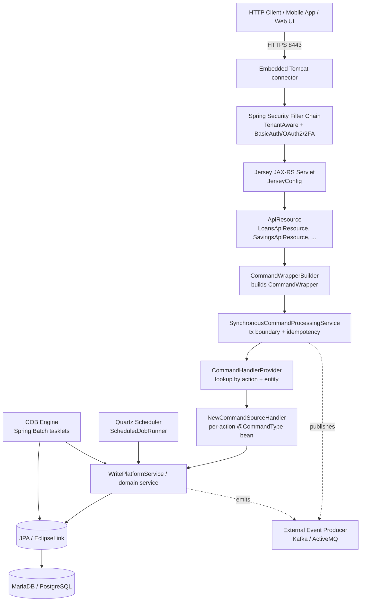

Apache Fineract is a layered, modular Spring Boot application that exposes a JAX-RS HTTP API on top of a domain-driven core for microfinance and digital banking. A request travels through Tomcat's connector, the Spring Security filter chain, a Jersey servlet that dispatches to API resource classes, a command bus that wraps write operations, and finally domain services that mutate JPA-managed entities persisted to MariaDB, MySQL, or PostgreSQL. Out-of-band machinery — the Close-of-Business (COB) engine, the Quartz scheduler, and the external event producer — runs alongside the request path and is wired through the same Spring context.

This page maps that pipeline onto the source tree so the rest of the wiki can refer back to a single shared mental model.

## Request pipeline at a glance

<Note>
The numbers in the diagram below mirror the layer table further down — use them together when tracing a request from `curl` to a row in the `m_loan` table.
</Note>

## Layers, by file

| # | Layer | What it does | Representative type |
|---|-------|--------------|---------------------|
| 1 | Boot | Spring Boot main / WAR initializer; selects web vs Liquibase-only mode | `org.apache.fineract.ServerApplication` |
| 2 | Filters | Tenant resolution, authentication, CORS, correlation id | `TenantAwareBasicAuthenticationFilter`, `TwoFactorAuthenticationFilter` |
| 3 | JAX-RS | Servlet container and resource scanning | `JerseyConfig` (in `fineract-provider`) |
| 4 | API Resource | URL/method binding, request/response DTOs, OpenAPI annotations | `LoansApiResource`, `SavingsAccountsApiResource`, `JournalEntriesApiResource` |
| 5 | Command builder | Materializes a `CommandWrapper` from path + body + action verb | `CommandWrapperBuilder` |
| 6 | Command bus | Transaction, audit, idempotency, optimistic locking retry | `SynchronousCommandProcessingService` |
| 7 | Handler lookup | Dispatches by `(entity, action)` pair | `CommandHandlerProvider` |
| 8 | Command handler | Thin Spring bean annotated with `@CommandType`, calls a write service | `CreateLoanApplicationCommandHandler`, `DisburseLoanCommandHandler` |
| 9 | Write platform service | Domain orchestration; loads aggregates, mutates them, persists | `LoanWritePlatformService`, `SavingsAccountWritePlatformService` |
| 10 | Domain model | Aggregate roots and value objects with behavior | `Loan`, `SavingsAccount`, `JournalEntry`, `Office` |
| 11 | Persistence | JPA (EclipseLink) repositories and JDBC helpers | `LoanRepository`, `JdbcTemplate`, `JdbcSupport` |
| 12 | Read services | Read-only projections, often raw SQL for performance | `LoanReadPlatformServiceImpl`, `SavingsAccountReadPlatformServiceImpl` |

<Tip>
Reads bypass the command bus entirely: a GET request goes Resource → ReadPlatformService → `JdbcTemplate`. Only writes (POST/PUT/DELETE) go through `CommandWrapper`.
</Tip>

## Why a command bus?

The command bus exists to standardize what every write needs: an audit record (the `m_portfolio_command_source` row), a single transaction boundary, idempotency keyed on a client-supplied token, optimistic-locking retry, and a Maker/Checker workflow toggle. Centralizing those concerns means every new business operation only writes one slim `@CommandType` handler plus its domain service.

<CardGroup cols={2}>
  <Card title="CommandWrapper" icon="cube">
    Immutable record of `(actionName, entityName, entityId, href, jsonBody)`. Built by `CommandWrapperBuilder`.
  </Card>
  <Card title="JsonCommand" icon="brackets-curly">
    Parsed view of the JSON payload passed to handlers. Provides typed accessors (`stringValueOfParameterNamed`, `bigDecimalValueOfParameterNamed`).
  </Card>
  <Card title="CommandSource" icon="database">
    Audit row written before/after execution. Holds the maker, checker, status, and result hash.
  </Card>
  <Card title="CommandProcessingResult" icon="check">
    Returned to the resource layer: contains `commandId`, `entityId`, change map, and external id.
  </Card>
</CardGroup>

## Cross-cutting concerns

Several capabilities span all layers and are configured once at the application level rather than per-module.

| Concern | Mechanism | Source |
|---------|-----------|--------|
| Multi-tenancy | `ThreadLocal` tenant context + routing `DataSource` selects per-tenant connection pool | `FineractPlatformTenant`, `RoutingDataSource`, `TenantDetailsService` |
| Authentication | Spring Security with pluggable BasicAuth / OAuth2 resource-server / 2FA OTP filter | `fineract-security`, `twofactor-tests`, `oauth2-tests` |
| Authorization | Permission strings (`PORTFOLIO_PRODUCT.CREATE_LOAN`) checked in handlers via `PlatformSecurityContext` | `PlatformSecurityContext`, `Permission` |
| Audit | Every command writes `m_portfolio_command_source`; Maker/Checker uses the same row | `CommandSource`, `fineract-command-audit` |
| Idempotency | Client sends `Idempotency-Key`; duplicates short-circuit to the stored result | `IdempotencyKeyResolver`, `CommandSource.idempotencyKey` |
| Close-of-Business | Spring Batch jobs run nightly per tenant to age accounts, accrue interest, run penalties | `fineract-cob`, `LoanCOBManagerService` |
| Scheduled jobs | Quartz scheduler runs background jobs (interest posting, holiday roll, dormancy) | `JobName`, `ScheduledJobRunnerService` |
| External events | Domain events serialized to Avro and published to Kafka or ActiveMQ | `fineract-avro-schemas`, `ExternalEventProducer` |
| Business date | Per-tenant `BusinessDate` decouples "today" from wall-clock time | `BusinessDate`, `BusinessDateApiResource` |
| Configuration | `FineractProperties` binds `fineract.*` keys; profiles select boot mode | `FineractProperties`, `application.properties` |

## Modular build

Fineract is a single deployable WAR but is broken into ~30 Gradle subprojects so concerns can be developed and tested in isolation. The full list lives in `settings.gradle`.

<AccordionGroup>
  <Accordion title="Core platform">
    `fineract-core` — domain primitives, `FineractContext`, JPA configuration, business date, tenant infrastructure, security context interface, JSON command parsing.
    `fineract-security` — Spring Security configuration, basic-auth and OAuth2 wiring, password hashing.
    `fineract-validation` — Hibernate Validator setup, custom constraint annotations.
  </Accordion>
  <Accordion title="Command bus">
    `fineract-command` — `CommandSource` entity and bus abstractions.
    `fineract-command-jdbc` — JDBC persistence for the command source table.
    `fineract-command-audit` — audit decorator that writes pre/post snapshots.
    `fineract-command-async` — async dispatch via Spring's `@Async` executor.
    `fineract-command-disruptor` — LMAX Disruptor-backed dispatcher for very high write throughput.
    `fineract-command-test` — shared test fixtures.
  </Accordion>
  <Accordion title="Portfolio modules">
    `fineract-loan` / `fineract-progressive-loan` / `fineract-working-capital-loan` — three loan flavours.
    `fineract-loan-origination` — application workflow before disbursement.
    `fineract-savings` — savings, recurring deposit, fixed deposit accounts.
    `fineract-investor` — securitization and asset-management linkage.
    `fineract-charge`, `fineract-rates`, `fineract-tax` — pricing primitives shared by loan and savings.
    `fineract-branch` — office hierarchy, staff, holidays.
  </Accordion>
  <Accordion title="Accounting and reporting">
    `fineract-accounting` — chart of accounts, journal entries, accrual postings, the Accounting Bridge.
    `fineract-mix` — Microfinance Information eXchange (MIX) regulatory reports.
    `fineract-report` — Pentaho/Jasper reporting integration and report parameter model.
    `fineract-document` — file attachment store with pluggable backends.
  </Accordion>
  <Accordion title="Runtime and packaging">
    `fineract-provider` — the runnable Spring Boot app: API resources, Jersey config, Quartz scheduler.
    `fineract-cob` — Close-of-Business batch engine.
    `fineract-war` — WAR packaging that includes `fineract-provider` plus all portfolio modules.
    `fineract-avro-schemas` — Avro IDLs for external events; generates a Java SDK.
    `fineract-client`, `fineract-client-feign` — generated Java SDKs.
    `fineract-doc` — Asciidoctor user guide and developer reference.
  </Accordion>
  <Accordion title="Test harnesses">
    `integration-tests` — REST-Assured integration test suite.
    `fineract-e2e-tests-core` / `fineract-e2e-tests-runner` — Cucumber end-to-end scenarios.
    `oauth2-tests`, `twofactor-tests` — auth-mode-specific integration suites.
    `custom/` — dynamic Gradle inclusion of customer-specific modules.
  </Accordion>
</AccordionGroup>

## Boot modes

`ServerApplication.main()` constructs a `SpringApplicationBuilder` that imports both `FineractWebApplicationConfiguration` and `FineractLiquibaseOnlyApplicationConfiguration`. Which one activates is chosen by `@Conditional` classes that read the active Spring profile.

| Mode | Profile / property | What it does |
|------|--------------------|--------------|
| Web | default | Boots Tomcat on `server.port` (8443), wires Jersey, Quartz, COB |
| Liquibase-only | `liquibase-only` profile | Runs migrations against the configured DataSources, exits |
| Diagnostics | `diagnostics` profile | Adds extra logging and JMX endpoints |
| Read-only worker | `fineract.mode.read-enabled=true` only | Disables write endpoints and schedulers; useful for read replicas |
| Batch worker | `fineract.mode.batch-worker-enabled=true` | Participates in Spring Batch as a remote partitioned worker |

<Info>
See [Runtime model](/overview/runtime-model) for the full startup sequence and how these modes combine with `fineract.node-id`.
</Info>

## A worked request: disbursing a loan

To make the layer table concrete, here is what happens when a client `POST`s to `/loans/{loanId}?command=disburse`.

<Steps>
  <Step title="Tomcat accepts the connection">
    The embedded connector terminates TLS and hands the request to Spring Security's filter chain.
  </Step>
  <Step title="Filters set up context">
    `TenantAwareBasicAuthenticationFilter` reads `Fineract-Platform-TenantId`, looks up the tenant, and pushes a `FineractPlatformTenant` into `ThreadLocalContextUtil`. The basic-auth (or OAuth2) filter authenticates and stores an `AppUser` in `PlatformSecurityContext`. If 2FA is enabled, `TwoFactorAuthenticationFilter` checks the OTP token.
  </Step>
  <Step title="Jersey dispatches to LoansApiResource">
    The `@Path("/v1/loans/{loanId}")` resource method binds path/body and reads `?command=disburse`.
  </Step>
  <Step title="CommandWrapperBuilder builds a CommandWrapper">
    `new CommandWrapperBuilder().disburseLoanApplication(loanId).withJson(apiJsonRequest).build()` materializes the immutable command record.
  </Step>
  <Step title="SynchronousCommandProcessingService runs">
    Opens a transaction, persists a pending `CommandSource` row, resolves the handler via `CommandHandlerProvider`, then invokes it.
  </Step>
  <Step title="DisburseLoanCommandHandler calls the domain service">
    A thin `@CommandType(entity = "LOAN", action = "DISBURSE")` bean delegates to `LoanWritePlatformService.disburseLoan(...)`.
  </Step>
  <Step title="LoanWritePlatformService mutates aggregates">
    Loads the `Loan` aggregate, applies the disbursement transaction, recomputes the repayment schedule, and asks the `AccountingBridge` to produce journal entries.
  </Step>
  <Step title="JPA persists, events fire">
    EclipseLink flushes the `Loan`, `LoanTransaction`, and `JournalEntry` rows. `BusinessEvent`s are raised inside the same transaction; on commit the external-event producer publishes their Avro form to Kafka/ActiveMQ.
  </Step>
  <Step title="CommandSource is finalized">
    The processor updates the audit row with the new status and result hash. The HTTP response carries the `CommandProcessingResult` (commandId, resourceId, changes map).
  </Step>
</Steps>

<Tip>
Tracing this flow in your own checkout? Set `logging.level.org.apache.fineract.commands=DEBUG` to see every command wrapper, handler resolution, and processing result on the console.
</Tip>

## Persistence model in one slide

Fineract uses EclipseLink JPA with static weaving plus heavy use of raw JDBC for reads. The combination is intentional: writes go through aggregates so domain invariants are enforced, while reads bypass the ORM for SQL that can be tuned independently of entity mappings.

| Concern | Tool | Where it lives |
|---------|------|----------------|
| Aggregate persistence | EclipseLink JPA | `*Repository` interfaces extending `JpaRepository` |
| Static weaving | Gradle EclipseLink plugin | `static-weaving.gradle` |
| Schema migration | Liquibase XML/SQL | `fineract-db/.../db/changelog/tenant/` |
| Multi-tenant routing | `RoutingDataSource` | `fineract-core/.../service/database/` |
| Read projections | `JdbcTemplate` + `RowMapper` | `*ReadPlatformServiceImpl` classes |
| Identifier-friendly types | `JdbcSupport` helpers | `fineract-core/.../service/database/JdbcSupport.java` |

## How modules collaborate per concern

The layered diagram earlier shows the request path. The same modules also collaborate horizontally per concern — for example, every portfolio module raises business events that the accounting module turns into journal entries.

| Concern | Originator modules | Reactor modules |
|---------|--------------------|-----------------|
| Money movement (loan disbursement, repayment, savings deposit) | `fineract-loan`, `fineract-savings`, `fineract-progressive-loan` | `fineract-accounting` (journal entries), `fineract-investor` (external owner postings) |
| Charge application | `fineract-charge` | `fineract-loan`, `fineract-savings`, `fineract-accounting` |
| Interest calculation | `fineract-loan`, `fineract-savings`, `fineract-rates` | `fineract-accounting` (accrual), `fineract-cob` (nightly accrual posting) |
| Tax calculation | `fineract-tax` | `fineract-charge`, `fineract-loan`, `fineract-savings` |
| Business date advancement | `fineract-cob` | every portfolio module that asks for "today" |
| Provisioning | `fineract-accounting` | `fineract-loan` (arrears age), `fineract-mix` (regulatory reports) |

<Info>
Notice that `fineract-accounting` is almost always a reactor, never an originator. It exists to mirror portfolio activity into double-entry book-keeping, which is why its public surface is dominated by the `AccountingBridge` and accrual processors rather than write-platform services.
</Info>

## Failure modes to keep in mind

A short reference for when the picture above breaks down.

<AccordionGroup>
  <Accordion title="Optimistic-lock contention on hot aggregates">
    Loans and savings accounts use JPA `@Version` columns. Concurrent writes on the same aggregate trigger `OptimisticLockException`. `SynchronousCommandProcessingService` catches it and retries a bounded number of times; persistent failures surface as HTTP 409.
  </Accordion>
  <Accordion title="Tenant missing from context">
    Any code that reaches `ThreadLocalContextUtil` outside the request thread (e.g. background jobs that forgot to set context) will throw — Quartz job runners set tenant context explicitly before dispatching.
  </Accordion>
  <Accordion title="Event-listener exceptions roll back the transaction">
    `BusinessEvent` listeners run inside the same transaction as the command. Throwing from a listener aborts the whole write — useful for invariants, painful when accidental.
  </Accordion>
  <Accordion title="External event broker unavailable">
    External events use transactional outbox semantics: rows are written to a staging table in the same transaction as the business change, then drained asynchronously. A broker outage delays publication but never loses events.
  </Accordion>
</AccordionGroup>

## Where to read next

<CardGroup cols={2}>
  <Card title="Repository layout" icon="folder-tree" href="/overview/repository-layout">
    Subproject-by-subproject map of the source tree.
  </Card>
  <Card title="Module graph" icon="diagram-project" href="/overview/module-graph">
    Which Gradle modules depend on which.
  </Card>
  <Card title="Runtime model" icon="play" href="/overview/runtime-model">
    Boot sequence, profiles, and instance modes.
  </Card>
  <Card title="Glossary" icon="book" href="/overview/glossary">
    Alphabetized list of Fineract acronyms and terms.
  </Card>
</CardGroup>
