Apache Fineract's modular Gradle build encodes a strict dependency direction: leaf modules depend on `fineract-core`, mid-level modules pull in the leaves they need, and `fineract-provider` (the runnable Spring Boot app) and `fineract-war` (the WAR packaging) sit on top of everything. The `custom/` directory adds an extra dimension — third-party modules are discovered at configuration time without editing `settings.gradle`.

This page draws that graph, lists each subproject's direct project-level dependencies, and explains the custom-module loader.

## The dependency tree

```mermaid
graph TD
    Core[fineract-core]
    Validation[fineract-validation]
    Security[fineract-security]
    Avro[fineract-avro-schemas]

    Cmd[fineract-command]
    CmdJdbc[fineract-command-jdbc]
    CmdAudit[fineract-command-audit]
    CmdAsync[fineract-command-async]
    CmdDis[fineract-command-disruptor]

    COB[fineract-cob]
    Tax[fineract-tax]
    Rates[fineract-rates]
    Charge[fineract-charge]
    Acct[fineract-accounting]
    Branch[fineract-branch]
    Doc[fineract-document]
    Mix[fineract-mix]
    Report[fineract-report]

    Loan[fineract-loan]
    PLoan[fineract-progressive-loan]
    WCLoan[fineract-working-capital-loan]
    LOrig[fineract-loan-origination]
    Sav[fineract-savings]
    Inv[fineract-investor]

    Provider[fineract-provider]
    War[fineract-war]

    Core --> Validation
    Core --> Security
    Core --> Tax
    Core --> Rates
    Tax --> Charge
    Charge --> Acct
    Core --> Acct

    Core --> Cmd
    Validation --> Cmd
    Cmd --> CmdJdbc
    Cmd --> CmdAudit
    Cmd --> CmdAsync
    Cmd --> CmdDis

    Avro --> COB
    Cmd --> COB
    Validation --> COB
    Core --> COB

    Core --> Branch
    Acct --> Branch

    Core --> Doc
    Cmd --> Doc
    Core --> Mix
    Cmd --> Mix
    Core --> Report

    Core --> Loan
    COB --> Loan
    Acct --> Loan
    Charge --> Loan
    Rates --> Loan
    Tax --> Loan

    Core --> Sav
    COB --> Sav
    Acct --> Sav
    Charge --> Sav
    Rates --> Sav
    Tax --> Sav

    Core --> PLoan
    Acct --> PLoan
    Charge --> PLoan
    Loan --> PLoan

    Core --> WCLoan
    Charge --> WCLoan
    Loan --> WCLoan
    Acct --> WCLoan
    COB --> WCLoan

    Core --> LOrig
    Loan --> LOrig

    Core --> Inv
    COB --> Inv
    Acct --> Inv
    Charge --> Inv
    Loan --> Inv

    Core --> Provider
    COB --> Provider
    Cmd --> Provider
    CmdAudit --> Provider
    CmdJdbc --> Provider
    Validation --> Provider
    Acct --> Provider
    Inv --> Provider
    Rates --> Provider
    Charge --> Provider
    Loan --> Provider
    Sav --> Provider
    Branch --> Provider
    Doc --> Provider
    PLoan --> Provider
    Report --> Provider
    Tax --> Provider
    LOrig --> Provider
    Security --> Provider
    WCLoan --> Provider
    Mix --> Provider

    Provider --> War
    Loan --> War
    Sav --> War
    Inv --> War
    Acct --> War
```



<Tip>
Read the arrows as "is needed by". `fineract-core` has the most outbound arrows because almost everything else compiles against it.
</Tip>

## Direct dependencies, module by module

The table below was extracted from each subproject's `dependencies.gradle` (or `build.gradle` when inline). Only `implementation project(':…')` lines are shown — third-party dependencies are omitted.

| Subproject | Direct project dependencies |
|------------|-----------------------------|
| `fineract-core` | _(none)_ — leaf |
| `fineract-validation` | _(none)_ |
| `fineract-security` | `fineract-core` |
| `fineract-avro-schemas` | _(none)_ |
| `fineract-command` | `fineract-validation` (test: `fineract-command-test`) |
| `fineract-command-jdbc` | `fineract-command` |
| `fineract-command-audit` | `fineract-command` |
| `fineract-command-async` | `fineract-command` |
| `fineract-command-disruptor` | `fineract-command` |
| `fineract-command-test` | _(test fixtures, no runtime deps on other Fineract modules)_ |
| `fineract-cob` | `fineract-avro-schemas`, `fineract-command`, `fineract-validation`, `fineract-core` |
| `fineract-tax` | `fineract-core` |
| `fineract-rates` | `fineract-core` |
| `fineract-charge` | `fineract-core`, `fineract-tax` |
| `fineract-accounting` | `fineract-core`, `fineract-charge` |
| `fineract-branch` | `fineract-core`, `fineract-accounting` |
| `fineract-document` | `fineract-core`, `fineract-command` |
| `fineract-mix` | `fineract-core`, `fineract-command` |
| `fineract-report` | `fineract-core` |
| `fineract-loan` | `fineract-core`, `fineract-cob`, `fineract-accounting`, `fineract-charge`, `fineract-rates`, `fineract-tax` |
| `fineract-progressive-loan` | `fineract-core`, `fineract-accounting`, `fineract-charge`, `fineract-loan` |
| `fineract-progressive-loan-embeddable-schedule-generator` | `fineract-core`, `fineract-loan` (subset, embeddable) |
| `fineract-working-capital-loan` | `fineract-core`, `fineract-charge`, `fineract-loan`, `fineract-accounting`, `fineract-cob` |
| `fineract-loan-origination` | `fineract-core`, `fineract-loan` |
| `fineract-savings` | `fineract-core`, `fineract-cob`, `fineract-accounting`, `fineract-charge`, `fineract-rates`, `fineract-tax` |
| `fineract-investor` | `fineract-core`, `fineract-cob`, `fineract-accounting`, `fineract-charge`, `fineract-loan` |
| `fineract-provider` | `fineract-core`, `fineract-cob`, `fineract-command`, `fineract-command-audit`, `fineract-command-jdbc`, `fineract-validation`, `fineract-accounting`, `fineract-investor`, `fineract-rates`, `fineract-charge`, `fineract-loan`, `fineract-savings`, `fineract-branch`, `fineract-document`, `fineract-progressive-loan`, `fineract-report`, `fineract-tax`, `fineract-loan-origination`, `fineract-security`, `fineract-working-capital-loan`, `fineract-mix` |
| `fineract-war` | `fineract-provider` plus the full set of portfolio modules listed above |
| `integration-tests` | `fineract-provider` (and `fineract-client`) at test scope |
| `oauth2-tests`, `twofactor-tests` | `fineract-provider` at test scope |
| `fineract-client`, `fineract-client-feign` | generated from OpenAPI — no internal Fineract project deps |
| `fineract-doc` | none (documentation only) |

<Warning>
A handful of rows above (the `fineract-progressive-loan-embeddable-schedule-generator` and some test harnesses) are inferred from package layout rather than read directly out of `dependencies.gradle`. If you're auditing your own build for module-graph violations, treat those rows as starting points rather than authoritative.
</Warning>

## Why `fineract-core` sits at the bottom

`fineract-core` deliberately contains no portfolio code. It hosts:

- `FineractContext`, `FineractProperties`, and the boot configuration classes used by `ServerApplication`.
- The `commands` package (`CommandWrapperBuilder`, `JsonCommand`, `CommandSource` entity) — every higher-level module emits commands but does not implement the bus itself.
- The tenant infrastructure (`FineractPlatformTenant`, routing data source, `TenantDetailsService`).
- The business-date subsystem (`BusinessDate`, `BusinessDateApiResource`).
- JPA repository base classes and the JDBC support helpers.
- Validation primitives (`DataValidatorBuilder`, `ApiParameterError`).

Because everything compiles against it, breaking changes there fan out to the entire build. The `scripts/check-liquibase-ddl-safety.sh` and `scripts/jpa-scanner-grouped.sh` helpers exist in part to police that surface.

## Why `fineract-provider` collects everything

`fineract-provider` is the only module that owns API resource classes (e.g. `LoansApiResource`) and the Jersey wiring. It needs every portfolio module on the classpath so its `@Path`-annotated resources can reference the right write-platform services. As a result it has the longest dependency list — 21 internal modules — and is the natural target you run with `gradle :fineract-provider:bootRun`.

The `fineract-war` project layers a WAR packaging on top, repeating most of `fineract-provider`'s dependencies so the assembled archive contains everything regardless of how Spring Boot's classpath resolution behaves.

## The custom-module loader

`settings.gradle` ends with this block:

```groovy
file("${rootDir}/custom").eachDir { companyDir ->
    if('build' != companyDir.name && 'docker' != companyDir.name) {
        file("${rootDir}/custom/${companyDir.name}").eachDir { categoryDir ->
            if('build' != categoryDir.name) {
                file("${rootDir}/custom/${companyDir.name}/${categoryDir.name}").eachDir { moduleDir ->
                    if('build' != moduleDir.name) {
                        include ":custom:${companyDir.name}:${categoryDir.name}:${moduleDir.name}"
                    }
                }
            }
        }
    }
}
```

In plain language: at Gradle configuration time, the script walks `custom/` three levels deep — company, category, module — and adds every directory it finds (skipping any literal `build/` directory that Gradle created earlier). The naming convention is therefore mandatory:

<Steps>
  <Step title="Pick a company namespace">
    Create `custom/<your-company>/`. The repository ships `custom/acme/` as a worked example.
  </Step>
  <Step title="Pick a category">
    Inside the company directory, create a category like `loan-product/`, `report/`, or `integration/`. Categories let you group related modules and namespace their Gradle paths.
  </Step>
  <Step title="Add the module">
    Create `custom/<company>/<category>/<module>/` with a `build.gradle` that applies `'java'` and adds whatever Fineract project dependencies you need (`implementation project(':fineract-core')`, `…(':fineract-loan')`, etc.).
  </Step>
  <Step title="Wire it into the build">
    No edits to `settings.gradle` required — the next Gradle invocation discovers the directory automatically and registers it as `:custom:<company>:<category>:<module>`.
  </Step>
  <Step title="Include it in the WAR (optional)">
    To ship the module inside a custom Docker image, add it as a dependency of `:custom:docker` (or use `docker-compose-custom.yml`, which builds the same image).
  </Step>
</Steps>

<Info>
The loader explicitly skips a `build` directory at every level so that Gradle's own output never gets mistaken for a module. That is also why your custom subproject must not be named `build`.
</Info>

## Working with the graph

<CardGroup cols={2}>
  <Card title="Render it locally" icon="diagram-project">
    `./gradlew projects` lists every module. `./gradlew :fineract-provider:dependencies --configuration runtimeClasspath` prints the full resolved graph.
  </Card>
  <Card title="Spot accidental coupling" icon="triangle-exclamation">
    If a leaf like `fineract-rates` suddenly depends on `fineract-loan`, the layered model is breaking — review the PR.
  </Card>
  <Card title="Add a new module" icon="plus">
    Add `include ':fineract-<thing>'` to `settings.gradle`, copy a `dependencies.gradle` from a sibling, and depend on it from `fineract-provider` if it owns API resources.
  </Card>
  <Card title="Customize without forking" icon="puzzle-piece">
    Use the `custom/` loader described above so upstream merges stay clean.
  </Card>
</CardGroup>

## See also

<CardGroup cols={2}>
  <Card title="Repository layout" icon="folder-tree" href="/overview/repository-layout">
    What each subproject contains.
  </Card>
  <Card title="Architecture" icon="layer-group" href="/overview/architecture">
    How modules interact at runtime.
  </Card>
</CardGroup>
