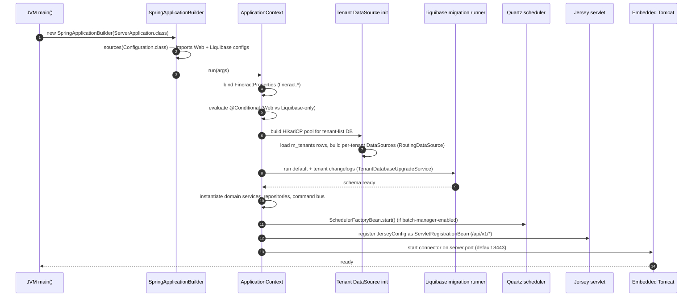
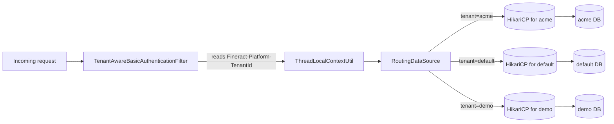

Apache Fineract ships as a single Spring Boot application that can be run as an executable JAR/WAR or deployed inside a servlet container. At startup it picks one of two top-level configurations — a full web mode or a Liquibase-only migration mode — applies a set of `fineract.mode.*` toggles that turn read endpoints, write endpoints, and batch participation on or off, then initializes per-tenant data sources, runs Liquibase migrations, registers the Jersey servlet, and starts Quartz. This page walks through that sequence with the actual classes that perform each step.

## Entry points

The primary entry point is `org.apache.fineract.ServerApplication` in `fineract-provider`. It extends `SpringBootServletInitializer` so the same class works whether you run it as a JAR (`main()` is invoked) or deploy it as a WAR (the servlet container calls `configure()`).

```java
public class ServerApplication extends SpringBootServletInitializer {

    @Import({ FineractWebApplicationConfiguration.class,
              FineractLiquibaseOnlyApplicationConfiguration.class })
    private static final class Configuration {}

    @Override
    protected SpringApplicationBuilder configure(SpringApplicationBuilder builder) {
        return configureApplication(builder);
    }

    private static SpringApplicationBuilder configureApplication(SpringApplicationBuilder builder) {
        return builder.sources(Configuration.class);
    }

    public static void main(String[] args) throws IOException {
        configureApplication(new SpringApplicationBuilder(ServerApplication.class)).run(args);
    }
}
```

Both top-level configurations are imported, but only one activates per process — Spring picks the right one via `@Conditional` classes.

| Configuration class | Activates when | Module |
|---------------------|----------------|--------|
| `FineractWebApplicationConfiguration` | Default — no `liquibase-only` profile active | `fineract-provider` |
| `FineractLiquibaseOnlyApplicationConfiguration` | `liquibase-only` Spring profile is active | `fineract-provider` |

The `liquibase-only` profile name is a constant on `FineractProfiles` (`fineract-core`):

```java
public final class FineractProfiles {
    public static final String LIQUIBASE_ONLY = "liquibase-only";
    public static final String DIAGNOSTICS = "diagnostics";
    public static final String TEST = "test";
}
```

## Web mode vs Liquibase-only mode

<Tabs>
  <Tab title="Web mode (default)">
    `FineractWebApplicationConfiguration` is the production runtime. It excludes a handful of Spring Boot auto-configurations that Fineract wires manually:

    - `DataSourceAutoConfiguration`, `JdbcTemplateAutoConfiguration`, `DataSourceTransactionManagerAutoConfiguration` — replaced by `JdbcConfig` and the multi-tenant routing data source.
    - `HibernateJpaAutoConfiguration` — Fineract uses EclipseLink with static weaving instead.
    - `LiquibaseAutoConfiguration` — replaced by a tenant-aware migration runner that iterates every tenant.
    - `GsonAutoConfiguration` — Fineract owns its Gson configuration to keep JSON command parsing consistent.

    It enables `@EnableTransactionManagement`, `@EnableWebSecurity`, and component scans both `org.apache.fineract.**` and `IntegrationComponentScan` for Spring Integration channels.
  </Tab>
  <Tab title="Liquibase-only mode">
    `FineractLiquibaseOnlyApplicationConfiguration` is the short-lived migration mode. Its component scan is intentionally narrow:

    ```java
    @ComponentScan(basePackages = {
        "org.apache.fineract.infrastructure.core.service.migration",
        "org.apache.fineract.infrastructure.core.service.database",
        "org.apache.fineract.infrastructure.core.service.tenant"
    })
    ```

    It boots just enough Spring to construct the JDBC and Hikari beans, runs Liquibase against every configured tenant, and exits. Use it in init containers or upgrade jobs before letting web-mode pods take traffic.
  </Tab>
  <Tab title="WAR variant">
    `fineract-war` wraps `fineract-provider` so the same `ServerApplication` class can be deployed under Tomcat, Wildfly, or another container. Because `ServerApplication extends SpringBootServletInitializer`, the container's `ServletContext` discovers it and calls `configure(SpringApplicationBuilder)` — identical bean wiring, different lifecycle owner.
  </Tab>
</Tabs>

## Startup sequence



## Application properties that shape the runtime

These come from `fineract-provider/src/main/resources/application.properties`. Every one is overridable via an `FINERACT_*` environment variable.

| Property | Default | Effect |
|----------|---------|--------|
| `server.port` | `8443` | Port the embedded Tomcat connector binds to. |
| `fineract.node-id` | `1` | Identifies this JVM in a cluster; written to `command_source` rows and used by COB partitioning. |
| `fineract.mode.read-enabled` | `true` | Toggle for read endpoints. |
| `fineract.mode.write-enabled` | `true` | Toggle for write endpoints. |
| `fineract.mode.batch-worker-enabled` | `true` | Allows this node to act as a Spring Batch worker. |
| `fineract.mode.batch-manager-enabled` | `true` | Allows this node to act as the Spring Batch / Quartz manager. |

<Note>
The `fineract.mode.*` flags are independent — you can build read-only replicas (`write-enabled=false`), batch-only workers (`read-enabled=false`, `write-enabled=false`, `batch-worker-enabled=true`), or any other combination. Combined with `fineract.node-id`, they form Fineract's lightweight horizontal-scaling model.
</Note>

## Instance modes in practice

<CardGroup cols={2}>
  <Card title="Single-node" icon="server">
    Everything `true`, `node-id=1`. The default for dev and small deployments. Tomcat, Quartz, and COB all run in one JVM.
  </Card>
  <Card title="Read replica" icon="eye">
    `write-enabled=false`, both batch flags `false`. Point Hikari at a read-replica database. Useful for serving heavy reporting traffic.
  </Card>
  <Card title="Write primary" icon="pen">
    `write-enabled=true`, `batch-manager-enabled=true`. Owns Quartz scheduling and COB orchestration.
  </Card>
  <Card title="Batch worker" icon="boxes-stacked">
    Only `batch-worker-enabled=true`. Joins Spring Batch's remote-partitioning topology to execute COB partitions in parallel.
  </Card>
</CardGroup>

## Migrations

Liquibase is invoked explicitly, not via Spring Boot's auto-configuration. The relevant beans live in `org.apache.fineract.infrastructure.core.service.migration` and `…service.database`. Two changelog trees apply:

| Changelog tree | Target | When it runs |
|----------------|--------|--------------|
| `fineract-db/.../db/changelog/default/` | The tenant-list database (`fineract_tenants`) | Always, first |
| `fineract-db/.../db/changelog/tenant/` | Each per-tenant database (`fineract_default`, …) | After tenant-list, once per tenant DataSource |

In `liquibase-only` mode this is essentially all the application does before exiting. In web mode the runner is invoked synchronously during context refresh, so by the time Tomcat starts accepting connections every tenant schema is at the current version.

<Warning>
Running multiple JVMs against the same database without an external lock can produce concurrent migration attempts. The Liquibase change-set locking on `DATABASECHANGELOGLOCK` prevents corruption but adds startup latency — prefer one dedicated `liquibase-only` pass before scaling out web-mode pods.
</Warning>

## Scheduler and COB

Quartz starts during context refresh (when `fineract.mode.batch-manager-enabled=true`). Job names are enumerated by `org.apache.fineract.infrastructure.jobs.service.JobName`. Some jobs (interest posting, fee charges) run inside the request thread on a cron, while COB-related jobs (`LOAN_COB`, accrual postings, dormancy) are orchestrated by `LoanCOBManagerConfiguration` in `fineract-provider`'s `cob/loan/` package, on top of the `COBBusinessStep` abstractions defined in `fineract-cob`.

The COB engine is a Spring Batch job that:

<Steps>
  <Step title="Advances the per-tenant business date">
    Driven by `BusinessDate` records. The new date becomes "today" for every business-date-aware service.
  </Step>
  <Step title="Partitions loans across worker nodes">
    Uses remote partitioning so multiple `batch-worker-enabled` JVMs can split the load.
  </Step>
  <Step title="Runs tasklets per loan">
    Accrue interest, apply charges, run dormancy checks, recompute schedules.
  </Step>
  <Step title="Publishes external events">
    External event producers (Kafka/ActiveMQ) emit per-loan COB completion events.
  </Step>
</Steps>

## Jersey servlet registration

In web mode `JerseyConfig` is registered as a `ResourceConfig` Spring bean and Jersey's Spring auto-configuration mounts it at `/api/v1/*`. The same component scan that finds your handlers (`org.apache.fineract.**`) also picks up `@Path`-annotated resource classes such as `LoansApiResource` and `SavingsAccountsApiResource`. The actual route table is therefore not a static config file — it's derived from annotations at startup.

## Common boot-time failures

<AccordionGroup>
  <Accordion title="App exits immediately after migrations">
    You are in `liquibase-only` mode. Remove the `liquibase-only` profile or unset `SPRING_PROFILES_ACTIVE=liquibase-only`.
  </Accordion>
  <Accordion title='"No tenant found" on every request'>
    The `TenantAwareBasicAuthenticationFilter` could not resolve a tenant. Check the `Fineract-Platform-TenantId` header (default value: `default`) and that the tenant exists in the tenant-list database.
  </Accordion>
  <Accordion title="Quartz tables missing">
    `quartz_*` tables live in the tenant database. Confirm migrations ran (look at `DATABASECHANGELOG` rows) and that `batch-manager-enabled=true` on at least one node.
  </Accordion>
  <Accordion title="Port 8443 already in use">
    Either set `FINERACT_SERVER_PORT` to a free port or shut down the conflicting process. Note that Tomcat's TLS keystore is configured in the same property block — check the `server.ssl.*` keys too.
  </Accordion>
  <Accordion title="EclipseLink weaving warnings">
    Static weaving is configured by `static-weaving.gradle`. If you see runtime weaving warnings the JPA module's classes were not woven at build time — run `./gradlew :fineract-loan:assemble` (or the relevant module) and check `STATIC_WEAVING.md` for guidance.
  </Accordion>
</AccordionGroup>

## Multi-tenancy at boot time

Fineract is multi-tenant by design. At startup the application maintains two databases in parallel:

| Database | Purpose | DataSource bean |
|----------|---------|-----------------|
| Tenant list (e.g. `fineract_tenants`) | Stores one row per tenant with connection details for that tenant's database | `tenantDataSourceJndi` |
| Per-tenant (e.g. `fineract_default`) | All business data — clients, loans, savings, accounting | Selected by `RoutingDataSource` per request |

The routing data source uses `ThreadLocalContextUtil` to look up the current tenant on every JDBC operation. At boot, every tenant in the tenant-list database gets a Hikari pool eagerly built so the first request to that tenant does not pay a cold-start cost.



## Health and observability after boot

Once running, the app exposes a small surface of management endpoints — exact paths depend on `management.endpoints.web.*` settings, but the defaults include:

| Endpoint | What it tells you |
|----------|-------------------|
| `/actuator/health` | Liveness/readiness with database and Liquibase checks. |
| `/actuator/info` | Build metadata (commit SHA, version) from `gradle-git-properties`. |
| `/api/v1/jobs` | List of Quartz jobs and their last run timestamps. |
| `/api/v1/scheduler` | Scheduler status; can be paused/resumed via API. |
| Spring Boot logs | `logging.level.org.apache.fineract` controls Fineract noise; defaults at INFO. |

<Tip>
For production deployments, scrape `/actuator/prometheus` (when enabled) and alert on tenant-level Hikari pool saturation — `RoutingDataSource` exposes per-tenant metrics through `TenantConnectionPoolMetricsTracker`.
</Tip>

## Reproducing each mode locally

<CodeGroup>

```bash Web mode (default)
./gradlew :fineract-provider:bootRun
# binds 0.0.0.0:8443, runs Liquibase, starts Quartz
```

```bash Liquibase-only mode
SPRING_PROFILES_ACTIVE=liquibase-only \
  ./gradlew :fineract-provider:bootRun
# runs migrations against configured tenants and exits
```

```bash Read replica
FINERACT_MODE_WRITE_ENABLED=false \
FINERACT_MODE_BATCH_MANAGER_ENABLED=false \
FINERACT_MODE_BATCH_WORKER_ENABLED=false \
  ./gradlew :fineract-provider:bootRun
```

```bash Batch worker
FINERACT_MODE_READ_ENABLED=false \
FINERACT_MODE_WRITE_ENABLED=false \
FINERACT_MODE_BATCH_MANAGER_ENABLED=false \
FINERACT_MODE_BATCH_WORKER_ENABLED=true \
FINERACT_NODE_ID=2 \
  ./gradlew :fineract-provider:bootRun
```

</CodeGroup>

## See also

<CardGroup cols={2}>
  <Card title="Architecture" icon="layer-group" href="/overview/architecture">
    The layered request pipeline that boots into life here.
  </Card>
  <Card title="Module graph" icon="diagram-project" href="/overview/module-graph">
    Which modules contribute beans at startup.
  </Card>
  <Card title="Repository layout" icon="folder-tree" href="/overview/repository-layout">
    Where `application.properties`, `JerseyConfig`, and the COB engine live.
  </Card>
  <Card title="Glossary" icon="book" href="/overview/glossary">
    Terms used above: COB, FineractContext, BusinessDate, JobName.
  </Card>
</CardGroup>
