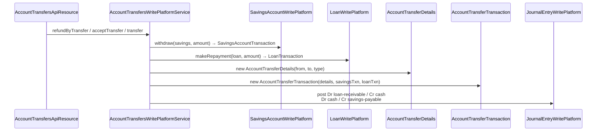

`AccountTransferTransaction` is the bridge that links a debit posting on one portfolio account with the matching credit posting on another in Apache Fineract. Manual transfers, automatic disbursement-to-savings, loan repayment by savings withdrawal, charge payment by savings, GLIM/GSIM postings, downpayments — they all reduce to "transfer some money from this `(accountType, accountId)` to that one" and they all materialise as rows in `m_account_transfer_transaction`.

## Package layout

```
org.apache.fineract.portfolio.account.domain  (fineract-provider)
├── AccountAssociationType.java
├── AccountAssociations.java
├── AccountAssociationsRepository.java
├── AccountTransferAssembler.java
├── AccountTransferDetailAssembler.java
├── AccountTransferDetails.java
├── AccountTransferDetailRepository.java
├── AccountTransferRecurrenceType.java
├── AccountTransferRepository.java
├── AccountTransferStandingInstruction.java
├── AccountTransferTransaction.java
├── AccountTransferType.java
├── StandingInstructionAssembler.java
├── StandingInstructionPriority.java
├── StandingInstructionRepository.java
├── StandingInstructionStatus.java
└── StandingInstructionType.java
```

The REST resource is `AccountTransfersApiResource` (`/v1/accounttransfers`) in `fineract-provider`.

## Two-tier model: details + transactions

A transfer has two persisted layers:

1. **`AccountTransferDetails`** — the *configuration*: from-account, to-account, transfer type, optional charge id, owning office. Created once per transfer relationship and reused for every actual movement.
2. **`AccountTransferTransaction`** — the *event*: the date, amount, currency and the FK pointers to the underlying `SavingsAccountTransaction` or `LoanTransaction` that the platform also wrote on each side.

For a one-shot transfer the `AccountTransferDetails` row is created in the same call as the transaction. For a standing instruction (see `/portfolio/standing-instructions`) the details row outlives many transaction rows.

## `AccountTransferTransaction`

```java
@Entity
@Table(name = "m_account_transfer_transaction")
public class AccountTransferTransaction extends AbstractPersistableCustom<Long> {

    @ManyToOne @JoinColumn(name = "account_transfer_details_id")
    private AccountTransferDetails accountTransferDetails;

    @ManyToOne @JoinColumn(name = "from_savings_transaction_id")
    private SavingsAccountTransaction fromSavingsTransaction;
    @ManyToOne @JoinColumn(name = "to_savings_transaction_id")
    private SavingsAccountTransaction toSavingsTransaction;
    @ManyToOne @JoinColumn(name = "to_loan_transaction_id")
    private LoanTransaction toLoanTransaction;
    @ManyToOne @JoinColumn(name = "from_loan_transaction_id")
    private LoanTransaction fromLoanTransaction;

    @Column(name = "is_reversed")    private boolean reversed;
    @Column(name = "transaction_date") private LocalDate date;
    @Embedded                          private MonetaryCurrency currency;
    @Column(name = "amount")          private BigDecimal amount;
}
```

The four nullable FKs let one row describe any of the four combinations of `(from, to) ∈ { savings, loan }`. The platform fills in exactly two of them — the two sides of the transfer — and leaves the other two `NULL`.

| Movement | `from_savings` | `from_loan` | `to_savings` | `to_loan` |
|----------|----------------|-------------|--------------|-----------|
| Savings → Savings | ✓ | — | ✓ | — |
| Savings → Loan (repayment from savings) | ✓ | — | — | ✓ |
| Loan → Savings (disbursement to savings) | — | ✓ | ✓ | — |
| Loan → Loan (rare; refinancing) | — | ✓ | — | ✓ |

## `PortfolioAccountType` and `AccountTransferType`

The two parties of a transfer are typed:

```java
public enum PortfolioAccountType {
    INVALID(0, "accountType.invalid"),
    LOAN(1,    "accountType.loan"),
    SAVINGS(2, "accountType.savings");
}
```

Note there is no `SHARES` or `FIXED_DEPOSIT` — share accounts go through their own posting path, and fixed deposits behave as savings accounts at the transfer layer (they share `m_savings_account`).

The semantics of the transfer are tagged:

```java
public enum AccountTransferType {
    INVALID(0,           "accountTransferType.invalid"),
    ACCOUNT_TRANSFER(1,  "accountTransferType.account.transfer"),
    LOAN_REPAYMENT(2,    "accountTransferType.loan.repayment"),
    CHARGE_PAYMENT(3,    "accountTransferType.charge.payment"),
    INTEREST_TRANSFER(4, "accountTransferType.interest.transfer"),
    LOAN_DOWN_PAYMENT(5, "accountTransferType.loan.downpayment");
}
```

The transfer type controls GL treatment and which underlying transaction kind is written on each side:

| `AccountTransferType` | From side | To side |
|-----------------------|-----------|---------|
| `ACCOUNT_TRANSFER` | Savings `WITHDRAWAL` | Savings `DEPOSIT` |
| `LOAN_REPAYMENT` | Savings `WITHDRAWAL` | Loan `REPAYMENT` |
| `CHARGE_PAYMENT` | Savings `WITHDRAWAL` | Loan `CHARGE_PAYMENT` (or Savings) |
| `INTEREST_TRANSFER` | Savings `INTEREST_POSTING_TRANSFER` | Savings `DEPOSIT` |
| `LOAN_DOWN_PAYMENT` | Savings `WITHDRAWAL` | Loan `DOWN_PAYMENT` |

The "savings or loan" choice on each side is decided from `fromAccountType` and `toAccountType` parameters on the request.

## Transfer direction

The most common shape is "one tenant, one currency, two accounts of the same client". But the request model also supports cross-client transfers — for instance, a wage payment from an employer-client's savings into an employee-client's loan repayment. The validator enforces:

- Both accounts exist and are `ACTIVE`.
- Currencies match.
- The transfer is not zero-amount.
- Office hierarchy is respected: the caller can see *both* accounts.

When the from-office and to-office differ, the row's office is set to the *from* side; the audit makes the originating branch responsible for the movement.

## `AccountAssociations`

Linking a loan to a savings account for repayment is configured up front:

```java
@Entity
@Table(name = "m_portfolio_account_associations")
public class AccountAssociations { … }
```

A row says "loan account 42 has its repayments collected from savings account 17". The savings link is used both for explicit `POST /v1/accounttransfers` and for periodic standing instructions. The association is bidirectional: a savings account knows its linked loans (for "transfer-out" defaults) and a loan knows its linked savings (for "transfer-in" defaults).

## REST surface

`AccountTransfersApiResource` exposes `/v1/accounttransfers`:

| Method | Path | Action |
|--------|------|--------|
| GET | `/template` | Drop-downs: `fromOfficeId`, `fromClientId`, `fromAccountId`, `fromAccountType`, `toOfficeId`, `toClientId`, `toAccountId`, `toAccountType`. |
| POST | `/` | Execute a transfer. |
| GET | `/` | Paged list (`fromOfficeId`, `fromAccountId`, …). |
| GET | `/{transferId}` | Single transfer. |
| POST | `/{transferId}?command=refundByTransfer` | Reverses a transfer. |

Request body for a typical savings → loan repayment:

```json
{
  "fromOfficeId": 1,
  "fromClientId": 42,
  "fromAccountType": 2,
  "fromAccountId": 17,
  "toOfficeId": 1,
  "toClientId": 42,
  "toAccountType": 1,
  "toAccountId": 88,
  "transferDate": "12 March 2024",
  "dateFormat": "dd MMMM yyyy",
  "locale": "en",
  "transferAmount": 1500.00,
  "transferDescription": "Manual repayment by SMS"
}
```

`fromAccountType` and `toAccountType` are integer values of `PortfolioAccountType` (1 = loan, 2 = savings).

## Posting sequence



The two underlying transactions and the `AccountTransferTransaction` row commit in the same JPA transaction. If GL posting fails, everything rolls back.

## GL accounting

The interesting accounting trick is that the cash account cancels out. For a savings → loan repayment:

| Step | Debit | Credit |
|------|-------|--------|
| Savings withdrawal | Savings (liability) | Cash |
| Loan repayment | Cash | Loan portfolio (asset) |

Net effect on cash is zero, which is exactly what should be the case for an internal movement. See `/accounting/journal-entries` for how each side independently produces its half.

## Reversal

`POST /v1/accounttransfers/{id}?command=refundByTransfer` runs the same flow in reverse:

1. Set `is_reversed = true` on the `AccountTransferTransaction`.
2. Adjust each underlying transaction (`SavingsAccountTransaction.reverse()`, `LoanTransaction.reverse()`).
3. Post the inverse GL entries.

Reversals can only undo the most recent transfer in a chain; older corrections require a fresh transfer in the opposite direction.

## Inter-office transfers

When the from and to offices differ, an inter-office holding account is required. The platform looks up the cash/HO clearing account via `FinancialActivityAccount` mappings — see `/accounting/financial-activity-accounts`. The two GL postings then debit/credit the clearing account rather than each other directly, leaving an audit trail that the reconciliation report consumes.

## Business events

| Event | When |
|-------|------|
| `AccountTransferBusinessEvent` | A new transfer transaction is posted. |
| `AccountTransferUpdateBusinessEvent` | A standing-instruction-driven transfer modifies a configured field. |

Listeners use these to push customer-facing notifications ("your savings paid your loan installment of 1500") and to update downstream ledgers.

<Info>
Share-account transfers do *not* use `AccountTransferTransaction`. They post through `ShareAccountTransaction` directly because the share workflow has its own bid/ask semantics.
</Info>

## Permissions

| Permission | Action |
|------------|--------|
| `READ_ACCOUNTTRANSFER` | GET on `/v1/accounttransfers`. |
| `CREATE_ACCOUNTTRANSFER` | POST a transfer. |
| `REFUNDBYTRANSFER_LOAN` | Reverse via refund. |

Maker-checker can be enabled per permission so high-value transfers go through an approval step before the underlying postings happen.

## See also

- `/portfolio/standing-instructions` — recurring transfers running on a Spring Batch job.
- `/savings/savings-transactions` — `WITHDRAWAL` / `DEPOSIT` posting details.
- `/loan/loan-transactions` — `REPAYMENT` and `DOWN_PAYMENT` postings.
- `/accounting/journal-entries` — GL posting machinery.
- `/accounting/financial-activity-accounts` — inter-office clearing accounts.
