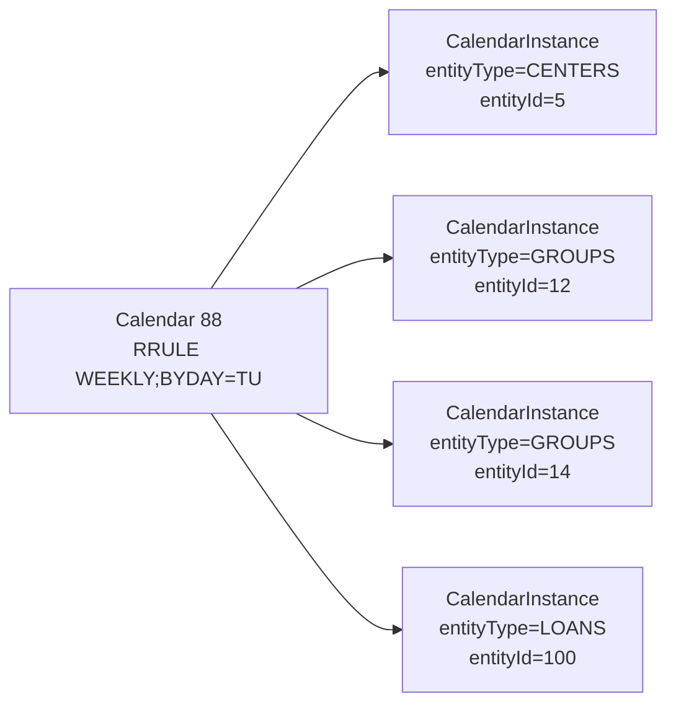
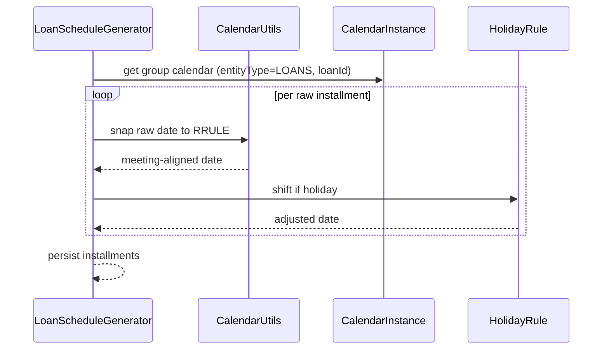

The **Calendar** subsystem in Apache Fineract is a small but heavily-used library for "things that happen on a recurring date" — meeting days for centers and groups, audit dates, training dates, even loan-product recalculation rest periods. Every loan repayment schedule that follows a center's meeting cadence ultimately consults a `Calendar` row to decide which dates qualify as installment dates.

## Package

```
org.apache.fineract.portfolio.calendar  (mostly fineract-core, REST in fineract-provider)
├── CalendarConstants.java
├── api/        CalendarsApiResource
├── command/    Calendar command DTOs
├── domain/
│   ├── Calendar.java
│   ├── CalendarType.java
│   ├── CalendarEntityType.java
│   ├── CalendarFrequencyType.java
│   ├── CalendarInstance.java
│   ├── CalendarHistory.java
│   ├── CalendarRemindBy.java
│   └── repository wrappers
├── exception/
├── handler/
├── serialization/
└── service/    CalendarReadPlatformService, CalendarUtils
```

The companion `org.apache.fineract.portfolio.meeting` package adds `Meeting`, `MeetingAttendance` and the `/v1/{entityType}/{entityId}/meetings` resources.

## The `Calendar` entity

```java
@Entity
@Table(name = "m_calendar")
public class Calendar extends AbstractAuditableWithUTCDateTimeCustom<Long> {

    @Column(name = "title")        private String title;
    @Column(name = "description")  private String description;
    @Column(name = "location")     private String location;
    @Column(name = "start_date")   private LocalDate startDate;
    @Column(name = "end_date")     private LocalDate endDate;
    @Column(name = "duration")     private Integer duration;
    @Column(name = "calendar_type_enum") private Integer typeId;
    @Column(name = "repeating")    private boolean repeating;
    @Column(name = "recurrence")   private String recurrence;   // RRULE
    @Column(name = "remind_by_enum") private Integer remindById;
    @Column(name = "first_reminder") private Integer firstReminder;
    @Column(name = "second_reminder") private Integer secondReminder;
}
```

`recurrence` stores an RFC 5545-style RRULE string. Examples:

- `RRULE:FREQ=WEEKLY;INTERVAL=1;BYDAY=TU` — every Tuesday.
- `RRULE:FREQ=MONTHLY;INTERVAL=1;BYMONTHDAY=5` — fifth of every month.
- `RRULE:FREQ=DAILY;INTERVAL=14` — every fortnight.

`CalendarUtils` exposes the parser:

- `getRecurringDate(rrule, seedDate, periodStart)` returns the next occurrence.
- `getRecurringDates(rrule, seedDate, periodStart, periodEnd, count)` lists occurrences in a window.

These are the entry points loan schedule generators use when their loan product is configured to align installments to meeting dates.

## `CalendarType`

```java
public enum CalendarType {
    COLLECTION(1, "calendarType.collection"),
    TRAINING(2,   "calendarType.training"),
    AUDIT(3,      "calendarType.audit"),
    GENERAL(4,    "calendarType.general");
}
```

Only `COLLECTION` is consulted by the loan engine for installment alignment. The others are pure scheduling metadata.

## `CalendarEntityType` — what the calendar is attached to

```java
public enum CalendarEntityType {
    INVALID(0,  "calendarEntityType.invalid"),
    CLIENTS(1,  "calendarEntityType.clients"),
    GROUPS(2,   "calendarEntityType.groups"),
    LOANS(3,    "calendarEntityType.loans"),
    CENTERS(4,  "calendarEntityType.centers"),
    SAVINGS(5,  "calendarEntityType.savings"),
    LOAN_RECALCULATION_REST_DETAIL(6,         "calendarEntityType.loan.recalculation.rest.detail"),
    LOAN_RECALCULATION_COMPOUNDING_DETAIL(7,  "calendarEntityType.loan.recalculation.compounding.detail");
}
```

Entity types 6 and 7 are used by the loan recalculation engine to store the rest and compounding cadences for interest recalculation. See `/loan/cumulative-schedule-generator`.

## `CalendarInstance` — the attachment row

Calendars themselves are reusable templates; `CalendarInstance` ties one calendar to one specific entity:

```java
@Entity
@Table(name = "m_calendar_instance")
public class CalendarInstance extends AbstractAuditableWithUTCDateTimeCustom<Long> {
    @ManyToOne private Calendar calendar;
    @Column(name = "entity_id")          private Long entityId;
    @Column(name = "entity_type_enum")   private Integer entityTypeId;
}
```

So a center's weekly meeting calendar lives in `m_calendar` once, and one `CalendarInstance` row per child group inherits it.



When the center is reassigned to a different calendar, the child group `CalendarInstance` rows are updated to point at the new calendar — installments shift to follow.

## `CalendarHistory`

Whenever a calendar's recurrence changes, `CalendarUpdateHandler` writes a `CalendarHistory` row capturing the previous recurrence and its valid-till date. Loan schedule generators that need to project a meeting date in the past consult `CalendarHistory` so they reproduce the meeting day that actually existed at the time of the installment, not today's recurrence.

## Calendars REST

`CalendarsApiResource` lives at `/v1/{entityType}/{entityId}/calendars`:

| Method | Path | Action |
|--------|------|--------|
| GET | `/v1/centers/{id}/calendars` | List calendars attached to this center. |
| GET | `/v1/centers/{id}/calendars/{calendarId}` | Single calendar. |
| POST | `/v1/centers/{id}/calendars` | Create. |
| PUT | `/v1/centers/{id}/calendars/{calendarId}` | Update — schedule changes propagate to child loans. |
| DELETE | `/v1/centers/{id}/calendars/{calendarId}` | Delete. |

Substitute `groups`, `clients`, `loans` for the `entityType`. The resource resolves the entity type from the path segment via `CalendarEntityType.fromString`.

### Create payload

```json
{
  "title": "Weekly center meeting",
  "startDate": "01 March 2024",
  "typeId": 1,
  "repeating": true,
  "frequency": 1,
  "interval": 1,
  "repeatsOnDay": 2,
  "dateFormat": "dd MMMM yyyy",
  "locale": "en"
}
```

`frequency` is the `CalendarFrequencyType` value (DAILY=0, WEEKLY=1, MONTHLY=2, YEARLY=3); `repeatsOnDay` is the `CalendarWeekDaysType` value (MON=1..SUN=7). The validator translates these convenience fields into an RRULE before storage.

## The `Meeting` entity

A calendar describes "every Tuesday". A `Meeting` is what actually happened on a specific Tuesday.

```java
@Entity
@Table(name = "m_meeting", uniqueConstraints = {
    @UniqueConstraint(columnNames = { "calendar_instance_id", "meeting_date" },
                      name = "unique_calendar_instance_id_meeting_date") })
public class Meeting extends AbstractPersistableCustom<Long> {

    @ManyToOne @JoinColumn(name = "calendar_instance_id")
    private CalendarInstance calendarInstance;

    @Column(name = "meeting_date") private LocalDate meetingDate;

    @OneToMany(cascade = CascadeType.ALL, mappedBy = "meeting", orphanRemoval = true)
    private Set<MeetingAttendance> clientsAttendance;
}
```

The unique constraint guarantees at most one meeting row per `(calendarInstance, date)`. Meetings are created lazily — typically on the first day they are needed (collection-sheet save, or an explicit attendance call).

## `MeetingAttendance`

```java
@Entity
@Table(name = "m_client_attendance", uniqueConstraints = {
    @UniqueConstraint(columnNames = { "client_id", "meeting_id" },
                      name = "unique_client_meeting_attendance") })
public class MeetingAttendance extends AbstractPersistableCustom<Long> {
    @ManyToOne @JoinColumn(name = "client_id")  private Client client;
    @ManyToOne @JoinColumn(name = "meeting_id") private Meeting meeting;
    @Column(name = "attendance_type_enum")      private Integer attendanceTypeId;
}
```

`AttendanceType` covers `PRESENT`, `ABSENT`, `APPROVED`, `LEAVE`, `LATE`. The unique constraint enforces "one row per client per meeting" — repeated saves overwrite rather than duplicate.

## Meetings REST

`MeetingsApiResource` lives at `/v1/{entityType}/{entityId}/meetings`:

| Method | Path | Action |
|--------|------|--------|
| GET | `/v1/centers/{id}/meetings` | List meetings. |
| GET | `/v1/centers/{id}/meetings/{meetingId}` | Single meeting with attendance. |
| POST | `/v1/centers/{id}/meetings` | Create a meeting on a given date. |
| POST | `/v1/centers/{id}/meetings?command=saveorupdateattendance` | Upsert per-client attendance rows. |
| PUT | `/v1/centers/{id}/meetings/{meetingId}` | Edit meeting date. |
| DELETE | `/v1/centers/{id}/meetings/{meetingId}` | Delete (cascades to attendance). |

Saving attendance is the most common interaction — the payload mirrors `clientsAttendance` from the collection sheet save:

```json
{
  "meetingDate": "12 March 2024",
  "clientsAttendance": [
    { "clientId": 42, "attendanceType": 1 },
    { "clientId": 43, "attendanceType": 2 }
  ]
}
```

## Loan integration

A loan disbursed under a group inherits the group's collection calendar through a `CalendarInstance(entityType=LOANS, entityId=<loanId>, calendar=<group's calendar>)` row. The loan schedule generator then:

1. Computes raw installment dates per `numberOfRepayments` and `repaymentEvery`.
2. For each raw date, snaps it to the next valid calendar occurrence using `CalendarUtils.getRecurringDate`.
3. Adjusts for holidays and working-day rules.

The result is a repayment schedule whose dates always line up with the next meeting day — exactly what the collection sheet expects on meeting day.



## Edits and shifts

When the operator updates a calendar's recurrence — e.g. moves the center's meeting from Tuesday to Wednesday — the calendar update handler writes a `CalendarHistory` row and resnaps every future installment of every loan attached to it. Past installments are not touched; they keep their original dates.

## Reminders

`remindById`, `firstReminder` and `secondReminder` express how many days before a meeting the system should send a reminder. The values are honoured by external notification subscribers, not by the platform itself — Apache Fineract emits an event and lets the operator's chosen channel (SMS, email) actually fire.

`CalendarRemindBy` enumerates the supported channels: `EMAIL(1)`, `SMS(2)`.

<Info>
`Calendar.startDate` is the seed date for the RRULE. Even if the recurrence is "every Tuesday", changing `startDate` from one Tuesday to a different Tuesday changes the parity of every fortnightly or monthly-on-day series anchored to it.
</Info>

## Validation

`CalendarValidator` enforces:

- `title` not blank.
- `startDate` present.
- `repeating = true` requires a valid `frequency`/`interval`/`repeatsOnDay` combination.
- For `COLLECTION` calendars on groups/centers, only `WEEKLY` and `MONTHLY` frequencies are supported (DAILY meetings are not a thing in microfinance).
- `endDate`, when present, is on or after `startDate`.

## See also

- `/portfolio/centers` and `/portfolio/groups` — entity types `CENTERS` and `GROUPS`.
- `/portfolio/collection-sheet` — meetings created during sheet save.
- `/loan/cumulative-schedule-generator` — how loans snap to RRULEs.
- `/organisation/holidays` and `/organisation/working-days` — date-shift rules applied on top of the calendar.
