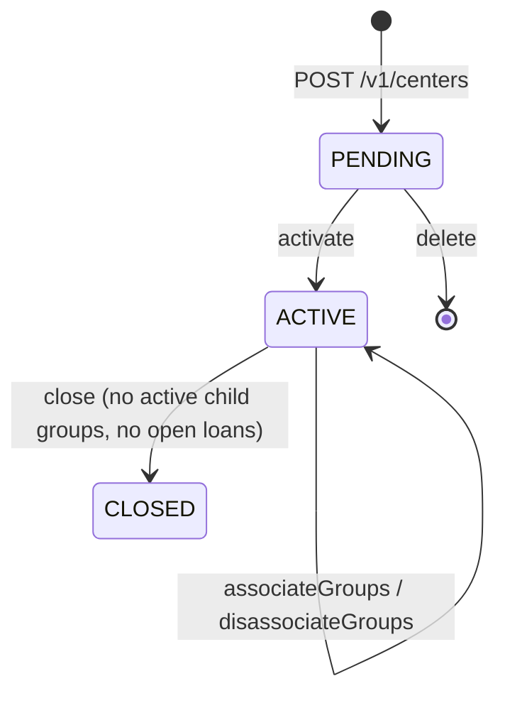
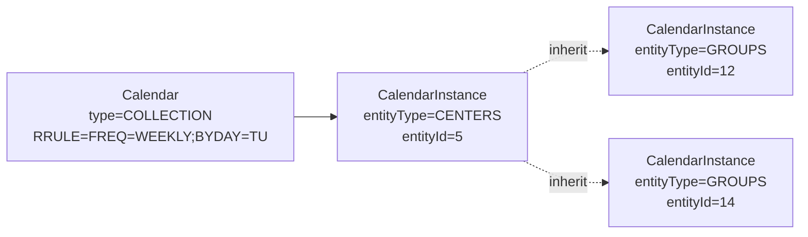
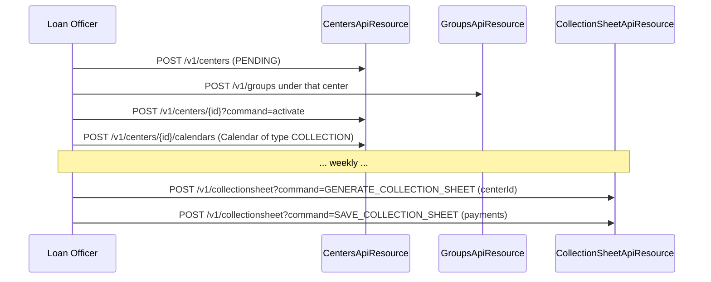

A **Center** is a top-level rallying point used in classical Grameen-style microfinance. Five to fifty groups meet on the same day at the same village location, settle the week's installments together, and disperse. In Apache Fineract a Center is *not* a separate entity — it is just a `Group` row with `groupLevel.id = 1`. The same `m_group` table, the same status machine, the same `clientMembers` set; only the level distinguishes them.

This design — one table, two levels — keeps loans, savings, calendars and transfers polymorphic. Code that consumes "a group or center" never has to branch on the type.

## Where the API lives

```
org.apache.fineract.portfolio.group.api  (fineract-provider)
├── GroupsApiResource       (/v1/groups)
├── GroupsLevelApiResource  (/v1/grouplevels)
└── CentersApiResource      (/v1/centers)
```

`CentersApiResource` is a thin convenience wrapper: every action it exposes is really a `Group` action with `groupLevel = CENTER` (id `1`).

```java
@Path("/v1/centers")
public class CentersApiResource { … }
```

The class delegates writes to the same `GroupWritePlatformService` used by `/v1/groups`, and reads to the same `GroupReadPlatformService` with the level filter applied.

## How Center differs from Group at runtime

| Aspect | Group | Center |
|--------|-------|--------|
| `groupLevel.id` | 2 | 1 |
| `parent_id` | center.id (optional) | always `NULL` |
| `clientMembers` | populated | typically empty |
| `groupMembers` | empty | the child groups |
| `canHaveClients` (on level) | `true` | `false` |
| Recommended Calendar entity type | `GROUPS` | `CENTERS` |

A center holds **groups**, not clients directly. The platform allows otherwise — `canHaveClients` is a level-level flag and can be flipped — but every shipped UI and rule treats centers as collection points.

## CRUD on centers

| Method | Path | Action |
|--------|------|--------|
| GET | `/v1/centers` | Paged list filtered to `level=1`. Supports `officeId`, `staffId`, `externalId`, `name`, `underHierarchy`, `paged`, `orphansOnly`. |
| GET | `/v1/centers/{id}` | Single center with optional `associations=groupMembers,collectionMeetingCalendar`. |
| GET | `/v1/centers/template` | Form template — offices, staff, calendar template. |
| POST | `/v1/centers` | Create. Sub-actions via `?command=close`, `?command=activate`, `?command=associateGroups`, `?command=disassociateGroups`. |
| PUT | `/v1/centers/{id}` | Update. |
| DELETE | `/v1/centers/{id}` | Allowed only while `PENDING` and with no child groups. |

The `associateGroups` and `disassociateGroups` actions are what populate `groupMembers`:

```json
POST /v1/centers/5?command=associateGroups
{ "groupMembers": [12, 14, 19] }
```

The handler `AssociateGroupsToCenterCommandHandler` validates that:

- Each `groupMembers` id exists and is currently `ACTIVE`.
- Each child group's `office_id` matches the center's `office_id` (no cross-branch centers).
- No child group is already under a different center.

Violations throw `GroupExistsInCenterException` or `GroupNotExistsInCenterException`.

## Lifecycle

The status machine is identical to plain groups (`PENDING → ACTIVE → CLOSED` with optional transfer states). Activation has one extra constraint: a center cannot be activated until it has at least one calendar attached when the deployment configures `centerActivationMeetingMandatory = true` in the global configuration.



## Closure rules

Closing a center cascades validation outward:

1. The center itself must have no open loans / savings (in practice it has none — those are on the groups).
2. Every child group must already be `CLOSED` or must be disassociated first.
3. A `closure_reason_cv_id` must be supplied; it references a `CodeValue` from `GroupClosureReason`.

If the validation passes, `Group.status` flips to `CLOSED`, `closedon_date` and `closedon_userid` are stamped, and `GroupCloseBusinessEvent` is emitted.

## Meeting schedules

Centers are where the **meeting calendar** typically lives. A `Calendar` row of `CalendarType.COLLECTION` is created against `CalendarEntityType.CENTERS` and inherited by every child group through `CalendarInstance`:



The recurrence rule (RRULE-compatible string) is stored once on the `Calendar` and consulted by every loan repayment schedule generator inside the center. Loans disbursed to clients under such a center are forced to follow the center's repayment cadence — meeting day, meeting frequency, holidays excluded — through the calendar-driven schedule generator.

See `/portfolio/calendar-and-meeting` for the recurrence DSL and the `Meeting` rollover entity.

## Collection sheets

The single biggest reason centers exist is bulk repayment. On meeting day, the loan officer:

1. Hits `POST /v1/collectionsheet?command=GENERATE_COLLECTION_SHEET` with `centerId`, `transactionDate`, and the meeting calendar — gets back the expected dues per client.
2. Updates per-row paid amounts on the printed sheet during the meeting.
3. Hits `POST /v1/collectionsheet?command=SAVE_COLLECTION_SHEET` with the consolidated payload — every loan repayment, savings deposit and charge payment is posted in one transactional shot.

The center-aware variant works on every group under the center in one call. See `/portfolio/collection-sheet`.

## Loan officer assignment

`UPDATE_STAFF_CENTER` (action `UPDATE_STAFF_GROUP` reused at the center level) reassigns the loan officer. The change is appended to `StaffAssignmentHistory` so portfolio reports always know which officer "owned" the center on any historical date — vital for staff-level performance attribution.

```java
@OneToMany(cascade = CascadeType.ALL, mappedBy = "center", orphanRemoval = true)
private Set<StaffAssignmentHistory> staffHistory;
```

The mapping name `center` is historical — the same field is reused for groups, even though most rows describe center assignments.

## Hierarchy enforcement

Centers participate in the same office hierarchy query as any other group:

```sql
SELECT g.* FROM m_group g
  JOIN m_office o ON o.id = g.office_id
 WHERE g.level_id = 1
   AND o.hierarchy LIKE :userHierarchy
```

A user attached to office `branch-A` cannot see centers of `branch-B` even if both are inside the same head office.

## Reading the center

`GET /v1/centers/{id}?associations=groupMembers,collectionMeetingCalendar` returns:

```json
{
  "id": 5,
  "accountNo": "0000000005",
  "name": "Center Alpha",
  "status": { "id": 300, "code": "centerStatusType.active" },
  "officeId": 7,
  "staffId": 12,
  "hierarchy": ".1.7.",
  "groupMembers": [ { "id": 12, "name": "Group A" }, { "id": 14, "name": "Group B" } ],
  "collectionMeetingCalendar": {
    "id": 88, "title": "Weekly meeting",
    "recurrence": "RRULE:FREQ=WEEKLY;INTERVAL=1;BYDAY=TU",
    "nextTenRecurringDates": [ "2024-04-02", "2024-04-09", "..." ]
  }
}
```

## Common workflows



## External event mapping

When `fineract-investor` or another consumer needs to mirror centers into an external system, the `GroupCreateBusinessEvent` event payload distinguishes centers from groups via `groupLevel.id`. Subscribers typically write:

```
if (event.getGroup().getGroupLevel().getId() == 1L) {
    // it's a center
} else {
    // it's a group
}
```

The payload otherwise carries the same fields for both — `id`, `accountNo`, `name`, `officeId`, `staffId`, `status` and `externalId`. Consumers persist centers with a different external resource type so downstream queries can roll up by center cleanly.

## Reports and exports

The portfolio reporting layer is center-aware: every standard report that takes `officeId` also takes `centerId` and rolls up loan-officer performance, arrears and collection percentages along the center → group → client axis. See `/reference/products` for product-level reporting and `/loan/loan-arrears-aging` for the arrears report.

<Info>
Because Center and Group share an entity, every business event uses the same payload class. Consumers filter on `groupLevel.id` to react only to centers, or only to groups, or to both.
</Info>

## Permissions

The center-related permissions exist alongside the group ones — same actions, different audit grouping:

| Permission | Action |
|------------|--------|
| `READ_CENTER` | GET on `/v1/centers`. |
| `CREATE_CENTER` | POST `/v1/centers`. |
| `UPDATE_CENTER` | PUT. |
| `ACTIVATE_CENTER` | `command=activate`. |
| `CLOSE_CENTER` | `command=close`. |
| `DELETE_CENTER` | DELETE on a PENDING center. |
| `ASSOCIATEGROUPS_CENTER` | `command=associateGroups`. |
| `DISASSOCIATEGROUPS_CENTER` | `command=disassociateGroups`. |
| `UPDATESTAFF_CENTER` | Reassign loan officer. |

A common role pattern is "Field Officer" with READ + ACTIVATE + COLLECT-SHEET-SAVE, "Branch Manager" with the full set above.

## Calendar conventions

Most production tenants attach a single `COLLECTION` calendar to each center, anchored to the actual meeting day. The standard recipe is:

1. Create the center in `PENDING` status.
2. Attach a `Calendar` of type `COLLECTION` with the appropriate weekly RRULE (e.g. `FREQ=WEEKLY;BYDAY=TU`).
3. Activate the center.
4. Associate child groups — each group inherits the calendar through its own `CalendarInstance` row.

Centers that meet fortnightly use `FREQ=WEEKLY;INTERVAL=2`; centers that meet monthly use `FREQ=MONTHLY;BYMONTHDAY=5`. The matching `CalendarInstance` rows are what the loan schedule generator consults when a loan is disbursed to a client in the center — installments automatically align to the center's meeting day.

## Inter-center group moves

A common operational task is moving a group from center A to center B within the same office. This is implemented as a pair of `disassociateGroups` + `associateGroups` calls and does not change anything on the underlying group rows other than `parent_id`. Loan and savings accounts under the moved group keep their `office_id` because both centers share it.

If the move crosses offices, the group must go through the full office-transfer workflow described in `/portfolio/transfer` — center membership cannot be reused as a shortcut for office transfer.

## Center vs group ergonomics

The reason the codebase keeps `CentersApiResource` despite full equivalence with `/v1/groups?level=1` is operator ergonomics. Field officers think in terms of "the center" as a place where the meeting happens, not "the group at level 1". The dedicated resource also enables center-specific endpoints — meeting attendance shortcut, collection-sheet-by-center — without polluting the more frequently used groups API surface.

## Performance considerations

A list of centers under a large office can grow into the thousands. `GET /v1/centers` uses keyset pagination via the `paged=true` query parameter and projects only the columns needed for the list UI. Heavy associations (`groupMembers`, `collectionMeetingCalendar`) are loaded lazily and only when explicitly requested in `?associations=`.

The collection-sheet generate endpoint scoped to a center is the single most expensive read in the portfolio module on meeting day — it walks every loan installment of every client of every child group. The implementation pulls the data with one query plus a streaming `RowMapper` rather than per-loan round-trips.

## See also

- `/portfolio/groups` — the underlying `Group` entity and status machine.
- `/portfolio/calendar-and-meeting` — recurrence rules and attendance.
- `/portfolio/collection-sheet` — bulk repayments on meeting day.
- `/portfolio/transfer` — moving a center to a different office.
- `/loan/glim` — Group Loan Individual Monitoring.
