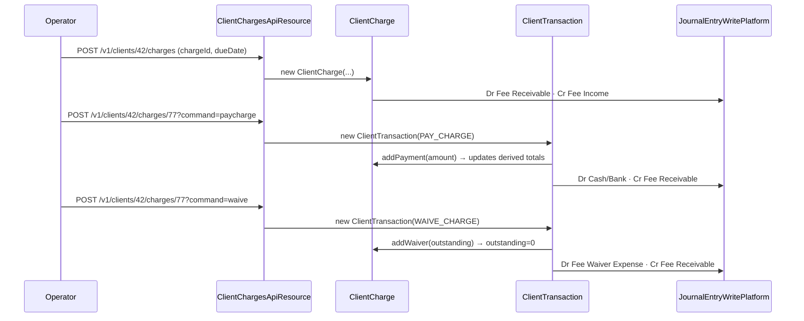

Not every fee an MFI collects belongs to a loan or savings account. Membership fees, KYC-renewal fees, ID-card reprint fees and similar one-off levies sit at the **client** level in Apache Fineract. They are modelled by `ClientCharge`, paid through `ClientTransaction` postings, and exposed under `/v1/clients/{clientId}/charges` and `/v1/clients/{clientId}/transactions`.

## Package

```
org.apache.fineract.portfolio.client.domain  (fineract-provider)
├── ClientCharge.java
├── ClientChargePaidBy.java
├── ClientChargeRepository.java
├── ClientChargeRepositoryWrapper.java
├── ClientTransaction.java
└── ClientTransactionType.java

org.apache.fineract.portfolio.client.api
├── ClientChargesApiResource.java         (/v1/clients/{clientId}/charges)
└── ClientTransactionsApiResource.java    (/v1/clients/{clientId}/transactions)
```

## `ClientCharge`

`ClientCharge` extends `AbstractPersistableCustom<Long>` and maps to `m_client_charge`:

```java
@Entity
@Table(name = "m_client_charge")
public class ClientCharge extends AbstractPersistableCustom<Long> {

    @ManyToOne(optional = false)
    @JoinColumn(name = "client_id", nullable = false)
    private Client client;

    @ManyToOne(optional = false)
    @JoinColumn(name = "charge_id", nullable = false)
    private Charge charge;

    @Column(name = "charge_time_enum")  private Integer chargeTime;
    @Column(name = "charge_due_date")   private LocalDate dueDate;
    @Column(name = "charge_calculation_enum") private Integer chargeCalculation;

    @Column(name = "amount")                 private BigDecimal amount;
    @Column(name = "amount_paid_derived")    private BigDecimal amountPaid;
    @Column(name = "amount_waived_derived")  private BigDecimal amountWaived;
    @Column(name = "amount_writtenoff_derived") private BigDecimal amountWrittenOff;
    @Column(name = "amount_outstanding_derived") private BigDecimal amountOutstanding;

    @Column(name = "is_penalty")     private boolean penaltyCharge;
    @Column(name = "is_paid_derived") private boolean paid;
}
```

The link to the catalogue is `charge_id` → `m_charge`. The catalogue carries currency, calculation type, and the GL account mapping; the row on `m_client_charge` is a per-client instance.

### Derived columns

`amount_paid_derived`, `amount_waived_derived`, `amount_writtenoff_derived` and `amount_outstanding_derived` are not maintained by triggers — they are recomputed in Java by `ClientCharge` whenever a `ClientChargePaidBy` is added. The `_derived` suffix is the project's convention for "summary maintained by the domain model, not by SQL".

The invariant the code enforces is:

```
amount = amountOutstanding + amountPaid + amountWaived + amountWrittenOff
```

### Charge time on a client

`chargeTime` is an integer from `ChargeTimeType`. Only a subset makes sense at the client level:

- `SPECIFIED_DUE_DATE` — one-off charge due on `dueDate`.
- (Annual fees and similar recurring charges live on savings/loan accounts, not directly on the client.)

`chargeCalculation` is similarly an integer from `ChargeCalculationType`. Client charges are almost always `FLAT`.

### Penalty flag

`is_penalty` is copied from the parent `Charge.isPenalty()` at creation. It is the same flag loans and savings use, but with no automatic application engine — a client penalty is created by a human, never by a scheduler.

## `ClientChargePaidBy` — the link table

`ClientChargePaidBy` links a `ClientTransaction` to the `ClientCharge` it paid (in whole or in part). It carries the amount and is the only place where partial payments are stored.

```java
@Entity
@Table(name = "m_client_charge_paid_by")
public class ClientChargePaidBy extends AbstractPersistableCustom<Long> {

    @ManyToOne
    @JoinColumn(name = "client_transaction_id")
    private ClientTransaction clientTransaction;

    @ManyToOne
    @JoinColumn(name = "client_charge_id")
    private ClientCharge clientCharge;

    @Column(name = "amount") private BigDecimal amount;
}
```

A single `ClientTransaction` of type `PAY_CHARGE` can settle multiple charges in one go — one `ClientChargePaidBy` per charge. Conversely, a charge can be paid by several transactions over time.

## `ClientTransaction`

`ClientTransaction` is the audit trail of every monetary movement at the client level (not on a sub-account). It extends `AbstractAuditableWithUTCDateTimeCustom<Long>` and maps to `m_client_transaction`:

```java
@Entity
@Table(name = "m_client_transaction", uniqueConstraints = {
    @UniqueConstraint(columnNames = { "external_id" }, name = "external_id") })
public class ClientTransaction extends AbstractAuditableWithUTCDateTimeCustom<Long> {

    @ManyToOne @JoinColumn(name = "client_id", nullable = false)
    private Client client;

    @ManyToOne @JoinColumn(name = "office_id", nullable = false)
    private Office office;

    @ManyToOne @JoinColumn(name = "payment_detail_id", nullable = true)
    private PaymentDetail paymentDetail;

    @Column(name = "currency_code")           private String currencyCode;
    @Column(name = "transaction_type_enum")   private Integer typeOf;
    @Column(name = "transaction_date")        private LocalDate dateOf;
    @Column(name = "submitted_on_date")       private LocalDate submittedOnDate;
    @Column(name = "amount")                  private BigDecimal amount;
    @Column(name = "is_reversed")             private boolean reversed;
    @Column(name = "external_id")             private ExternalId externalId;
}
```

Key columns:

- `transaction_type_enum` — the `ClientTransactionType` value.
- `payment_detail_id` — optional FK to `m_payment_detail` (cheque, account number, routing code, receipt number). Same shared structure used by loan and savings payments.
- `office_id` — the office that posted the transaction, recorded for branch-level GL postings.
- `external_id` — globally unique idempotency key.

## Transaction types

The set is intentionally tight — only two postings exist at the client level:

```java
public enum ClientTransactionType {
    PAY_CHARGE(1, "clientTransactionType.payCharge"),
    WAIVE_CHARGE(2, "clientTransactionType.waiveCharge");
}
```

| Type | What happens to `ClientCharge` |
|------|-------------------------------|
| `PAY_CHARGE` | Increases `amountPaid`, decreases `amountOutstanding`. Adds a `ClientChargePaidBy` per charge paid. Posts to GL: Dr Cash/Bank · Cr Fee Income. |
| `WAIVE_CHARGE` | Increases `amountWaived`, decreases `amountOutstanding`. Posts to GL: Dr Fee Waivers (expense) · Cr Fee Receivable, depending on the catalogue's `Charge` GL configuration. |

There is no separate "apply" transaction — the charge starts outstanding the moment it is created, and the GL receivable is booked at creation time.

## Lifecycle of a one-off fee



## REST surface

### `ClientChargesApiResource` — `/v1/clients/{clientId}/charges`

| Method | Path | Action |
|--------|------|--------|
| GET | `/` | List with `chargeStatus=active|inactive|all`, paginated. |
| GET | `/template` | Available `Charge` catalogue entries the operator may attach. |
| GET | `/{chargeId}` | Single charge with its `transactions` list. |
| POST | `/` | Create — body needs `chargeId`, `amount`, `dueDate`. |
| POST | `/{chargeId}?command=paycharge` | Settle (full or partial) with `transactionDate`, `amount`, `paymentTypeId`. |
| POST | `/{chargeId}?command=waive` | Waive the outstanding amount. |
| PUT | `/{chargeId}` | Edit `amount` / `dueDate` while unpaid. |
| DELETE | `/{chargeId}` | Allowed only when the charge has no transactions. |

Commands routed: `CREATE_CHARGE`, `UPDATE_CHARGE`, `DELETE_CHARGE`, `PAY_CHARGE`, `WAIVE_CHARGE` — all scoped to entity `CLIENTCHARGE` so audits do not collide with loan/savings charges of the same names.

### `ClientTransactionsApiResource` — `/v1/clients/{clientId}/transactions`

| Method | Path | Action |
|--------|------|--------|
| GET | `/` | Paged list of `ClientTransactionData`. |
| GET | `/{transactionId}` | Single transaction. |
| POST | `/{transactionId}?command=undo` | Reverse — sets `is_reversed = true` and re-posts inverse GL entries. |

Undo is restricted to the same day in the default configuration; institutions enable post-day undo by configuring the matching permission.

## Validation

`ClientChargeDataValidator` enforces:

- `chargeId` references an active charge in the `Client charges` group (`m_charge.charge_applies_to_enum = 3`).
- `amount` is positive and matches the charge's currency.
- `dueDate` is on or after `submittedOnDate`.
- For pay: `amount` ≤ `amountOutstanding`, `transactionDate` ≥ `dueDate` (configurable).
- For waive: charge is not already fully paid.

Errors come back as the usual `dataValidationErrors` 400 payload.

## Money and currency

`ClientCharge` does not embed `MonetaryCurrency` — it derives the currency from the parent `Charge` and stores the ISO code on `ClientTransaction.currencyCode`. The `currency()` accessor on `ClientCharge` joins via the `OrganisationCurrency` repository to resolve `decimalPlaces` and `inMultiplesOf` for rounding, so the entity can produce a `Money` value when asked.

## Accounting integration

The GL postings are produced by `JournalEntryWritePlatformService` from the `Charge.glAccount` mappings. For a typical membership fee:

| Event | Debit | Credit |
|-------|-------|--------|
| Create charge | Fee receivable (asset) | Fee income (income) |
| `PAY_CHARGE` | Cash / Bank (asset) | Fee receivable (asset) |
| `WAIVE_CHARGE` | Fee waivers (expense) | Fee receivable (asset) |
| `undo PAY_CHARGE` | Fee receivable | Cash / Bank |

If `Charge.isPenalty()` is `true`, the income line goes to "Penalty income" instead. See `/accounting/journal-entries`.

<Info>
`ClientCharge` has no installment schedule — every client charge is an immediate single-shot receivable. Recurring "monthly membership" patterns are implemented by either (a) attaching a charge to a savings account, or (b) creating a new `ClientCharge` per period via an external scheduler.
</Info>

## Business events

| Event | Trigger |
|-------|---------|
| `ClientChargeCreateBusinessEvent` | POST charges. |
| `ClientChargePaymentBusinessEvent` | Successful `PAY_CHARGE`. |
| `ClientChargeWaiveBusinessEvent` | Successful `WAIVE_CHARGE`. |
| `ClientChargeDeleteBusinessEvent` | DELETE charge. |
| `ClientTransactionAdjustmentBusinessEvent` | Undo of a posted transaction. |

These flow through `BusinessEventNotifierService` and are emitted in the same transaction as the database write, so subscribers always see the persisted state. See `/core/business-events`.

## See also

- `/portfolio/client` — owning entity.
- `/reference/charges` — the `Charge` catalogue and `chargeAppliesTo` filtering.
- `/accounting/journal-entries` — how GL postings are generated.
- `/commands/overview` — `PAY_CHARGE` / `WAIVE_CHARGE` command dispatch.
