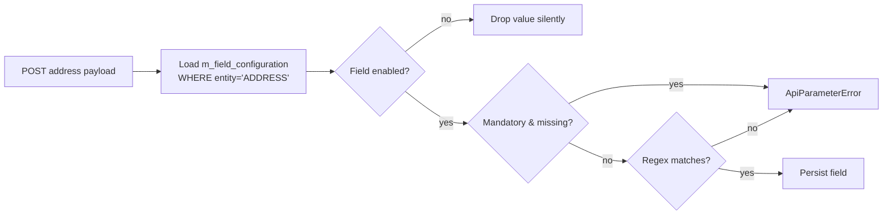
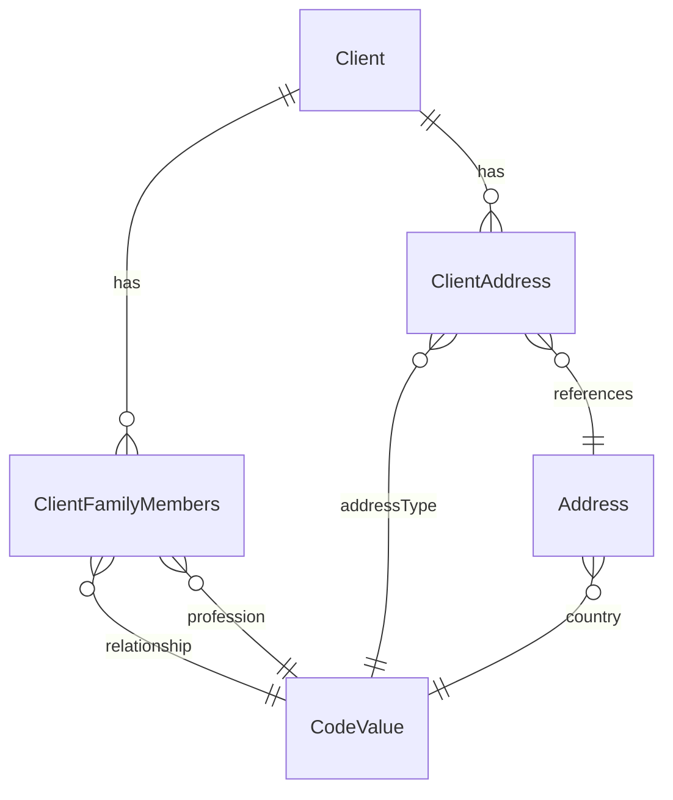

Beyond the scalar fields on the `Client` row itself, Apache Fineract carries two extension entities for the more practical KYC information an MFI needs: a list of family members (with a dependents flag for credit scoring) and an arbitrary number of addresses. Both are exposed under sub-paths of `/v1/clients/{clientId}` and both rely on `CodeValue` lookups for their type fields.

## Package

```
org.apache.fineract.portfolio.client.domain  (fineract-provider)
├── ClientFamilyMembers.java
├── ClientFamilyMembersRepository.java
├── ClientAddress.java
├── ClientAddressRepository.java
└── ClientAddressRepositoryWrapper.java

org.apache.fineract.portfolio.client.api
├── ClientFamilyMembersApiResource.java     (/v1/clients/{clientId}/familymembers)
└── ClientAddressApiResource.java           (/v1/client/...)

org.apache.fineract.portfolio.address
├── domain/Address.java                     (shared address row)
└── api/EntityFieldConfigurationApiResource (/v1/fieldconfiguration/{entity})
```

## `ClientFamilyMembers`

```java
@Entity
@Table(name = "m_family_members")
public class ClientFamilyMembers extends AbstractPersistableCustom<Long> {

    @ManyToOne @JoinColumn(name = "client_id") private Client client;

    @Column(name = "firstname")   private String firstName;
    @Column(name = "middlename")  private String middleName;
    @Column(name = "lastname")    private String lastName;

    @Column(name = "qualification") private String qualification;
    @Column(name = "mobile_number") private String mobileNumber;
    @Column(name = "age")           private Long age;
    @Column(name = "is_dependent")  private Boolean isDependent;

    @ManyToOne @JoinColumn(name = "relationship_cv_id")   private CodeValue relationship;
    @ManyToOne @JoinColumn(name = "marital_status_cv_id") private CodeValue maritalStatus;
    @ManyToOne @JoinColumn(name = "gender_cv_id")         private CodeValue gender;
    @ManyToOne @JoinColumn(name = "profession_cv_id")     private CodeValue profession;

    @Column(name = "date_of_birth") private LocalDate dateOfBirth;
}
```

Each family member is a free-standing row. The four `CodeValue` references all come from system-defined codes that the tenant can extend:

| Field | Code | Typical values |
|-------|------|----------------|
| `relationship` | `FamilyRelationship` | Spouse, Father, Mother, Son, Daughter, Sibling, … |
| `maritalStatus` | `MaritalStatus` | Married, Single, Widowed, Divorced |
| `gender` | `Gender` | Male, Female, Other |
| `profession` | `Profession` | Self-employed, Salaried, Student, Retired |

The `is_dependent` flag is the most important downstream signal — credit-scoring engines and household-income reports filter on it.

### Why `age` and `dateOfBirth` both exist

`age` is a snapshot used in deployments where date-of-birth is not collected reliably (very common in informal sectors). When `dateOfBirth` is supplied, derived reporting recomputes `age` from it; when only `age` is supplied, the value is stored as-is and is expected to be refreshed periodically.

## `ClientFamilyMembers` REST API

```java
@Path("/v1/clients/{clientId}/familymembers")
```

| Method | Path | Action |
|--------|------|--------|
| GET | `/` | List family members. |
| GET | `/template` | Returns the four CodeValue dropdowns. |
| POST | `/` | Add a member. |
| POST | `/?command=createall` | Bulk-add multiple members in one request. |
| PUT | `/{id}` | Update. |
| DELETE | `/{id}` | Remove. |

The command actions are `CREATE_FAMILYMEMBERS`, `CREATEALL_FAMILYMEMBERS`, `UPDATE_FAMILYMEMBERS`, `DELETE_FAMILYMEMBERS` — see `/commands/overview` for routing.

Request body for a single create:

```json
{
  "firstName": "Ade",
  "lastName": "Adeyemi",
  "relationshipId": 12,
  "genderId": 4,
  "isDependent": true,
  "dateOfBirth": "12 March 2010",
  "dateFormat": "dd MMMM yyyy",
  "locale": "en"
}
```

`relationshipId` is the only `CodeValue` reference that is conventionally mandatory; the rest are optional and may be omitted entirely.

## `ClientAddress`

`ClientAddress` is a tiny join row that gives a `Client` a typed reference to a shared `Address`. The address itself is stored once and may be linked from multiple clients or other entities later.

```java
@Entity
@Table(name = "m_client_address")
public class ClientAddress extends AbstractPersistableCustom<Long> {

    @ManyToOne private Client client;
    @ManyToOne private Address address;

    @ManyToOne @JoinColumn(name = "address_type_id")
    private CodeValue addressType;

    @Column(name = "is_active") private boolean isActive;
}
```

The `addressType` references the `AddressType` code, populated with values like `Residential`, `Permanent`, `Office`, `Family member`. Exactly one address of each type is conventionally marked `is_active = true`; older instances stay around for history.

### The shared `Address`

`org.apache.fineract.portfolio.address.domain.Address` (table `m_address`) holds:

- `street`, `address_line_1/2/3`
- `town_village`
- `city`
- `county_district`
- `state_province_id` (FK to `m_code_value` — code `State`)
- `country_id` (FK to `m_code_value` — code `COUNTRY`)
- `postal_code`
- `latitude`, `longitude`
- `created_by`, `created_on`, `updated_by`, `updated_on`

Apache Fineract treats `Address` as a stand-alone domain object exactly so it can be reused — between two related clients in the same household, between a guarantor and the client they guarantee, between branches of an `Office`.

### Address API

```java
@Path("/v1/client")
public class ClientAddressApiResource { … }
```

| Method | Path | Action |
|--------|------|--------|
| GET | `/{clientId}/addresses` | List addresses for the client. |
| POST | `/{clientId}/addresses?type={addressTypeId}` | Create — body holds the `Address` payload. |
| PUT | `/{clientId}/addresses` | Update — body holds the `clientAddressId` and modified fields. |

(The class-level path is `/v1/client` — singular — for historical reasons; the sub-resource paths are still organised around the `clientId`.)

## Address field configuration

Address requirements vary wildly by country — Kenyan deployments need `townVillage` more than `state`, US deployments need ZIP and state, German deployments need `country` and `postalCode` but rarely `county`. Rather than hard-code which fields are mandatory, Apache Fineract stores per-tenant rules in `m_field_configuration` and exposes them through `EntityFieldConfigurationApiResource`:

```java
@Path("/v1/fieldconfiguration/{entity}")
public class EntityFieldConfigurationApiResource { … }
```

A typical row looks like:

| `entity` | `field` | `is_enabled` | `is_mandatory` | `validation_regex` |
|----------|---------|--------------|----------------|---------------------|
| `ADDRESS` | `addressLine1` | true | true | `null` |
| `ADDRESS` | `postalCode` | true | true | `^[0-9]{5}$` |
| `ADDRESS` | `countyDistrict` | false | false | `null` |

The address validator consults the rows whose `entity = 'ADDRESS'` before each create/update. Disabled fields are silently dropped from the payload; mandatory fields produce a 400 if missing; the regex is applied last.



Operators tune this once per deployment and never again. The matching read endpoint is:

```
GET /v1/fieldconfiguration/ADDRESS
```

which returns a list of `FieldConfigurationData` rows that web clients use to render the form labels and `required` markers.

## Multiple addresses, one current

There is no unique constraint preventing two `is_active = true` rows for the same client and same `addressType`. The convention is enforced at the service layer:

1. On create with `is_active = true`, the service first sets every existing row with the same `(client, addressType)` to `is_active = false`.
2. The new row is inserted.

This gives a complete address history while keeping the "current" set easy to query with `WHERE is_active = TRUE`.

## Relationship to the client



Cascading delete of a `Client` does not delete its family-member rows — the FK is `ON DELETE RESTRICT`. The client write platform service refuses to delete a client that still has family members, so the operator must clean them up first.

## Bulk family creation

`POST /v1/clients/{clientId}/familymembers?command=createall` accepts a JSON array under `familyMembers` and creates all rows in a single transaction:

```json
{
  "familyMembers": [
    { "firstName": "Ade",  "relationshipId": 12, "isDependent": true },
    { "firstName": "Lara", "relationshipId": 13, "isDependent": true }
  ]
}
```

This is what loan-officer mobile apps use during onboarding — one round-trip per household instead of one per dependent.

## Validation specifics

- `ClientFamilyMembersDataValidator` enforces non-blank `firstName`, `relationshipId` present, and a non-negative `age`.
- `ClientAddress` create requires a positive `addressTypeId`. Pin code and country are governed by `m_field_configuration`.
- Locale and date format follow the global rules — see `/runtime/serialization-and-jersey`.

<Info>
The two extension entities (`ClientFamilyMembers`, `ClientAddress`) live in `fineract-provider`, not `fineract-core`. They are pure portfolio concerns and the loan/savings core does not need to know about them.
</Info>

## Permissions and audit

Standard permission rows govern the family/address sub-resources:

| Permission | Action |
|------------|--------|
| `CREATE_FAMILYMEMBERS` | Add a single family member. |
| `CREATEALL_FAMILYMEMBERS` | Bulk-add via `?command=createall`. |
| `UPDATE_FAMILYMEMBERS`, `DELETE_FAMILYMEMBERS` | Edit and remove. |
| `CREATE_ADDRESS`, `UPDATE_ADDRESS`, `DELETE_ADDRESS` | Address CRUD. |

Each command writes to `m_portfolio_command_source` as usual, so an institution that requires reviewing address changes (common when address feeds into AML risk scoring) enables maker-checker on the address permissions only.

## See also

- `/portfolio/client` — owning entity.
- `/portfolio/client-identifiers` — government ID storage.
- `/core/codes` — how the four CodeValue dropdowns are configured.
- `/runtime/error-handling` — how field-configuration violations surface as 400 responses.
