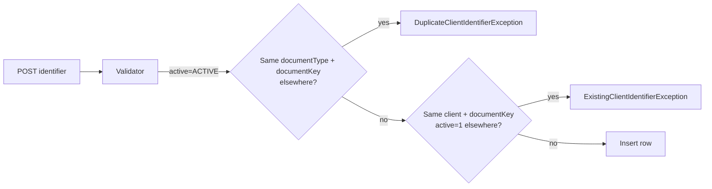
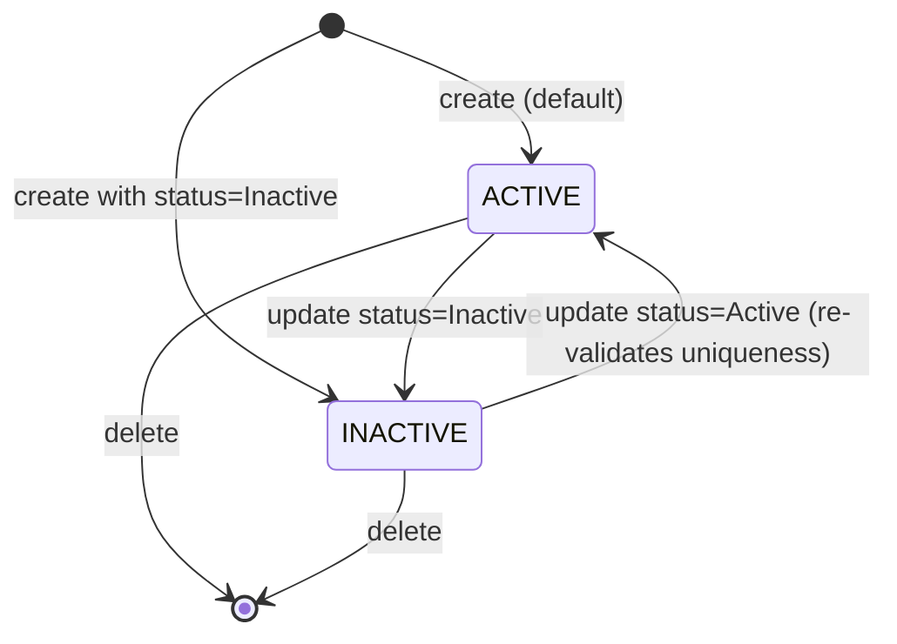
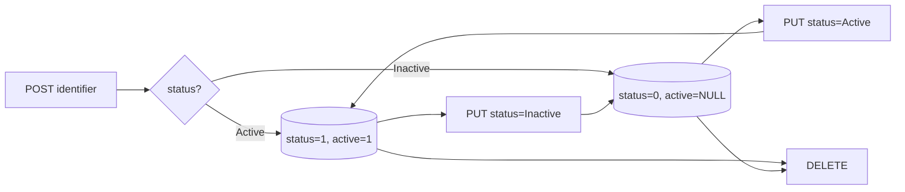

`ClientIdentifier` is the KYC arm of the client entity in Apache Fineract. Every government-issued document a microfinance institution wants to capture — national ID card, passport, driver's licence, voter card, tax ID — is represented as a row in `m_client_identifier` pointing at the same `Client`. The type of document is itself a `CodeValue`, so the catalogue of identifier types is fully configurable per deployment.

## Where it lives

```
org.apache.fineract.portfolio.client.domain
├── ClientIdentifier.java            (fineract-core)
├── ClientIdentifierRepository.java
└── ClientIdentifierStatus.java

org.apache.fineract.portfolio.client.api
└── ClientIdentifiersApiResource.java  (fineract-provider, /v1/clients/{clientId}/identifiers)

org.apache.fineract.portfolio.client.command
└── ClientIdentifierCommand.java
```

The domain entity is in `fineract-core` because the loan and savings KYC reporting code occasionally needs to read identifiers; the REST resource and command DTOs live in `fineract-provider`.

## The `ClientIdentifier` entity

```java
@Entity
@Table(name = "m_client_identifier", uniqueConstraints = {
    @UniqueConstraint(columnNames = { "document_type_id", "document_key" },
                      name = "unique_identifier_key"),
    @UniqueConstraint(columnNames = { "client_id", "document_key", "active" },
                      name = "unique_active_client_identifier") })
public class ClientIdentifier extends AbstractAuditableWithUTCDateTimeCustom<Long> {

    @ManyToOne @JoinColumn(name = "client_id", nullable = false)
    private Client client;

    @ManyToOne @JoinColumn(name = "document_type_id", nullable = false)
    private CodeValue documentType;

    @Column(name = "document_key", length = 1000)
    private String documentKey;

    @Column(name = "status", nullable = false)
    private Integer status;

    @Column(name = "description", length = 1000)
    private String description;

    @Column(name = "active")
    private Integer active;
}
```

| Column | Meaning |
|--------|---------|
| `client_id` | FK to `m_client`. |
| `document_type_id` | FK to `m_code_value` — points at a value of the `Customer Identifier` code by default. |
| `document_key` | The actual ID number (passport number, voter ID number, etc.). Up to 1000 chars to accommodate composite formats. |
| `status` | `ClientIdentifierStatus` value (`ACTIVE` / `INACTIVE`). |
| `active` | A copy of the `ACTIVE` value (`1`) when the status is `ACTIVE`, `NULL` otherwise. Used to make the partial-unique constraint enforceable on every SQL dialect. |
| `description` | Free-text remarks. |

## Uniqueness rules — both constraints matter

The two unique constraints encode different business rules:

**`unique_identifier_key (document_type_id, document_key)`**
No two clients in the tenant can ever share the same passport number. This is enforced even for inactive rows, because two different clients claiming the same passport — historical or current — is by definition a data-quality problem.

**`unique_active_client_identifier (client_id, document_key, active)`**
A single client cannot have two *active* identifiers with the same `document_key`. The trick is the trailing `active` column: when an identifier is `INACTIVE` the column is `NULL`, and most databases treat `NULL` in a unique constraint as not-equal-to-everything. So the same client can keep an old, inactive passport row around for history and add a new active one with a different key. Re-activating the old one would collide and be rejected at insert/update time.



## Identifier status

```java
public enum ClientIdentifierStatus {
    ACTIVE("Active", 1),
    INACTIVE("Inactive", 0);
}
```

The enum is intentionally tiny — it indicates whether a particular `(client, document)` pairing is currently the one the institution recognises. When an identifier is updated from `INACTIVE` to `ACTIVE`, the entity recomputes the `active` column from the status:

```java
ClientIdentifierStatus statusEnum = ClientIdentifierStatus.valueOf(statusName.toUpperCase());
this.active = null;
if (statusEnum.isActive()) {
    this.active = statusEnum.getValue();
}
this.status = statusEnum.getValue();
```

That keeps `active` and `status` in lock-step without a trigger.

## CodeValue-driven types

The `documentType` is *not* an enum — it is a `CodeValue` row in `m_code_value`, parented by the `Customer Identifier` code. A fresh tenant is seeded with values like:

- Passport
- Driver's License
- Voter ID
- National ID Card
- Aadhar
- PAN

Operators add or rename document types from the system administration UI (`/v1/codes/{codeId}/codevalues`). Adding `Tax ID` later requires no schema change and no code change — the validator looks the value up by id at command time.

<Info>
Because `documentType` is a `CodeValue` reference, deleting a code value that is still pointed at by an identifier fails with a referential-integrity error. Mark the value `is_active = false` instead — historical rows keep their FK and the value just disappears from the UI dropdown.
</Info>

## REST surface — `ClientIdentifiersApiResource`

```java
@Path("/v1/clients/{clientId}/identifiers")
public class ClientIdentifiersApiResource { … }
```

| Method | Path | Purpose |
|--------|------|---------|
| GET | `/v1/clients/{clientId}/identifiers` | List identifiers for the client. |
| GET | `/v1/clients/{clientId}/identifiers/template` | Returns the available `documentType` CodeValues. |
| GET | `/v1/clients/{clientId}/identifiers/{id}` | Single identifier. |
| POST | `/v1/clients/{clientId}/identifiers` | Create. |
| PUT | `/v1/clients/{clientId}/identifiers/{id}` | Update (`documentTypeId`, `documentKey`, `status`, `description`). |
| DELETE | `/v1/clients/{clientId}/identifiers/{id}` | Hard delete. |

The CRUD operations route through the commands framework — `CREATE_CLIENTIDENTIFIER`, `UPDATE_CLIENTIDENTIFIER`, `DELETE_CLIENTIDENTIFIER` — so maker-checker is supported uniformly.

### Create payload

```json
{
  "documentTypeId": 12,
  "documentKey": "P3829471",
  "description": "Issued by Ministry of Home Affairs",
  "status": "ACTIVE"
}
```

Fields:

- `documentTypeId` — mandatory; must reference an active `Customer Identifier` CodeValue.
- `documentKey` — mandatory; up to 1000 characters.
- `status` — optional; defaults to `ACTIVE`.
- `description` — optional.

### Update semantics

`ClientIdentifier.update(JsonCommand)` walks the four updatable fields one at a time and only emits an entry into the returned `actualChanges` map when the value really changed:

```java
if (command.isChangeInStringParameterNamed("documentKey", this.documentKey)) {
    String newValue = command.stringValueOfParameterNamed("documentKey");
    actualChanges.put("documentKey", newValue);
    this.documentKey = StringUtils.defaultIfEmpty(newValue, null);
}
```

The same pattern is used for `documentTypeId`, `description` and `status`. The returned map becomes the `changes` block of the command processing result, which is what audit and external-event consumers receive.

## Status transitions



There is no "revoked" state — institutions either inactivate (keep for history) or delete (full removal). Deletes go through `DELETE_CLIENTIDENTIFIER` and are not soft-deleted; they leave audit rows in `m_portfolio_command_source` via the commands framework.

## Validator — `ClientIdentifierCommand`

`ClientIdentifierCommand` is a small POJO that the write platform service uses to extract and validate parameters. Its `validateForCreate()` enforces:

- `documentTypeId` present.
- `documentKey` not blank.
- `status` either `ACTIVE`, `INACTIVE` or absent.

`validateForUpdate()` skips presence checks but still validates parsing of the supplied values. The validator builder produces `ApiParameterError` objects which the framework turns into a 400 response with a `dataValidationErrors` array — see `/runtime/error-handling`.

## Linked documents

Identifiers are scalar — they carry an ID number and a description. Scans, PDFs and photos of the underlying document are stored separately through the document management module under the `clients` entity type. The convention is to upload the document with `name = "<DocumentType> - <DocumentKey>"` so a manual reconciliation between a `ClientIdentifier` row and the matching file in `m_document` is straightforward.

## Reads

`ClientIdentifierReadPlatformService` runs a JDBC query joining `m_client_identifier` to `m_code_value`:

```sql
SELECT ci.id, ci.client_id, ci.document_type_id, cv.code_value AS document_type,
       ci.document_key, ci.description, ci.status
  FROM m_client_identifier ci
  JOIN m_code_value cv ON cv.id = ci.document_type_id
 WHERE ci.client_id = ?
 ORDER BY ci.id DESC
```

The returned `ClientIdentifierData` is what `GET /v1/clients/{clientId}/identifiers` returns directly — there is no projection layer.

## Failure cases

| Exception | HTTP | Cause |
|-----------|------|-------|
| `DuplicateClientIdentifierException` | 403 | `(documentType, documentKey)` exists for a different client. |
| `ClientIdentifierNotFoundException` | 404 | Path `{id}` not found, or not under the given `{clientId}`. |
| `CodeValueNotFoundException` | 404 | `documentTypeId` does not exist or is from the wrong code. |
| `PlatformApiDataValidationException` | 400 | Field validation failures from `ClientIdentifierCommand`. |

## Use with `Client` legal form

There is no schema-level enforcement that a `PERSON` client must have a passport or that an `ENTITY` client must have a company registration. Institutions can declare which identifier types are mandatory by writing a Liquibase patch that activates the appropriate CodeValues and adding a domain-rule check in their fork — the platform stays neutral so multi-tenant deployments with different regulators can share the same code.

## Status flow



## Reporting integration

Identifier rows are surfaced to the reporting layer through two SQL views shipped in the default `m_view` set: `v_client_identifier` joins the entity to `m_code_value` so reports can pivot on the human-readable document type without an extra JOIN, and `v_client_active_identifier` filters to the active rows only. Standard regulatory reports — KYC compliance, beneficial-ownership exports — read from these views rather than touching `m_client_identifier` directly, which lets a schema change to the table propagate to every report by updating the view.

## Bulk import

The bulk-import module supports identifier rows alongside client onboarding. A spreadsheet column set of `documentType,documentKey,status,description` per client is parsed by `ClientIdentifierImportHandler`; rejected rows surface in the per-sheet error column so the operator can fix and re-upload. See `/core/bulk-import`.

## See also

- `/portfolio/client` — owning entity and its lifecycle.
- `/core/codes` — Code / CodeValue mechanics.
- `/core/document-management` — uploading the actual document scans.
- `/commands/overview` — how `CREATE_CLIENTIDENTIFIER` and friends are routed.
