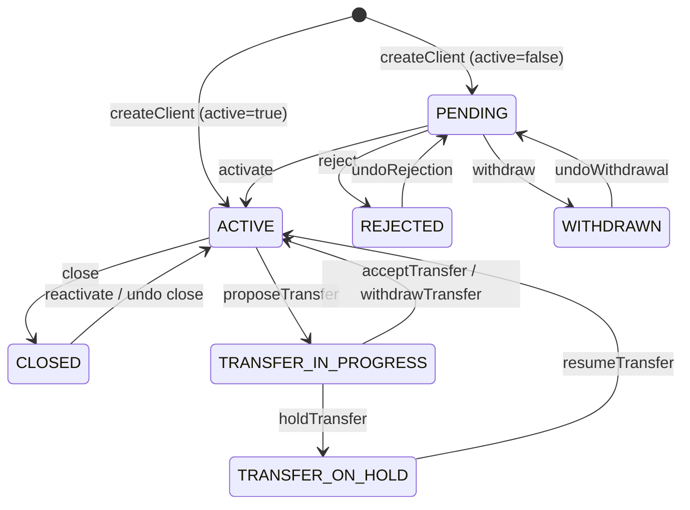
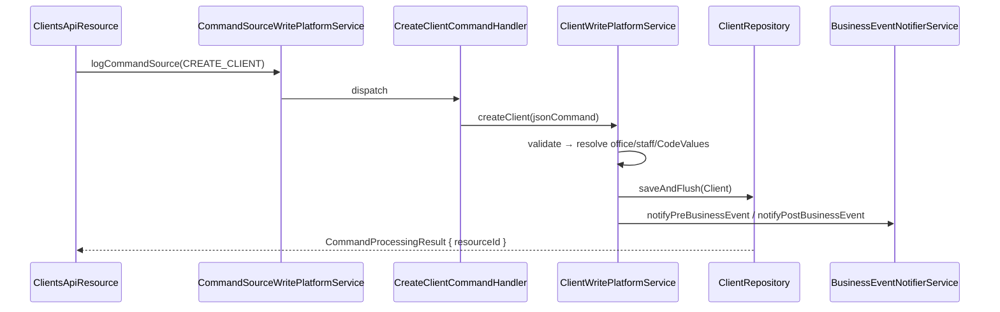

The `Client` is the root identity in Apache Fineract — every loan, savings account, share account, charge transaction and group membership ultimately hangs off a client. It models both natural persons and legal entities, owns its own status machine, and is exposed through the `/v1/clients` resource family. The entity lives in `fineract-core` so that the loan, savings and group modules can depend on it without pulling in REST plumbing.

## Package layout

```
org.apache.fineract.portfolio.client
├── adapter/      Adapters used by command handlers
├── api/          ClientApiConstants and core API helpers
├── data/         Read-side DTOs (ClientData, ClientTimelineData, …)
├── domain/       JPA entities — Client, ClientStatus, LegalForm, …
│   └── search/   SearchedClient + SearchingClientRepository (v2 search)
├── exception/    Domain rule exceptions
└── service/      Read-platform services
```

The REST resources (`ClientsApiResource`, `ClientTransactionsApiResource`, `ClientChargesApiResource`, `ClientIdentifiersApiResource`, `ClientFamilyMembersApiResource`, `ClientAddressApiResource`) live in `fineract-provider`; write-side platform services live in `fineract-provider/portfolio/client/service`.

## The `Client` entity

`org.apache.fineract.portfolio.client.domain.Client` extends `AbstractAuditableWithUTCDateTimeCustom<Long>` and maps to table `m_client`. The header declares two unique constraints:

```java
@Table(name = "m_client", uniqueConstraints = {
    @UniqueConstraint(columnNames = { "account_no" }, name = "account_no_UNIQUE"),
    @UniqueConstraint(columnNames = { "mobile_no" }, name = "mobile_no_UNIQUE") })
public class Client extends AbstractAuditableWithUTCDateTimeCustom<Long> { … }
```

Account number is required, mobile number is optional but globally unique when present. External id is also unique. Email is constrained unique at the column level.

### Field groups

The class is intentionally wide — it stores every attribute that any consumer of the client (loan officer, KYC auditor, regulator report) might need to filter on. The fields fall into a few groups.

**Identity and naming**

| Field | Column | Notes |
|-------|--------|-------|
| `accountNumber` | `account_no` | 20 chars, mandatory, unique. Generated via `AccountNumberFormat` when not supplied. |
| `externalId` | `external_id` | `ExternalId` wrapper, 100 chars, unique. |
| `firstname`, `middlename`, `lastname` | individual columns | Used when `legalForm = PERSON`. |
| `fullname` | `fullname` | Used when `legalForm = ENTITY` — single string for a company. |
| `displayName` | `display_name` | Always populated, computed from the above. |
| `mobileNo`, `emailAddress` | … | Optional contact fields; mobile is unique. |

**Office and staff**

| Field | Notes |
|-------|-------|
| `office` | Mandatory `ManyToOne` to `Office`. Anchor of the client to a branch. |
| `transferToOffice` | Target office while a transfer is in progress; `null` otherwise. |
| `staff` | Loan-officer / case-worker assignment. |
| `isStaff` | Marks the client as also being a staff member (some MFIs allow this). |

**KYC and classification (all `CodeValue` references)**

| Field | Code name driving the lookup |
|-------|------------------------------|
| `gender` | `Gender` |
| `clientType` | `ClientType` |
| `clientClassification` | `ClientClassification` |
| `subStatus` | `ClientSubStatus` — finer-grained sub-states inside ACTIVE. |
| `closureReason` | `ClientClosureReason` |
| `rejectionReason` | `ClientRejectReason` |
| `withdrawalReason` | `ClientWithdrawReason` |

This use of `CodeValue` is what makes the same client schema fit very different jurisdictions — the categories themselves are configurable. See `/core/codes` for how Code / CodeValue are stored.

**Lifecycle timestamps**

`submittedOnDate`, `activationDate`, `officeJoiningDate`, `closureDate`, `rejectionDate`, `withdrawalDate`, `reactivateDate`, `reopenedDate` together with the matching `*By` `AppUser` fields form an embedded audit trail of every state change. The read API surfaces this as `ClientTimelineData`.

**Other**

- `imageId` — link to the optional client photo stored through the document-management module.
- `dateOfBirth` — for persons.
- `legalForm` — integer mapped to the `LegalForm` enum (see below).
- `savingsProductId` / `savingsAccountId` — optional "default savings" that can be auto-created on activation.
- `groups` — `@ManyToMany` join table `m_group_client` to `Group`.

## Legal form

```java
public enum LegalForm {
    PERSON(1, "legalFormType.person", "Person"),
    ENTITY(2, "legalFormType.entity", "Entity");
}
```

Persons use `firstname/middlename/lastname`; entities use `fullname`. The validator in `ClientsApiResource` write platform service enforces which name fields are mandatory based on `legalForm`. `LegalForm.isPerson()` and `isEntity()` are used throughout the validator chain.

## Status machine

`ClientStatus` is a numeric enum stored as `status_enum` in the `Client.status` column.

```java
public enum ClientStatus {
    INVALID(0, "clientStatusType.invalid"),
    PENDING(100, "clientStatusType.pending"),
    ACTIVE(300, "clientStatusType.active"),
    TRANSFER_IN_PROGRESS(303, "clientStatusType.transfer.in.progress"),
    TRANSFER_ON_HOLD(304, "clientStatusType.transfer.on.hold"),
    CLOSED(600, "clientStatusType.closed"),
    REJECTED(700, "clientStatusType.rejected"),
    WITHDRAWN(800, "clientStatusType.withdraw");
}
```

The numeric values matter — they are persisted, written to integration events, and used in reports. The gaps (100, 300, 600, 700, 800) leave room for new intermediate states without renumbering.

### Transitions



`Client` exposes helper predicates — `isPending()`, `isActive()`, `isClosed()`, `isRejected()`, `isWithdrawn()`, `isTransferInProgress()`, `isTransferOnHold()` — that the write platform service consults before each transition. Invalid transitions throw `InvalidClientStateTransitionException`. The transfer-related transitions are driven by the office-transfer flow described in `/portfolio/transfer`.

## Commands and handlers

The clients API is fully command-driven. Each REST operation submits a `CommandWrapper` to `PortfolioCommandSourceWritePlatformService`, which persists a `CommandSource` row and dispatches to the matching `*CommandHandler`. The handlers in turn call `ClientWritePlatformService`.

| HTTP | Path | Command action |
|------|------|----------------|
| POST | `/clients` | `CREATE_CLIENT` |
| PUT | `/clients/{id}` | `UPDATE_CLIENT` |
| POST | `/clients/{id}?command=activate` | `ACTIVATE_CLIENT` |
| POST | `/clients/{id}?command=close` | `CLOSE_CLIENT` |
| POST | `/clients/{id}?command=reject` | `REJECT_CLIENT` |
| POST | `/clients/{id}?command=withdraw` | `WITHDRAW_CLIENT` |
| POST | `/clients/{id}?command=reactivate` | `REACTIVATE_CLIENT` |
| POST | `/clients/{id}?command=undoRejection` | `UNDO_REJECTION_CLIENT` |
| POST | `/clients/{id}?command=undoWithdrawal` | `UNDO_WITHDRAWAL_CLIENT` |
| POST | `/clients/{id}?command=updateSavingsAccount` | sets default savings |
| POST | `/clients/{id}?command=proposeTransfer` | hands off to transfer module |
| DELETE | `/clients/{id}` | only allowed in PENDING |

Maker-checker behaviour is inherited from the commands framework — each handler is annotated and the configuration in `m_permission` controls whether the command auto-executes or requires a separate approval.

## Creation flow



If the request includes `"active": true` and an `activationDate`, the same call also performs the activation transition and emits `ClientActivateBusinessEvent` alongside `ClientCreateBusinessEvent`.

## Default-savings hand-off

When the client is created against a `Charge` or `SavingsProduct` that declares it, the write service additionally calls into `SavingsApplicationProcessWritePlatformService` to create a `SavingsAccount` in pending state, then activates it as part of the same transaction. The resulting `savingsAccountId` is stored back on the `Client` as the default account — useful for downstream auto-debits and standing instructions.

## Read API

`ClientsApiResource` exposes:

- `GET /clients` — paged list with `sqlSearch`, `officeId`, `displayName`, `firstName`, `lastName`, `status`, `orphansOnly`, `underHierarchy`.
- `GET /clients/{id}` — full `ClientData` including timeline, codes, and (optionally) `groups`, `collateral`, `clientNonPersonDetails` via `?associations=`.
- `GET /clients/template` — drop-down options for creating a new client (offices, staff, code values, savings products).
- `GET /clients/{id}/accounts` — convenience join across loans, savings and shares for this client.

Reads delegate to `ClientReadPlatformService`, which uses JDBC-backed `RowMapper`s rather than JPA fetches to keep the list endpoints cheap.

## Hierarchy enforcement

Every list and lookup is constrained by the calling user's office hierarchy. `Office.getHierarchy()` produces a path like `.1.5.` and queries are rewritten with `WHERE o.hierarchy LIKE :hierarchy` so that a user attached to office `5` cannot see clients of an unrelated branch `7`. The same hierarchy is also used by `SearchApiResource` and the v2 client search.

## Non-person details

When `legalForm = ENTITY`, an optional companion entity `ClientNonPersonDetails` (table `m_client_non_person`) stores `constitution`, `incorpNo`, `incorpValidityTill`, `mainBusinessLine` and `remarks`. It is loaded lazily and surfaced under `clientNonPersonDetails` in the JSON payload.

## Family, address, identifiers, charges, transactions

Each of these is a sibling sub-resource of the client:

- `/clients/{id}/identifiers` — see `/portfolio/client-identifiers`.
- `/clients/{id}/charges` — see `/portfolio/client-charges`.
- `/clients/{id}/familymembers` and `/clients/{id}/addresses` — see `/portfolio/client-family-and-address`.
- `/clients/{id}/transactions` — `ClientTransaction` audit trail covering `PAY_CHARGE` / `WAIVE_CHARGE`.

## Business events

The client write platform service emits a fine-grained set of events through `BusinessEventNotifierService`. The most commonly subscribed are:

| Event | When |
|-------|------|
| `ClientCreateBusinessEvent` | Successful POST `/clients`. |
| `ClientActivateBusinessEvent` | Status moves to ACTIVE. |
| `ClientUpdateBusinessEvent` | Any field PUT. |
| `ClientCloseBusinessEvent` | Status moves to CLOSED. |
| `ClientRejectBusinessEvent` | Status moves to REJECTED. |
| `ClientReactivateBusinessEvent` | Reactivation from CLOSED. |

Subscribers in other modules use these to push notifications, refresh caches, or post to external CRMs. See `/core/business-events` for the dispatch mechanics.

<Info>
`ClientStatus.INVALID` is intentionally present so that legacy or partially-migrated rows expose themselves as `INVALID` instead of crashing the read pipeline. New code should never write `0` into `status_enum`.
</Info>

## Closure rules

Closing a client requires that all the client's accounts are themselves closed or write-off — the write platform service runs a check via `ClientReadPlatformService.retrieveClientAccountSummary` and refuses if any loan or savings is still open. The closure reason is mandatory and must reference an active `CodeValue` from the `ClientClosureReason` code.

Reactivation is allowed only from `CLOSED` and re-opens the client without restoring any of the previously closed sub-accounts — those have their own reopen flow.

## Permissions

Every client command has its own row in `m_permission`. The grouping makes it easy to grant a teller read-only access, a loan officer create-and-activate, and a branch manager close and transfer:

| Permission | Action |
|------------|--------|
| `READ_CLIENT` | Any GET on `/v1/clients`. |
| `CREATE_CLIENT` | POST `/v1/clients`. |
| `UPDATE_CLIENT` | PUT `/v1/clients/{id}`. |
| `ACTIVATE_CLIENT` | `command=activate`. |
| `CLOSE_CLIENT` | `command=close`. |
| `REJECT_CLIENT` | `command=reject`. |
| `DELETE_CLIENT` | DELETE on a PENDING client. |
| `PROPOSETRANSFER_CLIENT` | Inter-office propose. |
| `ACCEPTTRANSFER_CLIENT` | Inter-office accept. |

See `/security/filters` for how those permissions are checked at request time.

## See also

- `/portfolio/client-identifiers` — government IDs and KYC documents.
- `/portfolio/client-charges` — standalone charges on a client.
- `/portfolio/client-family-and-address` — dependents and multi-address support.
- `/portfolio/transfer` — moving a client between offices.
- `/portfolio/search` — v2 client search backed by `SearchingClientRepository`.
