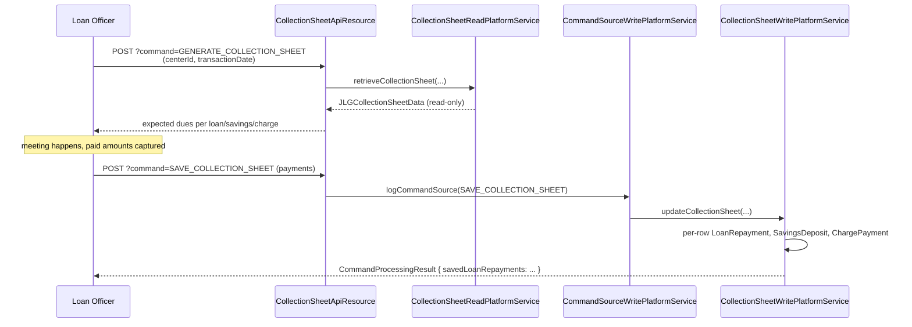
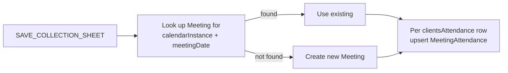

The **collection sheet** is the cornerstone of village-banking workflows in Apache Fineract. Every meeting day a loan officer prints (or pulls onto a tablet) a list of every client expected to pay, marks per-row paid amounts, and submits one bulk payload to the server. The server posts the loan repayments, savings deposits and charge payments atomically and writes one `LoanTransaction` / `SavingsAccountTransaction` per row.

## Package

```
org.apache.fineract.portfolio.collectionsheet  (fineract-provider)
├── api/
│   ├── CollectionSheetApiResource.java
│   └── CollectionSheetApiResourceSwagger.java
├── data/
│   ├── CollectionSheetRequest.java
│   ├── DisbursementTransactionsRequest.java
│   ├── IndividualClientData.java
│   ├── IndividualCollectionSheetData.java
│   ├── IndividualCollectionSheetLoanFlatData.java
│   ├── JLGClientData.java
│   ├── JLGCollectionSheetData.java
│   ├── JLGCollectionSheetFlatData.java
│   ├── JLGGroupData.java
│   ├── LoanDueData.java
│   ├── RepaymentTransactionRequest.java
│   ├── SavingDueTransactionRequest.java
│   └── SavingsDueData.java
├── handler/
├── serialization/
└── service/
```

The class-level path is:

```java
@Path("/v1/collectionsheet")
public class CollectionSheetApiResource { … }
```

## Two flavours: JLG and Individual

Apache Fineract supports two collection sheet shapes:

| Flavour | Use case | Aggregation key | Data class |
|---------|----------|-----------------|------------|
| **JLG** (joint-liability group) | Village banking via centers and groups | `(center, group, client)` | `JLGCollectionSheetData` |
| **Individual** | One-off field collection of unrelated clients | `(office, client)` | `IndividualCollectionSheetData` |

Both flow through the same two-phase generate-then-save workflow. The difference is how the rows are shaped and what filtering the read service applies.

## Two phases — generate and save



Generate is a *read* — it returns the expected schedule items as of the meeting date without touching the database. Save is a *command* — it goes through `PortfolioCommandSourceWritePlatformService`, gets a `CommandSource` row, and is subject to maker-checker if configured.

The two commands are recognised by their query parameter:

```java
import static org.apache.fineract.infrastructure.core.service.CommandParameterUtil.GENERATE_COLLECTION_SHEET_COMMAND_VALUE;
import static org.apache.fineract.infrastructure.core.service.CommandParameterUtil.SAVE_COLLECTION_SHEET_COMMAND_VALUE;
```

## REST surface

| Method | Path | Action |
|--------|------|--------|
| POST | `/v1/collectionsheet?command=GENERATE_COLLECTION_SHEET` | Compute dues; no DB write. |
| POST | `/v1/collectionsheet?command=SAVE_COLLECTION_SHEET` | Post the bulk payments. |
| POST | `/v1/centers/{centerId}/collectionsheet?command=GENERATE_COLLECTION_SHEET` | Center-scoped generate. |
| POST | `/v1/centers/{centerId}/collectionsheet?command=SAVE_COLLECTION_SHEET` | Center-scoped save. |
| POST | `/v1/groups/{groupId}/collectionsheet?command=...` | Group-scoped variants. |

Generate accepts a `JsonQuery` body that mirrors `CollectionSheetRequest`:

```json
{
  "transactionDate": "12 March 2024",
  "calendarId": 88,
  "officeId": 1,
  "staffId": 12,
  "centerId": 5,
  "groupId": null,
  "dateFormat": "dd MMMM yyyy",
  "locale": "en"
}
```

`calendarId` ties the request to a specific meeting calendar — see `/portfolio/calendar-and-meeting`. The transaction date must match an actual occurrence of that calendar, otherwise the service throws `CollectionSheetTransactionDateException`.

## The generate result — `JLGCollectionSheetData`

```
JLGCollectionSheetData
├── dueDate
├── nextMeetingDate
├── groups : List<JLGGroupData>
│    ├── groupId
│    ├── groupName
│    └── clients : List<JLGClientData>
│         ├── clientId
│         ├── clientName
│         ├── loans : List<LoanDueData>
│         │    ├── loanId
│         │    ├── principalDue, interestDue, feeDue, penaltyDue
│         │    ├── totalDue
│         │    └── chargesDue
│         └── savings : List<SavingsDueData>
│              ├── savingsId
│              └── depositDue / withdrawalAllowed
└── paymentTypeOptions
```

The structure is precisely what the printed paper sheet has — center at the top, groups underneath, one row per loan and one row per savings under each client. Each row carries the *expected* due so the loan officer can tick "matches" or write down a partial.

## The save payload

```json
POST /v1/centers/5/collectionsheet?command=SAVE_COLLECTION_SHEET
{
  "transactionDate": "12 March 2024",
  "actualDisbursementDate": "12 March 2024",
  "calendarId": 88,
  "bulkRepaymentTransactions": [
    { "loanId": 100, "transactionAmount": 1500.00, "paymentTypeId": 1 },
    { "loanId": 101, "transactionAmount": 1200.00 }
  ],
  "bulkSavingsDueTransactions": [
    { "savingsId": 200, "transactionAmount": 200.00 }
  ],
  "bulkDisbursementTransactions": [
    { "loanId": 102, "transactionAmount": 5000.00 }
  ],
  "clientsAttendance": [
    { "clientId": 42, "attendanceType": 1 },
    { "clientId": 43, "attendanceType": 2 }
  ],
  "dateFormat": "dd MMMM yyyy",
  "locale": "en"
}
```

The save understands four bulk arrays:

- `bulkRepaymentTransactions` → `RepaymentTransactionRequest` → loan `REPAYMENT`s.
- `bulkSavingsDueTransactions` → `SavingDueTransactionRequest` → savings `DEPOSIT`s.
- `bulkDisbursementTransactions` → `DisbursementTransactionsRequest` → loan disbursements (for loans approved earlier and disbursed at this meeting).
- `clientsAttendance` → `MeetingAttendance` rows linked to the meeting created for `transactionDate`.

All four arrays commit as one JPA transaction. If any individual row fails (insufficient balance for a savings withdrawal-equivalent, validation error on a disbursement), the whole save rolls back and the operator sees the failed row's index in the response.

## Validator

`CollectionSheetTransactionDataValidator` covers the save path:

- `transactionDate` present and ≤ business date.
- `calendarId` valid and the date is an occurrence of that calendar's RRULE.
- Each `loanId` in `bulkRepaymentTransactions` is open and belongs to a client under the center/group.
- Each `transactionAmount` ≥ 0 and currency matches the catalogue.
- Attendance entries reference clients that are actually in the group.

Errors come back as a 400 with the standard `dataValidationErrors` array — see `/runtime/error-handling`.

## Individual collection sheet

The same `CollectionSheetApiResource` handles the individual variant via a different read service path:

```
POST /v1/collectionsheet?command=GENERATE_COLLECTION_SHEET
{
  "transactionDate": "12 March 2024",
  "officeId": 7,
  "staffId": 12
}
```

When `centerId` and `groupId` are absent, the read service returns `IndividualCollectionSheetData` — a flat list of all clients in the office whose loans or savings have anything due. The save payload uses the same bulk arrays.

## Disbursements via collection sheet

`bulkDisbursementTransactions` lets a meeting double as a disbursement event. The loans referenced must be in `APPROVED` status. The save path calls `LoanWritePlatformService.disburseLoan` per row with the calendar-derived `actualDisbursementDate`, then writes the first repayment back into the calendar's recurrence so the schedule lines up with future meetings.

## Attendance

`MeetingAttendance` rows are an integral part of the save:



`MeetingAttendance.attendanceTypeId` references a `MeetingAttendanceType` enum: `PRESENT`, `ABSENT`, `APPROVED`, `LEAVE`, `LATE` — used by performance reports.

## Read-only generate semantics

Because generate writes nothing, callers may run it as often as they like, including from BI dashboards previewing tomorrow's expected dues. The expensive bit is the per-loan schedule projection, which uses `LoanRepaymentScheduleInstallment` rows already in the database — no schedule recomputation happens in the read path.

## Currency uniformity

The collection sheet does not support mixed currencies. Every loan / savings on the sheet must be in the same currency as the calendar's office default; rows in other currencies are silently skipped from the generate result and rejected with a validation error if included in the save.

## Holiday handling

When `transactionDate` falls on a holiday or non-working day, the generate respects the institution's holiday rules (see `/organisation/holidays`). The schedule is projected with installments shifted forward or backward per the configured rule, so the expected-due column matches what loans would have shown if their `expectedDueDate` had been recomputed.

## Business events

Each underlying row, when saved, emits its own business event — `LoanRepaymentBusinessEvent`, `SavingsDepositBusinessEvent`, `LoanDisbursalBusinessEvent`. There is no aggregate `CollectionSheetSavedBusinessEvent`; subscribers that want the rollup count rows themselves.

<Info>
The collection sheet read service caches the calendar's next-meeting calculation per request — even a center with hundreds of clients fits comfortably in one HTTP round-trip because all dues come from already-materialised schedule installments.
</Info>

## Idempotency

The save command supports an `Idempotency-Key` header through the commands framework. A re-submit with the same key returns the original `CommandSource` row instead of double-posting — vital for unreliable mobile network conditions during field collection. See `/commands/idempotency`.

## See also

- `/portfolio/centers` — top-level grouping the sheet runs against.
- `/portfolio/groups` — the second-level grouping.
- `/portfolio/calendar-and-meeting` — meeting schedules and `Meeting` rows.
- `/loan/loan-transactions` — `REPAYMENT` posting details.
- `/savings/savings-transactions` — `DEPOSIT` posting details.
- `/commands/idempotency` — safely retrying save payloads.
