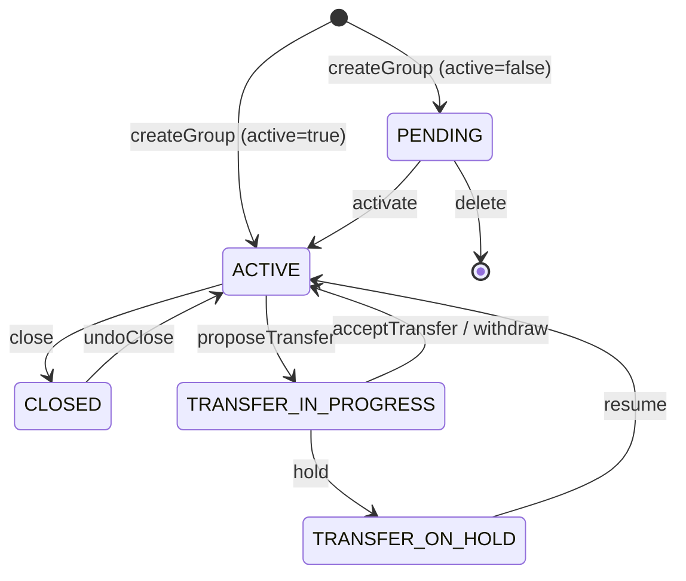
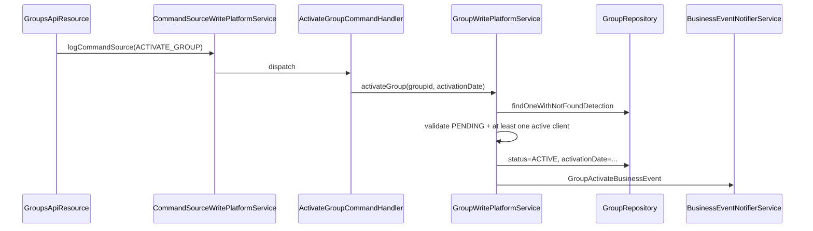

The joint-liability **Group** is the second pillar of the Apache Fineract portfolio, alongside the individual `Client`. Groups bind clients into a collective that meets together, repays together and — in many MFI models — guarantees each other's loans. The entity is in `fineract-core` because loan and savings modules consult the membership and the GLIM/GSIM features depend on it.

## Package layout

```
org.apache.fineract.portfolio.group
├── api/                        GroupingTypesApiConstants
├── domain/                     (fineract-core)
│   ├── Group.java
│   ├── GroupLevel.java
│   ├── GroupingTypeStatus.java
│   ├── GroupRole.java
│   └── StaffAssignmentHistory.java
├── data/                       GroupGeneralData, GroupLevelData, GroupRoleData, …
└── service/                    Group read/write platform services (fineract-provider)
```

The REST resources `GroupsApiResource`, `CentersApiResource` and `GroupsLevelApiResource` live in `fineract-provider`.

## `GroupLevel` — the hierarchy backbone

Apache Fineract does not hard-code "center > group > client". Instead it ships a `m_group_level` table that declares the hierarchy itself:

```java
@Entity
@Table(name = "m_group_level")
public class GroupLevel extends AbstractPersistableCustom<Long> {
    @Column(name = "parent_id")     private Long parentId;
    @Column(name = "super_parent")  private boolean superParent;
    @Column(name = "level_name")    private String levelName;
    @Column(name = "recursable")    private boolean recursable;
    @Column(name = "can_have_clients") private boolean canHaveClients;
}
```

The Liquibase seed inserts the standard pair:

| id | parentId | superParent | levelName | recursable | canHaveClients |
|----|----------|-------------|-----------|------------|----------------|
| 1 | `NULL` | `true` | Center | `false` | `false` |
| 2 | 1 | `false` | Group | `false` | `true` |

`recursable` enables nested levels (rarely used in production); `canHaveClients` decides whether the level may hold `Client` rows directly. The level read service exposes this through `/v1/groups/template` so UI can render the right form.

## The `Group` entity

```java
@Entity
@Table(name = "m_group")
public final class Group extends AbstractPersistableCustom<Long> {

    @Column(name = "external_id")   private String externalId;
    @Column(name = "status_enum")   private Integer status;
    @Column(name = "activation_date") private LocalDate activationDate;
    @Column(name = "account_no")    private String accountNumber;

    @ManyToOne @JoinColumn(name = "office_id")  private Office office;
    @ManyToOne @JoinColumn(name = "staff_id")   private Staff staff;
    @ManyToOne @JoinColumn(name = "parent_id")  private Group parent;
    @ManyToOne @JoinColumn(name = "level_id")   private GroupLevel groupLevel;

    @Column(name = "display_name") private String name;
    @Column(name = "hierarchy")    private String hierarchy;

    @OneToMany @JoinColumn(name = "parent_id")
    private List<Group> groupMembers = new ArrayList<>();

    @ManyToMany
    @JoinTable(name = "m_group_client",
               joinColumns = @JoinColumn(name = "group_id"),
               inverseJoinColumns = @JoinColumn(name = "client_id"))
    private Set<Client> clientMembers = new HashSet<>();

    @OneToMany(cascade = CascadeType.ALL, mappedBy = "center", orphanRemoval = true)
    private Set<StaffAssignmentHistory> staffHistory;

    @OneToMany(mappedBy = "group", cascade = CascadeType.REMOVE)
    private Set<GroupRole> groupRole;
}
```

Highlights:

- `parent` and `groupLevel` together place this row in the hierarchy. A Center has `parent = NULL` and `groupLevel = 1`; a Group has `parent = center.id` and `groupLevel = 2`.
- `hierarchy` is a denormalised path (`.<office>.<center>.<group>.`) used to push office-scope filters into single `LIKE` clauses.
- `clientMembers` is the `m_group_client` many-to-many, shared with `Client.groups`.
- `groupMembers` is the recursive parent/child link for centers.
- `staffHistory` keeps a `StaffAssignmentHistory` row whenever the loan officer assignment changes — important for portfolio attribution.

## The status machine

`GroupingTypeStatus` mirrors `ClientStatus` but is slimmer — groups have no `REJECTED` / `WITHDRAWN` distinction:

```java
public enum GroupingTypeStatus {
    INVALID(0,  "groupingStatusType.invalid"),
    PENDING(100, "groupingStatusType.pending"),
    ACTIVE(300,  "groupingStatusType.active"),
    TRANSFER_IN_PROGRESS(303, "clientStatusType.transfer.in.progress"),
    TRANSFER_ON_HOLD(304,     "clientStatusType.transfer.on.hold"),
    CLOSED(600, "groupingStatusType.closed");
}
```



Groups can only be deleted while `PENDING` and without any clients. Once active, they accumulate `clientMembers` and stay in the database forever — close moves to status 600 but retains all history.

## Group roles

```java
@Entity
@Table(name = "m_group_roles")
public class GroupRole extends AbstractPersistableCustom<Long> {
    @ManyToOne @JoinColumn(name = "group_id")  private Group group;
    @ManyToOne @JoinColumn(name = "client_id") private Client client;
    @ManyToOne @JoinColumn(name = "role_cv_id") private CodeValue role;
}
```

A role is `(group, client, role)` where `role` references a `CodeValue` from the `GroupRoles` code. Typical seeded values are:

- President
- Secretary
- Treasurer
- Loan Officer Liaison

A client may hold at most one role per group; multiple clients may share the same role (rare but allowed). Roles are managed through `/v1/groups/{groupId}/roles` and `GroupRolesWritePlatformService`.

## Membership rules

Adding a client to a group is a separate command from creating the group:

- `POST /v1/groups/{groupId}?command=associateClients` — body `{ "clientMembers": [...] }`.
- `POST /v1/groups/{groupId}?command=disassociateClients` — body `{ "clientMembers": [...] }`.

The implementation in `Group` adds the FK to `m_group_client`. Two checks are enforced:

- **Same office** — a group's clients must belong to the same office hierarchy. Violations throw `ClientNotInGroupException` / `ClientInGroupCannotBeAssociatedException`.
- **Active status** — only `ACTIVE` clients can be associated with an `ACTIVE` group.

`ClientExistInGroupException` is thrown when an `associateClients` payload includes a client already in the group; `ClientNotInGroupException` is thrown on `disassociateClients` when the client is absent.

## Centers vs groups

The same `Group` entity is used for both — only the `level_id` differs. The cleaner ergonomics live in `CentersApiResource` (`/v1/centers`), which preselects `level_id = 1` and filters list queries to centers only. See `/portfolio/centers` for that layer.

## Group commands

| Action | Handler |
|--------|---------|
| `CREATE_GROUP` / `CREATE_CENTER` | `CreateGroupCommandHandler` |
| `UPDATE_GROUP` / `UPDATE_CENTER` | `UpdateGroupCommandHandler` |
| `ACTIVATE_GROUP` / `ACTIVATE_CENTER` | `ActivateGroupCommandHandler` |
| `ASSOCIATE_CLIENTS_GROUP` | `AssociateClientsToGroupCommandHandler` |
| `DISASSOCIATE_CLIENTS_GROUP` | `DisassociateClientsToGroupCommandHandler` |
| `CLOSE_GROUP` / `CLOSE_CENTER` | `CloseGroupCommandHandler` |
| `DELETE_GROUP` / `DELETE_CENTER` | `DeleteGroupCommandHandler` |
| `UPDATE_STAFF_GROUP` | reassigns loan officer, writes `StaffAssignmentHistory` |
| `ASSOCIATE_GROUPS_CENTER` | adds child groups to a center |
| `DISASSOCIATE_GROUPS_CENTER` | removes them |

Each handler logs through the commands framework and emits a matching business event (`GroupCreateBusinessEvent`, `GroupActivateBusinessEvent`, `GroupCloseBusinessEvent`, …).

## Activation flow



The "at least one active client" rule prevents creating empty active groups that would never collect anything; institutions that want empty active groups override the rule in their fork.

## Hierarchy enforcement

Every group query is filtered by the caller's office hierarchy. The denormalised `hierarchy` column is the key:

```sql
SELECT g.* FROM m_group g
  JOIN m_office o ON o.id = g.office_id
 WHERE o.hierarchy LIKE :userHierarchy
```

When a group changes office (through transfer), `hierarchy` is recomputed before save so future queries find it under the new branch.

## Account number

`account_no` is mandatory, length 20, globally unique. If the create payload omits it, the entity asks `RandomPasswordGenerator(19)` for a fresh string and assigns it. Tenants that want deterministic numbers configure an `AccountNumberFormat` for `GROUPS`; the write service then consults that format before falling back to the random generator.

## Closure rules

Closing a group walks its clients and refuses if any client still has an active loan or savings account tied to the group:

```
if (clientHasNonClosedLoansAssociatedToThisGroup(...)) {
    throw new GroupHasNonClosedLoansException(...);
}
```

If the group is a center, it must additionally have no active child groups. A `closure_reason_cv_id` is required and references a `CodeValue` from `GroupClosureReason`.

<Info>
`Group.parent` is the only field whose recursion the framework uses heavily. The codebase deliberately stays at two levels in production deployments — Center and Group — even though `recursable = true` levels are supported.
</Info>

## GLIM linkage

Group Loan Individual Monitoring (GLIM) is built directly on the `Group` and `Client` membership tables. A GLIM "parent loan" is created against the group, and per-client child loans share the same accounting and schedule. See `/loan/glim`.

## Read model

`GroupReadPlatformService` exposes:

- `GET /v1/groups` — paged list with `officeId`, `staffId`, `name`, `underHierarchy`, `paged`, `orphansOnly` (groups not under a center).
- `GET /v1/groups/{id}` — `GroupGeneralData` plus optional `associations=clientMembers,groupRoles,calendarData`.
- `GET /v1/groups/template` — offices, staff, group levels, calendar templates.
- `GET /v1/groups/{id}/accountsoverview` — aggregated loan/savings exposure.

## See also

- `/portfolio/centers` — the same entity at `level_id = 1`.
- `/portfolio/collection-sheet` — bulk repayment driven by group meetings.
- `/portfolio/calendar-and-meeting` — recurring meeting schedules.
- `/portfolio/transfer` — moving groups between offices.
- `/loan/glim` and `/savings/gsim` — group-level loan and savings.
