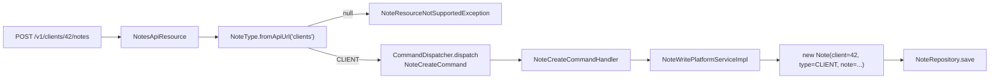
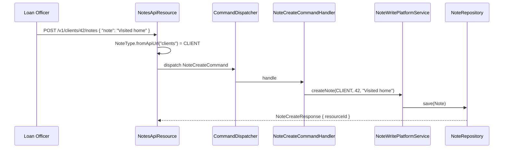

A **Note** in Apache Fineract is a short free-text annotation that can be attached to any of the major portfolio entities — clients, loans, loan transactions, savings, savings transactions, groups or share accounts. The same row schema serves all of them; the type is discriminated by a `NoteType` enum and the API path itself encodes which entity owns the note.

## Package

```
org.apache.fineract.portfolio.note
├── api/         NotesApiResource          (/v1/{resourceType}/{resourceId}/notes)
├── command/     NoteCreateCommand, NoteUpdateCommand, NoteDeleteCommand
├── domain/      Note, NoteRepository, (NoteType is in fineract-core)
├── exception/   NoteNotFoundException, NoteResourceNotSupportedException
├── handler/     NoteCreateCommandHandler, NoteUpdateCommandHandler, NoteDeleteCommandHandler
├── listener/    NoteListener
└── service/     NoteReadPlatformServiceImpl, NoteWritePlatformServiceImpl
```

The `Note` entity is in `fineract-provider`; `NoteType` is in `fineract-core` because several core modules reference it without needing the REST plumbing.

## The `Note` entity

`Note` maps to `m_note`. It carries one FK column per supported entity type — only one is populated per row:

| Column | Populated when `noteType` is |
|--------|------------------------------|
| `client_id` | `CLIENT` |
| `loan_id` | `LOAN` or `LOAN_TRANSACTION` |
| `loan_transaction_id` | `LOAN_TRANSACTION` |
| `savings_account_id` | `SAVING_ACCOUNT` or `SAVINGS_TRANSACTION` |
| `savings_account_transaction_id` | `SAVINGS_TRANSACTION` |
| `group_id` | `GROUP` |
| `share_account_id` | `SHARE_ACCOUNT` |

The `note_type_enum` column carries the `NoteType.value` so reads do not need to inspect which FK is non-null.

The remaining columns are the actual content (`note` — up to 1000 chars) and the standard auditing fields (`created_by`, `created_on_utc`, `last_modified_by`, `last_modified_on_utc`).

## `NoteType`

```java
public enum NoteType {
    CLIENT(100,             "noteType.client",              "clients",            "Client note"),
    LOAN(200,               "noteType.loan",                "loans",              "Loan note"),
    LOAN_TRANSACTION(300,   "noteType.loan.transaction",    "loanTransactions",   "Loan transaction note"),
    SAVING_ACCOUNT(500,     "noteType.saving",              "savings",            " account note"),
    GROUP(600,              "noteType.group",               "groups",             "Group note"),
    SHARE_ACCOUNT(700,      "noteType.shares",              "accounts/share",     "Share account note"),
    SAVINGS_TRANSACTION(800,"noteType.savings.transaction", "savingsTransactions","Savings transaction note");
}
```

The third field — `apiUrl` — is the path segment that addresses the parent entity. `NoteType.fromApiUrl(String)` is the lookup the REST resource uses to figure out which `NoteType` a request is for:

```java
public static NoteType fromApiUrl(final String url) {
    return BY_API.get(url);
}
```

The values 100/200/300/500/600/700/800 leave gaps (no 400, for instance) so future types can slot in cleanly.

## The polymorphic resource

```java
@Path("/v1/{resourceType:.+}/{resourceId}/notes")
@RequiredArgsConstructor
public class NotesApiResource {
    private final NoteReadPlatformService readPlatformService;
    private final CommandDispatcher dispatcher;
}
```

The `{resourceType:.+}` regex allows multi-segment types like `accounts/share`. The resource resolves `resourceType` through `NoteType.fromApiUrl` and throws `NoteResourceNotSupportedException` if the segment doesn't match any of the seven supported types.

| Method | Path | Action |
|--------|------|--------|
| GET | `/v1/{resource}/{id}/notes` | List notes (descending by `createdOn`). |
| GET | `/v1/{resource}/{id}/notes/{noteId}` | Single note. |
| POST | `/v1/{resource}/{id}/notes` | Create — body `{ "note": "..." }`. |
| PUT | `/v1/{resource}/{id}/notes/{noteId}` | Update content. |
| DELETE | `/v1/{resource}/{id}/notes/{noteId}` | Delete. |

The read endpoint accepts a `?fields=` query string for projection (e.g. `?fields=note,createdOn,createdByUsername`) and a `?limit=` for pagination.

## Lookup flow



## Command-based writes

Unlike older sub-resources in the codebase, `NotesApiResource` uses the `command-core` `CommandDispatcher` directly instead of going through `PortfolioCommandSourceWritePlatformService`. Three command DTOs live in `org.apache.fineract.portfolio.note.command`:

- `NoteCreateCommand`
- `NoteUpdateCommand`
- `NoteDeleteCommand`

Each is dispatched to the matching `NoteCreate/Update/DeleteCommandHandler`, which calls into `NoteWritePlatformServiceImpl`. The dispatcher path still writes a `CommandSource` audit row and still respects maker-checker.

## Read service

`NoteReadPlatformServiceImpl` runs a single JDBC query per request, picking the right `WHERE` clause based on `NoteType`:

```sql
-- for NoteType.CLIENT
SELECT n.id, n.client_id, n.note_type_enum, n.note,
       n.created_by, ab.username AS createdByUsername,
       n.created_on_utc, ...
  FROM m_note n
  LEFT JOIN m_appuser ab ON ab.id = n.created_by
 WHERE n.client_id = ?
   AND n.note_type_enum = 100
 ORDER BY n.created_on_utc DESC
```

`?fields=` is honoured by stripping unwanted columns from the projection before serialisation.

## Transaction-attached notes

Loan and savings transactions get their own note type so users can annotate the *transaction*, not the parent account. The owning account FK (`loan_id` for `LOAN_TRANSACTION`, `savings_account_id` for `SAVINGS_TRANSACTION`) is populated alongside the transaction FK — that way "all notes on loan 88" naturally includes notes on its transactions, while "notes on transaction 12345" is a tighter query.

## Listener

`NoteListener` subscribes to a handful of business events from other modules and produces notes automatically. Examples:

- When a loan is written off, a note "Loan written off on 2024-03-12 by user X" is appended.
- When a client is reactivated, a note is appended explaining the reason.

This keeps the audit narrative on the entity even when the change is made by a system command rather than a human typing a note.

## Validation

The validator is minimal — `note` must not be blank and must be ≤ 1000 chars. The owning entity is validated by repository lookup; a 404 comes back if `client_id = 42` does not exist or is not under the caller's office hierarchy.

## Concurrent edits

Two operators editing the same note simultaneously will produce a last-write-wins outcome — there is no optimistic-lock version on `m_note`. Production deployments that care about loss-of-edit configure maker-checker on the update permissions so a second editor sees the first one's pending change before they can submit theirs.

## Permissions

Each `(NoteType, action)` pair has its own permission in `m_permission`:

| Permission | Allows |
|------------|--------|
| `CREATE_CLIENTNOTE`, `UPDATE_CLIENTNOTE`, `DELETE_CLIENTNOTE` | Client notes. |
| `CREATE_LOANNOTE`, `UPDATE_LOANNOTE`, `DELETE_LOANNOTE` | Loan notes. |
| `CREATE_SAVINGSNOTE`, `UPDATE_SAVINGSNOTE`, `DELETE_SAVINGSNOTE` | Savings notes. |
| `CREATE_GROUPNOTE`, … | Group notes. |
| `CREATE_SHAREACCOUNTNOTE`, … | Share-account notes. |

Maker-checker is configured per permission, so the institution may require approval for client notes (HR-sensitive) but not loan notes.

## Failure cases

| Exception | HTTP | Cause |
|-----------|------|-------|
| `NoteResourceNotSupportedException` | 400 | The path's `{resourceType}` is not a recognised `NoteType.apiUrl`. |
| `NoteNotFoundException` | 404 | The note id does not exist, or does not belong to the given resource. |
| `PlatformApiDataValidationException` | 400 | Note text blank or too long. |
| Resource-specific exceptions (e.g. `ClientNotFoundException`) | 404 | The owning entity is missing. |

## Example sequence



<Info>
Notes are not free-form attachments. For PDFs, photos and uploaded files use the document-management module's `/v1/{entityType}/{entityId}/documents` endpoints instead — see `/core/document-management`.
</Info>

## Update semantics

`PUT /v1/{resource}/{id}/notes/{noteId}` only accepts the `note` text. The owning entity is fixed at creation — you cannot move a note from one client to another by editing it. To "move" a note the operator deletes it and creates a new one against the target entity.

The update path also runs through `CommandDispatcher`, writing a `CommandSource` row whose `payload` contains both the old and new text in the JSON-diff format the audit module uses.

## Empty result behaviour

`GET /v1/{resource}/{id}/notes` returns `[]` for entities that exist but have no notes. It returns 404 for entities that do not exist (or are outside the caller's office hierarchy). The distinction matters for UI clients deciding between "show empty list" and "show error".

## Listing across resources

There is no aggregate "all notes" endpoint at the top level. Reads are always scoped to one `(resourceType, resourceId)` pair. Consumers that want a cross-resource view (e.g. "all notes by this user in March") build it from the audit log instead.

## Length limit

The 1000-character cap is enforced both by the column definition and by `NoteCreateCommand` validation. Longer narratives — meeting minutes, audit findings — belong in the document-management module as attached PDFs, with a short note pointing to the document id.

## Adding a new note type

```mermaid
flowchart LR
    A[Liquibase patch: add row to NoteType] --> B[Add FK column to m_note]
    B --> C[Extend NoteWritePlatformServiceImpl<br/>switch statement]
    C --> D[Add permissions to m_permission]
    D --> E[Existing /v1/{type}/{id}/notes works automatically]
```

Adding `LOAN_PRODUCT` notes, for example, is a matter of adding a new enum value, a nullable `loan_product_id` column, the switch case, and the matching permissions. The polymorphic resource picks up the new type without code changes because it routes purely through `NoteType.fromApiUrl`.

## Audit pattern

Because notes carry the full auditing columns (`created_by`, `created_on_utc`, `last_modified_by`, `last_modified_on_utc`) they are the natural audit narrative on entities that otherwise change rarely. Many institutions follow a convention of "every state change creates a note" — implemented by subscribing `NoteListener` to a broader set of business events so the timeline of any client read endpoint also reads as a human-friendly history.

## Performance

The read endpoint runs a single indexed query per call — `m_note.client_id` (or the equivalent FK) is the lookup column and is indexed. Reading "all notes for client 42" stays sub-millisecond even on tenants with millions of clients because the index is narrow.

Writes are equally cheap: one row, no joins. The framework's audit machinery adds the `created_*` and `last_modified_*` columns automatically.

<Tip>
Mintlify-style preview clients can render the descending list of notes as a chronological log. Set `?fields=note,createdOn,createdByUsername&limit=20` and the response is small enough to embed inline.
</Tip>

## See also

- `/portfolio/client` — owning entity `CLIENT`.
- `/loan/loan-transactions` — `LOAN_TRANSACTION` notes.
- `/savings/savings-transactions` — `SAVINGS_TRANSACTION` notes.
- `/portfolio/groups` — `GROUP` notes.
- `/shares/share-account` — `SHARE_ACCOUNT` notes.
- `/core/business-events` — events the `NoteListener` reacts to.
