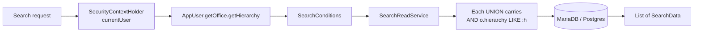

`SearchApiResource` is the cross-entity search entry-point of Apache Fineract. It serves the type-ahead box in the web UI, the global lookup in field-officer apps and the ad-hoc query builder used by analysts. Two surfaces live under the same package — a fuzzy keyword search (`/v1/search`) and an advanced typed query (`/v1/search/advance`) — and a separate, newer repository powers the high-performance v2 client search.

## Package

```
org.apache.fineract.portfolio.search  (fineract-provider)
├── api/
│   ├── SearchApiResource.java
│   └── SearchApiResourceSwagger.java
├── data/
│   ├── AdHocQuerySearchRequest.java
│   ├── AdHocSearchQueryData.java
│   ├── SearchConditions.java
│   └── SearchData.java
├── service/
│   ├── SearchReadService.java
│   └── SearchReadServiceImpl.java
└── starter/
    └── SearchConfiguration.java

org.apache.fineract.portfolio.client.domain.search  (fineract-core)
├── SearchedClient.java
├── SearchingClientRepository.java
└── SearchingClientRepositoryImpl.java
```

The resource exposes three endpoints; the search read service does all the heavy lifting through JDBC.

## The class skeleton

```java
@Path("/v1/search")
@Component
@Tag(name = "Search API",
     description = "Search API allows to search scoped resources clients, loans and groups on specified fields.")
@RequiredArgsConstructor
@Produces({ MediaType.APPLICATION_JSON })
public class SearchApiResource {

    private final SearchReadService searchReadService;
}
```

## Endpoint 1 — fuzzy keyword search

```java
@GET
public List<SearchData> searchData(
    @QueryParam("query")      final String query,
    @QueryParam("resource")   final String resource,
    @QueryParam("exactMatch") @DefaultValue("false") Boolean exactMatch) {

    final AppUser currentUser = (AppUser) SecurityContextHolder.getContext()
                                                                .getAuthentication().getPrincipal();
    final String hierarchy = currentUser.getOffice().getHierarchy();
    final SearchConditions searchConditions = new SearchConditions(query, resource, exactMatch, hierarchy);

    return searchReadService.retriveMatchingData(searchConditions);
}
```

Three query parameters:

- `query` — the search string. Account numbers (`000000001`), external ids, names, mobile numbers all work.
- `resource` — optional CSV of entity types to restrict the search to. Recognised values: `clients`, `loans`, `clientIdentifiers`, `groups`, `savings`, `shares`.
- `exactMatch` — when `true`, runs `WHERE col = :q`; when `false` (default), runs `WHERE col LIKE CONCAT('%', :q, '%')`.

The search is automatically scoped to the calling user's office hierarchy — every UNION branch in the underlying query carries an `AND o.hierarchy LIKE :userHierarchy` predicate.

### `SearchConditions`

```
SearchConditions
├── query        — the search term
├── resource     — CSV of categories
├── exactMatch   — boolean
└── hierarchy    — office hierarchy path of the caller
```

### `SearchData` — the result row

```
SearchData
├── entityId       — primary key in the source table
├── entityAccountNo
├── entityExternalId
├── entityName
├── entityType     — "CLIENT" / "LOAN" / "SAVING" / "GROUP" / …
├── parentId       — for accounts: the client; for groups: the parent center
├── parentName
└── entityStatus
```

The implementation runs a single SQL statement that UNIONs across the requested categories — clients, groups, loan account numbers, savings account numbers, external ids, identifier document keys — and returns the merged list ordered by a relevance heuristic (exact account-number matches first, then name prefixes, then substring matches).

### Example

```
GET /v1/search?query=Petra&resource=clients,groups&exactMatch=false
```

```json
[
  { "entityId": 42, "entityAccountNo": "0000000042",
    "entityName": "Petra Schmidt", "entityType": "CLIENT",
    "entityStatus": { "id": 300, "code": "clientStatusType.active" } },
  { "entityId": 5, "entityAccountNo": "0000000005",
    "entityName": "Petra Center", "entityType": "GROUP" }
]
```

## Endpoint 2 — ad-hoc typed query

```java
@POST
@Path("/advance")
public List<AdHocSearchQueryData> advancedSearch(final AdHocQuerySearchRequest request) {
    return searchReadService.retrieveAdHocQueryMatchingData(request);
}
```

The advanced search is a structured filter over loan portfolios — used for portfolio analysis dashboards. The request shape is:

```json
{
  "entities": ["loans"],
  "loanStatus": [300],
  "loanProducts": [1, 2],
  "offices": [5, 7],
  "loanDateOption": "approvedDate",
  "loanFromDate": "01 January 2024",
  "loanToDate": "31 March 2024",
  "includeOutstandingAmount": true,
  "outstandingAmountCondition": "greaterThan",
  "outstandingAmount": 10000,
  "includeOutStandingAmountPercentage": true,
  "outStandingAmountPercentageCondition": "between",
  "minOutStandingAmountPercentage": 60,
  "maxOutStandingAmountPercentage": 100,
  "dateFormat": "dd MMMM yyyy",
  "locale": "en"
}
```

Mandatory field is `entities`. Every other field is optional and only the ones supplied contribute to the WHERE clause. The result groups loans by office and product, returning aggregated outstanding amounts and counts — `AdHocSearchQueryData` per group.

## Endpoint 3 — template for the form

```java
@GET
@Path("/template")
public AdHocSearchQueryData retrieveAdHocSearchQueryTemplate() {
    return searchReadService.retrieveAdHocQueryTemplate();
}
```

Returns the drop-down options that populate the advanced-search form — list of offices visible to the caller, available loan products, available loan statuses. The UI calls this once when the analyst opens the screen.

## Search categories

The implementation supports the following entity types in the basic search:

| `resource` token | Underlying table | Match columns |
|------------------|------------------|---------------|
| `clients` | `m_client` | `account_no`, `external_id`, `display_name`, `mobile_no` |
| `clientIdentifiers` | `m_client_identifier` | `document_key` |
| `loans` | `m_loan` | `account_no`, `external_id` |
| `groups` | `m_group` | `account_no`, `external_id`, `display_name` |
| `savings` | `m_savings_account` | `account_no`, `external_id` |
| `shares` | `m_share_account` | `account_no`, `external_id` |

Empty `resource` means "all of the above". The implementation precompiles these into UNION branches at startup.

## The v2 client search

For deployments with millions of clients, the basic search becomes a hot path. Apache Fineract ships a dedicated, statically-typed repository — `SearchingClientRepository` — that runs as a JPA Criteria query producing `SearchedClient` projections directly:

```
org.apache.fineract.portfolio.client.domain.search
├── SearchedClient                 — DTO with id, accountNo, displayName, status
├── SearchingClientRepository      — Spring Data repository
└── SearchingClientRepositoryImpl  — Criteria-based implementation
```

The v2 endpoint is `GET /v2/clients` (registered in `fineract-provider`'s API config). It accepts:

- `name` — substring match on `display_name`.
- `status` — array of `ClientStatus` ids.
- `officeId` — restrict by office (still hierarchy-checked).
- `limit`, `offset` — pagination.

The Criteria approach generates a typed query plan that the JPA provider can cache, eliminating the per-call SQL parsing cost the legacy union query pays.

## Authorisation model



The hierarchy filter happens unconditionally — there is no way to disable it via the API. A user attached to office `.1.7.` cannot find clients of `.1.8.` even by typing the exact account number.

## Performance notes

- The legacy search is bounded by indices on `account_no`, `external_id` and `display_name`. Production deployments add a separate index on `mobile_no` for the name-and-phone variant.
- The v2 search adds a covering index that includes the `office_id` to satisfy the hierarchy filter without touching the wide `m_client` row.
- Both implementations exit early when `exactMatch = true` and the input matches the account-number format — they skip the UNION across other entities and serve the result from one row read.

## Validation

The advanced search validator (`SearchReadServiceImpl.validateAdHocQuery`) enforces:

- `entities` contains at least one supported value.
- `from`/`to` date pairs are consistent.
- `min`/`max` outstanding amount pairs are consistent.
- Percentage conditions are within `[0, 100]`.

Errors are returned as the usual 400 with `dataValidationErrors`.

<Info>
The fuzzy search is intentionally simple — it does not use full-text indices or Lucene. Tenants who need misspelling tolerance or stemming integrate an external search service through the business-event subscribers and let the v2 endpoint act as the read fallback when the external service is unavailable.
</Info>

## Permissions

The basic search has a single coarse permission and the advanced search has its own:

| Permission | Action |
|------------|--------|
| `READ_SEARCH` | GET `/v1/search`. |
| `READ_ADHOCQUERY` | GET `/v1/search/template`. |
| `EXECUTE_ADHOCQUERY` | POST `/v1/search/advance`. |

In typical tenant configurations every authenticated role gets `READ_SEARCH`; `EXECUTE_ADHOCQUERY` is reserved for analysts and managers.

## See also

- `/portfolio/client` — the primary entity returned by name/account search.
- `/portfolio/client-identifiers` — `document_key` matching.
- `/portfolio/groups` — group rows in results.
- `/security/filters` — how `SecurityContextHolder.getPrincipal` becomes the office hierarchy.
- `/runtime/serialization-and-jersey` — how the JSON request body of advanced search is parsed.
