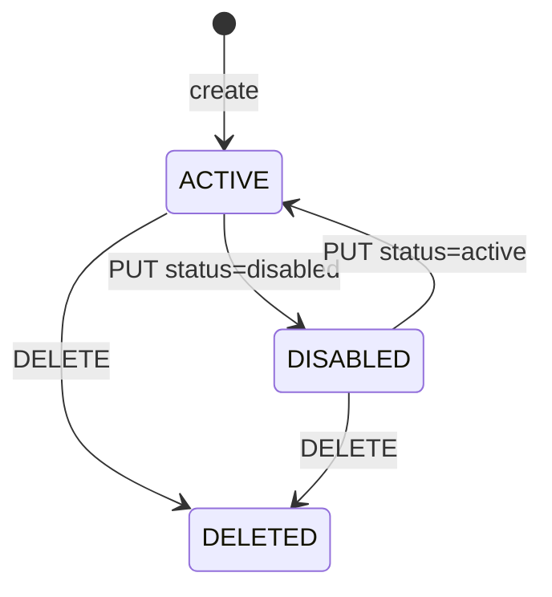
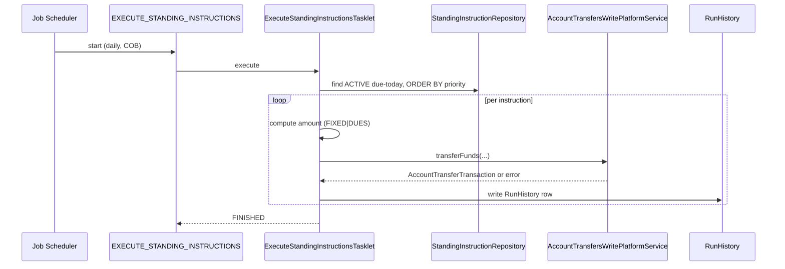

A **standing instruction** in Apache Fineract is a saved rule that says "every Tuesday move 1,500 from savings 17 to loan 88 as a repayment" — or "on the 5th of each month move whatever is due on loan 88 from savings 17". The rule sits in `m_account_transfer_standing_instructions`, runs under the daily `EXECUTE_STANDING_INSTRUCTIONS` Spring Batch job, and produces the same `AccountTransferTransaction` rows a manual transfer would.

## Package

```
org.apache.fineract.portfolio.account.domain  (fineract-provider)
├── AccountTransferStandingInstruction.java
├── StandingInstructionAssembler.java
├── StandingInstructionPriority.java
├── StandingInstructionRepository.java
├── StandingInstructionStatus.java
├── StandingInstructionType.java
└── AccountTransferRecurrenceType.java

org.apache.fineract.portfolio.account.jobs.executestandinginstructions
├── ExecuteStandingInstructionsConfig.java
└── ExecuteStandingInstructionsTasklet.java
```

REST is `StandingInstructionsApiResource` (`/v1/standinginstructions`) and the run history is exposed at `/v1/standinginstructionrunhistory`.

## The rule entity

`AccountTransferStandingInstruction` extends `AbstractPersistableCustom<Long>` and maps to `m_account_transfer_standing_instructions`:

```java
@Entity
@Table(name = "m_account_transfer_standing_instructions", uniqueConstraints = {
    @UniqueConstraint(columnNames = { "name" }, name = "name") })
public class AccountTransferStandingInstruction extends AbstractPersistableCustom<Long> {

    @ManyToOne @JoinColumn(name = "account_transfer_details_id")
    private AccountTransferDetails accountTransferDetails;

    @Column(name = "name")                  private String name;
    @Column(name = "priority")              private Integer priority;
    @Column(name = "instruction_type")      private Integer instructionType;
    @Column(name = "status")                private Integer status;
    @Column(name = "amount")                private BigDecimal amount;

    @Column(name = "valid_from")            private LocalDate validFrom;
    @Column(name = "valid_till")            private LocalDate validTill;

    @Column(name = "recurrence_type")       private Integer recurrenceType;
    @Column(name = "recurrence_frequency")  private Integer recurrenceFrequency;
    @Column(name = "recurrence_interval")   private Integer recurrenceInterval;
    // ... recurrence_on_day, recurrence_on_month
}
```

The rule does **not** carry the from/to account directly — those live on the shared `AccountTransferDetails` row (`account_transfer_details_id`), which is reused for every transaction the rule produces.

Globally unique `name` is enforced so operators can find a rule unambiguously.

## Instruction type — fixed vs dues

```java
public enum StandingInstructionType {
    INVALID(0, "standingInstructionType.invalid"),
    FIXED(1,   "standingInstructionType.fixed"),
    DUES(2,    "standingInstructionType.dues");
}
```

| Type | Amount semantics |
|------|------------------|
| `FIXED` | Transfer exactly `amount` on each run. If `amount` is more than the source balance, the run is skipped and logged. |
| `DUES` | Compute the amount on the fly. For transfers into a loan, take the installments due on or before today; for transfers into a savings account, take the minimum balance shortfall. `amount` on the entity is ignored. |

`DUES` is the killer feature — set up once, the rule keeps the loan paid in full automatically as long as the savings account has the funds.

## Status

```java
public enum StandingInstructionStatus {
    INVALID(0,  "standingInstructionStatus.invalid"),
    ACTIVE(1,   "standingInstructionStatus.active"),
    DISABLED(2, "standingInstructionStatus.disabled"),
    DELETED(3,  "standingInstructionStatus.deleted");
}
```

`DELETED` is a soft delete — the row stays for audit, the job ignores it. `DISABLED` is the pause control: temporarily skip without losing the configuration.



## Recurrence

`AccountTransferRecurrenceType` plus `PeriodFrequencyType` together describe when the rule fires:

```java
public enum AccountTransferRecurrenceType {
    INVALID(0,    "accountTransferRecurrenceType.invalid"),
    PERIODIC(1,   "accountTransferRecurrenceType.periodic"),
    AS_PER_DUES(2, "accountTransferRecurrenceType.as.per.dues");
}
```

- `PERIODIC` uses the supplied `recurrence_frequency` (days, weeks, months, years) and `recurrence_interval`. For monthly rules `recurrence_on_month_day` carries the day of month.
- `AS_PER_DUES` fires whenever there is a due installment — useful for loans with irregular schedules.

`recurrence_frequency` is a `PeriodFrequencyType` value (`DAYS=0, WEEKS=1, MONTHS=2, YEARS=3`).

## Priority

`StandingInstructionPriority` is a four-level enum — `URGENT(1)`, `HIGH(2)`, `MEDIUM(3)`, `LOW(4)` — that controls execution order when multiple rules attempt to drain the same source account on the same day. The job sorts by priority ascending and processes URGENT before LOW; lower priorities are skipped when the source balance is exhausted.

## REST surface

`StandingInstructionsApiResource` lives at `/v1/standinginstructions`:

| Method | Path | Action |
|--------|------|--------|
| GET | `/template` | Drop-downs for the create form. |
| POST | `/` | Create. |
| GET | `/` | Paged list with `clientId`, `clientName`, `fromAccountId`, `fromAccountType`, `transferType`. |
| GET | `/{id}` | Retrieve. |
| PUT | `/{id}?command=update` | Update name, amount, priority, schedule. |
| DELETE | `/{id}` | Soft delete (sets status to `DELETED`). |

Run history is exposed separately at `GET /v1/standinginstructionrunhistory?transferId={id}&offset=...&limit=...` — one row per execution attempt, success or skipped.

### Create payload

```json
{
  "name": "Auto repayment loan 88",
  "transferType": 2,
  "fromOfficeId": 1,
  "fromClientId": 42,
  "fromAccountType": 2,
  "fromAccountId": 17,
  "toOfficeId": 1,
  "toClientId": 42,
  "toAccountType": 1,
  "toAccountId": 88,
  "priority": 2,
  "instructionType": 2,
  "status": 1,
  "recurrenceType": 1,
  "recurrenceFrequency": 2,
  "recurrenceInterval": 1,
  "recurrenceOnMonthDay": "05",
  "validFrom": "01 March 2024",
  "dateFormat": "dd MMMM yyyy",
  "locale": "en"
}
```

Note the structure: from/to fields create the underlying `AccountTransferDetails`; the standing instruction layer adds priority/recurrence/validity. `transferType` (2 = `LOAN_REPAYMENT`) is the `AccountTransferType` value — see `/portfolio/account-transfers`.

## The batch job

`ExecuteStandingInstructionsConfig` registers the Spring Batch job under `JobName.EXECUTE_STANDING_INSTRUCTIONS`:

```java
return new JobBuilder(JobName.EXECUTE_STANDING_INSTRUCTIONS.name(), jobRepository)
        .start(executeStandingInstructionsStep())
        .build();
```

The single step delegates to `ExecuteStandingInstructionsTasklet`, which:

1. Queries every `AccountTransferStandingInstruction` with `status = ACTIVE` whose next-due-date is today.
2. Sorts by `priority`.
3. For each rule, computes the amount (`FIXED` or `DUES`) and calls `AccountTransfersWritePlatformService.transferFunds(...)` — exactly the same write service path a manual transfer uses.
4. On success, records `latsRunDate`, advances next-due-date, writes a `StandingInstructionRunHistory` row with the transferred amount and the resulting `AccountTransferTransaction.id`.
5. On failure (insufficient balance, validation failure, account inactive), the tasklet still writes a history row with `status = FAILED` and the error reason.



The job is configured to run as part of the close-of-business pipeline. See `/core/jobs-domain` for the scheduler integration and `/loan/loan-jobs` for the wider COB ordering.

## Run history

`m_account_transfer_standing_instructions_history` rows look like:

| Column | Meaning |
|--------|---------|
| `id` | PK. |
| `standing_instruction_id` | FK. |
| `version` | Snapshot of the rule version that ran. |
| `status` | `success` / `failed`. |
| `execution_time` | Timestamp. |
| `amount` | Amount the rule attempted to move. |
| `error_log` | Free-text error message when `status = failed`. |
| `from_account_transaction_id` | FK to the resulting savings/loan transaction on the from side. |
| `to_account_transaction_id` | FK on the to side. |

Operators consult this to debug "why didn't my standing instruction fire today?" — the most common answer is `error_log = insufficient.balance`.

## Validity window

Every rule has `valid_from` and optional `valid_till`. The tasklet's WHERE clause is:

```
valid_from <= :runDate
AND (valid_till IS NULL OR valid_till >= :runDate)
AND status = ACTIVE
```

Setting `valid_till` to a date in the past disables the rule without flipping its status — useful for institutions that want a paper trail of "this instruction lapsed naturally" instead of "an operator disabled it".

## Validation

`StandingInstructionAssembler` enforces during create / update:

- `name` not blank, unique tenant-wide.
- `priority` ∈ {1, 2, 3, 4}.
- `instructionType` ∈ {`FIXED`, `DUES`}.
- If `FIXED`, `amount > 0`.
- `recurrenceFrequency` and `recurrenceInterval` consistent with `recurrenceType`.
- `validFrom` on or after today (configurable).
- The underlying from/to accounts exist, are `ACTIVE`, share currency, and the caller can see both under their office hierarchy.

## Maker-checker

The create, update and delete operations are routed through `CREATE_STANDINGINSTRUCTION`, `UPDATE_STANDINGINSTRUCTION` and `DELETE_STANDINGINSTRUCTION` commands. Tenants that enable maker-checker on these actions get a manual approval step between configuration and the job picking the rule up. See `/commands/makercheckers`.

<Info>
`DUES` instructions cooperate with the loan repayment processor — the amount is computed by `LoanReadPlatformService.retrieveAllPeriods` so the rule always pays whatever the schedule says, including penalties and accrued interest.
</Info>

## See also

- `/portfolio/account-transfers` — the underlying transfer model.
- `/core/jobs-domain` — Spring Batch and the job-name registry.
- `/loan/loan-jobs` — where this job sits in the COB pipeline.
- `/savings/savings-transactions` — the `WITHDRAWAL` posting on the source side.
- `/loan/loan-transactions` — the `REPAYMENT` / `DOWN_PAYMENT` posting on the destination side.
