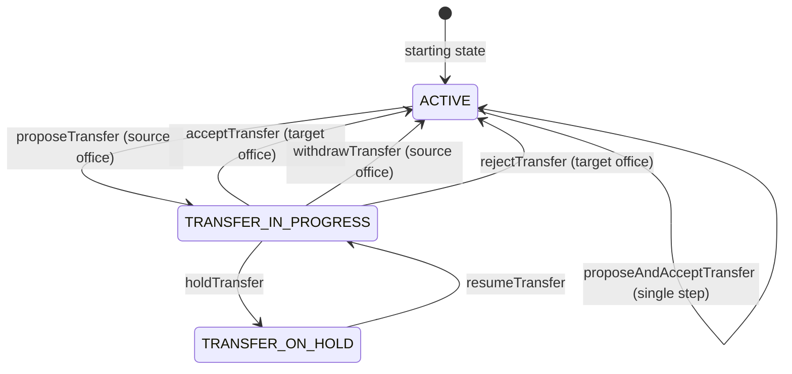
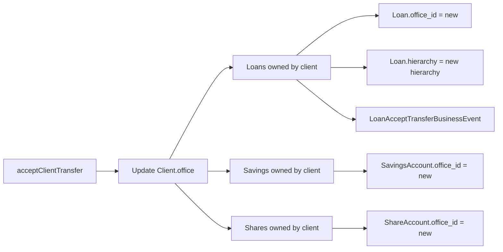
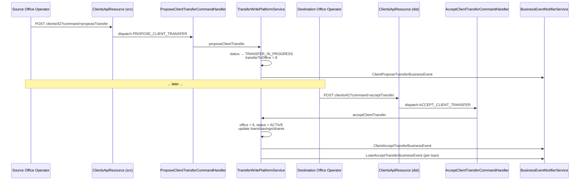

Microfinance institutions reshuffle their portfolio constantly. A client moves house, a center's loan officer is promoted to a different branch, a group splits between two villages. Apache Fineract handles all of these through the **portfolio transfer** subsystem — a four-state workflow that moves a `Client` (or all clients of a `Group`) from one `Office` to another with a clear audit trail and an explicit accept-or-reject gate at the destination.

## Package

```
org.apache.fineract.portfolio.transfer  (fineract-provider)
├── api/        TransferApiConstants
├── data/       TransfersDataValidator
├── exception/  ClientNotAwaitingTransferApprovalException, …
├── handler/    Per-command handlers
├── service/
│   ├── TransferEventType.java
│   ├── TransferWritePlatformService.java
│   └── TransferWritePlatformServiceJpaRepositoryImpl.java
└── starter/    TransferConfiguration
```

The write platform service interface declares the entire surface:

```java
public interface TransferWritePlatformService {
    CommandProcessingResult transferClientsBetweenGroups(Long sourceGroupId, JsonCommand jsonCommand);
    CommandProcessingResult proposeClientTransfer(Long clientId, JsonCommand jsonCommand);
    CommandProcessingResult withdrawClientTransfer(Long clientId, JsonCommand jsonCommand);
    CommandProcessingResult acceptClientTransfer(Long clientId, JsonCommand jsonCommand);
    CommandProcessingResult rejectClientTransfer(Long clientId, JsonCommand jsonCommand);
    CommandProcessingResult proposeAndAcceptClientTransfer(Long clientId, JsonCommand jsonCommand);
}
```

The matching command handlers — `ProposeClientTransferCommandHandler`, `AcceptClientTransferCommandHandler`, `WithdrawClientTransferCommandHandler`, `RejectClientTransferCommandHandler`, `ProposeAndAcceptClientTransferCommandHandler`, `TransferClientsBetweenGroupsCommandHandler` — route requests from the `/v1/clients/{id}?command=...` endpoints into this service.

## Two flows in one package

The transfer package covers two distinct movements:

| Flow | Boundary | API path |
|------|----------|----------|
| **Inter-office** | From office A to office B | `POST /v1/clients/{id}?command=proposeTransfer` and friends |
| **Inter-group** | From group A to group B within the same office | `POST /v1/groups/{sourceGroupId}?command=transferClients` |

The two share validation infrastructure (`TransfersDataValidator`) but emit different events and use different `Client.status` transitions. Inter-group is essentially a `m_group_client` join-table edit; inter-office is the multi-step workflow described in detail below.

## The four-state inter-office flow



The states are `ClientStatus.ACTIVE` (300), `TRANSFER_IN_PROGRESS` (303) and `TRANSFER_ON_HOLD` (304). On acceptance the status returns to `ACTIVE` but the `office_id` has changed; on withdrawal/rejection the status returns to `ACTIVE` with the original `office_id` unchanged.

## Transfer event type

```java
public enum TransferEventType {
    PROPOSAL(1,    "transferEvent.proposal"),
    ACCEPTANCE(2,  "transferEvent.acceptance"),
    WITHDRAWAL(3,  "transferEvent.withdrawal"),
    REJECTION(4,   "transferEvent.rejection");
}
```

Every state transition writes a transfer-event row, providing a complete audit trail of who proposed, who accepted, who withdrew, with timestamps.

## Propose

```
POST /v1/clients/{clientId}?command=proposeTransfer
{
  "destinationOfficeId": 8,
  "transferDate": "12 March 2024",
  "dateFormat": "dd MMMM yyyy",
  "locale": "en",
  "note": "Client moved to new town"
}
```

`proposeClientTransfer(clientId, jsonCommand)` runs these checks before flipping status:

- Client is currently `ACTIVE` — `ClientNotAwaitingTransferApprovalException` if not.
- Caller's office hierarchy includes the client's current office.
- `destinationOfficeId` exists.
- Source and destination differ.
- No open loan that violates the institution's transfer policy (configurable: some allow open loans to move, some don't).
- No open standing instructions that would dangle after the move.

If the validation passes, the service:

1. Sets `Client.status = TRANSFER_IN_PROGRESS`.
2. Sets `Client.transferToOffice = destination`.
3. Stamps `proposedTransferDate`.
4. Cascades the same transition to every group the client belongs to whose other members are also being transferred (group-aware propose).

## Accept

```
POST /v1/clients/{clientId}?command=acceptTransfer
{
  "destinationGroupId": 14,
  "staffId": 22,
  "transferDate": "12 March 2024",
  "dateFormat": "dd MMMM yyyy",
  "locale": "en"
}
```

`acceptClientTransfer(clientId, jsonCommand)` is called from the *destination* office. It:

1. Asserts the client is `TRANSFER_IN_PROGRESS` (or `TRANSFER_ON_HOLD`).
2. Asserts the caller's hierarchy covers `Client.transferToOffice`.
3. Updates `Client.office = transferToOffice` and clears `transferToOffice`.
4. Optionally associates the client to `destinationGroupId` and assigns `staffId`.
5. Walks the client's open loans, savings and shares and updates their `office_id` and `hierarchy` columns to match.
6. Sets `Client.status = ACTIVE`.
7. Emits `ClientTransferBusinessEvent` with event type `ACCEPTANCE`.

For loans specifically, `LoanAcceptTransferBusinessEvent` and `LoanInitiateTransferBusinessEvent` are emitted by the loan module so downstream listeners can re-link accounting and reporting to the new branch.

## Withdraw (source) and reject (destination)

Either side can abort an in-progress transfer:

```
POST /v1/clients/{clientId}?command=withdrawTransfer        — by the source office
POST /v1/clients/{clientId}?command=rejectTransfer          — by the destination office
```

Both restore `Client.status = ACTIVE`, clear `transferToOffice` and write a `WITHDRAWAL` or `REJECTION` `TransferEventType` row. Withdraw is allowed even if the destination has already accepted but the change has not been fully committed (rare race).

## Propose-and-accept — the single-step shortcut

```
POST /v1/clients/{clientId}?command=proposeAndAcceptTransfer
{
  "destinationOfficeId": 8,
  "destinationGroupId": 14,
  "staffId": 22,
  "transferDate": "12 March 2024",
  "dateFormat": "dd MMMM yyyy",
  "locale": "en"
}
```

This is used when the caller has permissions for both offices (e.g. a regional admin). It runs propose and accept atomically in a single transaction; the client never appears in `TRANSFER_IN_PROGRESS` state externally. Both `PROPOSAL` and `ACCEPTANCE` event rows are written.

## Inter-group transfers

```
POST /v1/groups/{sourceGroupId}?command=transferClients
{
  "clients": [42, 43, 44],
  "destinationGroupId": 17,
  "inheritDestinationGroupLoanOfficer": true
}
```

`transferClientsBetweenGroups(sourceGroupId, jsonCommand)` runs purely within one office. It:

1. Validates both groups are `ACTIVE` and in the same office.
2. Updates the `m_group_client` join rows for each listed client — removes from source, adds to destination.
3. Optionally reassigns the loan officer to the destination group's officer.
4. Each affected client's status is unchanged (no `TRANSFER_IN_PROGRESS` step).

This flow does not produce `TransferEventType` rows; the audit is the `m_group_client` history alone.

## Account migration

When a client's office changes through accept, every linked account must follow:



The hierarchy column on accounts is denormalised exactly for this reason — updating one column propagates the office change to every existing hierarchy-scoped query.

## Validation exceptions

| Exception | HTTP | Cause |
|-----------|------|-------|
| `ClientNotAwaitingTransferApprovalException` | 403 | Accept/reject called on a client not in `TRANSFER_IN_PROGRESS`. |
| `ClientNotAwaitingTransferApprovalOrOnHoldException` | 403 | Variant for accept-when-on-hold flow. |
| `TransferNotSupportedException` | 403 | Open product or association blocks the transfer. |
| `ClientNotFoundException` | 404 | The client id does not exist or is outside the caller's hierarchy. |
| `OfficeNotFoundException` | 404 | `destinationOfficeId` invalid. |
| `PlatformApiDataValidationException` | 400 | Field validation by `TransfersDataValidator`. |

## Business events

| Event | When |
|-------|------|
| `ClientProposeTransferBusinessEvent` | Propose succeeds. |
| `ClientWithdrawTransferBusinessEvent` | Withdraw succeeds. |
| `ClientRejectTransferBusinessEvent` | Reject succeeds. |
| `ClientAcceptTransferBusinessEvent` | Accept succeeds. |
| `ClientTransferProposalBusinessEvent` | Aggregate event used by some listeners. |
| `LoanInitiateTransferBusinessEvent` | Per loan, on propose. |
| `LoanAcceptTransferBusinessEvent` | Per loan, on accept. |
| `LoanWithdrawTransferBusinessEvent` | Per loan, on withdraw. |
| `LoanRejectTransferBusinessEvent` | Per loan, on reject. |

Listeners typically use these to re-route notifications, refresh reporting caches and re-stamp report hierarchies.

## Sequence — full happy path



## Hold / resume

The `TRANSFER_ON_HOLD` state exists to support institutions that require manual review after propose but before accept. The destination office puts a transfer on hold (`holdTransfer` command), which freezes the workflow without rejecting; a later `resumeTransfer` returns the client to `TRANSFER_IN_PROGRESS` for accept-or-reject.

<Info>
A transfer does not move the *GL balances* between branches by itself. The accounting follow-up — typically a clearing entry from "Cash receivable HO" to "Cash payable HO" — is posted separately through the inter-office accounting mappings. See `/accounting/financial-activity-accounts`.
</Info>

## See also

- `/portfolio/client` — owning entity and full status diagram.
- `/portfolio/groups` — group membership rules.
- `/portfolio/centers` — center-level transfers reuse the same machinery.
- `/organisation/offices` — what the `Office` hierarchy looks like.
- `/core/business-events` — how transfer events are dispatched to subscribers.
